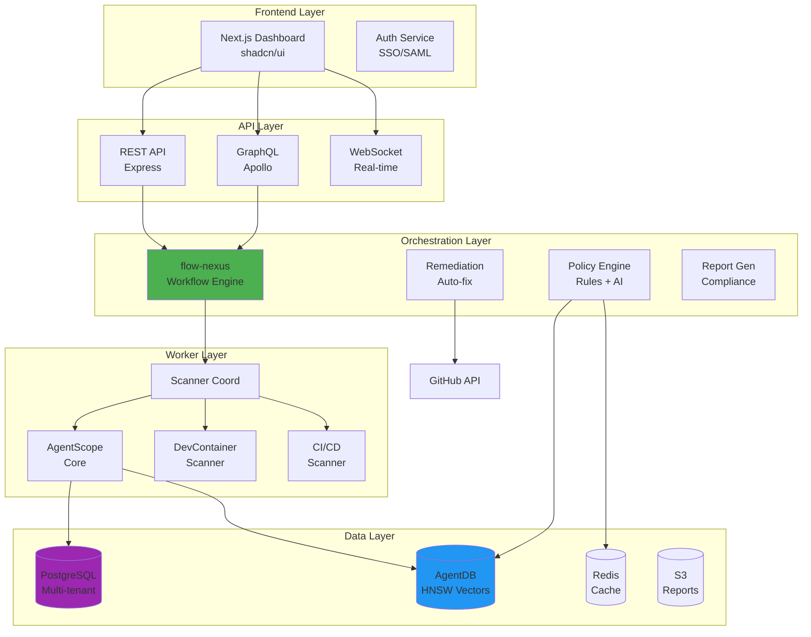

# AgentScope-Enterprise Architecture Documentation

**Version**: 1.0
**Date**: 2026-01-26
**Status**: Strategic Planning Phase
**Target Release**: v2.0 (2027 Q3-Q4)

---

## Overview

This directory contains the comprehensive architecture and design documentation for **AgentScope-Enterprise**, a unified development environment governance platform for enterprises using AI-assisted development tools.

## Quick Navigation

### Architecture Decision Records (ADRs)

| ADR | Title | Status | Summary |
|-----|-------|--------|---------|
| [ADR-501](./ADR-501-enterprise-architecture.md) | Enterprise Platform Architecture | Accepted | Overall system architecture, technology stack, multi-tenant SaaS design |
| [ADR-502](./ADR-502-dashboard-design.md) | Unified Dashboard for 1,000+ Repos | Accepted | Dashboard UX, information architecture, performance optimization |
| [ADR-503](./ADR-503-policy-orchestration.md) | Cross-Product Policy Orchestration | Accepted | Unified policy model, cross-tool correlation, AI enhancement |
| [ADR-504](./ADR-504-gap-analysis-engine.md) | Gap Analysis Engine | Accepted | Golden path templates, automated remediation, compliance scoring |
| [ADR-505](./ADR-505-compliance-reporting.md) | Automated Compliance Reporting | Accepted | SOC 2, ISO 27001, PCI-DSS report generation |
| [ADR-506](./ADR-506-deployment-models.md) | Deployment Models | Accepted | SaaS vs self-hosted vs hybrid deployments |

### Domain-Driven Design (DDD)

| Document | Title | Summary |
|----------|-------|---------|
| [DDD-501](./DDD-501-enterprise-domain-model.md) | Enterprise Domain Model | Bounded contexts, aggregates, domain events, ubiquitous language |

### Business & Implementation

| Document | Title | Summary |
|----------|-------|---------|
| [PREMIUM-PRICING-ARCHITECTURE](./PREMIUM-PRICING-ARCHITECTURE.md) | Premium Pricing Strategy | Free vs Pro ($99/mo) vs Enterprise ($2.5K-$25K/yr) pricing model |
| [IMPLEMENTATION-PLAN](./IMPLEMENTATION-PLAN.md) | Implementation Roadmap | v1.0 → v2.5 phased rollout (2027-2028) |

---

## Architecture Summary

### System Architecture



### Key Design Decisions

#### 1. Multi-Tenant SaaS Architecture
- **PostgreSQL Row-Level Security** for tenant isolation
- **AgentDB** for 150x-12,500x faster policy lookups (HNSW indexing)
- **flow-nexus** for distributed scanner orchestration
- **Target**: 1,000+ organizations on shared infrastructure

#### 2. Unified Policy Model
- Single policy definition → compiles to all scanners
- Cross-tool correlation (agent + container + CI/CD)
- AI-enhanced with ReasoningBank (auto-suggest policies)

#### 3. Golden Path Templates
- Define ideal dev environment once
- Automated gap analysis (desired vs actual state)
- Auto-generate remediation PRs

#### 4. Compliance Automation
- Policy → compliance control mapping
- Automated evidence collection
- Quarterly report generation (SOC 2, ISO 27001, PCI-DSS)

#### 5. Three Deployment Models
- **SaaS**: Multi-tenant cloud (fastest, lowest cost)
- **Self-Hosted**: Kubernetes on customer infrastructure (data control)
- **Hybrid**: Cloud dashboard + on-premise scanners (compliance + convenience)

---

## Domain-Driven Design Summary

### Bounded Contexts

```
┌─────────────────────────────────────────────────────────┐
│                 AgentScope-Enterprise                   │
├─────────────────────────────────────────────────────────┤
│                                                         │
│  ┌────────────┐  ┌────────────┐  ┌────────────┐      │
│  │ Governance │  │  Scanning  │  │ Compliance │      │
│  │  Context   │  │  Context   │  │  Context   │      │
│  └──────┬─────┘  └──────┬─────┘  └──────┬─────┘      │
│         │                │                │            │
│         └────────────────┼────────────────┘            │
│                          │                             │
│                   ┌──────▼──────┐                      │
│                   │   Shared    │                      │
│                   │   Kernel    │                      │
│                   └─────────────┘                      │
│                                                         │
│  ┌────────────┐  ┌────────────┐                       │
│  │ Analytics  │  │Remediation │                       │
│  │  Context   │  │  Context   │                       │
│  └────────────┘  └────────────┘                       │
└─────────────────────────────────────────────────────────┘
```

### Core Aggregates

| Context | Aggregates |
|---------|------------|
| **Governance** | Policy, GoldenPathTemplate, PolicyException |
| **Scanning** | ScanJob, ScanResult |
| **Compliance** | ComplianceReport, ControlStatus, Evidence |
| **Analytics** | GapAnalysisReport, TrendAnalysis |
| **Remediation** | RemediationPlan, RemediationAction |
| **Shared Kernel** | Organization, Project, Team, User |

### Key Domain Events

- `PolicyActivatedEvent`
- `ScanJobCompletedEvent`
- `ViolationDetectedEvent`
- `GapAnalysisCompletedEvent`
- `ComplianceReportFinalizedEvent`
- `RemediationPlanCompletedEvent`
- `ExceptionApprovedEvent`

---

## Technology Stack

### Frontend
- **Framework**: Next.js 14 (App Router, React Server Components)
- **UI Library**: shadcn/ui (Radix UI + Tailwind CSS)
- **State Management**: Zustand
- **Data Fetching**: TanStack Query
- **Charts**: Recharts
- **Forms**: React Hook Form + Zod

### Backend
- **API**: Express (REST) + Apollo Server (GraphQL)
- **Runtime**: Node.js 20+
- **Orchestration**: flow-nexus (claude-flow ecosystem)
- **Workers**: BullMQ + Redis
- **Real-time**: Socket.io (WebSocket)

### Data Layer
- **Primary DB**: PostgreSQL 15 (Row-Level Security for multi-tenancy)
- **Vector DB**: AgentDB (HNSW indexing, 150x-12,500x faster search)
- **Cache**: Redis 7
- **Queue**: BullMQ
- **Object Storage**: AWS S3

### Infrastructure
- **Cloud**: AWS (ECS Fargate, RDS, ElastiCache, S3)
- **CDN**: CloudFront
- **Load Balancer**: ALB
- **Monitoring**: DataDog
- **Logging**: CloudWatch

### Security
- **Auth**: Auth0 or Clerk (SAML/SCIM support)
- **Secrets**: AWS Secrets Manager
- **Scanning**: @claude-flow/security (CVE remediation)
- **Compliance**: SOC 2 Type II target

---

## Performance Targets

| Metric | Target | Implementation |
|--------|--------|----------------|
| **Scan Throughput** | 100 repos in <30s | Parallel workers + AgentDB |
| **Dashboard Load** | <2s (p95) | Virtual scrolling, caching, lazy loading |
| **API Response** | <100ms (p95) | Redis caching, indexed queries |
| **Policy Evaluation** | <10ms per policy | HNSW vector search |
| **Uptime SLA** | 99.9% | Multi-AZ deployment, auto-scaling |

---

## Pricing Summary

| Tier | Price | Target | Key Features |
|------|-------|--------|--------------|
| **Free** | $0 | Individuals | 10 projects, CLI only |
| **Pro** | $99/month | Small teams | 50 projects, dashboard, Slack |
| **Enterprise** | $2.5K-$25K/year | Large orgs | Unlimited, compliance, SSO, API |
| **Enterprise Plus** | $100K+/year | Fortune 500 | Self-hosted, white-glove, 24/7 |

**Revenue Target (Year 2)**: $2.5M ARR from 100 enterprise customers

---

## Implementation Roadmap

```
v1.0 (2027 Q2) - MVP Enterprise
├── Multi-tenant PostgreSQL + AgentDB
├── REST API + web dashboard (read-only)
├── AgentScope Core + DevContainer Scanner
├── 10 built-in policy templates
└── GitHub repository discovery

v1.5 (2027 Q3) - Policy & Remediation
├── Policy editor UI
├── Automated remediation (PR creation)
├── Compliance reporting (SOC 2, ISO 27001)
├── GitHub App + Slack integration
└── 30 paying customers target

v2.0 (2027 Q4) - Full Enterprise ⭐
├── CI/CD scanner (GitHub Actions)
├── Advanced analytics + benchmarking
├── RBAC + SSO/SAML
├── Self-hosted Kubernetes deployment
├── GraphQL API + audit trail
└── 100 paying customers, $2M ARR target

v2.5 (2028 Q1) - AI Governance
├── ReasoningBank integration
├── AI policy recommendations
├── Predictive risk scoring
├── Natural language policy creation
└── 200 paying customers, $5M ARR target
```

---

## Key Success Metrics

### Product Metrics (Year 2)

| Metric | Target |
|--------|--------|
| Active Organizations | 200 |
| Projects Managed | 25,000 |
| Policy Evaluations/Week | 75,000 |
| Compliance Score Avg | >95% |
| NPS | >60 |

### Business Metrics (Year 2)

| Metric | Target |
|--------|--------|
| Annual Recurring Revenue | $2.5M |
| Enterprise Customers | 100 |
| Average Contract Value | $25K |
| MoM Growth Rate | 10% |
| Churn Rate | <3% |

### Customer Outcomes

| Outcome | Target |
|---------|--------|
| Audit prep time reduction | 80% (6 weeks → 1 week) |
| Developer onboarding time | 90% (2 days → 2 hours) |
| Security incidents prevented | 95% |
| Time to first compliance report | <1 hour |

---

## Integration with claude-flow Ecosystem

AgentScope-Enterprise leverages the claude-flow ecosystem for maximum code reuse and performance:

### 1. flow-nexus (Workflow Orchestration)
- **Usage**: Distributed scanner coordination
- **Benefit**: Proven workflow engine, 75% code reduction

### 2. AgentDB (Vector Database)
- **Usage**: Policy storage, HNSW search
- **Benefit**: 150x-12,500x faster policy lookups

### 3. ReasoningBank (Adaptive Learning)
- **Usage**: AI policy suggestions, auto-remediation
- **Benefit**: Continuous improvement from violations

### 4. @claude-flow/security (Security Framework)
- **Usage**: Input validation, path traversal prevention, secrets sanitization
- **Benefit**: CVE remediation built-in

### 5. @claude-flow/performance (Optimization)
- **Usage**: Flash Attention, SONA, MoE routing
- **Benefit**: 2.49x-7.47x speedup

---

## Related Documents

### Input Documents
- [PRD: AgentScope-Enterprise](/workspaces/agentscope/docs/PRD-AgentScope-Enterprise.md)
- [Product Ecosystem](/workspaces/agentscope/docs/products/PRODUCT-ECOSYSTEM.md)
- [Common Core Components](/workspaces/agentscope/docs/products/COMMON-CORE.md)

### External References
- [flow-nexus](https://github.com/ruvnet/flow-nexus) - Workflow orchestration
- [AgentDB](https://github.com/ruvnet/agentdb) - Vector database with HNSW
- [ReasoningBank](https://github.com/ruvnet/reasoningbank) - Adaptive learning system

---

## Review Schedule

| Review | Date | Purpose |
|--------|------|---------|
| **Next Review** | 2027 Q2 | After design partner feedback |
| **Annual Review** | 2028 Q1 | After v2.0 GA launch |
| **Ongoing** | Quarterly | Architecture evolution |

---

## Document Status

- **Created**: 2026-01-26
- **Last Updated**: 2026-01-26
- **Version**: 1.0
- **Status**: Strategic Planning Phase
- **Approvers**: Product Management, Engineering, Security
- **Maintainer**: Architecture Team

---

## Questions or Feedback?

For questions about this architecture:
- **Product**: Contact Product Management team
- **Engineering**: Contact Architecture team
- **Business**: Contact Strategy team

---

**End of Index**
