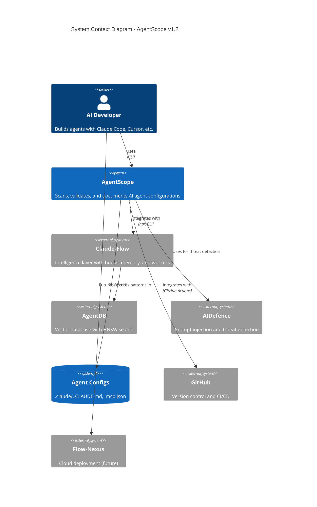
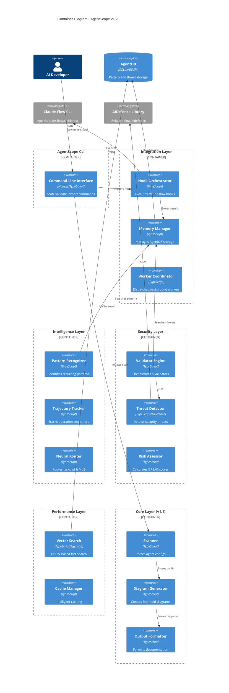
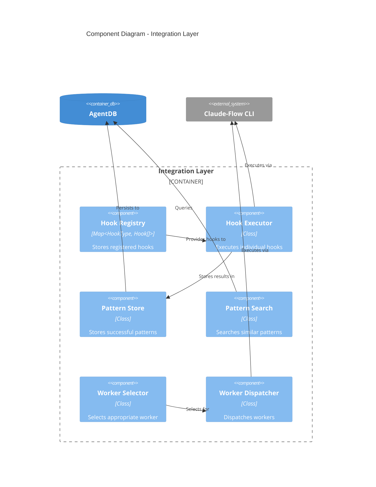
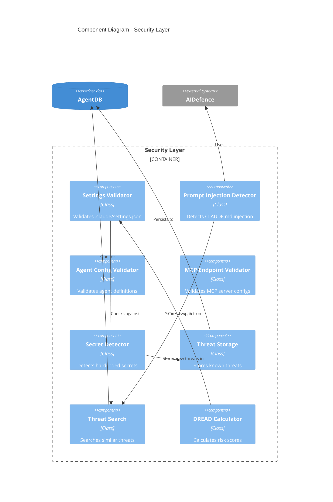
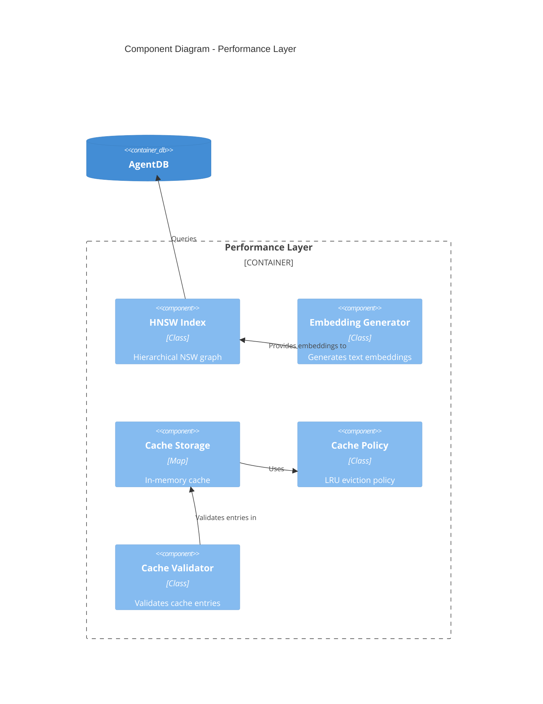
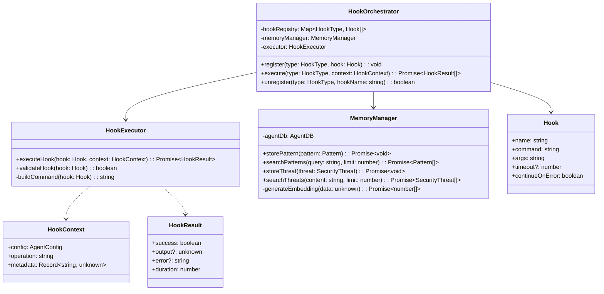
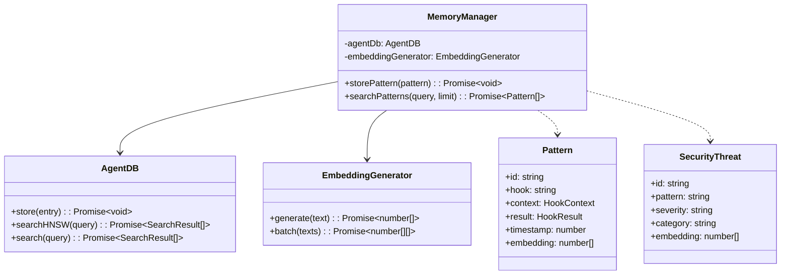
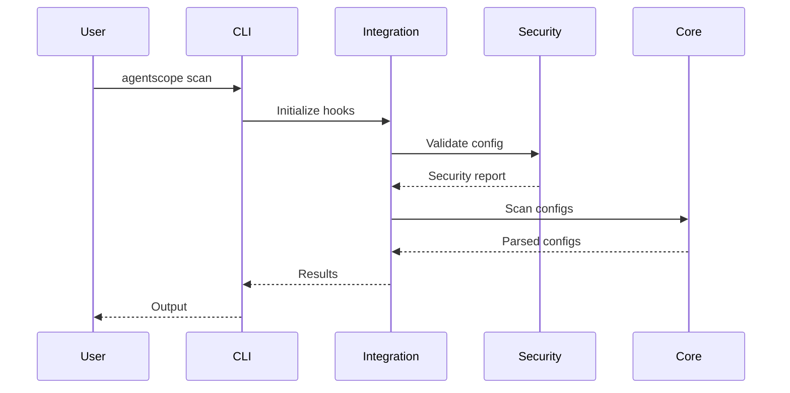
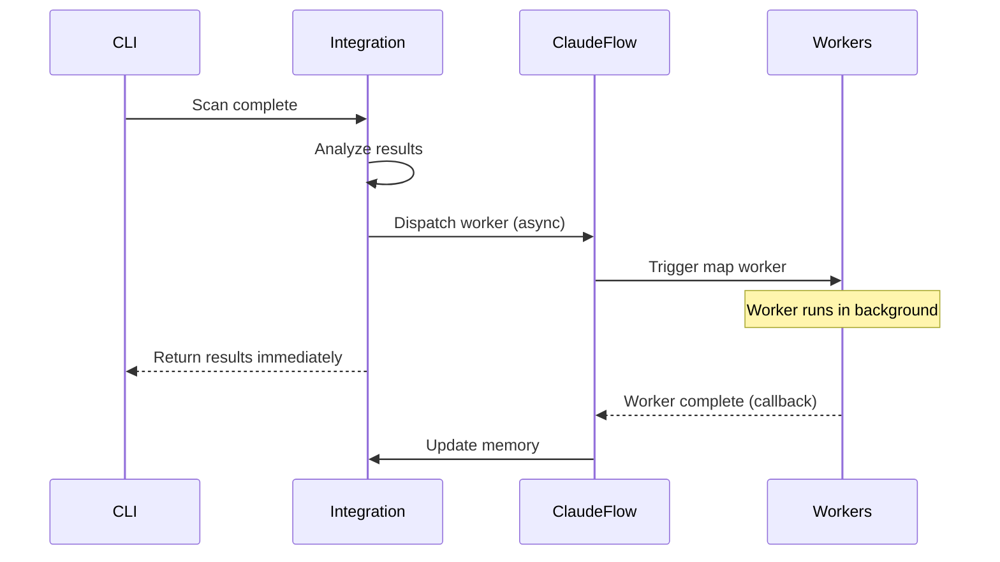

# AgentScope v1.2 - C4 Architecture Diagrams

## C4 Model Overview

The C4 model provides a hierarchical view of the software architecture:

1. **System Context** - How AgentScope fits in the broader ecosystem
2. **Container** - High-level technology choices and system decomposition
3. **Component** - Detailed component responsibilities and relationships
4. **Code** - Class-level design (selective, for complex areas)

---

## Level 1: System Context Diagram

### Purpose

Shows how AgentScope fits into the user's development workflow.



### Key Actors

| Actor | Description |
|-------|-------------|
| **AI Developer** | Primary user - builds AI agents and needs documentation |
| **AgentScope** | Core system - scans and validates agent configurations |
| **Claude-Flow** | External system - provides intelligence and learning |
| **AgentDB** | External system - vector database for pattern storage |
| **AIDefence** | External system - advanced threat detection |
| **GitHub** | External system - version control and CI/CD integration |
| **Flow-Nexus** | Future external system - cloud deployment platform |

---

## Level 2: Container Diagram

### Purpose

Shows the major technology containers and how they interact.



### Container Responsibilities

| Container | Technology | Responsibility |
|-----------|-----------|----------------|
| **CLI** | Node.js/TypeScript | User interface, command parsing |
| **Hook Orchestrator** | TypeScript | Execute lifecycle hooks |
| **Memory Manager** | TypeScript | AgentDB interface |
| **Worker Coordinator** | TypeScript | Background worker dispatch |
| **Pattern Recognizer** | TypeScript | Identify patterns in configs |
| **Trajectory Tracker** | TypeScript | Track operation sequences |
| **Neural Router** | TypeScript | MoE-based task routing |
| **Validator Engine** | TypeScript | Security validation orchestration |
| **Threat Detector** | TypeScript/AIDefence | Advanced threat detection |
| **Risk Assessor** | TypeScript | DREAD scoring |
| **Vector Search** | TypeScript/AgentDB | Fast pattern/threat search |
| **Cache Manager** | TypeScript | Intelligent caching |
| **Scanner** | TypeScript | Config file parsing |
| **Diagram Generator** | TypeScript | Mermaid diagram creation |
| **Output Formatter** | TypeScript | Documentation formatting |

---

## Level 3: Component Diagram

### Integration Layer Components



---

### Security Layer Components



---

### Performance Layer Components



---

## Level 4: Code Diagram (Selective)

### Hook Orchestrator Class Diagram



---

### Security Validator Class Hierarchy

```mermaid
classDiagram
    class SecurityValidator {
        <<abstract>>
        +name: string
        +validate(config: AgentConfig, knownThreats: SecurityThreat[]): Promise~SecurityIssue[]~*
    }

    class ClaudeSettingsValidator {
        +name: "claude-settings"
        +validate(config, threats): Promise~SecurityIssue[]~
        -validateSchema(settings): ValidationResult
        -checkInsecureSettings(settings): SecurityIssue[]
    }

    class PromptInjectionDetector {
        +name: "prompt-injection"
        +validate(config, threats): Promise~SecurityIssue[]~
        -detectInjection(content: string): boolean
        -useAIDefence(content: string): Promise~DetectionResult~
    }

    class AgentConfigValidator {
        +name: "agent-config"
        +validate(config, threats): Promise~SecurityIssue[]~
        -validatePermissions(config): SecurityIssue[]
        -detectCircularDelegation(config): SecurityIssue[]
    }

    class McpEndpointValidator {
        +name: "mcp-endpoint"
        +validate(config, threats): Promise~SecurityIssue[]~
        -validateURL(url: string): boolean
        -checkTransportSecurity(server): SecurityIssue[]
    }

    class SecretDetector {
        +name: "secret-detector"
        +validate(config, threats): Promise~SecurityIssue[]~
        -detectSecrets(content: string): SecretFinding[]
        -calculateEntropy(str: string): number
    }

    SecurityValidator <|-- ClaudeSettingsValidator
    SecurityValidator <|-- PromptInjectionDetector
    SecurityValidator <|-- AgentConfigValidator
    SecurityValidator <|-- McpEndpointValidator
    SecurityValidator <|-- SecretDetector
```



---

### Memory Manager Pattern Storage



---

## Deployment Architecture

### Local Development

```
┌────────────────────────────────────────────────┐
│         Developer Machine                      │
│                                                │
│  ┌──────────────────────────────────────────┐  │
│  │   Project Directory                      │  │
│  │   ├── .claude/                           │  │
│  │   ├── CLAUDE.md                          │  │
│  │   └── .mcp.json                          │  │
│  └──────────────────────────────────────────┘  │
│                    ↓                           │
│  ┌──────────────────────────────────────────┐  │
│  │   AgentScope CLI                         │  │
│  │   (npx @vipasane/agentscope scan)        │  │
│  └──────────────┬───────────────────────────┘  │
│                 ↓                              │
│  ┌──────────────────────────────────────────┐  │
│  │   Integration Layer                      │  │
│  │   ├── Hook Orchestrator                  │  │
│  │   ├── Memory Manager                     │  │
│  │   └── Worker Coordinator                 │  │
│  └──────────────┬───────────────────────────┘  │
│                 ↓                              │
│  ┌──────────────────────────────────────────┐  │
│  │   Claude-Flow CLI (npx)                  │  │
│  │   └── Hooks, Memory, Workers             │  │
│  └──────────────┬───────────────────────────┘  │
│                 ↓                              │
│  ┌──────────────────────────────────────────┐  │
│  │   AgentDB (SQLite)                       │  │
│  │   ~/.agentscope/memory.db                │  │
│  └──────────────────────────────────────────┘  │
└────────────────────────────────────────────────┘
```

---

### CI/CD Integration (GitHub Actions)

```
┌────────────────────────────────────────────────┐
│         GitHub Actions Runner                  │
│                                                │
│  ┌──────────────────────────────────────────┐  │
│  │   Step 1: Checkout Code                  │  │
│  └──────────────┬───────────────────────────┘  │
│                 ↓                              │
│  ┌──────────────────────────────────────────┐  │
│  │   Step 2: Setup Node.js                  │  │
│  └──────────────┬───────────────────────────┘  │
│                 ↓                              │
│  ┌──────────────────────────────────────────┐  │
│  │   Step 3: Install AgentScope             │  │
│  │   npm install -g @vipasane/agentscope    │  │
│  └──────────────┬───────────────────────────┘  │
│                 ↓                              │
│  ┌──────────────────────────────────────────┐  │
│  │   Step 4: Scan & Validate                │  │
│  │   agentscope scan --security --strict    │  │
│  └──────────────┬───────────────────────────┘  │
│                 ↓                              │
│  ┌──────────────────────────────────────────┐  │
│  │   Step 5: Check Security Report          │  │
│  │   if critical issues → fail build        │  │
│  └──────────────┬───────────────────────────┘  │
│                 ↓                              │
│  ┌──────────────────────────────────────────┐  │
│  │   Step 6: Upload Artifacts               │  │
│  │   - Security report                      │  │
│  │   - Generated diagrams                   │  │
│  │   - Documentation                        │  │
│  └──────────────────────────────────────────┘  │
└────────────────────────────────────────────────┘
```

---

### Cloud Deployment (Future - Flow-Nexus)

```
┌────────────────────────────────────────────────┐
│         User Browser                           │
└──────────────────┬─────────────────────────────┘
                   ↓ HTTPS
┌────────────────────────────────────────────────┐
│         Load Balancer                          │
└──────────────────┬─────────────────────────────┘
                   ↓
┌────────────────────────────────────────────────┐
│         Flow-Nexus Web UI                      │
│         (React/Next.js)                        │
└──────────────────┬─────────────────────────────┘
                   ↓ REST API
┌────────────────────────────────────────────────┐
│         AgentScope API Server                  │
│         (Node.js/Express)                      │
│  ┌──────────────────────────────────────────┐  │
│  │   API Endpoints                          │  │
│  │   - POST /api/scan                       │  │
│  │   - GET /api/security-report/:id         │  │
│  │   - GET /api/diagrams/:id                │  │
│  └──────────────┬───────────────────────────┘  │
│                 ↓                              │
│  ┌──────────────────────────────────────────┐  │
│  │   Integration Layer                      │  │
│  └──────────────┬───────────────────────────┘  │
└─────────────────┼──────────────────────────────┘
                  ↓
┌────────────────────────────────────────────────┐
│         AgentDB (PostgreSQL + pgvector)        │
│         - Pattern storage                      │
│         - Threat database                      │
│         - HNSW indices                         │
└────────────────────────────────────────────────┘
```

---

## Communication Patterns

### Synchronous Communication



---

### Asynchronous Communication (Workers)



---

## Technology Stack

### Core Technologies

| Layer | Technology | Version | Purpose |
|-------|-----------|---------|---------|
| Runtime | Node.js | >=18.0.0 | JavaScript runtime |
| Language | TypeScript | ^5.9.0 | Type-safe development |
| CLI Framework | Commander | ^14.0.2 | Command-line interface |
| File Parsing | js-yaml | ^4.1.0 | YAML parsing |
| File Globbing | fast-glob | ^3.3.3 | File discovery |
| Testing | Vitest | ^3.0.0 | Unit/integration tests |

---

### Integration Technologies

| Component | Technology | Purpose |
|-----------|-----------|---------|
| Claude-Flow | @claude-flow/cli@latest (npx) | Intelligence layer |
| AgentDB | SQLite/WASM | Pattern/threat storage |
| AIDefence | @claude-flow/aidefence | Threat detection |
| Embeddings | @claude-flow/embeddings | Vector generation |

---

### Future Technologies

| Component | Technology | Status | Purpose |
|-----------|-----------|--------|---------|
| WASM Acceleration | WASM SIMD | Planned | 75x faster embeddings |
| Cloud DB | PostgreSQL + pgvector | Planned | Cloud deployment |
| Web UI | React/Next.js | Planned | Browser-based UI |
| API Server | Express.js | Planned | REST API |

---

## Conclusion

The C4 model provides a comprehensive view of AgentScope v1.2's architecture:

- **Level 1 (System Context)**: Shows AgentScope in the broader ecosystem
- **Level 2 (Container)**: Shows the 5-layer architecture and technology choices
- **Level 3 (Component)**: Details component responsibilities within each layer
- **Level 4 (Code)**: Shows class-level design for complex areas

This architecture enables:
- ✅ Modularity and maintainability
- ✅ Clear separation of concerns
- ✅ Extensibility through plugin system
- ✅ Testability at all levels
- ✅ Backward compatibility with v1.1

---

*AgentScope Architecture Team*
*2026-01-25*
