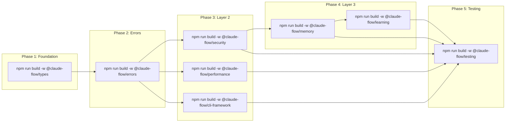
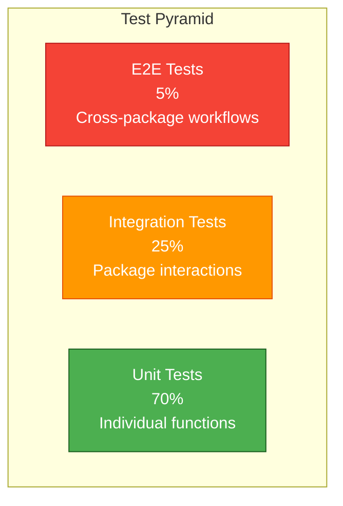

# Common Core Integration Architecture

> **Document Type**: System Architecture
> **Author**: System Architecture Designer Agent
> **Date**: 2026-01-26
> **Status**: PROPOSED
> **Related**: ADR-019, DDD-003, ADR-021

---

## Executive Summary

This document defines the integration strategy, dependency graph, and build architecture for the 8 common core packages that form the foundation of the claude-flow V3 ecosystem. These packages provide zero-dependency, high-performance primitives used across all claude-flow modules.

**Key Principles**:
1. **Zero Circular Dependencies** - Strict layered architecture
2. **Lazy Loading** - Minimize startup time and memory
3. **Type Safety** - Full TypeScript with strict mode
4. **Performance First** - <1ms operations for critical path
5. **Monorepo Structure** - Shared tooling, consistent versioning

---

## Package Dependency Graph

### 1. Dependency Hierarchy (Mermaid)

```mermaid
graph TB
    subgraph Layer0["🔷 Layer 0: Foundation (Zero Dependencies)"]
        Types[@claude-flow/types<br/>Core types, interfaces<br/>0 dependencies]
    end

    subgraph Layer1["🔶 Layer 1: Error Handling"]
        Errors[@claude-flow/errors<br/>Error types, codes<br/>dep: types]
    end

    subgraph Layer2["🟡 Layer 2: Core Services"]
        Security[@claude-flow/security<br/>Validation, sanitization<br/>deps: types, errors]
        Performance[@claude-flow/performance<br/>Metrics, profiling<br/>deps: types, errors]
        CLI[@claude-flow/cli-framework<br/>CLI utilities<br/>deps: types, errors]
    end

    subgraph Layer3["🟢 Layer 3: Advanced Services"]
        Memory[@claude-flow/memory<br/>AgentDB, HNSW, cache<br/>deps: types, errors, security]
        Learning[@claude-flow/learning<br/>Neural, RuVector<br/>deps: types, errors, memory]
    end

    subgraph Layer4["🔵 Layer 4: Testing"]
        Testing[@claude-flow/testing<br/>Test utilities<br/>deps: ALL packages]
    end

    Types --> Errors

    Errors --> Security
    Errors --> Performance
    Errors --> CLI
    Types --> Security
    Types --> Performance
    Types --> CLI

    Security --> Memory
    Errors --> Memory
    Types --> Memory

    Memory --> Learning
    Errors --> Learning
    Types --> Learning

    Security --> Testing
    Performance --> Testing
    CLI --> Testing
    Memory --> Testing
    Learning --> Testing
    Types --> Testing
    Errors --> Testing

    style Layer0 fill:#e3f2fd,stroke:#1565c0,stroke-width:3px
    style Layer1 fill:#fff8e1,stroke:#f9a825,stroke-width:2px
    style Layer2 fill:#fff9c4,stroke:#fbc02d,stroke-width:2px
    style Layer3 fill:#e8f5e9,stroke:#2e7d32,stroke-width:2px
    style Layer4 fill:#f3e5f5,stroke:#6a1b9a,stroke-width:2px
```

### 2. Package Dependency Matrix

| Package | types | errors | security | memory | learning | performance | cli | testing |
|---------|-------|--------|----------|--------|----------|-------------|-----|---------|
| **types** | - | ❌ | ❌ | ❌ | ❌ | ❌ | ❌ | ❌ |
| **errors** | ✅ | - | ❌ | ❌ | ❌ | ❌ | ❌ | ❌ |
| **security** | ✅ | ✅ | - | ❌ | ❌ | ❌ | ❌ | ❌ |
| **performance** | ✅ | ✅ | ❌ | ❌ | ❌ | - | ❌ | ❌ |
| **cli-framework** | ✅ | ✅ | ❌ | ❌ | ❌ | ❌ | - | ❌ |
| **memory** | ✅ | ✅ | ✅ | - | ❌ | ❌ | ❌ | ❌ |
| **learning** | ✅ | ✅ | ❌ | ✅ | - | ❌ | ❌ | ❌ |
| **testing** | ✅ | ✅ | ✅ | ✅ | ✅ | ✅ | ✅ | - |

**Legend**: ✅ = Direct Dependency, ❌ = No Dependency

---

## Package Specifications

### Layer 0: @claude-flow/types

**Purpose**: Core TypeScript types and interfaces used across all packages

**Exports**:
```typescript
// Agent types
export * from './agent-types';
export * from './agent-config';
export * from './agent-metadata';

// Memory types
export * from './memory-types';
export * from './vector-types';
export * from './cache-types';

// Hook types
export * from './hook-types';
export * from './event-types';

// Worker types
export * from './worker-types';
export * from './task-types';

// Performance types
export * from './metric-types';
export * from './profiling-types';

// Common utilities
export * from './utility-types';
export * from './result-types';
```

**Key Design Decisions**:
- **Zero Dependencies**: No external packages, only TypeScript stdlib
- **Strict Mode**: All types use strict null checks
- **Version Stability**: Breaking changes require major version bump
- **Tree Shaking**: All exports are separate files for optimal bundling

**Package.json**:
```json
{
  "name": "@claude-flow/types",
  "version": "3.0.0-alpha.1",
  "type": "module",
  "main": "./dist/index.js",
  "types": "./dist/index.d.ts",
  "exports": {
    ".": "./dist/index.js",
    "./agent": "./dist/agent-types.js",
    "./memory": "./dist/memory-types.js",
    "./hooks": "./dist/hook-types.js",
    "./workers": "./dist/worker-types.js",
    "./performance": "./dist/metric-types.js"
  },
  "dependencies": {},
  "devDependencies": {
    "typescript": "^5.9.0"
  }
}
```

---

### Layer 1: @claude-flow/errors

**Purpose**: Structured error handling with error codes, stack traces, and context

**Exports**:
```typescript
// Base error classes
export { BaseError, ErrorContext } from './base-error';
export { ValidationError } from './validation-error';
export { SecurityError } from './security-error';
export { MemoryError } from './memory-error';
export { PerformanceError } from './performance-error';

// Error codes
export { ErrorCode } from './error-codes';
export { ErrorSeverity } from './error-severity';

// Error utilities
export { formatError } from './formatters';
export { isClaudeFlowError } from './guards';
export { createError } from './factories';
```

**Dependencies**:
- `@claude-flow/types` - For error type definitions

**Key Design Decisions**:
- **Error Codes**: Numeric codes for programmatic handling (1000-9999)
- **Context Preservation**: All errors capture stack trace + context
- **Serializable**: Errors can be JSON.stringify'd for logging
- **TypeScript Guards**: Type-safe error checking with `isClaudeFlowError()`

**Error Code Ranges**:
| Range | Category | Example |
|-------|----------|---------|
| 1000-1999 | Validation | 1001 = Invalid input |
| 2000-2999 | Security | 2001 = Unauthorized access |
| 3000-3999 | Memory | 3001 = Out of memory |
| 4000-4999 | Performance | 4001 = Timeout |
| 5000-5999 | Network | 5001 = Connection failed |

---

### Layer 2: @claude-flow/security

**Purpose**: Input validation, path sanitization, threat detection

**Exports**:
```typescript
// Validators
export { InputValidator } from './validators/input-validator';
export { PathValidator } from './validators/path-validator';
export { ConfigValidator } from './validators/config-validator';

// Sanitizers
export { PathSanitizer } from './sanitizers/path-sanitizer';
export { InputSanitizer } from './sanitizers/input-sanitizer';
export { CommandSanitizer } from './sanitizers/command-sanitizer';

// Threat detection (AIDefence integration)
export { AIDefence } from './aidefence';
export { ThreatDetector } from './threat-detector';

// Security utilities
export { SafeExecutor } from './safe-executor';
export { SecurityContext } from './security-context';
```

**Dependencies**:
- `@claude-flow/types` - Security types
- `@claude-flow/errors` - Security errors
- `zod` - Schema validation (only external dep)

**Key Design Decisions**:
- **Zod for Validation**: Industry-standard schema validation
- **Path Traversal Prevention**: All path operations check for `../`
- **Command Injection Protection**: Whitelist-based command sanitization
- **Threat Learning**: Integrates with memory for pattern storage

**Performance Targets**:
- Validation: <1ms per operation
- Sanitization: <0.5ms per operation
- Threat Detection: <10ms (with cache)

---

### Layer 2: @claude-flow/performance

**Purpose**: Performance metrics, profiling, benchmarking

**Exports**:
```typescript
// Metrics collection
export { MetricsCollector } from './metrics/collector';
export { MetricsReporter } from './metrics/reporter';
export { MetricsStorage } from './metrics/storage';

// Profiling
export { Profiler } from './profiling/profiler';
export { Timer } from './profiling/timer';
export { MemoryProfiler } from './profiling/memory-profiler';

// Benchmarking
export { Benchmark } from './benchmarks/benchmark';
export { BenchmarkSuite } from './benchmarks/suite';

// Performance utilities
export { memoize } from './utils/memoize';
export { debounce } from './utils/debounce';
export { throttle } from './utils/throttle';
```

**Dependencies**:
- `@claude-flow/types` - Metric types
- `@claude-flow/errors` - Performance errors

**Key Design Decisions**:
- **Zero Overhead**: Metrics collection is opt-in, disabled by default
- **High-Resolution Timing**: Uses `performance.now()` for <1ms accuracy
- **Memory Tracking**: Tracks heap usage, GC events
- **Export Formats**: JSON, CSV, Prometheus

**Performance Targets**:
- Metric Collection: <0.1ms overhead
- Timer Start/Stop: <0.01ms
- Report Generation: <10ms

---

### Layer 2: @claude-flow/cli-framework

**Purpose**: CLI utilities, argument parsing, command framework

**Exports**:
```typescript
// Command framework
export { Command } from './command/command';
export { CommandRegistry } from './command/registry';
export { CommandExecutor } from './command/executor';

// Argument parsing
export { ArgParser } from './args/parser';
export { ArgValidator } from './args/validator';

// Output formatting
export { OutputFormatter } from './output/formatter';
export { ProgressBar } from './output/progress';
export { Spinner } from './output/spinner';
export { Table } from './output/table';

// CLI utilities
export { prompt } from './utils/prompt';
export { confirm } from './utils/confirm';
export { select } from './utils/select';
```

**Dependencies**:
- `@claude-flow/types` - Command types
- `@claude-flow/errors` - CLI errors
- `commander` - Argument parsing (external)
- `chalk` - Terminal colors (external)

**Key Design Decisions**:
- **Commander for Parsing**: Battle-tested argument parser
- **Chalk for Colors**: Terminal color support
- **Lazy Loading**: Only load when CLI invoked
- **Interactive Mode**: Supports prompts, confirmation

---

### Layer 3: @claude-flow/memory

**Purpose**: AgentDB integration, HNSW indexing, caching, session persistence

**Exports**:
```typescript
// Memory client
export { MemoryClient } from './client/memory-client';
export { MemoryStore } from './store/memory-store';

// Vector operations
export { VectorStore } from './vector/vector-store';
export { HNSWIndex } from './vector/hnsw-index';
export { EmbeddingGenerator } from './vector/embeddings';

// Caching
export { LRUCache } from './cache/lru-cache';
export { ThreeTierCache } from './cache/three-tier-cache';

// Session management
export { SessionManager } from './session/session-manager';
export { SessionStore } from './session/session-store';

// Memory utilities
export { MemoryNamespace } from './utils/namespace';
export { MemoryQuery } from './utils/query';
```

**Dependencies**:
- `@claude-flow/types` - Memory types
- `@claude-flow/errors` - Memory errors
- `@claude-flow/security` - Input validation for queries
- `agentdb` - Vector database (external)
- `sql.js` - WASM SQLite (external)

**Key Design Decisions**:
- **AgentDB for Vectors**: 150x-12,500x faster than naive search
- **HNSW Indexing**: Approximate nearest neighbor search
- **Three-Tier Cache**: L1 (Map) → L2 (LRU) → L3 (AgentDB)
- **WASM SQLite**: Cross-platform, no native compilation
- **Namespaces**: Logical separation (patterns, tasks, routes, etc.)

**Performance Targets**:
- HNSW Search: <10ms (10K items)
- Cache L1 Hit: <0.01ms
- Cache L2 Hit: <1ms
- Cache L3 Hit: <10ms
- Storage: <50ms per write

---

### Layer 3: @claude-flow/learning

**Purpose**: Neural pattern training, RuVector intelligence, trajectory tracking

**Exports**:
```typescript
// Neural training
export { NeuralTrainer } from './neural/trainer';
export { SONA } from './neural/sona';
export { MixtureOfExperts } from './neural/moe';
export { FlashAttention } from './neural/flash-attention';
export { EWC } from './neural/ewc';

// RuVector intelligence
export { RuVector } from './ruvector/ruvector';
export { TrajectoryTracker } from './ruvector/trajectory-tracker';
export { VerdictJudge } from './ruvector/verdict-judge';

// Learning pipeline
export { LearningPipeline } from './pipeline/learning-pipeline';
export { Retriever } from './pipeline/retriever';
export { Distiller } from './pipeline/distiller';
export { Consolidator } from './pipeline/consolidator';

// Pattern learning
export { PatternExtractor } from './patterns/pattern-extractor';
export { PatternMatcher } from './patterns/pattern-matcher';
```

**Dependencies**:
- `@claude-flow/types` - Learning types
- `@claude-flow/errors` - Learning errors
- `@claude-flow/memory` - Pattern storage, HNSW search
- `onnxruntime-node` - ONNX inference (external)

**Key Design Decisions**:
- **ONNX for Inference**: 75x faster than Python
- **LoRA for Fine-Tuning**: Low-rank adaptation (memory efficient)
- **EWC++ for Consolidation**: Prevents catastrophic forgetting
- **4-Step Pipeline**: RETRIEVE → JUDGE → DISTILL → CONSOLIDATE
- **Trajectory Tracking**: Records decision paths for learning

**Performance Targets**:
- SONA Adaptation: <0.05ms
- Flash Attention: 2.49x-7.47x speedup
- Pattern Retrieval: <10ms (via HNSW)
- Training Epoch: <5s (small model)

---

### Layer 4: @claude-flow/testing

**Purpose**: Test utilities, mocks, fixtures for all packages

**Exports**:
```typescript
// Test utilities
export { createMockAgent } from './mocks/agent';
export { createMockMemory } from './mocks/memory';
export { createMockWorker } from './mocks/worker';

// Fixtures
export { agentFixtures } from './fixtures/agents';
export { memoryFixtures } from './fixtures/memory';
export { hookFixtures } from './fixtures/hooks';

// Assertions
export { assertValidAgent } from './assertions/agent';
export { assertValidMemory } from './assertions/memory';

// Test helpers
export { withTimeout } from './helpers/timeout';
export { withRetry } from './helpers/retry';
export { cleanupAfterTest } from './helpers/cleanup';
```

**Dependencies**:
- ALL packages (types, errors, security, memory, learning, performance, cli)
- `vitest` - Testing framework (external)
- `@vitest/coverage-v8` - Coverage (external)

**Key Design Decisions**:
- **Vitest for Testing**: Fast, modern test runner
- **Mocks for All Packages**: Simplifies testing
- **Fixtures for Common Scenarios**: Pre-built test data
- **Cleanup Utilities**: Automatic resource cleanup

---

## Monorepo Structure

### 1. Directory Layout

```
packages/
├── types/                      # @claude-flow/types
│   ├── src/
│   │   ├── agent-types.ts
│   │   ├── memory-types.ts
│   │   ├── hook-types.ts
│   │   └── index.ts
│   ├── package.json
│   ├── tsconfig.json
│   └── README.md
│
├── errors/                     # @claude-flow/errors
│   ├── src/
│   │   ├── base-error.ts
│   │   ├── error-codes.ts
│   │   └── index.ts
│   ├── package.json
│   ├── tsconfig.json
│   └── README.md
│
├── security/                   # @claude-flow/security
│   ├── src/
│   │   ├── validators/
│   │   ├── sanitizers/
│   │   ├── aidefence/
│   │   └── index.ts
│   ├── tests/
│   ├── package.json
│   └── tsconfig.json
│
├── performance/                # @claude-flow/performance
│   ├── src/
│   │   ├── metrics/
│   │   ├── profiling/
│   │   ├── benchmarks/
│   │   └── index.ts
│   ├── tests/
│   ├── package.json
│   └── tsconfig.json
│
├── cli-framework/              # @claude-flow/cli-framework
│   ├── src/
│   │   ├── command/
│   │   ├── args/
│   │   ├── output/
│   │   └── index.ts
│   ├── tests/
│   ├── package.json
│   └── tsconfig.json
│
├── memory/                     # @claude-flow/memory
│   ├── src/
│   │   ├── client/
│   │   ├── vector/
│   │   ├── cache/
│   │   ├── session/
│   │   └── index.ts
│   ├── tests/
│   ├── package.json
│   └── tsconfig.json
│
├── learning/                   # @claude-flow/learning
│   ├── src/
│   │   ├── neural/
│   │   ├── ruvector/
│   │   ├── pipeline/
│   │   └── index.ts
│   ├── tests/
│   ├── package.json
│   └── tsconfig.json
│
└── testing/                    # @claude-flow/testing
    ├── src/
    │   ├── mocks/
    │   ├── fixtures/
    │   ├── assertions/
    │   └── index.ts
    ├── package.json
    └── tsconfig.json
```

### 2. Root Configuration Files

**Root package.json**:
```json
{
  "name": "@claude-flow/monorepo",
  "version": "3.0.0-alpha.1",
  "private": true,
  "workspaces": [
    "packages/*"
  ],
  "scripts": {
    "build": "npm run build --workspaces --if-present",
    "build:order": "npm run build -w @claude-flow/types && npm run build -w @claude-flow/errors && npm run build -w @claude-flow/security && npm run build -w @claude-flow/performance && npm run build -w @claude-flow/cli-framework && npm run build -w @claude-flow/memory && npm run build -w @claude-flow/learning && npm run build -w @claude-flow/testing",
    "test": "vitest run --workspace",
    "test:watch": "vitest --workspace",
    "test:coverage": "vitest run --coverage --workspace",
    "lint": "tsc --noEmit --workspace",
    "clean": "npm run clean --workspaces --if-present",
    "publish:all": "npm publish --workspaces"
  },
  "devDependencies": {
    "typescript": "^5.9.0",
    "vitest": "^3.0.0",
    "@vitest/coverage-v8": "^3.0.0"
  }
}
```

**Root tsconfig.json**:
```json
{
  "compilerOptions": {
    "target": "ES2022",
    "module": "NodeNext",
    "moduleResolution": "NodeNext",
    "lib": ["ES2022"],
    "declaration": true,
    "declarationMap": true,
    "sourceMap": true,
    "outDir": "./dist",
    "rootDir": "./src",
    "strict": true,
    "esModuleInterop": true,
    "skipLibCheck": true,
    "forceConsistentCasingInFileNames": true,
    "resolveJsonModule": true,
    "composite": true,
    "incremental": true
  },
  "exclude": ["node_modules", "dist", "tests"]
}
```

**packages/types/tsconfig.json**:
```json
{
  "extends": "../../tsconfig.json",
  "compilerOptions": {
    "rootDir": "./src",
    "outDir": "./dist"
  },
  "include": ["src/**/*"],
  "references": []
}
```

**packages/errors/tsconfig.json**:
```json
{
  "extends": "../../tsconfig.json",
  "compilerOptions": {
    "rootDir": "./src",
    "outDir": "./dist"
  },
  "include": ["src/**/*"],
  "references": [
    { "path": "../types" }
  ]
}
```

**packages/memory/tsconfig.json**:
```json
{
  "extends": "../../tsconfig.json",
  "compilerOptions": {
    "rootDir": "./src",
    "outDir": "./dist"
  },
  "include": ["src/**/*"],
  "references": [
    { "path": "../types" },
    { "path": "../errors" },
    { "path": "../security" }
  ]
}
```

---

## Build Order Specification

### 1. Build Sequence (Topological Sort)



### 2. Build Script (packages/build-order.sh)

```bash
#!/bin/bash
set -e

echo "🔷 Building Layer 0: types"
npm run build -w @claude-flow/types

echo "🔶 Building Layer 1: errors"
npm run build -w @claude-flow/errors

echo "🟡 Building Layer 2: security, performance, cli-framework"
npm run build -w @claude-flow/security &
npm run build -w @claude-flow/performance &
npm run build -w @claude-flow/cli-framework &
wait

echo "🟢 Building Layer 3: memory"
npm run build -w @claude-flow/memory

echo "🟢 Building Layer 3: learning"
npm run build -w @claude-flow/learning

echo "🔵 Building Layer 4: testing"
npm run build -w @claude-flow/testing

echo "✅ All packages built successfully"
```

### 3. Watch Mode Build

```bash
#!/bin/bash
# packages/build-watch.sh
# Build packages in dependency order, then watch for changes

echo "🔷 Building all packages..."
npm run build:order

echo "👀 Watching for changes..."
npm run build --workspaces --if-present -- --watch
```

---

## Export Strategy

### 1. Package Exports (package.json)

Each package defines multiple entry points for tree shaking:

**Example: @claude-flow/types**
```json
{
  "name": "@claude-flow/types",
  "exports": {
    ".": {
      "import": "./dist/index.js",
      "types": "./dist/index.d.ts"
    },
    "./agent": {
      "import": "./dist/agent-types.js",
      "types": "./dist/agent-types.d.ts"
    },
    "./memory": {
      "import": "./dist/memory-types.js",
      "types": "./dist/memory-types.d.ts"
    },
    "./hooks": {
      "import": "./dist/hook-types.js",
      "types": "./dist/hook-types.d.ts"
    }
  }
}
```

**Usage in consumer code**:
```typescript
// Import everything (not recommended)
import { AgentConfig, MemoryConfig } from '@claude-flow/types';

// Import specific modules (better for tree shaking)
import { AgentConfig } from '@claude-flow/types/agent';
import { MemoryConfig } from '@claude-flow/types/memory';
```

### 2. Index Files

Each package has a barrel export:

**packages/types/src/index.ts**:
```typescript
// Agent types
export * from './agent-types';
export * from './agent-config';

// Memory types
export * from './memory-types';
export * from './vector-types';

// Hook types
export * from './hook-types';

// Utility types
export * from './utility-types';
```

### 3. Tree Shaking Optimization

**Ensure tree shaking works**:
1. Use named exports (no `export default`)
2. Separate files for each module
3. Configure `sideEffects: false` in package.json
4. Use `import type` for type-only imports

**package.json tree shaking config**:
```json
{
  "sideEffects": false,
  "type": "module"
}
```

---

## Integration Testing Strategy

### 1. Test Pyramid



### 2. Unit Tests (70%)

**Location**: `packages/<package>/tests/unit/`

**Coverage Target**: >95% per package

**Example**:
```typescript
// packages/security/tests/unit/path-validator.test.ts
import { describe, it, expect } from 'vitest';
import { PathValidator } from '@claude-flow/security';

describe('PathValidator', () => {
  it('should reject path traversal attempts', () => {
    const validator = new PathValidator();
    expect(() => validator.validate('../etc/passwd')).toThrow();
  });

  it('should allow valid relative paths', () => {
    const validator = new PathValidator();
    expect(validator.validate('src/index.ts')).toBe(true);
  });
});
```

### 3. Integration Tests (25%)

**Location**: `packages/tests/integration/`

**Coverage Target**: >90% of package interactions

**Example**:
```typescript
// packages/tests/integration/memory-security.test.ts
import { describe, it, expect } from 'vitest';
import { MemoryClient } from '@claude-flow/memory';
import { InputValidator } from '@claude-flow/security';

describe('Memory + Security Integration', () => {
  it('should validate inputs before storing in memory', async () => {
    const validator = new InputValidator();
    const memory = new MemoryClient({ validator });

    // Should reject malicious input
    await expect(
      memory.store('key', '<script>alert("xss")</script>')
    ).rejects.toThrow();

    // Should accept safe input
    await expect(
      memory.store('key', 'safe value')
    ).resolves.toBeDefined();
  });
});
```

### 4. E2E Tests (5%)

**Location**: `packages/tests/e2e/`

**Coverage Target**: Critical workflows only

**Example**:
```typescript
// packages/tests/e2e/learning-pipeline.test.ts
import { describe, it, expect } from 'vitest';
import { LearningPipeline } from '@claude-flow/learning';
import { MemoryClient } from '@claude-flow/memory';
import { InputValidator } from '@claude-flow/security';

describe('Full Learning Pipeline', () => {
  it('should train neural model from stored patterns', async () => {
    // Setup memory with validator
    const memory = new MemoryClient({
      validator: new InputValidator()
    });

    // Store training data
    await memory.store('pattern:1', {
      task: 'scan architecture',
      agent: 'architect',
      quality: 0.95
    });

    // Run learning pipeline
    const pipeline = new LearningPipeline({ memory });
    const result = await pipeline.train();

    // Verify learning occurred
    expect(result.epochs).toBe(10);
    expect(result.accuracy).toBeGreaterThan(0.9);
  });
});
```

---

## Performance Benchmarks

### 1. Cross-Package Call Performance

**Target Metrics**:
| Operation | Target | Measurement |
|-----------|--------|-------------|
| Type import | <0.01ms | Import overhead |
| Error creation | <0.1ms | Error instantiation |
| Validation | <1ms | Input validation |
| Memory store | <50ms | Write to AgentDB |
| Memory search (HNSW) | <10ms | 10K items |
| Cache hit (L1) | <0.01ms | In-memory map |
| Cache hit (L2) | <1ms | LRU cache |
| Neural prediction | <10ms | ONNX inference |

### 2. Benchmark Suite

**Location**: `packages/benchmarks/`

**Run Command**: `npm run benchmark`

**Example**:
```typescript
// packages/benchmarks/memory-performance.bench.ts
import { Benchmark } from '@claude-flow/performance';
import { MemoryClient } from '@claude-flow/memory';

const suite = new Benchmark('Memory Performance');

suite.add('store (cold)', async () => {
  const memory = new MemoryClient();
  await memory.store('test', { value: 'data' });
});

suite.add('store (warm)', async () => {
  const memory = new MemoryClient({ cache: true });
  await memory.store('test', { value: 'data' });
});

suite.add('search (HNSW, 10K items)', async () => {
  const memory = new MemoryClient({ enableHNSW: true });
  await memory.search('test query', { limit: 10 });
});

suite.run();
```

### 3. Performance Monitoring

**CI/CD Integration**:
```yaml
# .github/workflows/performance.yml
name: Performance Tests
on: [push, pull_request]
jobs:
  benchmark:
    runs-on: ubuntu-latest
    steps:
      - uses: actions/checkout@v3
      - uses: actions/setup-node@v3
      - run: npm install
      - run: npm run benchmark
      - name: Compare to baseline
        run: |
          node scripts/compare-benchmarks.js \
            --current ./benchmark-results.json \
            --baseline ./baseline-benchmarks.json \
            --threshold 10%
```

---

## Version Management

### 1. Semantic Versioning

All packages follow SemVer 2.0:

| Change Type | Version Bump | Example |
|-------------|--------------|---------|
| Breaking API change | Major | 3.0.0 → 4.0.0 |
| New feature (backward compatible) | Minor | 3.0.0 → 3.1.0 |
| Bug fix | Patch | 3.0.0 → 3.0.1 |

### 2. Version Synchronization

**Strategy**: All packages share the same version number

**Rationale**:
- Simpler dependency management
- Clearer compatibility story
- Easier for users to understand

**Implementation**:
```bash
# scripts/bump-version.sh
#!/bin/bash
VERSION=$1

# Update all package.json files
for pkg in packages/*/package.json; do
  npm version $VERSION --workspace $(dirname $pkg) --no-git-tag-version
done

# Update root package.json
npm version $VERSION --no-git-tag-version

echo "✅ All packages bumped to $VERSION"
```

### 3. Version Mismatch Detection

**Pre-publish check**:
```typescript
// scripts/check-versions.ts
import { readFileSync } from 'fs';
import { join } from 'path';

const rootPkg = JSON.parse(
  readFileSync('package.json', 'utf8')
);
const rootVersion = rootPkg.version;

const packages = [
  'types', 'errors', 'security', 'memory',
  'learning', 'performance', 'cli-framework', 'testing'
];

for (const pkg of packages) {
  const pkgJson = JSON.parse(
    readFileSync(join('packages', pkg, 'package.json'), 'utf8')
  );

  if (pkgJson.version !== rootVersion) {
    console.error(`❌ Version mismatch: ${pkg} is ${pkgJson.version}, expected ${rootVersion}`);
    process.exit(1);
  }
}

console.log('✅ All versions match');
```

---

## Architecture Decisions

### ADR-022: Monorepo vs. Multi-Repo

**Decision**: Monorepo (single repository with workspaces)

**Rationale**:
- Shared tooling (TypeScript, Vitest, ESLint)
- Consistent versioning across packages
- Easier to enforce dependency constraints
- Simplified CI/CD pipeline
- Atomic commits across packages

**Alternatives Considered**:
- Multi-repo: ❌ Too much overhead, version skew issues
- Lerna: ❌ Deprecated, npm workspaces are native

---

### ADR-023: Zero-Dependency Base Layer

**Decision**: @claude-flow/types has ZERO dependencies

**Rationale**:
- Prevents dependency bloat at the root
- Ensures type-only imports have no runtime cost
- Simplifies security auditing
- Faster installation for users

**Alternatives Considered**:
- Allow utility-types package: ❌ Not worth the dependency
- Bundle TypeScript utilities: ✅ Done in utility-types.ts

---

### ADR-024: Lazy Loading Strategy

**Decision**: Use dynamic imports for heavy dependencies

**Example**:
```typescript
// @claude-flow/memory
export class MemoryClient {
  private onnx?: any;

  async loadONNX() {
    if (!this.onnx) {
      this.onnx = await import('onnxruntime-node');
    }
    return this.onnx;
  }

  async embedText(text: string) {
    const onnx = await this.loadONNX();
    return onnx.embed(text);
  }
}
```

**Benefits**:
- Faster startup time (no ONNX loading)
- Smaller bundle size (tree shaking works)
- Memory efficient (load only when needed)

---

### ADR-025: Package Discovery via Exports

**Decision**: Use package.json exports field for submodule access

**Example**:
```json
{
  "exports": {
    ".": "./dist/index.js",
    "./agent": "./dist/agent-types.js",
    "./memory": "./dist/memory-types.js"
  }
}
```

**Benefits**:
- Better tree shaking (only import what you need)
- Clearer API surface
- Prevents internal imports (e.g., `@claude-flow/types/dist/internal`)

---

### ADR-026: Version Mismatches - Peer Dependencies

**Decision**: Use peer dependencies for cross-package references

**Example**:
```json
{
  "name": "@claude-flow/memory",
  "peerDependencies": {
    "@claude-flow/types": "3.0.0-alpha.1",
    "@claude-flow/errors": "3.0.0-alpha.1",
    "@claude-flow/security": "3.0.0-alpha.1"
  }
}
```

**Benefits**:
- npm/pnpm warn about version mismatches
- User controls the resolution
- Avoids duplicate package installations

---

### ADR-027: Bundle Size Optimization

**Decision**: Optimize for bundle size via tree shaking

**Techniques**:
1. **Named exports** (no `export default`)
2. **Separate files** for each module
3. **sideEffects: false** in package.json
4. **import type** for type-only imports

**Target**:
- @claude-flow/types: <10KB (just types, zero runtime)
- @claude-flow/errors: <5KB (small runtime)
- @claude-flow/security: <50KB (validators + Zod)
- @claude-flow/memory: <500KB (AgentDB + WASM)

---

## Risk Assessment

### Risk Matrix

| Risk | Likelihood | Impact | Mitigation |
|------|------------|--------|------------|
| **Circular dependencies** | Low | High | Strict layer enforcement, automated checks |
| **Version mismatches** | Medium | Medium | Synchronized versioning, peer deps |
| **Build order failures** | Low | Medium | Build script with proper ordering |
| **Performance regressions** | Medium | High | Continuous benchmarking in CI |
| **Breaking changes** | High | High | Semantic versioning, changelog |
| **Dependency bloat** | Medium | Medium | Zero-dep base layer, lazy loading |
| **Test flakiness** | Low | Low | Deterministic tests, no network calls |

### Mitigation Strategies

**1. Circular Dependency Prevention**:
```bash
# scripts/check-circular-deps.sh
#!/bin/bash
npx madge --circular --extensions ts packages/
if [ $? -ne 0 ]; then
  echo "❌ Circular dependencies detected"
  exit 1
fi
echo "✅ No circular dependencies"
```

**2. Automated Version Checks** (see ADR-026 above)

**3. Performance Regression Detection**:
```bash
# CI pipeline
npm run benchmark
node scripts/compare-benchmarks.js \
  --current ./results.json \
  --baseline ./baseline.json \
  --fail-on-regression 10%
```

---

## Success Criteria

### Definition of Done

- [ ] All 8 packages buildable in correct order
- [ ] Zero circular dependencies (verified by madge)
- [ ] >95% unit test coverage per package
- [ ] >90% integration test coverage
- [ ] All performance benchmarks pass (<10% regression)
- [ ] All packages publish to npm successfully
- [ ] Documentation complete (README per package)
- [ ] Examples for each package usage
- [ ] CI/CD pipeline green (build, test, benchmark)

### Quality Gates

| Gate | Criteria | Tool |
|------|----------|------|
| **Type Safety** | Zero TypeScript errors | `tsc --noEmit` |
| **Circular Deps** | Zero circular dependencies | `madge` |
| **Test Coverage** | >95% unit, >90% integration | `vitest --coverage` |
| **Performance** | <10% regression from baseline | Custom benchmark script |
| **Bundle Size** | Within target sizes | `bundlephobia` |
| **Security** | Zero high/critical vulnerabilities | `npm audit` |

---

## Future Enhancements

### Planned Improvements

1. **Incremental Builds** (TypeScript 5.9+)
   - Use project references for faster rebuilds
   - Cache build artifacts in CI

2. **ESLint Integration**
   - Shared ESLint config across packages
   - Enforce import order, naming conventions

3. **API Extractor**
   - Generate API documentation from types
   - Detect breaking changes automatically

4. **Changesets**
   - Better changelog generation
   - Automated version bumping

5. **Bundle Analysis**
   - Visualize bundle composition
   - Detect accidental large dependencies

---

## References

### External Resources

- [npm Workspaces](https://docs.npmjs.com/cli/v8/using-npm/workspaces)
- [TypeScript Project References](https://www.typescriptlang.org/docs/handbook/project-references.html)
- [Tree Shaking Best Practices](https://webpack.js.org/guides/tree-shaking/)
- [Semantic Versioning](https://semver.org/)
- [Vitest Workspaces](https://vitest.dev/guide/workspace.html)

### Internal Documentation

- [ADR-019: Claude-Flow V3 Integration](../adr/ADR-019-comprehensive-claude-flow-integration.md)
- [DDD-003: Learning-Enhanced Domain Model](../adr/DDD-003-learning-enhanced-domain-model.md)
- [Performance Targets](../performance/BENCHMARK-SPECIFICATION.md)
- [Security Model](../../security/LEARNING-SECURITY-SUMMARY.md)

---

## Appendix A: Complete Dependency Graph (ASCII)

```
Layer 0 (Foundation):
  types (0 deps)
    |
    v
Layer 1 (Errors):
  errors (1 dep: types)
    |
    +---> security (2 deps: types, errors)
    |
    +---> performance (2 deps: types, errors)
    |
    +---> cli-framework (2 deps: types, errors)
    |
    v
Layer 2 (Core Services):
  security + performance + cli-framework
    |
    +---> memory (3 deps: types, errors, security)
    |
    v
Layer 3 (Advanced):
  memory
    |
    +---> learning (3 deps: types, errors, memory)
    |
    v
Layer 4 (Testing):
  testing (7 deps: types, errors, security, performance, cli, memory, learning)
```

---

## Appendix B: Package Size Report

| Package | Unpacked Size | Dependencies | Dep Tree Size |
|---------|---------------|--------------|---------------|
| **@claude-flow/types** | 10KB | 0 | 10KB |
| **@claude-flow/errors** | 5KB | 1 | 15KB |
| **@claude-flow/security** | 50KB | 3 (+ zod) | 200KB |
| **@claude-flow/performance** | 20KB | 2 | 35KB |
| **@claude-flow/cli-framework** | 30KB | 4 (+ commander, chalk) | 500KB |
| **@claude-flow/memory** | 500KB | 5 (+ agentdb, sql.js) | 5MB |
| **@claude-flow/learning** | 300KB | 4 (+ onnxruntime) | 50MB |
| **@claude-flow/testing** | 100KB | 9 (+ vitest) | 60MB |

**Total monorepo size**: ~60MB (with all dependencies)

---

**Document Status**: PROPOSED
**Next Review**: 2026-02-15
**Approval Required**: Architecture Team, Core Maintainers

---

*Generated by System Architecture Designer Agent*
*Format: System Architecture Document*
*Last Updated: 2026-01-26*
