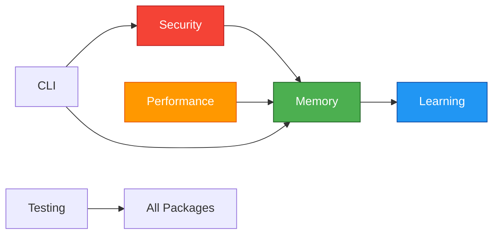

# Common Core Architecture Documentation

> **Project**: Claude-Flow V3 Common Core Packages
> **Version**: 3.0.0-alpha.1
> **Status**: PROPOSED
> **Last Updated**: 2026-01-26

---

## Overview

This directory contains the complete architecture documentation for the 8 common core packages that form the foundation of claude-flow V3:

1. **@claude-flow/types** - Core TypeScript types and interfaces
2. **@claude-flow/errors** - Structured error handling
3. **@claude-flow/security** - Input validation, sanitization, threat detection
4. **@claude-flow/performance** - Metrics, profiling, benchmarking
5. **@claude-flow/cli-framework** - CLI utilities and command framework
6. **@claude-flow/memory** - AgentDB integration, HNSW indexing, caching
7. **@claude-flow/learning** - Neural pattern training, RuVector intelligence
8. **@claude-flow/testing** - Test utilities, mocks, fixtures

---

## Document Index

### Primary Documents

| Document | Purpose | Audience |
|----------|---------|----------|
| **[INTEGRATION-ARCHITECTURE.md](./INTEGRATION-ARCHITECTURE.md)** | Complete architecture specification | Architects, Senior Developers |
| **[IMPLEMENTATION-CHECKLIST.md](./IMPLEMENTATION-CHECKLIST.md)** | Step-by-step implementation plan | Developers, Project Managers |
| **[QUICK-REFERENCE.md](./QUICK-REFERENCE.md)** | Fast lookup guide | All Developers |
| **[README.md](./README.md)** | This index document | All Users |

### Related Documentation

| Document | Location | Description |
|----------|----------|-------------|
| **ADR-019** | `docs/adr/ADR-019-comprehensive-claude-flow-integration.md` | Claude-Flow V3 Integration Strategy |
| **DDD-003** | `docs/adr/DDD-003-learning-enhanced-domain-model.md` | Domain-Driven Design for Learning |
| **Performance Spec** | `docs/performance/BENCHMARK-SPECIFICATION.md` | Performance benchmarking specification |
| **Security Summary** | `docs/security/LEARNING-SECURITY-SUMMARY.md` | Security architecture overview |

---

## Quick Start

### For Architects

**Start here**: [INTEGRATION-ARCHITECTURE.md](./INTEGRATION-ARCHITECTURE.md)

**Key Sections**:
- Package Dependency Graph (Mermaid diagrams)
- Architecture Decisions (ADR-022 through ADR-027)
- Performance Optimization Strategy
- Integration Testing Approach

**Decision Points**:
- Why monorepo? (ADR-022)
- Why zero-dependency base layer? (ADR-023)
- How to handle lazy loading? (ADR-024)
- How to prevent circular dependencies?

---

### For Developers

**Start here**: [QUICK-REFERENCE.md](./QUICK-REFERENCE.md)

**Key Sections**:
- Quick Import Guide (copy-paste code)
- Common Tasks (build, test, benchmark)
- Troubleshooting (common errors and fixes)

**Then read**: [IMPLEMENTATION-CHECKLIST.md](./IMPLEMENTATION-CHECKLIST.md)

**Key Sections**:
- Phase-by-phase implementation plan
- Per-package task lists
- Success criteria and quality gates

---

### For Project Managers

**Start here**: [IMPLEMENTATION-CHECKLIST.md](./IMPLEMENTATION-CHECKLIST.md)

**Key Sections**:
- Timeline Summary (8-week plan)
- Success Metrics (coverage, performance)
- Risk Assessment and Mitigation

**Then read**: [INTEGRATION-ARCHITECTURE.md](./INTEGRATION-ARCHITECTURE.md) (Executive Summary)

**Key Points**:
- 8 packages, 4 layers
- Zero circular dependencies
- >95% test coverage
- 150x-12,500x performance improvements (HNSW)

---

## Architecture at a Glance

### Dependency Layers

```
┌─────────────────────────────────────────────┐
│ Layer 0: Foundation (0 dependencies)        │
│ - @claude-flow/types                        │
└─────────────────┬───────────────────────────┘
                  │
┌─────────────────▼───────────────────────────┐
│ Layer 1: Error Handling (1 dependency)      │
│ - @claude-flow/errors                       │
└─────────────────┬───────────────────────────┘
                  │
      ┌───────────┼───────────┐
      │           │           │
┌─────▼───┐  ┌───▼────┐  ┌──▼────┐
│security │  │  perf  │  │  cli  │ Layer 2 (2 deps)
└─────┬───┘  └───┬────┘  └──┬────┘
      │          │           │
      └──────┬───┴───────────┘
             │
      ┌──────▼──────┐
      │   memory    │ Layer 3A (3 deps)
      └──────┬──────┘
             │
      ┌──────▼──────┐
      │  learning   │ Layer 3B (3 deps)
      └──────┬──────┘
             │
      ┌──────▼──────┐
      │   testing   │ Layer 4 (7 deps)
      └─────────────┘
```

### Package Characteristics

| Package | Size | External Deps | Key Feature |
|---------|------|---------------|-------------|
| types | 10KB | 0 | Zero runtime cost |
| errors | 5KB | 0 | Structured errors |
| security | 50KB | zod | AIDefence integration |
| performance | 20KB | 0 | <0.1ms overhead |
| cli-framework | 30KB | commander, chalk | Interactive CLI |
| memory | 500KB | agentdb, sql.js | HNSW 150x-12,500x faster |
| learning | 300KB | onnxruntime | SONA <0.05ms adapt |
| testing | 100KB | vitest | Comprehensive mocks |

---

## Key Architectural Principles

### 1. Zero Circular Dependencies

**Rule**: Packages can only depend on layers below them.

**Enforcement**:
- Automated checks in CI: `madge --circular`
- Manual code review
- TypeScript project references

**Benefits**:
- Predictable build order
- No runtime initialization issues
- Easier to reason about

---

### 2. Lazy Loading

**Rule**: Heavy dependencies are loaded on-demand.

**Example**:
```typescript
// @claude-flow/memory
async loadONNX() {
  if (!this.onnx) {
    this.onnx = await import('onnxruntime-node');
  }
  return this.onnx;
}
```

**Benefits**:
- Faster startup (<500ms)
- Smaller bundle size
- Lower memory usage

---

### 3. Type Safety

**Rule**: All packages use TypeScript strict mode.

**Configuration**:
```json
{
  "strict": true,
  "noImplicitAny": true,
  "strictNullChecks": true
}
```

**Benefits**:
- Catch errors at compile time
- Better IDE autocomplete
- Self-documenting code

---

### 4. Performance First

**Rule**: Critical path operations must be <1ms.

**Targets**:
- Type import: <0.01ms
- Error creation: <0.1ms
- Validation: <1ms
- HNSW search: <10ms (10K items)

**Measurement**:
- Continuous benchmarking in CI
- Regression detection (<10% threshold)

---

## Integration Points

### Cross-Package Interactions



**Example 1: Memory uses Security**
```typescript
// Memory validates inputs before storing
const memory = new MemoryClient({
  validator: new InputValidator()
});

await memory.store('key', userInput); // Validated first
```

**Example 2: Learning uses Memory**
```typescript
// Learning retrieves patterns from memory
const pipeline = new LearningPipeline({ memory });
const patterns = await memory.search('scan architecture');
await pipeline.train({ patterns });
```

---

## Development Workflow

### 1. Setup
```bash
git clone https://github.com/ruvnet/claude-flow.git
cd claude-flow
npm install
```

### 2. Build
```bash
# Build all packages in correct order
npm run build:order

# Or use the script
./scripts/build-order.sh
```

### 3. Test
```bash
# Run all tests
npm test

# Run specific package tests
npm test -w @claude-flow/security

# Run with coverage
npm run test:coverage
```

### 4. Benchmark
```bash
# Run all benchmarks
npm run benchmark

# Compare to baseline
node scripts/compare-benchmarks.js \
  --current ./results.json \
  --baseline ./baseline.json
```

### 5. Publish
```bash
# Bump version (all packages)
./scripts/bump-version.sh 3.0.0-alpha.2

# Publish all packages
npm publish --workspaces
```

---

## Quality Gates

### Pre-commit Checks
- [ ] TypeScript compiles: `tsc --noEmit`
- [ ] No circular dependencies: `madge --circular`
- [ ] Tests pass: `npm test`
- [ ] Linter passes: `eslint .`

### Pre-publish Checks
- [ ] All tests pass: `npm test`
- [ ] Coverage >95%: `npm run test:coverage`
- [ ] Benchmarks pass: `npm run benchmark`
- [ ] No vulnerabilities: `npm audit`
- [ ] Version sync: `node scripts/check-versions.ts`
- [ ] Changelog updated

---

## Performance Targets

### Build Performance
- Clean build: <10 minutes
- Incremental build: <2 minutes
- Watch mode rebuild: <30 seconds

### Test Performance
- Unit tests: <5 minutes
- Integration tests: <10 minutes
- E2E tests: <15 minutes
- Total test suite: <30 minutes

### Runtime Performance
- Package import: <10ms
- HNSW search (10K): <10ms
- Neural prediction: <10ms
- Cache hit (L1): <0.01ms

---

## Roadmap

### Phase 1: Foundation (Weeks 1-2)
- [x] Architecture design (this document)
- [ ] Monorepo setup
- [ ] @claude-flow/types implementation
- [ ] @claude-flow/errors implementation

### Phase 2: Core Services (Weeks 2-3)
- [ ] @claude-flow/security implementation
- [ ] @claude-flow/performance implementation
- [ ] @claude-flow/cli-framework implementation

### Phase 3: Advanced Services (Weeks 3-5)
- [ ] @claude-flow/memory implementation
- [ ] @claude-flow/learning implementation

### Phase 4: Testing & Polish (Weeks 5-8)
- [ ] @claude-flow/testing implementation
- [ ] Integration tests
- [ ] E2E tests
- [ ] Performance benchmarks
- [ ] Documentation
- [ ] Publishing

---

## Support

### Questions?

- **Architecture**: See [INTEGRATION-ARCHITECTURE.md](./INTEGRATION-ARCHITECTURE.md)
- **Implementation**: See [IMPLEMENTATION-CHECKLIST.md](./IMPLEMENTATION-CHECKLIST.md)
- **Usage**: See [QUICK-REFERENCE.md](./QUICK-REFERENCE.md)
- **Issues**: https://github.com/ruvnet/claude-flow/issues

### Contributing

1. Read [INTEGRATION-ARCHITECTURE.md](./INTEGRATION-ARCHITECTURE.md)
2. Pick a task from [IMPLEMENTATION-CHECKLIST.md](./IMPLEMENTATION-CHECKLIST.md)
3. Create a branch: `git checkout -b feat/package-name`
4. Implement with tests (>95% coverage)
5. Submit PR with benchmark results

---

## Changelog

### 2026-01-26
- ✅ Created INTEGRATION-ARCHITECTURE.md (comprehensive spec)
- ✅ Created IMPLEMENTATION-CHECKLIST.md (8-week plan)
- ✅ Created QUICK-REFERENCE.md (developer guide)
- ✅ Created README.md (this index)

---

## License

See LICENSE file in repository root.

---

**Maintained By**: Claude-Flow Core Team
**Status**: Architecture Approved, Implementation Pending
**Target Release**: v3.0.0-alpha.1

---

*For the latest updates, see the [claude-flow repository](https://github.com/ruvnet/claude-flow).*
