# AgentScope Component Diagrams

> **Version**: 1.0
> **Date**: January 2026
> **Status**: Ready for Implementation

This document contains Mermaid diagrams illustrating the AgentScope architecture at various levels of detail.

---

## 1. System Context Diagram (C4 Level 1)

Shows AgentScope in context with external systems and users.

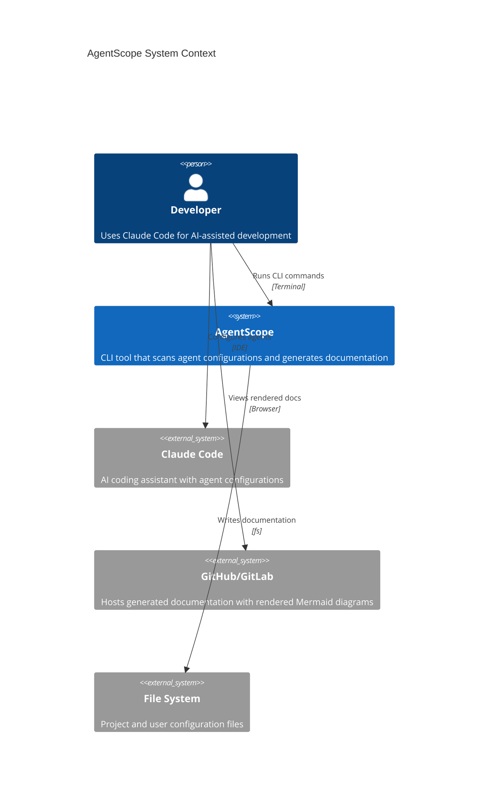

---

## 2. Container Diagram (C4 Level 2)

Shows the high-level containers/packages within AgentScope.

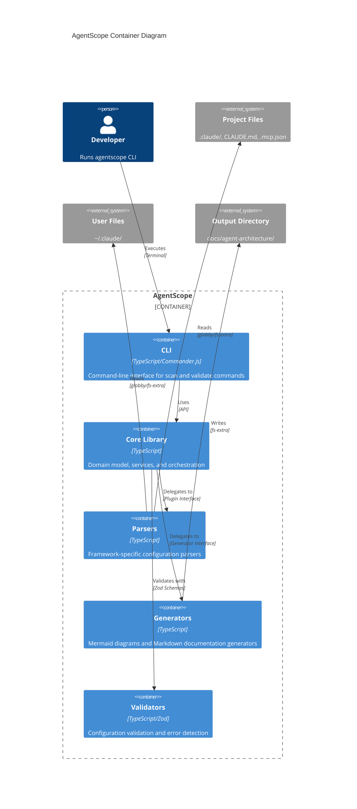

---

## 3. Component Diagram (C4 Level 3)

### 3.1 Core Library Components

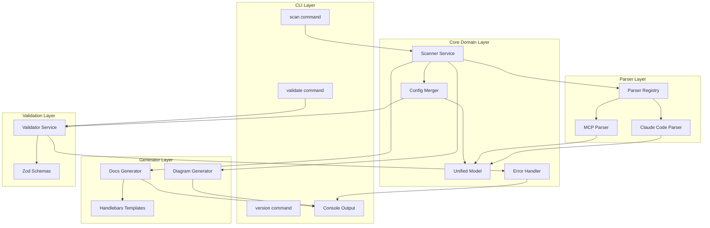

### 3.2 Parser Components Detail

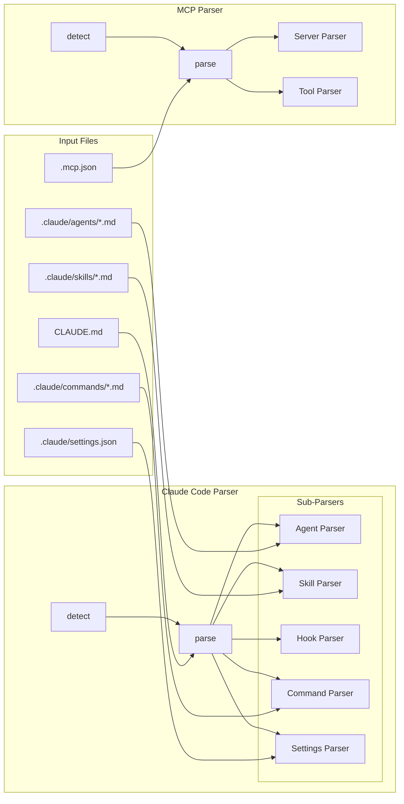

### 3.3 Generator Components Detail

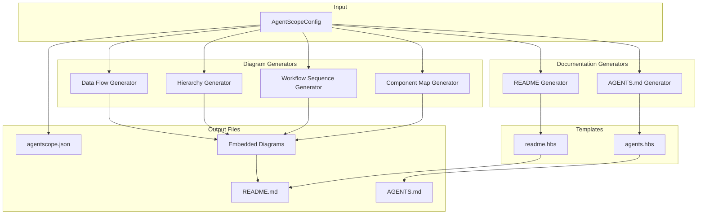

---

## 4. Data Flow Diagram

Shows how data flows through the system during a scan operation.

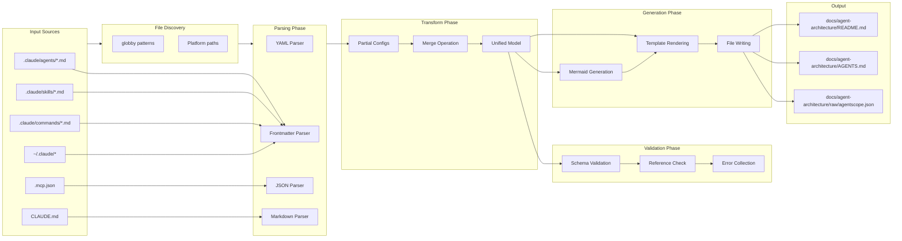

---

## 5. Sequence Diagrams

### 5.1 Scan Command Sequence

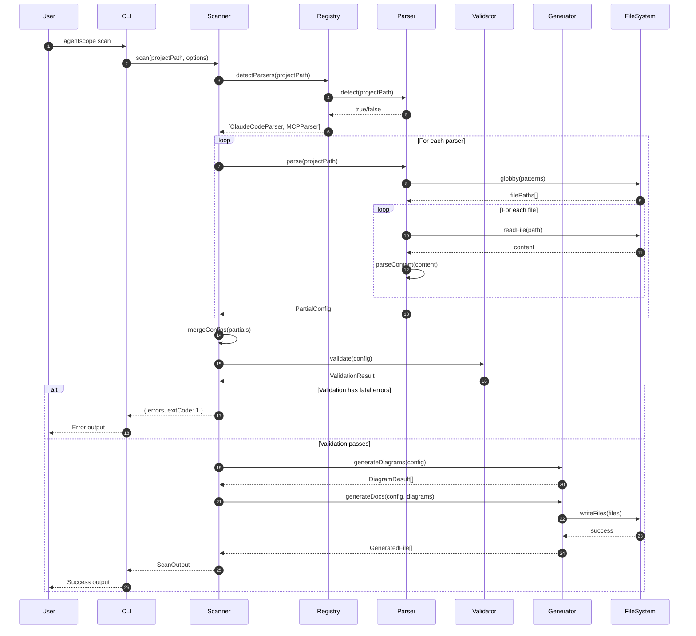

### 5.2 Validation Sequence

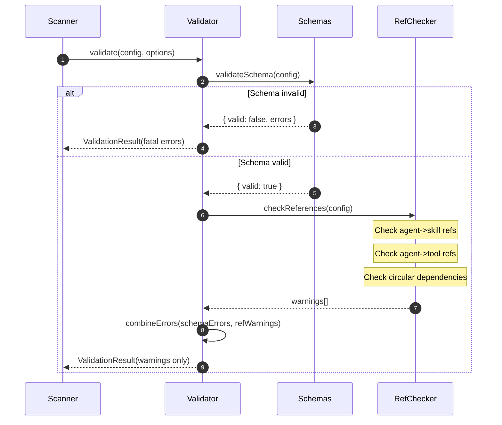

---

## 6. Class Diagram (Simplified)

Shows the key classes and their relationships.

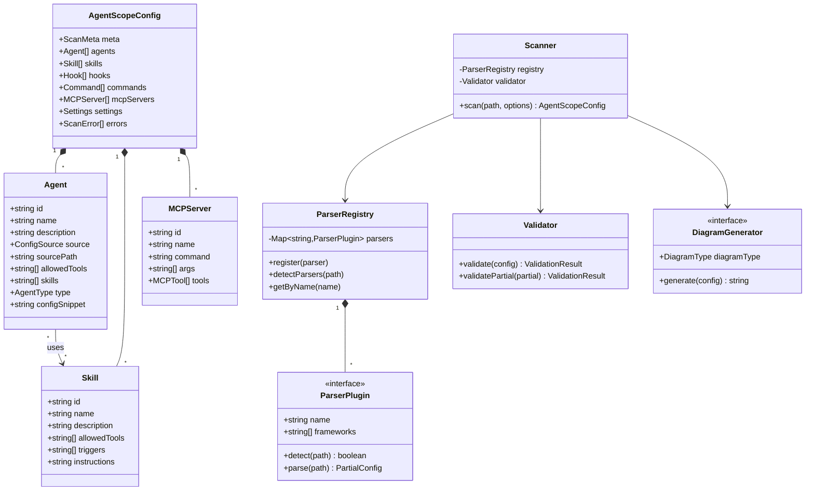

---

## 7. Package Dependency Diagram

Shows dependencies between internal packages.

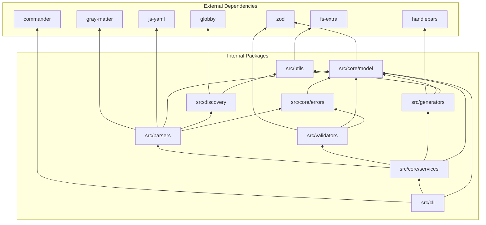

---

## 8. Deployment Diagram

Shows how AgentScope is distributed and used.

```mermaid
flowchart TB
    subgraph npm["npm Registry"]
        PKG[agentscope package]
    end

    subgraph DevMachine["Developer Machine"]
        subgraph Global["Global Install"]
            GLOBAL_BIN[/usr/local/bin/agentscope]
        end

        subgraph Project["Project Directory"]
            NODE_MODULES[node_modules/agentscope]
            PROJECT_FILES[.claude/, CLAUDE.md, .mcp.json]
            OUTPUT_DIR[docs/agent-architecture/]
        end

        subgraph UserDir["User Directory"]
            USER_CONFIG[~/.claude/]
        end
    end

    subgraph Usage["Usage Patterns"]
        NPM_GLOBAL[npm install -g agentscope]
        NPM_DEV[npm install -D agentscope]
        NPX[npx agentscope scan]
    end

    PKG --> NPM_GLOBAL
    PKG --> NPM_DEV
    PKG --> NPX

    NPM_GLOBAL --> GLOBAL_BIN
    NPM_DEV --> NODE_MODULES
    NPX --> NODE_MODULES

    GLOBAL_BIN --> PROJECT_FILES
    NODE_MODULES --> PROJECT_FILES

    PROJECT_FILES --> OUTPUT_DIR
    USER_CONFIG --> OUTPUT_DIR
```

---

## 9. State Diagram: Scan Process

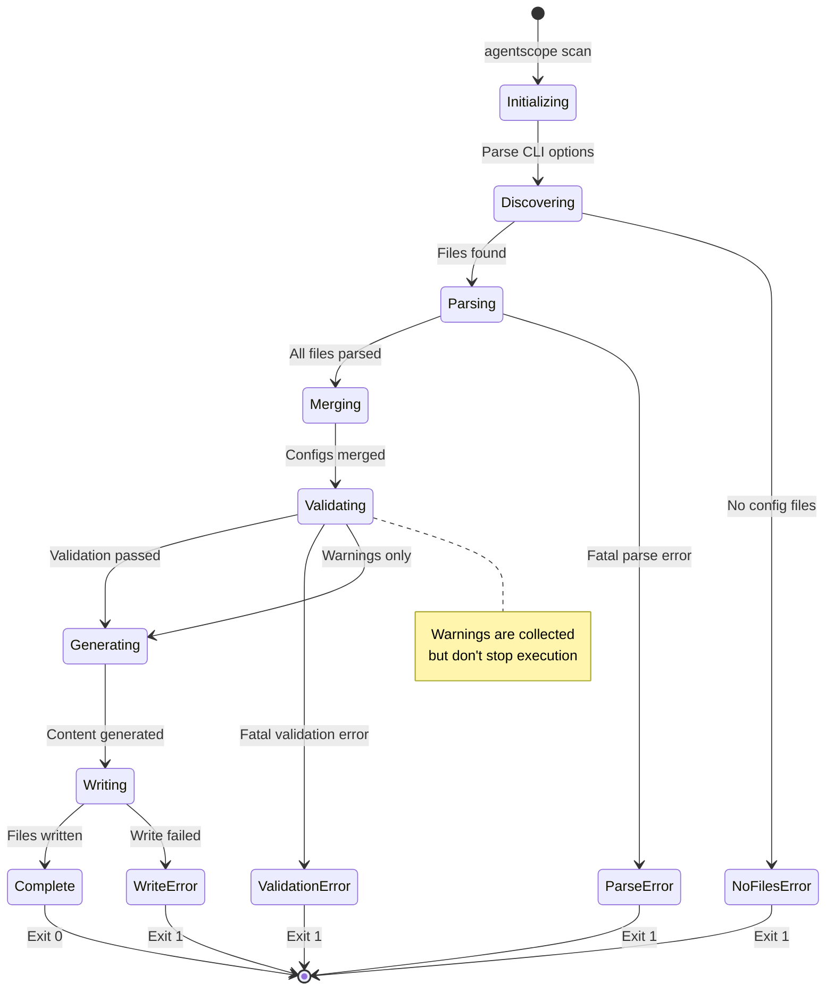

---

## 10. Error Handling Flow

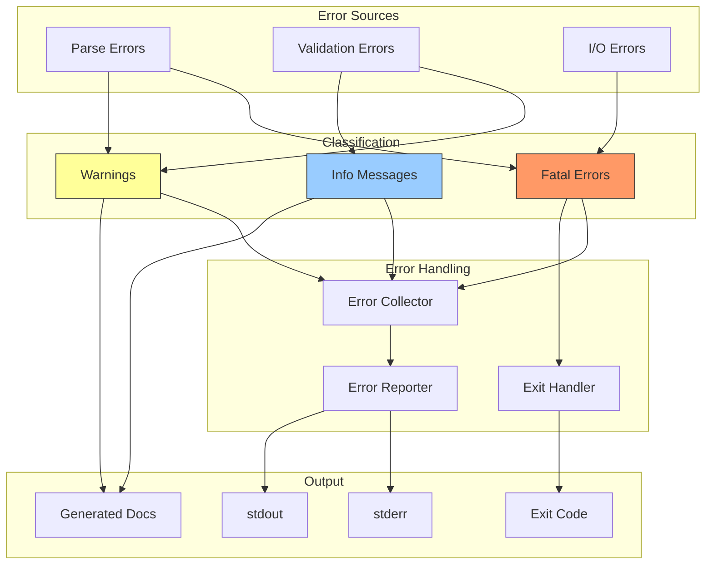

---

*Document Version: 1.0 | January 2026 | Architecture Diagrams*
