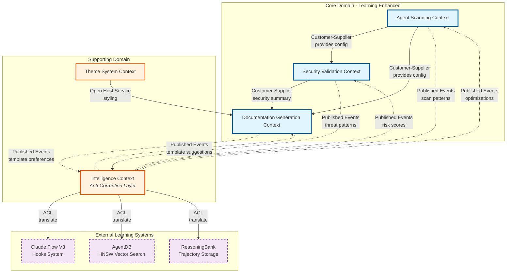
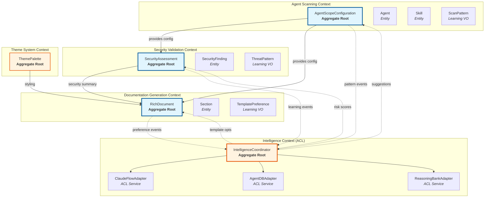
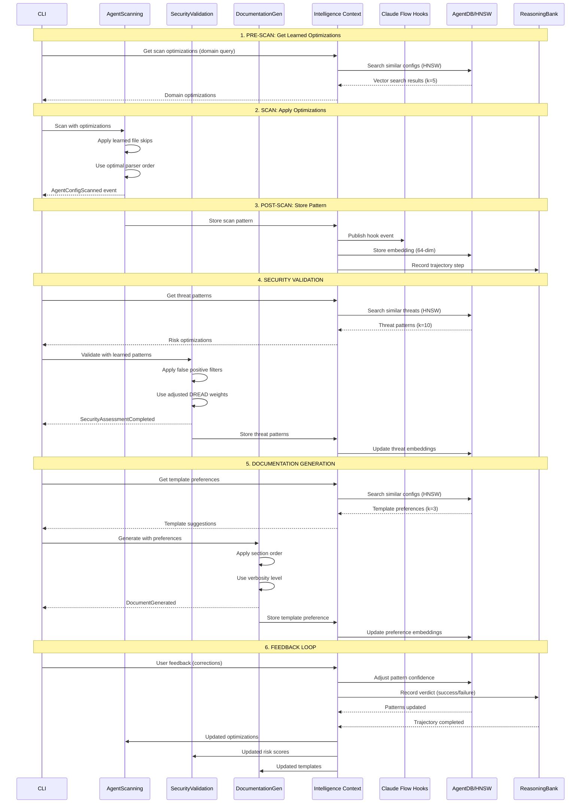
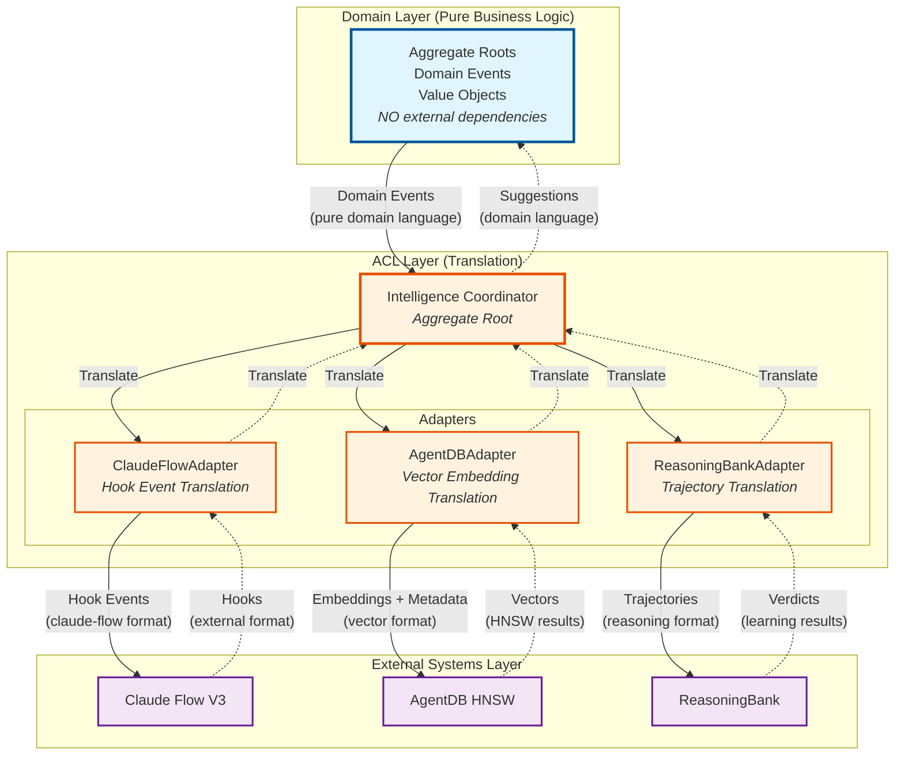
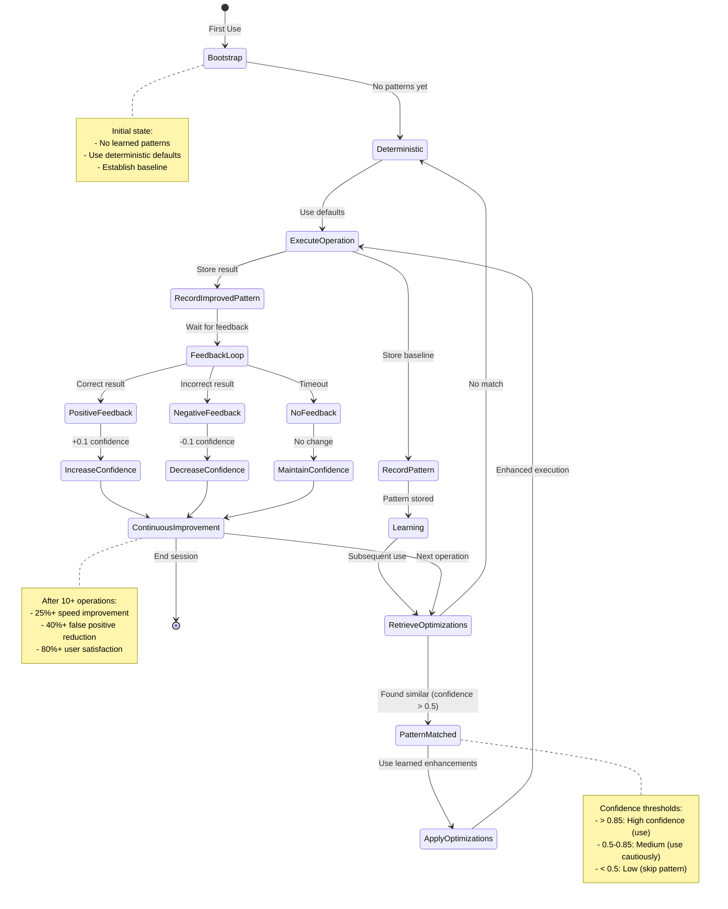
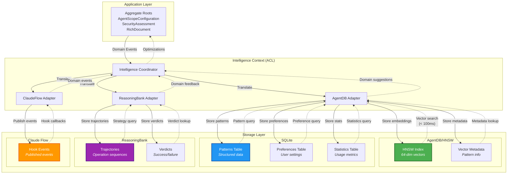
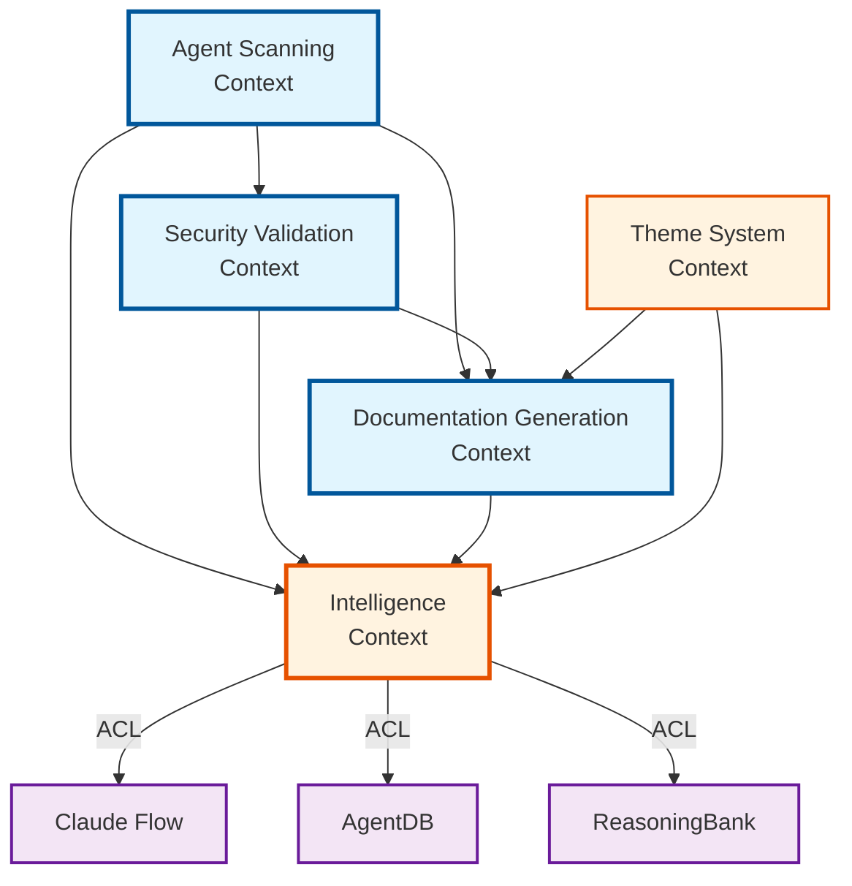
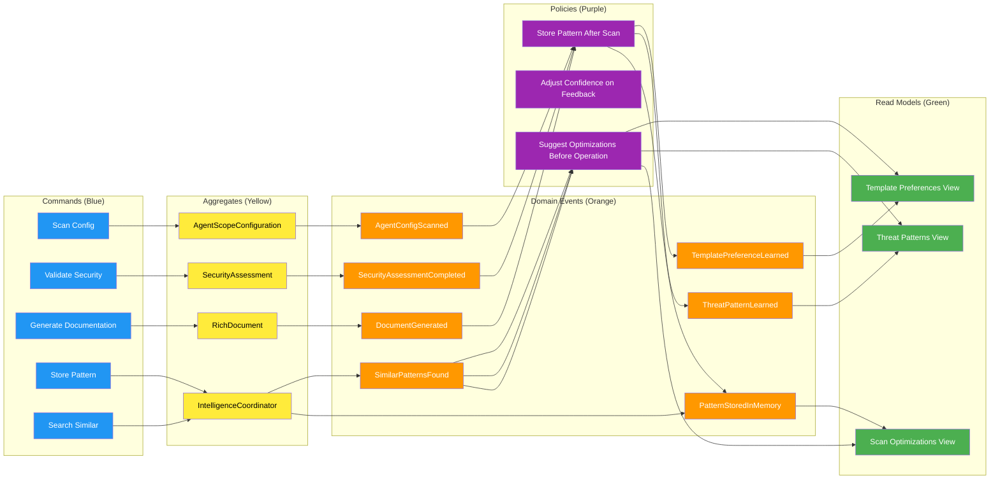

# DDD v1.2 Context Map - Visual Architecture

**Related:** [DDD-003: Learning-Enhanced Domain Model](../adr/DDD-003-learning-enhanced-domain-model.md)

---

## Complete Context Map

---

## Aggregate Collaboration

---

## Learning Integration Flow

---

## Anti-Corruption Layer Architecture

---

## Learning Cycle State Machine

---

## Storage Architecture

---

## Dependency Graph

**Rules:**
1. ✅ Core domains depend on Intelligence Context (supporting)
2. ✅ Intelligence Context depends on external systems (ACL)
3. ❌ Core domains NEVER depend directly on external systems
4. ✅ No circular dependencies
5. ✅ Event-driven communication (loose coupling)

---

## Event Storming Results

---

*Generated by AgentScope DDD Expert*
*Last Updated: 2026-01-25*
