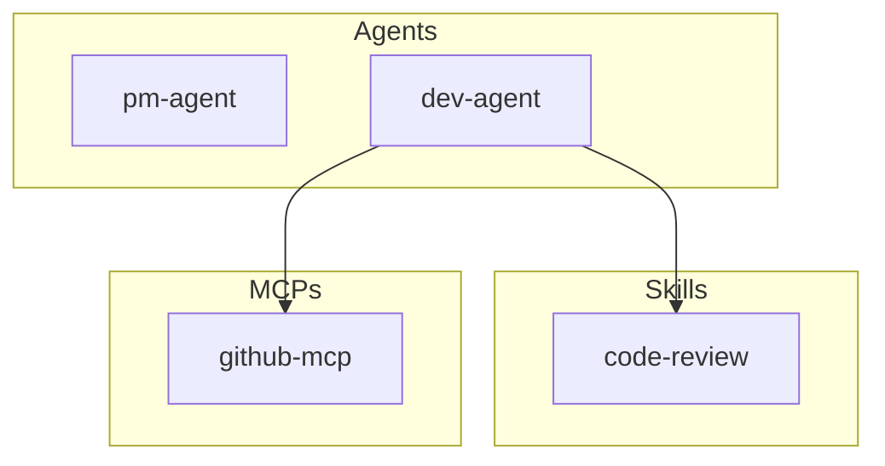

# ADR-002: Diagram Format - Mermaid

## Status

Accepted

## Context

AgentScope generates architecture diagrams to visualize agent configurations. We need to choose a diagram format that:

1. **Renders natively on GitHub/GitLab** - No external services required for viewing
2. **Is human-readable as text** - Can be reviewed in PRs and diffs
3. **Supports required diagram types** - Flowcharts, sequence diagrams, component diagrams
4. **Has good tooling** - CLI generation, validation, export to images
5. **Is widely adopted** - Developers already know the syntax

The primary diagram types needed are:
- **Component Map**: Shows all agents, skills, hooks, MCPs (flowchart)
- **Workflow Sequence**: Shows request flow from user to agent to tools (sequence diagram)
- **Agent Hierarchy**: Parent/subagent relationships (flowchart, v1.1)
- **Data Flow**: Data movement through system (flowchart, v1.2)

## Decision

We will use **Mermaid** as the diagram format for all AgentScope-generated diagrams.

### Key Characteristics

- **Text-based DSL** embedded in Markdown code blocks
- **Native rendering** on GitHub, GitLab, Azure DevOps, Notion, and VS Code
- **Supports all required diagram types**: flowchart, sequenceDiagram, classDiagram, C4
- **CLI tool available**: `mermaid-cli` for validation and image export
- **Active development**: Regular releases, growing feature set

### Diagram Type Mapping

| AgentScope Diagram | Mermaid Type | Syntax |
|-------------------|--------------|--------|
| Component Map | `flowchart TB` | Subgraphs for agents, skills, hooks, MCPs |
| Workflow Sequence | `sequenceDiagram` | Participants, messages, activations |
| Agent Hierarchy | `flowchart TB` | Parent-child node relationships |
| Data Flow | `flowchart LR` | Data nodes with directional edges |

### Example Output

```markdown
## Component Map


```

## Consequences

### Positive

- **Zero-friction viewing**: GitHub/GitLab render diagrams without any setup
- **Version control friendly**: Text diffs show exactly what changed
- **Reviewable in PRs**: Diagram changes can be discussed in code review
- **No external dependencies**: No servers, APIs, or authentication required
- **Wide adoption**: Many developers already know Mermaid syntax
- **CLI validation**: Can verify diagram syntax in CI/CD

### Negative

- **Limited layout control**: Auto-layout can produce suboptimal arrangements
- **Complex diagrams suffer**: 50+ nodes become hard to read
- **No interactive features**: Static diagrams only (no zoom, pan, collapse)
- **Syntax limitations**: Some edge cases require workarounds

### Neutral

- Learning curve for advanced features (subgraphs, styling)
- Diagrams are embedded in Markdown, not standalone files

## Options Considered

### Option 1: PlantUML

Text-based UML diagram tool with extensive features.

- **Pros**: More diagram types, better layout algorithms, mature tooling
- **Cons**: Requires server or Java for rendering, not native on GitHub/GitLab
- **Why rejected**: External rendering dependency contradicts offline-first principle

### Option 2: Mermaid (Chosen)

JavaScript-based diagram DSL with native platform support.

- **Pros**: Native GitHub/GitLab rendering, good enough diagram types, active community
- **Cons**: Less layout control than PlantUML
- **Why chosen**: Zero-friction viewing outweighs layout limitations

### Option 3: Structurizr DSL

C4 model-specific DSL with excellent architecture diagram support.

- **Pros**: Best C4 support, generates multiple formats
- **Cons**: Requires Structurizr tool, not rendered on GitHub, C4-specific
- **Why rejected**: Too specialized, adds external dependency

### Option 4: draw.io XML

Visual diagramming tool with export capabilities.

- **Pros**: Best visual editing, many export formats
- **Cons**: Binary/XML format, not diffable, requires GUI
- **Why rejected**: Not text-based, can't review in PRs

### Option 5: D2

Modern diagram DSL with better layout.

- **Pros**: Better auto-layout than Mermaid, clean syntax
- **Cons**: Not supported on GitHub/GitLab yet, smaller ecosystem
- **Why rejected**: Lack of native platform rendering

## Related Decisions

- [ADR-003](./ADR-003-c4-model-mapping.md) - C4 Model Mapping (uses Mermaid C4 syntax)
- [ADR-005](./ADR-005-output-format.md) - Output Format (Mermaid embedded in Markdown)

## References

- [Mermaid Documentation](https://mermaid.js.org/)
- [GitHub Mermaid Support](https://github.blog/2022-02-14-include-diagrams-markdown-files-mermaid/)
- [Mermaid CLI](https://github.com/mermaid-js/mermaid-cli)
- [Research: Documentation Frameworks Deep Analysis](../../research/11-documentation-frameworks-deep-analysis.md) - Section 3.3, 6.3
