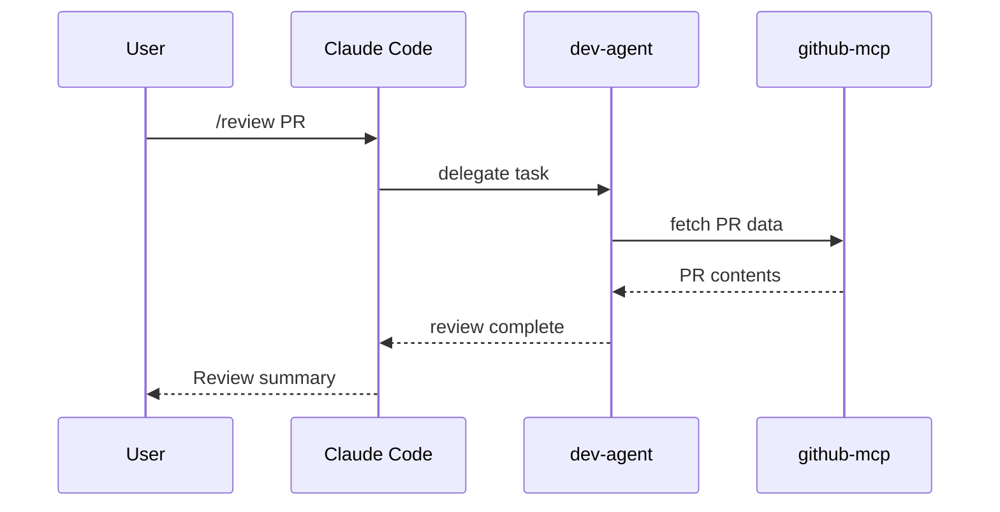
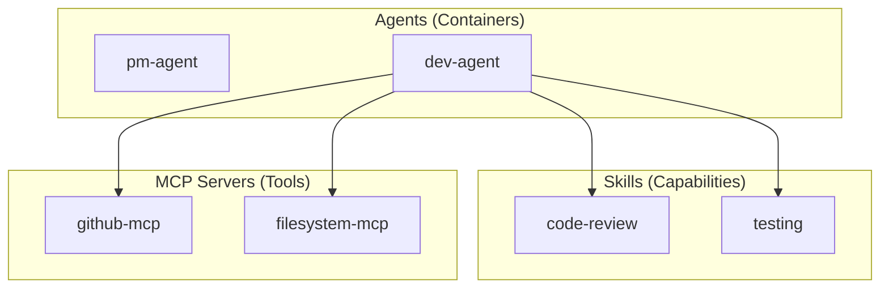
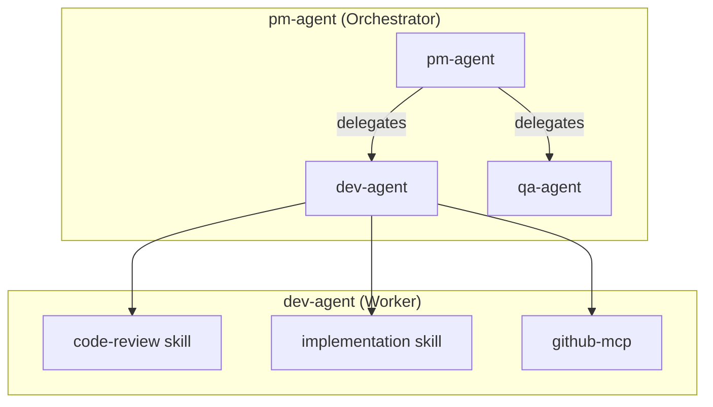

# ADR-003: C4 Model Mapping to Agent Concepts

## Status

Accepted

## Context

AgentScope needs a consistent mental model for visualizing agent architectures at different abstraction levels. The C4 Model (Context, Containers, Components, Code) is the de facto standard for software architecture diagrams, but it was designed for traditional software systems, not AI agent configurations.

We need to:

1. **Map C4 levels to agent concepts** - Define what each level means for agent architectures
2. **Determine which levels to generate** - Not all levels are useful for agent documentation
3. **Align with industry standards** - Leverage existing C4 knowledge developers have
4. **Support the PRD requirements** - Component Map, Workflow Sequence, Hierarchy diagrams

The C4 Model has four levels:
- **Level 1 (Context)**: System and its interactions with users and external systems
- **Level 2 (Container)**: High-level technology building blocks
- **Level 3 (Component)**: Internal modules within containers
- **Level 4 (Code)**: Implementation details (classes, functions)

## Decision

We will adopt the C4 Model with the following mapping to agent concepts:

### C4 Level Mapping

| C4 Level | AgentScope Mapping | Diagram | Generated In |
|----------|-------------------|---------|--------------|
| **L1 Context** | Project + users + external systems | Workflow Sequence | v1.0 |
| **L2 Container** | Agents, MCP servers, memory stores | Component Map | v1.0 |
| **L3 Component** | Skills, tools, hooks within agents | Agent Hierarchy | v1.1 |
| **L4 Code** | (Not generated - use IDE) | N/A | Never |

### Detailed Mapping

#### Level 1: System Context (Workflow Sequence)

Shows the agent system in context with users and external services.

**Elements:**
- **User**: Human interacting with Claude Code
- **Claude Code**: The AI assistant platform
- **Agents**: The configured agents
- **External Systems**: GitHub, file system, databases

**Example:**


#### Level 2: Container (Component Map)

Shows the major building blocks of the agent configuration.

**Elements:**
- **Agents**: Autonomous actors with specific responsibilities
- **MCP Servers**: Tool providers (github-mcp, filesystem-mcp)
- **Skills**: Reusable capabilities agents can invoke
- **Hooks**: Event triggers (pre-commit, post-task)
- **Commands**: User-invokable actions

**Example:**


#### Level 3: Component (Agent Hierarchy)

Shows internal structure of agents - their skills, tools, and relationships.

**Elements:**
- **Parent Agents**: Orchestrators that delegate to sub-agents
- **Sub-Agents**: Specialized agents for specific tasks
- **Skill Dependencies**: Which skills an agent uses
- **Tool Permissions**: Which MCP tools an agent can access

**Example:**


#### Level 4: Code (Not Generated)

AgentScope intentionally skips Level 4 (Code) because:
- Agent configurations are declarative, not imperative code
- IDE tools better serve code-level documentation
- This abstraction level doesn't add value for agent understanding

### Abstraction Boundaries

```
+----------------------------------------------------------+
|                  BUSINESS LAYER (Not AgentScope)          |
|   Business processes, value streams, user journeys        |
+----------------------------------------------------------+
                              |
+----------------------------------------------------------+
|                ARCHITECTURE LAYER (AgentScope Focus)      |
|   L1: System Context (who uses this?)                     |
|   L2: Containers (what are the building blocks?)          |
|   L3: Components (how is each block structured?)          |
+----------------------------------------------------------+
                              |
+----------------------------------------------------------+
|                    CODE LAYER (Not AgentScope)            |
|   Classes, functions, interfaces - use IDE/TypeDoc        |
+----------------------------------------------------------+
```

## Consequences

### Positive

- **Leverages existing knowledge**: Developers familiar with C4 understand the hierarchy
- **Clear abstraction levels**: Each diagram answers a specific question
- **Progressive detail**: Start with overview (L1), drill down as needed (L2, L3)
- **Industry alignment**: Matches how architecture is documented in modern teams
- **Avoids over-documentation**: Skipping L4 prevents unnecessary complexity

### Negative

- **Imperfect mapping**: Agent concepts don't map 1:1 to traditional containers
- **Learning curve**: Developers unfamiliar with C4 need to learn the model
- **Terminology overlap**: "Component" in C4 vs "component" in agent configs

### Neutral

- Requires clear documentation of the mapping for users
- May evolve as agent frameworks mature

## Options Considered

### Option 1: Custom Abstraction Model

Create AgentScope-specific abstraction levels.

- **Pros**: Perfect fit for agent concepts
- **Cons**: No existing knowledge to leverage, reinventing the wheel
- **Why rejected**: Unnecessary when C4 maps well

### Option 2: Strict C4 Compliance

Use C4 exactly as defined, forcing agent concepts into existing boxes.

- **Pros**: Full standards compliance
- **Cons**: Awkward mappings, some concepts don't fit
- **Why rejected**: Pragmatism over purity

### Option 3: Adapted C4 (Chosen)

Map C4 levels to agent concepts with documented translations.

- **Pros**: Leverages C4 familiarity while fitting agent domain
- **Cons**: Slight deviation from standard
- **Why chosen**: Best balance of standards alignment and domain fit

### Option 4: arc42 Only

Use arc42's 12 sections without C4 diagram levels.

- **Pros**: Comprehensive documentation structure
- **Cons**: arc42 is about documentation, not diagram abstraction
- **Why rejected**: C4 better for diagram hierarchy; arc42 used for doc structure

## Related Decisions

- [ADR-002](./ADR-002-diagram-format.md) - Diagram Format (C4 diagrams rendered in Mermaid)
- [ADR-005](./ADR-005-output-format.md) - Output Format (C4 levels inform document structure)

## References

- [C4 Model](https://c4model.com/)
- [C4 Model for Agent Systems (research)](../../research/11-documentation-frameworks-deep-analysis.md) - Section 7.3
- [Executive Summary - C4 Mapping](../../research/00-EXECUTIVE-SUMMARY.md) - Documentation Framework Alignment
