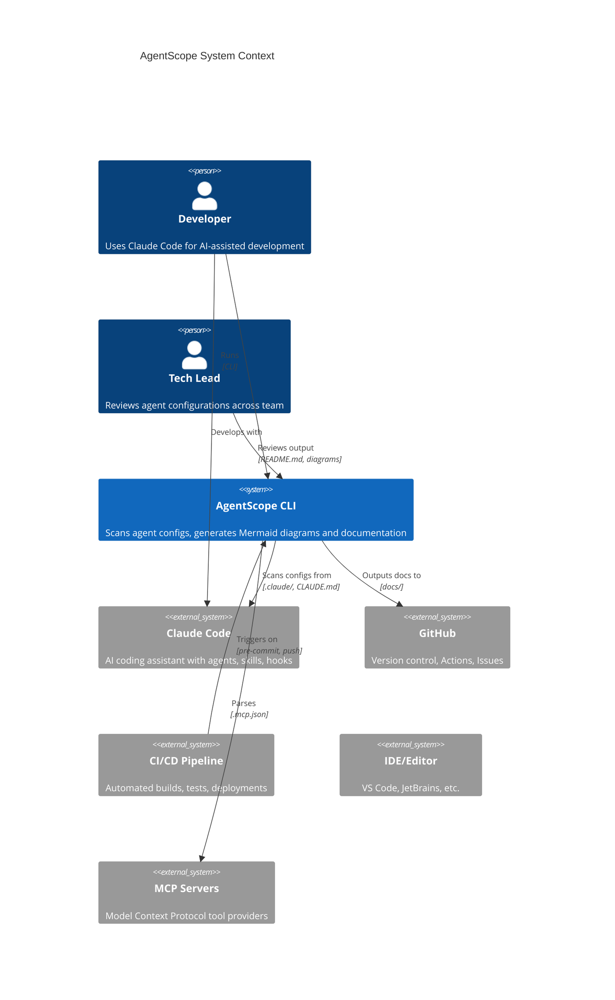
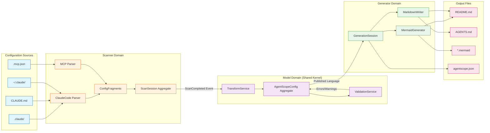
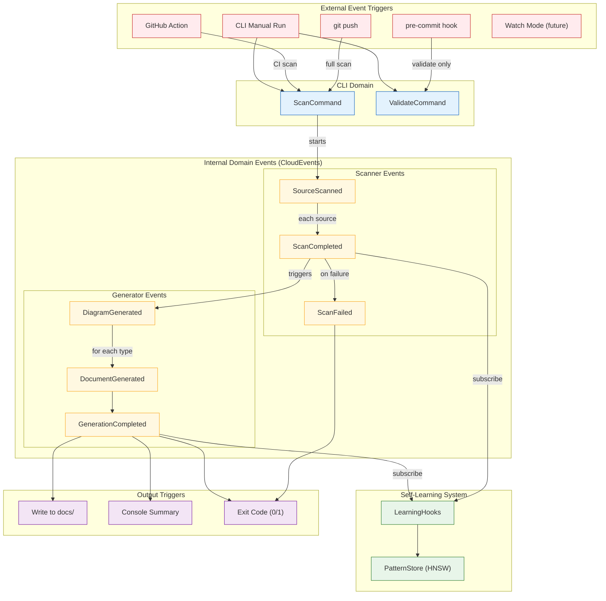
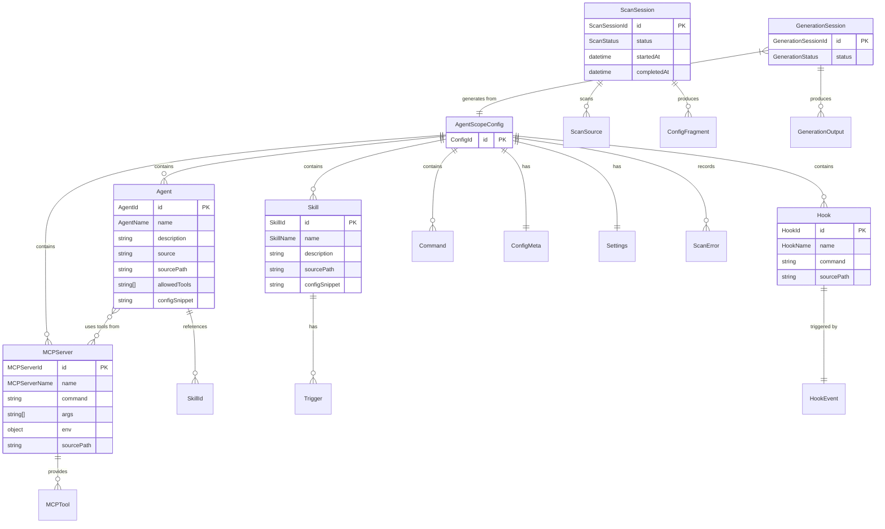
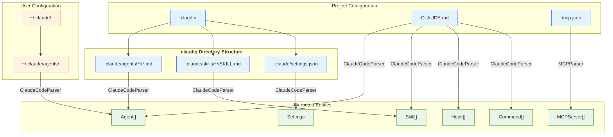
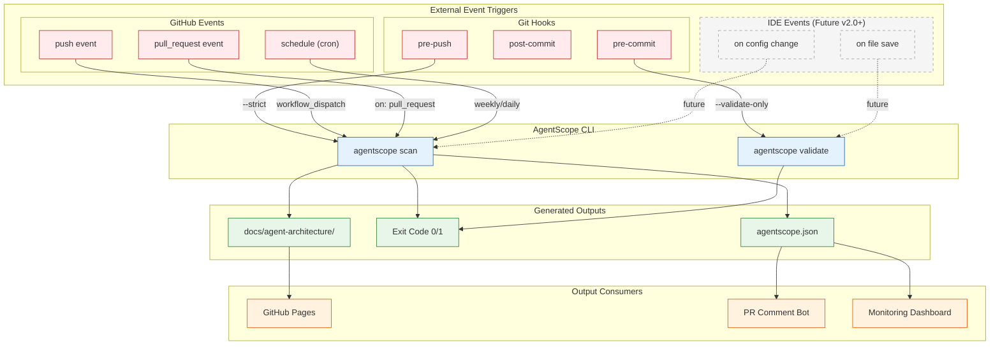
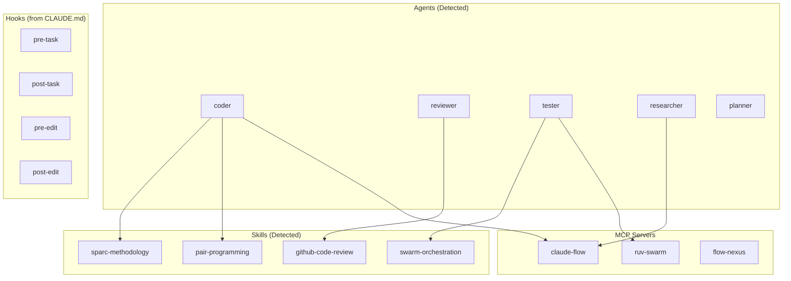
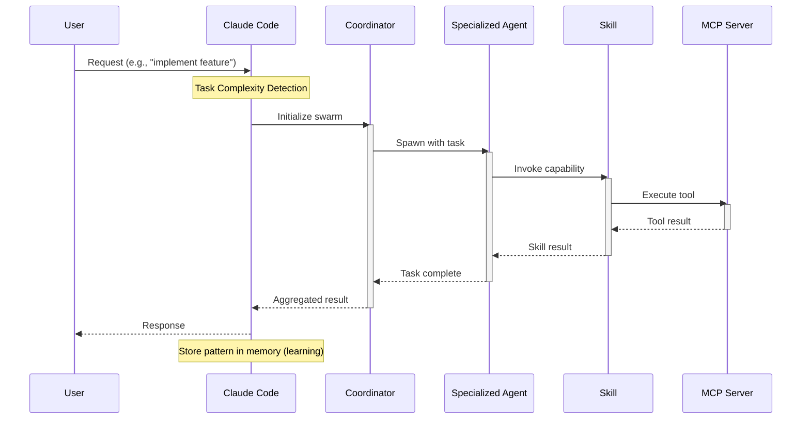
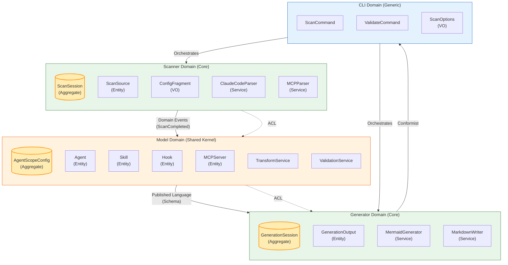

# AgentScope Visualization Architecture

> **Architecture Visualization and Flow Documentation**
> **Version**: 1.0
> **Date**: January 2026
> **Status**: Reference Document

---

## Document Purpose

This document provides visual representations of the AgentScope system architecture, data flows, and integration points. It serves as a navigation hub linking to detailed documentation.

**Related Documentation:**
- [DDD Implementation Plan](./DDD-IMPLEMENTATION.md) - Domain-Driven Design details
- [PRD v2.0](../AgentScope-PRD-v2.md) - Product requirements and features
- [CLAUDE.md](../../CLAUDE.md) - Claude Code configuration and agent orchestration

---

## 1. System Context Diagram (C4 Level 1)

Shows AgentScope's position within the broader development ecosystem.



### External Systems Detail

| System | Integration Type | Purpose | Reference |
|--------|-----------------|---------|-----------|
| **Claude Code** | File System Scan | Source of agent, skill, hook, command configs | [PRD v2.0 Section 4.1](../AgentScope-PRD-v2.md#41-scanner-module) |
| **MCP Servers** | JSON Parsing | Tool and server definitions | [DDD - MCPParser](./DDD-IMPLEMENTATION.md#scanner-domain-services) |
| **GitHub** | Output Target | Generated documentation repository | [PRD v2.0 Section 4.3](../AgentScope-PRD-v2.md#43-documentation-generator) |
| **CI/CD** | Event Trigger | Pre-commit hooks, GitHub Actions | [External Events](#5-external-integration-points) |
| **IDE** | Future | VS Code extension (v2.0+) | [PRD v2.0 Section 8](../AgentScope-PRD-v2.md#8-future-roadmap) |

---

## 2. Data Flow Diagram

Shows how configuration data flows through the AgentScope processing pipeline.



### Data Flow Reference

| Stage | Component | Input | Output | Details |
|-------|-----------|-------|--------|---------|
| **Parse** | ClaudeCodeParser | `.claude/**/*.md`, `CLAUDE.md` | ConfigFragment[] | [DDD Section 2.4](./DDD-IMPLEMENTATION.md#24-scanner-domain-services) |
| **Parse** | MCPParser | `.mcp.json` | ConfigFragment[] | [DDD Section 2.4](./DDD-IMPLEMENTATION.md#24-scanner-domain-services) |
| **Transform** | TransformService | ConfigFragment[] | AgentScopeConfig | [DDD Section 3.4](./DDD-IMPLEMENTATION.md#34-model-domain-services) |
| **Validate** | ValidationService | AgentScopeConfig | ScanError[] | [DDD Section 3.4](./DDD-IMPLEMENTATION.md#34-model-domain-services) |
| **Generate** | MermaidGenerator | AgentScopeConfig | Mermaid strings | [DDD Section 4.4](./DDD-IMPLEMENTATION.md#44-generator-domain-services) |
| **Generate** | MarkdownWriter | AgentScopeConfig | Markdown strings | [DDD Section 4.4](./DDD-IMPLEMENTATION.md#44-generator-domain-services) |

---

## 3. Event Flow Diagram

Shows internal domain events and external integration triggers.



### Event Catalog

| Event | Source Domain | Type (CloudEvents) | Data | Reference |
|-------|--------------|-------------------|------|-----------|
| `SourceScanned` | Scanner | `com.agentscope.scanner.source-scanned` | sessionId, sourceType, fragmentCount | [DDD Section 6.1](./DDD-IMPLEMENTATION.md#61-event-definitions) |
| `ScanCompleted` | Scanner | `com.agentscope.scanner.scan-completed` | sessionId, counts, duration | [DDD Section 6.1](./DDD-IMPLEMENTATION.md#61-event-definitions) |
| `ScanFailed` | Scanner | `com.agentscope.scanner.scan-failed` | sessionId, error, source | [DDD Section 6.1](./DDD-IMPLEMENTATION.md#61-event-definitions) |
| `DiagramGenerated` | Generator | `com.agentscope.generator.diagram-generated` | sessionId, diagramType, outputPath | [DDD Section 6.1](./DDD-IMPLEMENTATION.md#61-event-definitions) |
| `DocumentGenerated` | Generator | `com.agentscope.generator.document-generated` | sessionId, documentType, outputPath | [DDD Section 6.1](./DDD-IMPLEMENTATION.md#61-event-definitions) |
| `GenerationCompleted` | Generator | `com.agentscope.generator.generation-completed` | sessionId, outputCount, counts | [DDD Section 6.1](./DDD-IMPLEMENTATION.md#61-event-definitions) |

---

## 4. Entity Relationship Diagram

Shows all domain entities and their relationships.



### Entity Reference

For detailed entity definitions, see:

| Entity | Domain | Type | Details |
|--------|--------|------|---------|
| **AgentScopeConfig** | Model | Aggregate Root | [DDD Section 3.1](./DDD-IMPLEMENTATION.md#31-unified-config-aggregate) |
| **Agent** | Model | Entity | [DDD Section 3.2](./DDD-IMPLEMENTATION.md#32-model-entities) |
| **Skill** | Model | Entity | [DDD Section 3.2](./DDD-IMPLEMENTATION.md#32-model-entities) |
| **Hook** | Model | Entity | [DDD Section 3.2](./DDD-IMPLEMENTATION.md#32-model-entities) |
| **MCPServer** | Model | Entity | [DDD Section 3.2](./DDD-IMPLEMENTATION.md#32-model-entities) |
| **ScanSession** | Scanner | Aggregate Root | [DDD Section 2.1](./DDD-IMPLEMENTATION.md#21-scanner-aggregate-root) |
| **ScanSource** | Scanner | Entity | [DDD Section 2.2](./DDD-IMPLEMENTATION.md#22-scanner-entities) |
| **GenerationSession** | Generator | Aggregate Root | [DDD Section 4.1](./DDD-IMPLEMENTATION.md#41-generator-aggregate-root) |
| **GenerationOutput** | Generator | Entity | [DDD Section 4.2](./DDD-IMPLEMENTATION.md#42-generator-entities) |

---

## 5. File Reference Map

Maps which configuration files contain which entity types, with links to actual file locations.



### File Location Reference

| File/Pattern | Parser | Entity Types | Example Path |
|--------------|--------|--------------|--------------|
| `.claude/agents/**/*.md` | ClaudeCodeParser | Agent | [.claude/agents/core/coder.md](../../.claude/agents/core/coder.md) |
| `.claude/skills/**/SKILL.md` | ClaudeCodeParser | Skill | [.claude/skills/sparc-methodology/SKILL.md](../../.claude/skills/sparc-methodology/SKILL.md) |
| `.claude/settings.json` | ClaudeCodeParser | Settings | [.claude/settings.json](../../.claude/settings.json) |
| `CLAUDE.md` | ClaudeCodeParser | Agent, Skill, Hook, Command | [CLAUDE.md](../../CLAUDE.md) |
| `.mcp.json` | MCPParser | MCPServer | [.mcp.json](../../.mcp.json) |
| `~/.claude/agents/` | ClaudeCodeParser | Agent (user-level) | User home directory |

### Parser Responsibilities

| Parser | Files Handled | Entity Extraction Logic |
|--------|--------------|------------------------|
| **ClaudeCodeParser** | `.claude/**`, `CLAUDE.md` | YAML frontmatter + markdown body parsing |
| **MCPParser** | `.mcp.json` | JSON parsing of `mcpServers` object |

For parser implementation details, see [DDD Section 2.4](./DDD-IMPLEMENTATION.md#24-scanner-domain-services).

---

## 6. External Integration Points

### 6.1 Integration Architecture



### 6.2 Git Hooks Integration

```bash
# .git/hooks/pre-commit (or via husky/lint-staged)
#!/bin/bash
npx agentscope validate --strict
if [ $? -ne 0 ]; then
    echo "AgentScope validation failed. Fix configuration errors before committing."
    exit 1
fi
```

| Hook | Command | Purpose | Exit Behavior |
|------|---------|---------|---------------|
| `pre-commit` | `agentscope validate --strict` | Validate configs before commit | Exit 1 on fatal errors |
| `pre-push` | `agentscope scan --strict` | Full scan before push | Exit 1 on any errors |
| `post-commit` | `agentscope scan` | Update docs after commit | Non-blocking |

### 6.3 GitHub Actions Integration

```yaml
# .github/workflows/agentscope.yml
name: AgentScope Documentation

on:
  push:
    paths:
      - '.claude/**'
      - 'CLAUDE.md'
      - '.mcp.json'
  pull_request:
    paths:
      - '.claude/**'
      - 'CLAUDE.md'
      - '.mcp.json'
  schedule:
    - cron: '0 0 * * 0'  # Weekly on Sunday

jobs:
  scan:
    runs-on: ubuntu-latest
    steps:
      - uses: actions/checkout@v4

      - name: Setup Node.js
        uses: actions/setup-node@v4
        with:
          node-version: '20'

      - name: Run AgentScope
        run: npx agentscope scan --strict

      - name: Upload Documentation
        if: github.ref == 'refs/heads/main'
        uses: actions/upload-artifact@v4
        with:
          name: agent-docs
          path: docs/agent-architecture/
```

### 6.4 CI/CD Pipeline Events

| Event Type | Trigger | AgentScope Action | Output |
|------------|---------|-------------------|--------|
| **Push to main** | `push` | Full scan + deploy docs | docs/agent-architecture/ |
| **Pull Request** | `pull_request` | Validate + comment | PR comment with summary |
| **Scheduled** | `schedule` | Full scan | Weekly report |
| **Manual** | `workflow_dispatch` | Configurable | User-selected options |

### 6.5 IDE Extension Events (Future v2.0+)

| Event | Trigger | Response |
|-------|---------|----------|
| `onDidSaveTextDocument` | Save `.claude/**/*.md` | Re-validate affected agent/skill |
| `onDidChangeConfiguration` | Save `.mcp.json` | Re-parse MCP config |
| `onDidOpenTextDocument` | Open agent file | Show related diagram |

For future roadmap details, see [PRD v2.0 Section 8](../AgentScope-PRD-v2.md#8-future-roadmap).

---

## 7. Component Map (Default Diagram)

The standard component map generated by AgentScope, showing detected agents, skills, hooks, and MCP servers.



**Note:** This is an example diagram. Actual output depends on scanned configuration.

For diagram generation implementation, see [DDD Section 4.4](./DDD-IMPLEMENTATION.md#44-generator-domain-services).

---

## 8. Workflow Sequence (Default Diagram)

Shows the typical request flow from user through agents to tools.



**Reference:** For swarm orchestration patterns, see [CLAUDE.md - Auto-Start Swarm Protocol](../../CLAUDE.md#-auto-start-swarm-protocol-background-execution).

---

## 9. Bounded Context Map

Shows the Domain-Driven Design bounded contexts and their relationships.



### Context Relationships Detail

| Upstream | Downstream | Pattern | Description |
|----------|------------|---------|-------------|
| Scanner | Model | Customer-Supplier + ACL | Scanner produces fragments, Model consumes via ACL |
| Model | Generator | Published Language | Shared schema (AgentScopeConfig) |
| Generator | CLI | Conformist | Generator adapts to CLI output needs |
| CLI | Scanner, Generator | Orchestration | CLI coordinates the workflow |

For detailed bounded context definitions, see [DDD Section 1.2](./DDD-IMPLEMENTATION.md#12-bounded-context-definitions).

---

## 10. Quick Reference Links

### Architecture Documents
- [DDD Implementation Plan](./DDD-IMPLEMENTATION.md) - Complete domain model
- [Security Architecture](./SECURITY-ARCHITECTURE.md) - Security considerations
- [Memory Architecture](./MEMORY-ARCHITECTURE.md) - Pattern storage
- [ADR Index](./decisions/README.md) - Architecture Decision Records

### Product Documents
- [PRD v2.0](../AgentScope-PRD-v2.md) - Product requirements
- [Definition of Done](../DEFINITION_OF_DONE.md) - Quality criteria
- [Changelog](../CHANGELOG.md) - Version history

### Configuration Reference
- [CLAUDE.md](../../CLAUDE.md) - Agent orchestration config
- [.claude/ Directory](../../.claude/) - Agents and skills
- [.mcp.json](../../.mcp.json) - MCP server config

### Research
- [Executive Summary](../research/00-EXECUTIVE-SUMMARY.md) - Research overview
- [Documentation Frameworks](../research/11-documentation-frameworks-deep-analysis.md) - Standards analysis
- [TDD Quality Framework](../research/07-tdd-quality-framework.md) - Testing approach

---

*Document Version: 1.0 | January 2026 | Status: Reference*
