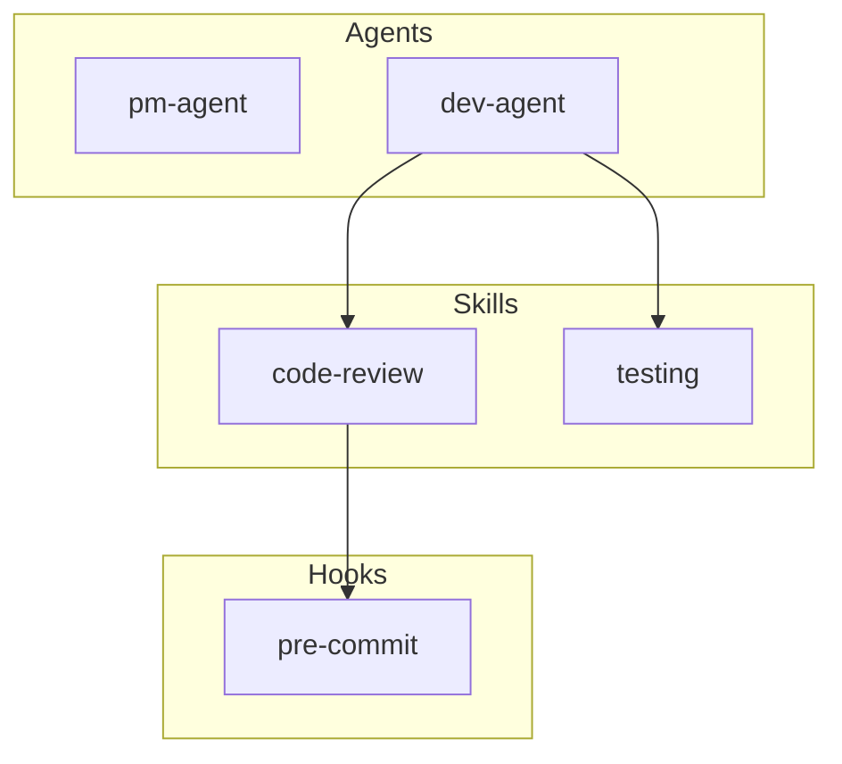

# AgentScope Simplification Proposal

> Reducing a 20-week, 5-framework project to something shippable

## Executive Summary

The current PRD describes a comprehensive agent documentation platform spanning 5 frameworks, 6 diagram types, 7 documentation files, and 5 implementation phases over 20 weeks. This is scope creep before we've written line one.

**The hard truth**: Nobody needs all of this on day one. Most users have one framework (Claude Code), need one thing (understanding their setup), and will never use cross-framework export.

This proposal presents three alternatives with a clear recommendation.

---

## Current PRD Scope Analysis

### What's Proposed (20 weeks)

| Category | Items | Complexity |
|----------|-------|------------|
| Frameworks | 5 (Claude Code, BMad, MCP, Gemini, Claude-flow) | High |
| Diagram Types | 6 (workflow, hierarchy, dataflow, component, permission, hook) | Medium |
| Doc Files | 7 (README, AGENTS, SKILLS, HOOKS, MCPS, WORKFLOWS, DATAFLOW) | Medium |
| Features | Scanner, Visualizer, Documenter, Comparator, Optimizer, Exporter | High |
| Integrations | CLI, Skill, GitHub Action, VS Code Extension, Web Viewer | Very High |

### The 80/20 Analysis

**What delivers 80% of value:**
- Scanning Claude Code configs (the dominant framework)
- One visual diagram showing "what do I have?"
- One documentation file for quick reference

**What's the other 80% of work for 20% value:**
- Multi-framework support (most users use one framework)
- Bidirectional export (nice-to-have, rarely used)
- Workflow comparator (enterprise feature)
- VS Code extension (overhead before product-market fit)
- Web viewer (unnecessary when Mermaid renders in GitHub)

---

## Option A: Micro MVP (2 Weeks)

### Philosophy
Ship something useful in 2 weeks. Validate the core assumption: "Do developers actually want auto-generated agent documentation?"

### Feature List

| Feature | Description | Time |
|---------|-------------|------|
| Claude Code Scanner | Parse `.claude/` and `CLAUDE.md` only | 3 days |
| Single Diagram | Component Map (agents + skills + hooks) | 2 days |
| Single Doc File | `AGENTS.md` with embedded diagram | 2 days |
| CLI | `agentscope scan` command only | 2 days |
| Testing + Polish | | 1 day |

### What's Removed

| Removed | Why It's Okay | Risk |
|---------|---------------|------|
| BMad, Gemini, Claude-flow scanners | <5% of users use these | Miss early adopters from other frameworks |
| MCP scanner | Can add in v1.1 | Users must document MCPs manually |
| 5 diagram types | Component map shows everything | Power users want more granularity |
| 6 doc files | One file is enough to start | Less organized for large setups |
| Workflow comparator | Enterprise feature | No enterprise adoption path |
| Exporter | Lock-in concern is theoretical | Can't switch frameworks easily |
| GitHub Action | Users can run manually | No CI/CD automation |
| VS Code extension | Premature optimization | IDE users must use CLI |
| Web viewer | Mermaid renders in GitHub | No interactive exploration |

### CLI Interface

```bash
# The only command
agentscope scan

# Output
./docs/AGENTS.md  # Contains component map + agent/skill/hook list
```

### Output Example

```markdown
# Agent Architecture

> Auto-generated by AgentScope | 2026-01-20

## Component Map



## Agents (2)

| Agent | Description | Tools |
|-------|-------------|-------|
| pm-agent | Product management | Read, Write |
| dev-agent | Development | Read, Write, Bash |

## Skills (2)

| Skill | Trigger | Agent |
|-------|---------|-------|
| code-review | /review | dev-agent |
| testing | /test | dev-agent |

## Hooks (1)

| Hook | Event | Action |
|------|-------|--------|
| pre-commit | PreToolUse | Validate changes |
```

### Estimate
**2 weeks** (10 working days)

---

## Option B: Lean MVP (4 Weeks)

### Philosophy
A more complete scanner with enough diagrams to be genuinely useful, but still Claude Code only.

### Feature List

| Feature | Description | Time |
|---------|-------------|------|
| Claude Code Scanner | Full: agents, skills, hooks, commands, settings | 4 days |
| MCP Scanner | Parse `.mcp.json` for server inventory | 2 days |
| Diagram: Component Map | All components in one view | 2 days |
| Diagram: Workflow Sequence | User -> Agent -> Tool -> Response | 2 days |
| Doc: README.md | Overview with both diagrams | 2 days |
| Doc: AGENTS.md | Detailed agent documentation | 2 days |
| CLI | `scan`, `diagram --type` commands | 3 days |
| Testing + Polish | | 3 days |

### What's Removed

| Removed | Why It's Okay | Risk |
|---------|---------------|------|
| BMad, Gemini, Claude-flow | Can add as v1.x features | Miss multi-framework users |
| 4 diagram types | 2 diagrams cover 90% of use cases | Power users want hierarchy/permissions |
| 5 doc files | README + AGENTS is sufficient | Less comprehensive |
| Workflow comparator | Enterprise feature, add later | No workflow alignment |
| Exporter | Nice-to-have | Framework lock-in |
| GitHub Action | Easy to add post-launch | Manual CI |
| VS Code extension | Premature | CLI-only |
| Web viewer | Mermaid in GitHub | No interactivity |

### CLI Interface

```bash
# Scan and generate all docs
agentscope scan

# Generate specific diagram
agentscope diagram --type component
agentscope diagram --type workflow

# Output
./docs/agent-architecture/
├── README.md   # Overview + component map
└── AGENTS.md   # Detailed agents + workflow diagram
```

### Estimate
**4 weeks** (20 working days)

---

## Option C: Reduced Full (8 Weeks)

### Philosophy
Cut the PRD in half by removing the "ecosystem" phase and limiting to 2 frameworks.

### Feature List

| Feature | Description | Time |
|---------|-------------|------|
| Claude Code Scanner | Full scanner | 5 days |
| BMad Scanner | YAML agent parser | 4 days |
| MCP Scanner | Server inventory | 2 days |
| 4 Diagram Types | Component, Workflow, Hierarchy, DataFlow | 8 days |
| 4 Doc Files | README, AGENTS, SKILLS, WORKFLOWS | 6 days |
| Workflow Comparator | Basic company workflow alignment | 5 days |
| CLI | Full command suite | 4 days |
| Claude Code Skill | Install as skill | 2 days |
| Testing + Polish | | 4 days |

### What's Removed

| Removed | Why It's Okay | Risk |
|---------|---------------|------|
| Gemini, Claude-flow scanners | Lower adoption | Miss those users |
| Permission Matrix diagram | Rarely needed | Manual permission tracking |
| Hook Lifecycle diagram | Niche | Less hook visibility |
| Optimizer module | v2 feature | No optimization suggestions |
| Framework exporter | Complex, low usage | Can't convert configs |
| GitHub Action | Easy to DIY | Manual CI |
| VS Code extension | Post-validation | CLI-only |
| Web viewer | Mermaid in GitHub | Static only |
| Community library | Requires traction first | No template sharing |

### CLI Interface

```bash
agentscope scan [--framework claude-code|bmad|auto]
agentscope diagram --type [component|workflow|hierarchy|dataflow]
agentscope compare --workflow ./company-workflow.yaml

# Output
./docs/agent-architecture/
├── README.md
├── AGENTS.md
├── SKILLS.md
└── WORKFLOWS.md
```

### Estimate
**8 weeks** (40 working days)

---

## Comparison Matrix

| Criteria | Option A (2wk) | Option B (4wk) | Option C (8wk) |
|----------|----------------|----------------|----------------|
| Time to Ship | 2 weeks | 4 weeks | 8 weeks |
| Frameworks | 1 | 1 + MCP | 2 + MCP |
| Diagrams | 1 | 2 | 4 |
| Doc Files | 1 | 2 | 4 |
| Workflow Compare | No | No | Yes |
| Risk | Low | Low | Medium |
| Learning | Maximum | High | Medium |
| Useful? | Yes (basic) | Yes (good) | Yes (complete) |

---

## Recommendation: Option B (Lean MVP - 4 Weeks)

### Why Option B?

**Not Option A because:**
- One diagram and one doc file feels incomplete
- No MCP scanning misses a key Claude Code component
- 2 weeks is too rushed for quality

**Not Option C because:**
- 8 weeks is too long before validation
- BMad has <10% market share vs Claude Code
- Workflow comparator is enterprise feature (validate need first)
- Building for 2 frameworks doubles maintenance

**Option B is the sweet spot:**
- Ships in 4 weeks - fast enough to validate
- Claude Code + MCP covers 90%+ of users
- 2 diagrams (Component Map + Workflow) answer the key questions
- 2 doc files (README + AGENTS) provide quick reference
- Clean foundation to extend

### Option B Success Criteria

| Metric | Target | Why |
|--------|--------|-----|
| Scan Accuracy | >95% | Must find all configs |
| Valid Mermaid | 100% | Diagrams must render |
| Scan Time | <3s | Fast feedback |
| GitHub Stars | 100 in month 1 | Early validation |
| Issues | <5 critical bugs | Quality |

### Post-MVP Roadmap

If Option B validates:

**v1.1 (Week 5-6):**
- Add Hierarchy diagram
- Add SKILLS.md doc

**v1.2 (Week 7-8):**
- BMad scanner
- DataFlow diagram

**v1.3 (Week 9-10):**
- Workflow comparator
- Claude Code skill package

**v2.0 (Week 11-16):**
- Gemini scanner
- GitHub Action
- Consider VS Code extension

---

## Implementation Plan for Option B

### Week 1: Scanner Foundation

| Day | Task |
|-----|------|
| 1-2 | Project setup, TypeScript config, CLI skeleton |
| 3-4 | Claude Code scanner: agents, skills |
| 5 | Claude Code scanner: hooks, commands |

### Week 2: Scanner Completion + Diagram

| Day | Task |
|-----|------|
| 1 | Claude Code scanner: settings, CLAUDE.md |
| 2 | MCP scanner: .mcp.json parser |
| 3-4 | Component Map diagram generator |
| 5 | Diagram output + Mermaid validation |

### Week 3: Workflow Diagram + Docs

| Day | Task |
|-----|------|
| 1-2 | Workflow Sequence diagram generator |
| 3 | README.md generator |
| 4 | AGENTS.md generator |
| 5 | CLI command finalization |

### Week 4: Testing + Ship

| Day | Task |
|-----|------|
| 1-2 | Unit tests for scanners |
| 3 | Integration tests |
| 4 | Documentation, README |
| 5 | NPM publish, announce |

---

## Decision Required

Choose one:

- [ ] **Option A (Micro MVP)** - 2 weeks, maximum speed, minimal features
- [x] **Option B (Lean MVP)** - 4 weeks, balanced scope, recommended
- [ ] **Option C (Reduced Full)** - 8 weeks, more complete, higher risk

---

## Appendix: What We're NOT Building (Yet)

These are explicitly out of scope for MVP:

1. **Gemini CLI support** - Wait for adoption data
2. **Claude-flow support** - Wait for adoption data
3. **Bidirectional export** - Theoretical need, unvalidated
4. **VS Code extension** - Premature optimization
5. **Web viewer** - GitHub renders Mermaid
6. **Optimizer module** - Feature creep
7. **Community library** - Needs user base first
8. **Interactive diagrams** - Static is fine for v1

Each of these can be added post-validation if users request them.

---

*Proposal Version: 1.0 | January 2026 | Author: Strategic Planning Agent*
