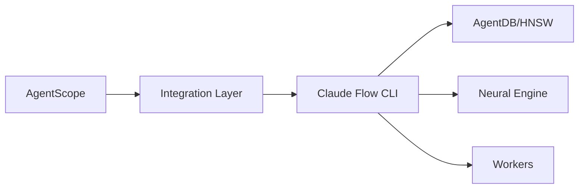

# Claude Flow V3 Integration - Quick Reference

**AgentScope v1.2 + Claude Flow V3 - Essential Commands & Concepts**

---

## 📋 Document Map

| Document | Purpose | Read Time |
|----------|---------|-----------|
| [Executive Summary](./CLAUDE-FLOW-V3-SUMMARY.md) | High-level overview, ROI, decision criteria | 10 min |
| [Integration Guide](./claude-flow-v3-integration-guide.md) | Complete step-by-step implementation | 30 min |
| [ADR Index](../adr/README.md) | All architecture decisions | 5 min |
| **This Document** | Quick reference for daily use | 2 min |

---

## ⚡ Quick Start (5 Minutes)

```bash
# 1. Install
npm install --save-peer @claude-flow/cli@3.0.0-alpha.12

# 2. Initialize
npx @claude-flow/cli init --wizard

# 3. Start daemon
npx @claude-flow/cli daemon start

# 4. Verify
npx @claude-flow/cli doctor --fix
```

---

## 🎯 Core Concepts

### 1. Deterministic First

```
Task → Deterministic? → Yes → Regex/Rules (0ms, $0)
                     → No  → Learned Pattern? → Yes → Memory Search (<10ms, $0)
                                              → No  → LLM (500ms+, $0.0002+)
```

**Key:** Always prefer faster, cheaper solutions

### 2. Atomic Operations

| Property | Rule |
|----------|------|
| Size | <200 lines |
| Time | 5-15 minutes |
| Scope | 1-5 files |
| Includes | Code + Tests + Docs (if needed) |

### 3. Integration Layers



---

## 🔧 Essential CLI Commands

### Memory Operations

```bash
# Store pattern
npx @claude-flow/cli memory store \\
  --key "pattern-auth" \\
  --value "JWT with refresh tokens" \\
  --namespace patterns

# Search patterns (HNSW)
npx @claude-flow/cli memory search \\
  --query "authentication patterns" \\
  --limit 5

# List patterns
npx @claude-flow/cli memory list --namespace patterns

# Retrieve specific pattern
npx @claude-flow/cli memory retrieve --key "pattern-auth"
```

### Hooks

```bash
# Pre-task (routing)
npx @claude-flow/cli hooks pre-task \\
  --description "Scan agent architecture"

# Post-task (learning)
npx @claude-flow/cli hooks post-task \\
  --task-id "scan-123" \\
  --success true \\
  --store-results true

# Route task
npx @claude-flow/cli hooks route \\
  --task "generate documentation"

# View metrics
npx @claude-flow/cli hooks metrics --v3-dashboard
```

### Workers

```bash
# List workers
npx @claude-flow/cli hooks worker-list

# Dispatch worker
npx @claude-flow/cli hooks worker-dispatch \\
  --trigger ultralearn \\
  --background true

# Worker status
npx @claude-flow/cli hooks worker-status

# Detect workers from prompt
npx @claude-flow/cli hooks worker-detect \\
  --prompt "analyze code quality"
```

### Performance

```bash
# Benchmarks
npx @claude-flow/cli performance benchmark --suite all

# Bottleneck detection
npx @claude-flow/cli performance bottleneck --deep true

# Metrics
npx @claude-flow/cli performance metrics --format table

# Optimize
npx @claude-flow/cli performance optimize --target memory
```

### System

```bash
# Health check
npx @claude-flow/cli doctor --fix

# System status
npx @claude-flow/cli system status --verbose

# Daemon control
npx @claude-flow/cli daemon start
npx @claude-flow/cli daemon stop
npx @claude-flow/cli daemon status
```

---

## 📊 Performance Targets Cheat Sheet

| Metric | Target | How to Check |
|--------|--------|--------------|
| **Memory Search** | <10ms | `performance benchmark --suite memory` |
| **Agent Routing** | <50ms | Check metrics dashboard |
| **Cache Hit Rate** | >80% | `hooks metrics` |
| **Routing Accuracy** | >85% | Neural predictions log |
| **SONA Adaptation** | <0.05ms | Intelligence stats |

---

## 🧠 27 Hooks Overview

### Pre-Hooks (Before Operation)

| Hook | Purpose | Use When |
|------|---------|----------|
| `pre-task` | Get routing recommendation | Before any task |
| `pre-edit` | Get context + suggestions | Before file edit |
| `pre-command` | Risk assessment | Before command exec |

### Post-Hooks (After Operation)

| Hook | Purpose | Use When |
|------|---------|----------|
| `post-task` | Store learning | After task complete |
| `post-edit` | Train on outcome | After file edit |
| `post-command` | Track metrics | After command exec |

### Intelligence Hooks

| Hook | Purpose | Use When |
|------|---------|----------|
| `route` | Find optimal agent | Agent selection |
| `explain` | Decision transparency | Debugging routing |
| `pretrain` | Bootstrap intelligence | First run |
| `build-agents` | Generate configs | After pretrain |

### Session Hooks

| Hook | Purpose | Use When |
|------|---------|----------|
| `session-start` | Initialize state | CLI startup |
| `session-end` | Persist learning | CLI shutdown |
| `session-restore` | Resume context | Restore session |

---

## 🤖 12 Background Workers

### Knowledge Workers

| Worker | Trigger | Priority |
|--------|---------|----------|
| `ultralearn` | File changes | normal |
| `map` | 5+ file changes | normal |
| `deepdive` | Manual | normal |

### Optimization Workers

| Worker | Trigger | Priority |
|--------|---------|----------|
| `optimize` | Performance issue | high |
| `consolidate` | Scheduled (6h) | low |
| `refactor` | Code smell | normal |

### Quality Workers

| Worker | Trigger | Priority |
|--------|---------|----------|
| `audit` | Security change | critical |
| `testgaps` | Feature added | normal |
| `benchmark` | Scheduled (weekly) | normal |

### Automation Workers

| Worker | Trigger | Priority |
|--------|---------|----------|
| `predict` | Task start | normal |
| `preload` | Scheduled (daily) | low |
| `document` | API change | normal |

---

## 💾 Memory Namespaces

| Namespace | Purpose | TTL | Examples |
|-----------|---------|-----|----------|
| `patterns` | Successful configs | ∞ | Theme combos, layouts |
| `tasks` | Task history | 30d | Scan results, logs |
| `agents` | Routing decisions | ∞ | Agent mappings |
| `routes` | Optimal paths | ∞ | Task → Agent |
| `metrics` | Performance data | 90d | Latency, quality |
| `projects` | Project-specific | ∞ | Per-repo patterns |

---

## 🎯 Common Workflows

### Workflow 1: Intelligent Scan

```bash
# 1. Pre-task routing
npx @claude-flow/cli hooks pre-task \\
  --description "Scan agent architecture"

# 2. Execute scan with recommended agent
agentscope scan ./project

# 3. Post-task learning
npx @claude-flow/cli hooks post-task \\
  --task-id "scan-$(date +%s)" \\
  --success true
```

### Workflow 2: Find Similar Patterns

```bash
# Search for similar successful scans
npx @claude-flow/cli memory search \\
  --query "scan large typescript project" \\
  --namespace routes \\
  --limit 5
```

### Workflow 3: Trigger Background Analysis

```bash
# After major changes, trigger workers
npx @claude-flow/cli hooks worker-dispatch --trigger map
npx @claude-flow/cli hooks worker-dispatch --trigger audit
npx @claude-flow/cli hooks worker-dispatch --trigger testgaps
```

### Workflow 4: Performance Check

```bash
# Run benchmarks
npx @claude-flow/cli performance benchmark --suite all

# Check for bottlenecks
npx @claude-flow/cli performance bottleneck --deep true

# View metrics
npx @claude-flow/cli hooks metrics --v3-dashboard
```

---

## 🐛 Troubleshooting

### Issue: CLI not found

```bash
# Solution 1: Install globally
npm install -g @claude-flow/cli@3.0.0-alpha.12

# Solution 2: Use npx
npx @claude-flow/cli --version
```

### Issue: Memory search slow

```bash
# Rebuild HNSW index
npx @claude-flow/cli memory rebuild-index --namespace patterns
```

### Issue: Worker not triggering

```bash
# Check daemon status
npx @claude-flow/cli daemon status

# Restart daemon
npx @claude-flow/cli daemon stop
npx @claude-flow/cli daemon start

# Manual trigger
npx @claude-flow/cli hooks worker-dispatch \\
  --trigger <worker-name> \\
  --background false
```

### Issue: Low routing accuracy

```bash
# Re-train neural model
npx @claude-flow/cli hooks pretrain --model-type moe --epochs 20

# Build agent configs
npx @claude-flow/cli hooks build-agents --focus all
```

---

## 📈 Monitoring

### Daily Checks

```bash
# 1. System health
npx @claude-flow/cli doctor

# 2. Performance metrics
npx @claude-flow/cli hooks metrics

# 3. Worker status
npx @claude-flow/cli hooks worker-status
```

### Weekly Reviews

```bash
# 1. Full benchmark
npx @claude-flow/cli performance benchmark --suite all

# 2. Memory stats
npx @claude-flow/cli memory stats

# 3. Neural status
npx @claude-flow/cli hooks intelligence --show-status true
```

---

## 🔗 Quick Links

### Documentation

- [**Executive Summary**](./CLAUDE-FLOW-V3-SUMMARY.md) - ROI, decision criteria
- [**Integration Guide**](./claude-flow-v3-integration-guide.md) - Step-by-step
- [**ADR Index**](../adr/README.md) - Architecture decisions

### ADRs

| ADR | Title | Week |
|-----|-------|------|
| [001](../adr/ADR-001-claude-flow-v3-integration.md) | Core Integration | 1-2 |
| [002](../adr/ADR-002-hooks-integration.md) | Hooks | 3 |
| [003](../adr/ADR-003-memory-integration.md) | Memory | 4 |
| [004](../adr/ADR-004-neural-patterns.md) | Neural | 5 |
| [005](../adr/ADR-005-performance-optimization.md) | Performance | 6 |
| [006](../adr/ADR-006-background-workers.md) | Workers | 7 |

### External

- [Claude Flow V3](https://github.com/ruvnet/claude-flow)
- [AgentDB](https://github.com/ruvnet/agentdb)
- [HNSW Paper](https://arxiv.org/abs/1603.09320)
- [Flash Attention](https://arxiv.org/abs/2205.14135)

---

## 🎯 Configuration Template

```json
{
  "enabled": true,
  "features": {
    "hooks": true,
    "memory": true,
    "neural": true,
    "workers": true,
    "claims": false
  },
  "memory": {
    "backend": "hybrid",
    "enableHNSW": true,
    "cacheSize": 1000
  },
  "neural": {
    "modelType": "moe",
    "epochs": 10,
    "learningRate": 0.001
  },
  "workers": {
    "enabled": ["ultralearn", "map", "audit", "testgaps", "document"],
    "autoDispatch": true,
    "priority": "normal"
  }
}
```

**Save to:** `.agentscope/claude-flow.json`

---

**Last Updated:** 2026-01-25
**Version:** 1.0
