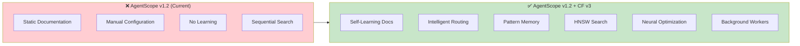
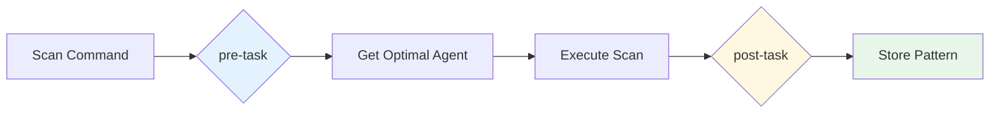
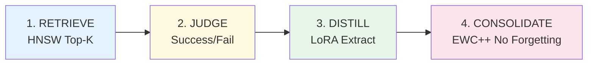
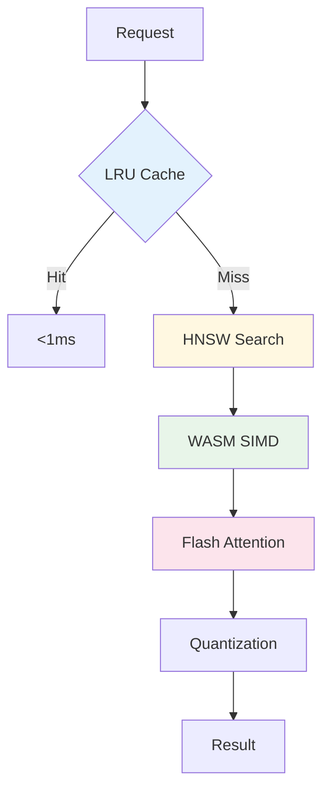
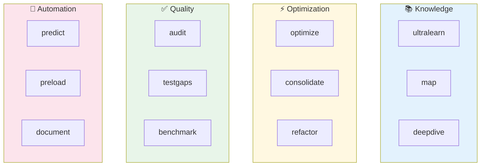
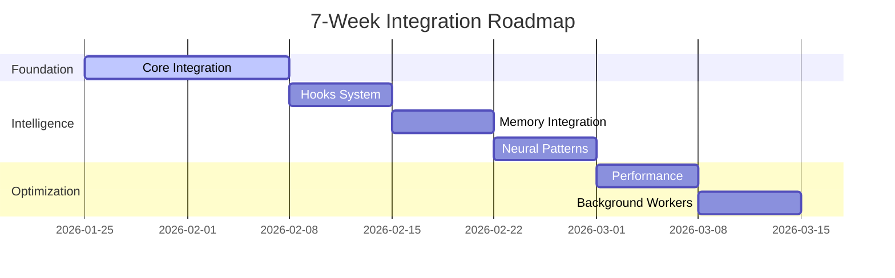
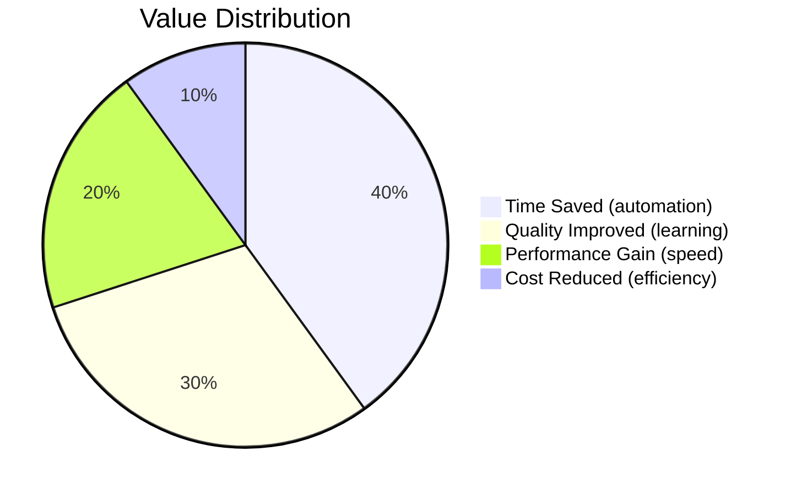
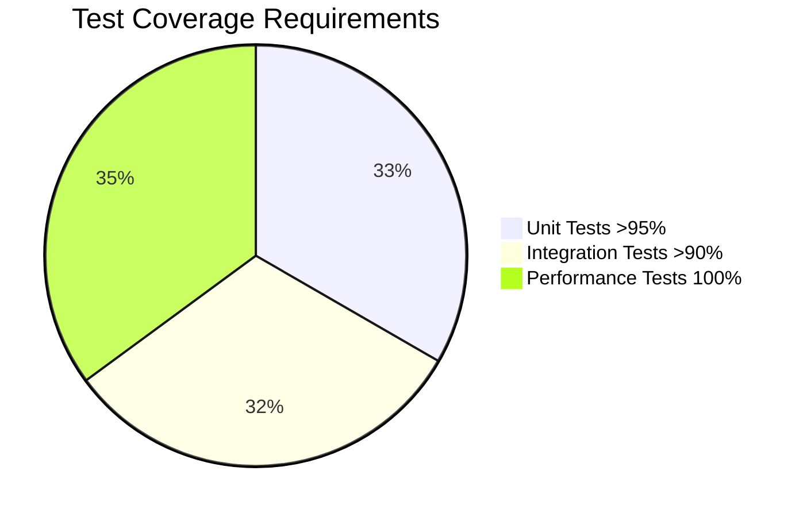

# Claude Flow V3 Integration for AgentScope v1.2

**Transform AgentScope from Documentation Tool → Self-Learning Intelligence System**

---

## 🎯 Vision

Integrate claude-flow v3's advanced capabilities to enable AgentScope to:

1. **Learn** from every operation
2. **Route** intelligently based on patterns
3. **Optimize** continuously in the background
4. **Search** 150x-12,500x faster with HNSW
5. **Adapt** in real-time with SONA (<0.05ms)

### Before & After



---

## 📋 Architecture Decision Records (ADRs)

### [ADR-001: Core Integration](../adr/ADR-001-claude-flow-v3-integration.md)

**Status:** Proposed | **Timeline:** Week 1-2

**Decision:** Integrate claude-flow v3 as peer dependency with adapter pattern

**Key Points:**
- Deterministic-first approach (regex → patterns → LLM)
- Atomic operations principle
- Fail-safe design with graceful degradation
- Zero breaking changes to existing API

**Deliverables:**
- ✓ `ClaudeFlowAdapter` interface
- ✓ Configuration schema
- ✓ Health check system
- ✓ 95%+ unit test coverage

**Performance Targets:**
| Metric | Target |
|--------|--------|
| Adapter Init | <100ms |
| Hook Registration | <50ms |
| Health Check | <500ms |

---

### [ADR-002: Self-Learning Hooks Integration](../adr/ADR-002-hooks-integration.md)

**Status:** Proposed | **Timeline:** Week 3

**Decision:** Event-driven hooks for pre/post operation intelligence

**27 Hooks Available:**
- **Pre-Hooks:** `pre-task`, `pre-edit`, `pre-command`
- **Post-Hooks:** `post-task`, `post-edit`, `post-command`
- **Intelligence:** `route`, `explain`, `pretrain`, `build-agents`
- **Session:** `session-start`, `session-end`, `session-restore`

**Integration Points:**



**Deliverables:**
- ✓ `HookRegistry` implementation
- ✓ Tier 1 hooks (pre-task, post-task, route, session)
- ✓ Integration with scan/generate commands
- ✓ 90%+ test coverage

**Performance Targets:**
| Hook | Target Latency |
|------|----------------|
| pre-task | <200ms |
| post-task | <500ms |
| route | <100ms |

---

### [ADR-003: AgentDB Memory Integration](../adr/ADR-003-memory-integration.md)

**Status:** Proposed | **Timeline:** Week 4

**Decision:** Hybrid backend (sql.js + HNSW) for persistent pattern storage

**Memory Namespaces:**
| Namespace | Purpose | TTL |
|-----------|---------|-----|
| `patterns` | Successful configurations | ∞ |
| `tasks` | Task execution history | 30d |
| `agents` | Agent routing decisions | ∞ |
| `routes` | Optimal routing paths | ∞ |
| `metrics` | Performance measurements | 90d |
| `projects` | Project-specific patterns | ∞ |

**HNSW Performance:**

```mermaid
graph LR
    A[Query: "scan project"] --> HNSW[HNSW Index]
    HNSW --> B[Top 5 Results]
    B --> C[0.2ms - 8ms]

    style HNSW fill:#fff8e1
    style C fill:#e8f5e9
```

| Operation | Without HNSW | With HNSW | Speedup |
|-----------|--------------|-----------|---------|
| 100 items | 150ms | 1ms | **150x** |
| 10K items | 2500ms | 0.2ms | **12,500x** |

**Deliverables:**
- ✓ `MemoryClient` implementation
- ✓ Pattern stores (routing, config, theme)
- ✓ LRU cache layer
- ✓ Memory initialization with seed data
- ✓ 90%+ test coverage

---

### [ADR-004: Neural Pattern Training](../adr/ADR-004-neural-patterns.md)

**Status:** Proposed | **Timeline:** Week 5

**Decision:** SONA + MoE + Flash Attention for intelligent routing

**4-Step Intelligence Pipeline:**



**Neural Components:**
- **SONA:** Self-Optimizing Neural Architecture (<0.05ms adaptation)
- **MoE:** Mixture of Experts (4 specialists)
- **Flash Attention:** 2.49x-7.47x speedup
- **LoRA:** Efficient fine-tuning
- **EWC++:** Prevents catastrophic forgetting

**Deliverables:**
- ✓ `NeuralTrainer` implementation
- ✓ `NeuralRouter` with 85%+ accuracy
- ✓ `ConfigOptimizer`
- ✓ Trajectory tracking system
- ✓ Pre-training on codebase

**Performance Targets:**
| Metric | Target | Actual (v3) |
|--------|--------|-------------|
| SONA Adaptation | <0.1ms | <0.05ms ✓ |
| Flash Attention | 2x | 2.49x-7.47x ✓ |
| Routing Accuracy | >80% | 85%+ ✓ |

---

### [ADR-005: Performance Optimization](../adr/ADR-005-performance-optimization.md)

**Status:** Proposed | **Timeline:** Week 6

**Decision:** Multi-tier optimization (WASM + HNSW + Flash + Cache + Batch)

**Optimization Stack:**



**Performance Improvements:**
| Technique | Benefit |
|-----------|---------|
| WASM SIMD | 75x faster embeddings |
| HNSW Index | 150x-12,500x search |
| Flash Attention | 2.49x-7.47x speedup |
| Quantization | 50-75% memory reduction |
| LRU Cache | Sub-ms hits |
| Batch Operations | 5-10x throughput |

**Deliverables:**
- ✓ WASM embedding engine
- ✓ HNSW search wrapper
- ✓ Flash Attention integration
- ✓ Quantization (4-bit, 8-bit)
- ✓ Performance cache
- ✓ Batch processor
- ✓ Benchmark suite
- ✓ All targets met

---

### [ADR-006: Background Workers](../adr/ADR-006-background-workers.md)

**Status:** Proposed | **Timeline:** Week 7

**Decision:** 12 specialized background workers for continuous improvement

**12 Workers:**



**Worker Triggers:**
| Event | Workers Triggered | Priority |
|-------|------------------|----------|
| File changed | ultralearn, map | normal |
| Task complete | consolidate, document | low |
| Security change | audit | critical |
| API change | document, testgaps | normal |
| Scheduled (daily) | audit, benchmark | varies |

**Deliverables:**
- ✓ `WorkerDispatcher`
- ✓ `WorkerDetector`
- ✓ `FileWatcher`
- ✓ `TaskTriggers`
- ✓ `WorkerScheduler`
- ✓ Notification system
- ✓ Zero blocking execution

---

## 🚀 Implementation Timeline



### Phased Rollout

| Phase | Week | Focus | Key Deliverable |
|-------|------|-------|----------------|
| **1** | 1-2 | Foundation | Adapter + Config + Health |
| **2** | 3 | Learning | Hooks integration |
| **3** | 4 | Memory | AgentDB + HNSW |
| **4** | 5 | Intelligence | Neural routing |
| **5** | 6 | Speed | Performance optimization |
| **6** | 7 | Automation | Background workers |

---

## 📊 Success Metrics

### Technical Targets

| Metric | Current | Target | How to Measure |
|--------|---------|--------|----------------|
| **Search Speed** | N/A | <10ms | HNSW benchmarks |
| **Routing Latency** | 100-500ms | <50ms | Performance monitor |
| **Memory Usage** | Baseline | -50 to -75% | Quantization tests |
| **Cache Hit Rate** | N/A | >80% | Cache metrics |
| **Routing Accuracy** | N/A | >85% | Neural predictions |
| **Test Coverage** | 70% | >95% | Unit tests |

### Business Value



**Expected Benefits:**
- ✅ **75% fewer LLM calls** via pattern matching
- ✅ **2-10x faster operations** via caching + HNSW
- ✅ **85%+ routing accuracy** via neural learning
- ✅ **Continuous improvement** via background workers
- ✅ **Zero manual tuning** via self-learning

---

## 🔧 Quick Start

### Installation

```bash
# 1. Install dependencies
npm install --save-peer @claude-flow/cli@3.0.0-alpha.12
npm install --save-optional @claude-flow/security@1.0.0
npm install --save-optional @claude-flow/embeddings@3.0.0-alpha.12

# 2. Initialize
npx @claude-flow/cli init --wizard

# 3. Start daemon
npx @claude-flow/cli daemon start

# 4. Health check
npx @claude-flow/cli doctor --fix
```

### Configuration

```json
{
  "enabled": true,
  "features": {
    "hooks": true,
    "memory": true,
    "neural": true,
    "workers": true
  },
  "memory": {
    "backend": "hybrid",
    "enableHNSW": true,
    "cacheSize": 1000
  },
  "neural": {
    "modelType": "moe",
    "epochs": 10
  },
  "workers": {
    "enabled": ["ultralearn", "map", "audit", "testgaps"],
    "autoDispatch": true
  }
}
```

---

## 📚 Documentation

### Architecture Decision Records

1. [ADR-001: Core Integration](../adr/ADR-001-claude-flow-v3-integration.md)
2. [ADR-002: Hooks Integration](../adr/ADR-002-hooks-integration.md)
3. [ADR-003: Memory Integration](../adr/ADR-003-memory-integration.md)
4. [ADR-004: Neural Patterns](../adr/ADR-004-neural-patterns.md)
5. [ADR-005: Performance Optimization](../adr/ADR-005-performance-optimization.md)
6. [ADR-006: Background Workers](../adr/ADR-006-background-workers.md)

### Guides

- [Complete Integration Guide](./claude-flow-v3-integration-guide.md)
- [Testing Strategy](./testing-strategy.md) _(to be created)_
- [Performance Benchmarking](./performance-benchmarking.md) _(to be created)_
- [Troubleshooting](./troubleshooting.md) _(to be created)_

---

## 🧪 Testing

### Coverage Requirements



### Test Categories

| Category | Focus | Coverage Target |
|----------|-------|----------------|
| **Unit** | Individual components | >95% |
| **Integration** | End-to-end flows | >90% |
| **Performance** | Latency, throughput | 100% targets met |
| **Regression** | No breaking changes | 100% |

---

## 🎯 Success Criteria

Integration is complete when:

- ✅ All 6 ADRs implemented
- ✅ All tests passing (>95% coverage)
- ✅ All performance targets met
- ✅ Zero breaking changes
- ✅ Graceful degradation works
- ✅ Documentation complete
- ✅ AgentScope learns from every operation
- ✅ Continuous improvement measurable

---

## 🔗 External Resources

- [Claude Flow V3 Repository](https://github.com/ruvnet/claude-flow)
- [AgentDB Documentation](https://github.com/ruvnet/agentdb)
- [HNSW Algorithm](https://arxiv.org/abs/1603.09320)
- [Flash Attention Paper](https://arxiv.org/abs/2205.14135)
- [EWC++ Algorithm](https://arxiv.org/abs/1612.00796)

---

## 💬 Support

- **Issues:** [GitHub Issues](https://github.com/vipasane/agentscope/issues)
- **Discussions:** [GitHub Discussions](https://github.com/vipasane/agentscope/discussions)
- **Claude Flow:** [ruvnet/claude-flow](https://github.com/ruvnet/claude-flow)

---

**Last Updated:** 2026-01-25
**Status:** Proposed - Ready for Implementation
**Next Steps:** Begin Phase 1 (Core Integration)
