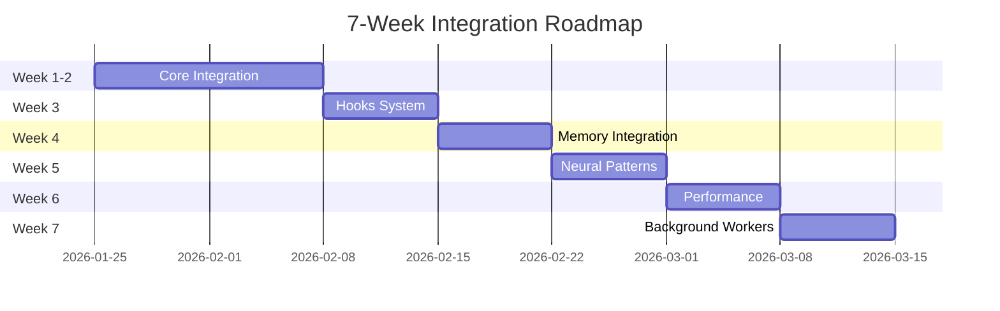
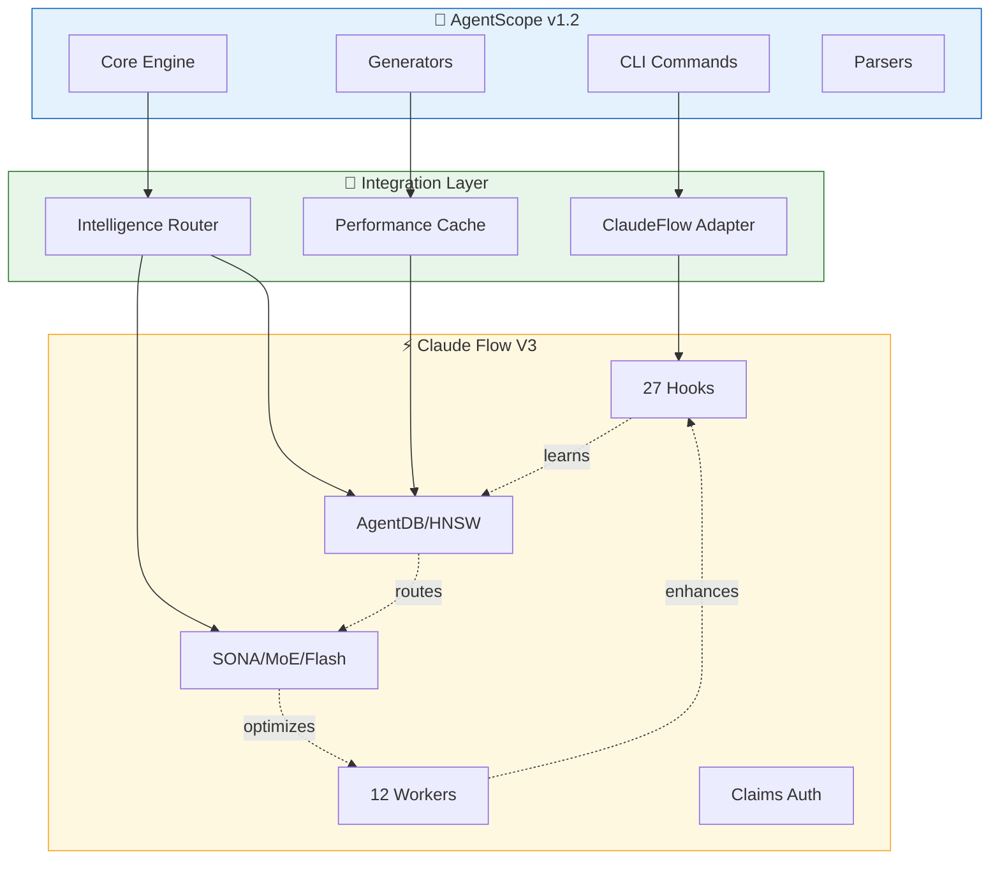

# Claude Flow V3 Integration Guide
**AgentScope v1.2 → Self-Learning Intelligence**

---

## 📋 Overview

This guide provides a complete roadmap for integrating claude-flow v3 capabilities into AgentScope v1.2, transforming it from a documentation tool into a self-learning, intelligent system.

### Integration Timeline



### Architecture Overview



---

## 🚀 Quick Start

### Prerequisites

```bash
# 1. Node.js 20+
node --version  # v20.0.0+

# 2. npm 9+
npm --version   # 9.0.0+

# 3. Install claude-flow CLI
npm install -g @claude-flow/cli@3.0.0-alpha.12
```

### Installation

```bash
# 1. Navigate to AgentScope project
cd /workspaces/agentscope

# 2. Install peer dependencies
npm install --save-peer @claude-flow/cli@3.0.0-alpha.12

# 3. Install optional dependencies
npm install --save-optional @claude-flow/security@1.0.0
npm install --save-optional @claude-flow/embeddings@3.0.0-alpha.12

# 4. Initialize claude-flow
npx @claude-flow/cli init --wizard

# 5. Start daemon
npx @claude-flow/cli daemon start

# 6. Run health check
npx @claude-flow/cli doctor --fix
```

### Configuration

Create `.agentscope/claude-flow.json`:

```json
{
  "enabled": true,
  "features": {
    "hooks": true,
    "memory": true,
    "neural": true,
    "workers": true,
    "claims": false
  },
  "memory": {
    "backend": "hybrid",
    "enableHNSW": true,
    "cacheSize": 1000
  },
  "neural": {
    "modelType": "moe",
    "epochs": 10,
    "learningRate": 0.001
  },
  "workers": {
    "enabled": [
      "ultralearn",
      "map",
      "audit",
      "testgaps",
      "document"
    ],
    "autoDispatch": true,
    "priority": "normal"
  }
}
```

---

## 📚 Phase-by-Phase Integration

### Phase 1: Core Integration (Week 1-2)

**Goal:** Establish foundation for claude-flow v3 integration

#### 1.1 Install Dependencies

```typescript
// package.json
{
  "peerDependencies": {
    "@claude-flow/cli": "^3.0.0-alpha.12"
  },
  "optionalDependencies": {
    "@claude-flow/security": "^1.0.0",
    "@claude-flow/embeddings": "^3.0.0-alpha.12"
  },
  "devDependencies": {
    "lru-cache": "^10.0.0",
    "chokidar": "^3.5.0"
  }
}
```

#### 1.2 Create Adapter Interface

```typescript
// src/integrations/claude-flow/adapter.ts
export interface ClaudeFlowAdapter {
  // Health
  checkHealth(): Promise<HealthStatus>;

  // Hooks
  registerHook(hook: HookType, handler: HookHandler): Promise<void>;

  // Memory
  storePattern(key: string, value: any, namespace?: string): Promise<void>;
  searchPatterns(query: string, options?: SearchOptions): Promise<Pattern[]>;

  // Neural
  trainPattern(data: TrainingData): Promise<TrainingResult>;
  predictOptimal(task: Task): Promise<Prediction>;

  // Workers
  dispatchWorker(trigger: WorkerTrigger, context?: any): Promise<string>;
}
```

#### 1.3 Implement Configuration

```typescript
// src/integrations/claude-flow/config.ts
export class ClaudeFlowConfig {
  static load(configPath?: string): ClaudeFlowConfig {
    const path = configPath || './.agentscope/claude-flow.json';

    if (!fs.existsSync(path)) {
      return this.defaults();
    }

    const config = JSON.parse(fs.readFileSync(path, 'utf-8'));
    return this.validate(config);
  }

  static defaults(): ClaudeFlowConfig {
    return {
      enabled: true,
      features: {
        hooks: true,
        memory: true,
        neural: true,
        workers: true,
        claims: false
      },
      memory: {
        backend: 'hybrid',
        enableHNSW: true,
        cacheSize: 1000
      },
      neural: {
        modelType: 'moe',
        epochs: 10,
        learningRate: 0.001
      },
      workers: {
        enabled: ['ultralearn', 'map', 'audit'],
        autoDispatch: true,
        priority: 'normal'
      }
    };
  }
}
```

**Deliverables:**
- ✓ Adapter interface defined
- ✓ Configuration schema implemented
- ✓ Health check system
- ✓ Unit tests (95%+ coverage)

---

### Phase 2: Hooks Integration (Week 3)

**Goal:** Enable self-learning through hooks

#### 2.1 Core Hooks

```typescript
// src/integrations/claude-flow/hooks/registry.ts
export class HookRegistry {
  private hooks: Map<HookType, HookHandler[]> = new Map();

  async register(hook: HookType, handler: HookHandler): Promise<void> {
    if (!this.hooks.has(hook)) {
      this.hooks.set(hook, []);
    }
    this.hooks.get(hook)!.push(handler);
  }

  async trigger(hook: HookType, context: HookContext): Promise<HookResult> {
    const handlers = this.hooks.get(hook) || [];
    const results = await Promise.all(
      handlers.map(h => h.execute(context))
    );
    return this.aggregateResults(results);
  }
}
```

#### 2.2 Pre-Task Hook

```typescript
// src/integrations/claude-flow/hooks/pre-task.ts
export class PreTaskHook implements HookHandler {
  async execute(context: PreTaskContext): Promise<PreTaskResult> {
    const result = await execAsync(
      `npx @claude-flow/cli hooks pre-task \\
        --description "${context.description}" \\
        --coordinate-swarm true`
    );

    const parsed = this.parseOutput(result.stdout);

    return {
      agent: parsed.recommendedAgent,
      model: parsed.modelRecommendation,
      context: parsed.additionalContext,
      estimatedComplexity: parsed.complexity
    };
  }
}
```

#### 2.3 Integration with Scan Command

```typescript
// src/cli/commands/scan.ts
export async function scanCommand(options: ScanOptions): Promise<void> {
  const hooks = new HookRegistry();
  const preTask = new PreTaskHook();

  await hooks.register('pre-task', preTask);

  // Get routing recommendation
  const routing = await hooks.trigger('pre-task', {
    description: 'Scan agent architecture',
    filePath: options.path
  });

  console.log(`🎯 Routing to: ${routing.agent} (${routing.model})`);

  // Execute with optimal agent
  const result = await executeWithAgent(routing.agent, routing.model, options);

  // Learn from outcome
  await hooks.trigger('post-task', {
    taskId: `scan-${Date.now()}`,
    success: result.success,
    quality: result.quality,
    agent: routing.agent
  });
}
```

**Deliverables:**
- ✓ HookRegistry implementation
- ✓ Pre-task, post-task hooks
- ✓ Route hook
- ✓ Session hooks
- ✓ Integration with commands
- ✓ 90%+ test coverage

---

### Phase 3: Memory Integration (Week 4)

**Goal:** Persistent pattern storage with HNSW search

#### 3.1 Memory Client

```typescript
// src/integrations/claude-flow/memory/client.ts
export class ClaudeFlowMemoryClient implements MemoryClient {
  private cache: LRUCache<string, any>;

  async store(key: string, value: any, options: StoreOptions = {}): Promise<void> {
    const namespace = options.namespace || 'default';
    const cacheKey = `${namespace}:${key}`;

    this.cache.set(cacheKey, value);

    await this.execCLI([
      'memory', 'store',
      '--key', key,
      '--value', JSON.stringify(value),
      '--namespace', namespace
    ]);
  }

  async search<T>(query: string, options: SearchOptions = {}): Promise<SearchResult<T>[]> {
    const cacheKey = `search:${query}:${JSON.stringify(options)}`;
    const cached = this.cache.get(cacheKey);
    if (cached) return cached;

    const result = await this.execCLI([
      'memory', 'search',
      '--query', query,
      '--namespace', options.namespace || 'patterns',
      '--limit', (options.limit || 5).toString()
    ]);

    const parsed = this.parseSearchResults<T>(result.stdout);
    this.cache.set(cacheKey, parsed, { ttl: 60000 });

    return parsed;
  }
}
```

#### 3.2 Pattern Stores

```typescript
// src/integrations/claude-flow/memory/patterns/routing.ts
export class RoutingPatternStore {
  async storeSuccessfulRoute(
    task: string,
    agent: string,
    model: string,
    quality: number
  ): Promise<void> {
    await this.memory.store(
      `route:${this.hashTask(task)}`,
      { task, agent, model, quality, timestamp: Date.now() },
      { namespace: 'routes', tags: ['routing', agent, model] }
    );
  }

  async findSimilarRoutes(task: string, limit: number = 5): Promise<RoutingPattern[]> {
    const results = await this.memory.search<RoutingPattern>(task, {
      namespace: 'routes',
      limit,
      threshold: 0.6
    });

    return results
      .sort((a, b) => b.value.quality - a.value.quality)
      .map(r => r.value);
  }
}
```

**Deliverables:**
- ✓ MemoryClient implementation
- ✓ Pattern stores (routing, config, theme)
- ✓ Cache layer
- ✓ Integration with commands
- ✓ Memory initialization
- ✓ 90%+ test coverage

---

### Phase 4: Neural Patterns (Week 5)

**Goal:** Intelligent routing and optimization

#### 4.1 Neural Trainer

```typescript
// src/integrations/claude-flow/neural/trainer.ts
export class ClaudeFlowNeuralTrainer implements NeuralTrainer {
  async train(data: TrainingData, options: TrainOptions = {}): Promise<TrainingResult> {
    await this.storeTrajectories(data.trajectories);

    const result = await this.execCLI([
      'neural', 'train',
      '--model-type', this.modelType,
      '--epochs', (options.epochs || 10).toString(),
      '--learning-rate', (options.learningRate || 0.001).toString()
    ]);

    return this.parseTrainingResult(result.stdout);
  }

  async predict(input: PredictionInput): Promise<Prediction> {
    const result = await this.execCLI([
      'neural', 'predict',
      '--input', JSON.stringify(input),
      '--top-k', (input.topK || 3).toString()
    ]);

    return this.parsePrediction(result.stdout);
  }
}
```

#### 4.2 Neural Router

```typescript
// src/integrations/claude-flow/neural/routing.ts
export class NeuralRouter {
  async selectOptimalAgent(task: string, context?: any): Promise<AgentSelection> {
    // 1. Retrieve similar tasks (HNSW)
    const similar = await this.memory.search(task, {
      namespace: 'routes',
      limit: 10
    });

    // 2. Neural prediction
    const prediction = await this.trainer.predict({
      task,
      context,
      similarTasks: similar.map(s => s.value)
    });

    return {
      agent: prediction.agent,
      model: prediction.model,
      confidence: prediction.confidence,
      reasoning: prediction.reasoning
    };
  }
}
```

**Deliverables:**
- ✓ NeuralTrainer implementation
- ✓ NeuralRouter
- ✓ ConfigOptimizer
- ✓ Trajectory tracking
- ✓ Pre-training logic
- ✓ 85%+ routing accuracy

---

### Phase 5: Performance Optimization (Week 6)

**Goal:** Meet aggressive performance targets

#### 5.1 WASM Embeddings

```typescript
// src/integrations/claude-flow/performance/wasm-embeddings.ts
export class WASMEmbeddingEngine {
  async initialize(): Promise<void> {
    const { InferenceSession } = await import('onnxruntime-web/wasm');

    this.session = await InferenceSession.create('all-MiniLM-L6-v2.onnx', {
      executionProviders: ['wasm'],
      graphOptimizationLevel: 'all'
    });
  }

  async generateEmbedding(text: string): Promise<Float32Array> {
    const input = this.tokenize(text);
    const output = await this.session!.run({ input });
    return output.embedding.data as Float32Array;
  }
}
```

#### 5.2 Performance Cache

```typescript
// src/integrations/claude-flow/performance/cache.ts
export class PerformanceCache {
  async getOrCompute<T>(
    key: string,
    compute: () => Promise<T>,
    options?: CacheOptions
  ): Promise<T> {
    const cached = this.cache.get(key);
    if (cached !== undefined) {
      this.recordMetric('cache.hit', 0);
      return cached as T;
    }

    const value = await compute();
    this.cache.set(key, value, { ttl: options?.ttl });

    this.recordMetric('cache.miss', 0);
    return value;
  }
}
```

**Deliverables:**
- ✓ WASM embeddings (75x faster)
- ✓ HNSW search integration (150-12,500x)
- ✓ Flash Attention (2.49x-7.47x)
- ✓ Quantization (50-75% memory reduction)
- ✓ LRU cache (sub-ms hits)
- ✓ Batch operations (5-10x throughput)
- ✓ Performance targets met

---

### Phase 6: Background Workers (Week 7)

**Goal:** Continuous improvement

#### 6.1 Worker Dispatcher

```typescript
// src/integrations/claude-flow/workers/dispatcher.ts
export class WorkerDispatcher {
  async dispatch(
    trigger: WorkerTrigger,
    context?: any,
    options: DispatchOptions = {}
  ): Promise<string> {
    const result = await execAsync(
      `npx @claude-flow/cli hooks worker-dispatch \\
        --trigger ${trigger} \\
        --context '${JSON.stringify(context || {})}' \\
        --background ${options.background !== false}`
    );

    const parsed = JSON.parse(result.stdout);
    return parsed.workerId;
  }
}
```

#### 6.2 File Watcher

```typescript
// src/integrations/claude-flow/workers/file-watcher.ts
export class FileWatcher {
  watch(paths: string[]): void {
    const watcher = chokidar.watch(paths, {
      ignored: /(^|[\/\\])\../,
      persistent: true
    });

    watcher.on('change', (path) => this.handleFileChange(path));
  }

  private async triggerWorkers(): Promise<void> {
    const triggers = this.detector.detectFromFileChanges(this.changedFiles);

    await this.dispatcher.batchDispatch(
      triggers.map(trigger => ({
        trigger,
        confidence: 1.0,
        reasoning: 'File change detected',
        priority: this.getPriority(trigger)
      }))
    );
  }
}
```

**Deliverables:**
- ✓ WorkerDispatcher
- ✓ WorkerDetector
- ✓ FileWatcher
- ✓ TaskTriggers
- ✓ WorkerScheduler
- ✓ Notification system
- ✓ Zero blocking execution

---

## 🧪 Testing Strategy

### Unit Tests

```typescript
// src/integrations/claude-flow/__tests__/adapter.test.ts
describe('ClaudeFlowAdapter', () => {
  it('should check health', async () => {
    const adapter = new ClaudeFlowAdapter(config);
    const health = await adapter.checkHealth();
    expect(health.status).toBe('healthy');
  });

  it('should fallback gracefully when CLI unavailable', async () => {
    // Mock CLI failure
    jest.spyOn(child_process, 'exec').mockRejectedValue(new Error('CLI not found'));

    const adapter = new ClaudeFlowAdapter({ fallback: 'default' });
    const result = await adapter.searchPatterns('test');

    expect(result).toEqual([]); // Graceful fallback
  });
});
```

### Integration Tests

```typescript
// src/integrations/claude-flow/__tests__/integration.test.ts
describe('Full Integration', () => {
  it('should complete learning cycle', async () => {
    // 1. Pre-task
    const routing = await hooks.trigger('pre-task', {
      description: 'Scan project'
    });

    // 2. Execute
    const result = await scanCommand({ path: './test' });

    // 3. Post-task
    const learned = await hooks.trigger('post-task', {
      taskId: 'test-1',
      success: true,
      quality: 0.9
    });

    expect(learned.stored).toBe(true);

    // 4. Verify learning
    const similar = await memory.search('scan project');
    expect(similar.length).toBeGreaterThan(0);
  });
});
```

### Performance Tests

```typescript
// src/integrations/claude-flow/__tests__/performance.test.ts
describe('Performance', () => {
  it('should meet search latency target (<10ms)', async () => {
    const times: number[] = [];

    for (let i = 0; i < 100; i++) {
      const start = performance.now();
      await memory.search('test query');
      times.push(performance.now() - start);
    }

    const p95 = times.sort((a, b) => a - b)[95];
    expect(p95).toBeLessThan(10);
  });
});
```

---

## 📊 Quality Metrics

### Coverage Targets

| Area | Target | Validation |
|------|--------|------------|
| Unit Tests | >95% | `npm run test:coverage` |
| Integration Tests | >90% | End-to-end scenarios |
| Performance Tests | 100% targets met | Benchmark suite |

### Performance Targets

| Metric | Target | How to Measure |
|--------|--------|----------------|
| Memory Search | <10ms | `npx @claude-flow/cli performance benchmark --suite memory` |
| Agent Routing | <50ms | Performance monitor |
| Flash Attention | 2.49x-7.47x | Neural benchmarks |
| Memory Reduction | 50-75% | Quantization tests |
| Cache Hit Rate | >80% | Cache metrics |

---

## 🔍 Troubleshooting

### Issue: CLI not found

```bash
# Solution: Install globally
npm install -g @claude-flow/cli@3.0.0-alpha.12

# Or use npx
npx @claude-flow/cli --version
```

### Issue: Memory initialization fails

```bash
# Solution: Force re-initialization
npx @claude-flow/cli memory init --force --verbose
```

### Issue: Worker daemon not starting

```bash
# Solution: Check daemon status
npx @claude-flow/cli daemon status

# Restart daemon
npx @claude-flow/cli daemon stop
npx @claude-flow/cli daemon start
```

### Issue: HNSW search slow

```bash
# Solution: Rebuild HNSW index
npx @claude-flow/cli memory rebuild-index --namespace patterns
```

---

## 📚 Additional Resources

### Documentation

- [ADR-001: Core Integration](../adr/ADR-001-claude-flow-v3-integration.md)
- [ADR-002: Hooks Integration](../adr/ADR-002-hooks-integration.md)
- [ADR-003: Memory Integration](../adr/ADR-003-memory-integration.md)
- [ADR-004: Neural Patterns](../adr/ADR-004-neural-patterns.md)
- [ADR-005: Performance Optimization](../adr/ADR-005-performance-optimization.md)
- [ADR-006: Background Workers](../adr/ADR-006-background-workers.md)

### External Links

- [Claude Flow V3 Repository](https://github.com/ruvnet/claude-flow)
- [AgentDB Documentation](https://github.com/ruvnet/agentdb)
- [HNSW Algorithm Paper](https://arxiv.org/abs/1603.09320)
- [Flash Attention Paper](https://arxiv.org/abs/2205.14135)

---

## ✅ Success Checklist

- [ ] All dependencies installed
- [ ] Configuration file created
- [ ] Health check passes
- [ ] Hooks registered and tested
- [ ] Memory initialized with seed data
- [ ] Neural models pre-trained
- [ ] Performance benchmarks run
- [ ] Workers dispatching correctly
- [ ] All tests passing (>95% coverage)
- [ ] Performance targets met
- [ ] Documentation complete

---

## 🎯 Next Steps

After completing integration:

1. **Monitor performance:** Use `npx @claude-flow/cli performance dashboard`
2. **Review learning:** Check `npx @claude-flow/cli hooks metrics --v3-dashboard`
3. **Optimize workers:** Adjust schedules in configuration
4. **Fine-tune neural models:** Re-train with production data
5. **Expand patterns:** Add domain-specific patterns to memory

**Integration is complete when AgentScope learns from every operation and continuously improves without user intervention.**
