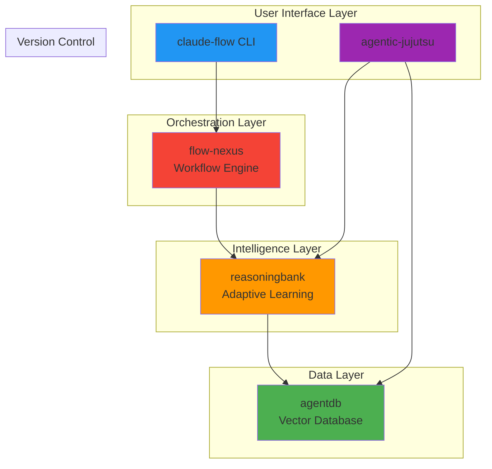

# Product Ecosystem Architecture

**Strategic Planning Coordinator**
**Date**: 2026-01-26
**Version**: 1.0
**Status**: Coordinating 5 parallel PRD agents

---

## Executive Summary

The claude-flow ecosystem consists of 5 integrated products that work together to provide a comprehensive AI agent development and orchestration platform. Each product addresses specific concerns while sharing common architectural components and patterns.

### Product Lineup

| Product | Primary Focus | Key Value Proposition |
|---------|---------------|----------------------|
| **claude-flow** | Multi-agent orchestration | 60+ agents, 27 hooks, swarm coordination |
| **agentdb** | Vector database | 150x-12,500x faster search with HNSW |
| **reasoningbank** | Adaptive learning | 4-step learning pipeline (RETRIEVE-JUDGE-DISTILL-CONSOLIDATE) |
| **agentic-jujutsu** | Version control | AI-native semantic commits and conflict resolution |
| **flow-nexus** | Workflow orchestration | Unified workflow engine with MCP integration |

---

## Product Relationships

### Architecture View



### Integration Points

#### 1. claude-flow ↔ agentdb
- **Purpose**: Memory and pattern storage for agents
- **Data Flow**: Agent observations → AgentDB vectors → HNSW search
- **Performance**: 150x-12,500x faster retrieval for agent memory

#### 2. claude-flow ↔ reasoningbank
- **Purpose**: Continuous learning from agent outcomes
- **Data Flow**: Task results → Trajectory tracking → Pattern distillation
- **Benefit**: Agents learn from successes and failures

#### 3. claude-flow ↔ flow-nexus
- **Purpose**: Complex workflow orchestration
- **Data Flow**: Swarm coordination → Workflow engine → Task distribution
- **Benefit**: Scalable multi-agent workflows

#### 4. reasoningbank ↔ agentdb
- **Purpose**: Fast pattern retrieval for learning
- **Data Flow**: Learning patterns → HNSW index → Sub-millisecond retrieval
- **Benefit**: Real-time learning without latency

#### 5. agentic-jujutsu ↔ agentdb
- **Purpose**: Semantic commit history and dependency tracking
- **Data Flow**: Commits → Semantic embeddings → Conflict prediction
- **Benefit**: AI-powered merge conflict resolution

#### 6. agentic-jujutsu ↔ reasoningbank
- **Purpose**: Learn from merge patterns
- **Data Flow**: Merge outcomes → Learning pipeline → Improved predictions
- **Benefit**: Better conflict resolution over time

---

## Common Concerns Across Products

### 1. Performance
**Shared Challenge**: All products need sub-second response times

**Unified Approach**:
- HNSW indexing (agentdb) provides 150x-12,500x speedup
- Flash Attention (reasoningbank, claude-flow) delivers 2.49x-7.47x speedup
- Quantization (agentdb) reduces memory 50-75%
- SONA adaptation (reasoningbank) achieves <0.05ms model updates

**Implementation**: Common performance monitoring via claude-flow hooks

### 2. Security
**Shared Challenge**: All products handle sensitive code and data

**Unified Approach**:
- Input validation using Zod schemas (all products)
- Path traversal prevention (agentdb, claude-flow, flow-nexus)
- Secrets sanitization (agentic-jujutsu, claude-flow)
- Command injection protection (claude-flow, flow-nexus)

**Implementation**: Shared `@claude-flow/security` package

### 3. Learning
**Shared Challenge**: All products benefit from adaptive behavior

**Unified Approach**:
- 4-step learning pipeline: RETRIEVE → JUDGE → DISTILL → CONSOLIDATE
- EWC++ prevents catastrophic forgetting across all products
- Pattern sharing via IPFS registry
- Cross-product learning transfer

**Implementation**: ReasoningBank provides learning substrate for all

### 4. Vector Search
**Shared Challenge**: All products need semantic similarity search

**Unified Approach**:
- AgentDB provides unified vector database
- HNSW indexing for fast retrieval
- Quantization for memory efficiency
- GNN-enhanced search for graph contexts

**Implementation**: AgentDB as shared data layer

### 5. Orchestration
**Shared Challenge**: All products need workflow coordination

**Unified Approach**:
- Flow-nexus provides unified workflow engine
- Hierarchical-mesh topology for anti-drift
- MCP integration for tool access
- Task distribution with load balancing

**Implementation**: Flow-nexus as shared orchestration layer

---

## Shared Component Architecture

### Core Shared Components

```typescript
// @claude-flow/core - Shared across all products
export interface SharedComponents {
  // Vector Database (agentdb)
  vectorDatabase: {
    hnsw: HNSWIndex;           // 150x-12,500x faster search
    quantization: Quantizer;    // 50-75% memory reduction
    gnn: GraphNeuralNetwork;   // +12.4% accuracy for graphs
  };

  // Learning System (reasoningbank)
  learningSystem: {
    trajectoryTracker: TrajectoryTracker;
    verdictJudge: VerdictJudge;
    memoryDistiller: MemoryDistiller;
    ewcConsolidator: EWCConsolidator;
  };

  // Security Framework (all products)
  security: {
    inputValidator: InputValidator;
    pathValidator: PathValidator;
    safeExecutor: SafeExecutor;
    secretsSanitizer: SecretsSanitizer;
  };

  // Performance Optimization (all products)
  performance: {
    flashAttention: FlashAttention;  // 2.49x-7.47x speedup
    sona: SONA;                      // <0.05ms adaptation
    moe: MixtureOfExperts;           // Optimal routing
  };

  // Workflow Engine (flow-nexus)
  orchestration: {
    workflowEngine: WorkflowEngine;
    taskDistributor: TaskDistributor;
    topologyManager: TopologyManager;
    consensusBuilder: ConsensusBuilder;
  };
}
```

### Shared CLI Framework

All products share a common CLI pattern:

```bash
# Common command structure
<product> <domain> <action> [options]

# Examples across products
claude-flow agent spawn -t coder
agentdb memory search --query "patterns"
reasoningbank trajectory start --task-id "task-1"
agentic-jujutsu commit semantic --message "feat: add auth"
flow-nexus workflow execute --template "ci-cd"
```

### Shared Configuration Format

```json
{
  "version": "3.0.0",
  "products": {
    "claude-flow": { "enabled": true },
    "agentdb": { "enabled": true, "backend": "hybrid" },
    "reasoningbank": { "enabled": true, "learningRate": 0.001 },
    "agentic-jujutsu": { "enabled": false },
    "flow-nexus": { "enabled": true }
  },
  "shared": {
    "memory": {
      "backend": "hybrid",
      "hnsw": { "enabled": true, "m": 16, "efConstruction": 200 }
    },
    "security": {
      "inputValidation": true,
      "secretsSanitization": true
    },
    "performance": {
      "flashAttention": true,
      "quantization": true,
      "sona": { "enabled": true, "maxLatency": 0.05 }
    }
  }
}
```

### Shared Testing Framework

```typescript
// All products use Vitest for testing
import { describe, it, expect } from 'vitest';
import { SharedTestHelpers } from '@claude-flow/testing';

describe('Product Integration Tests', () => {
  it('should integrate with agentdb', async () => {
    const db = await SharedTestHelpers.createTestDB();
    // Test implementation
  });

  it('should integrate with reasoningbank', async () => {
    const learning = await SharedTestHelpers.createTestLearning();
    // Test implementation
  });
});
```

---

## Versioning and Compatibility Strategy

### Semantic Versioning Across Products

```
Major.Minor.Patch-Channel

Example: 3.0.1-alpha
- Major: Breaking changes (synchronized across all products)
- Minor: New features (independent per product)
- Patch: Bug fixes (independent per product)
- Channel: alpha, beta, rc, stable
```

### Compatibility Matrix

| claude-flow | agentdb | reasoningbank | agentic-jujutsu | flow-nexus |
|-------------|---------|---------------|-----------------|------------|
| 3.0.x | 3.0.x | 3.0.x | 1.0.x | 2.0.x |
| 3.1.x | 3.0.x-3.1.x | 3.0.x-3.1.x | 1.0.x-1.1.x | 2.0.x-2.1.x |

**Rules**:
- Major version changes require synchronized updates across all products
- Minor version updates maintain backward compatibility within major version
- Shared components (`@claude-flow/core`) follow strict semver

### Migration Paths

```bash
# Upgrade all products to latest compatible versions
npx @claude-flow/cli@latest migrate ecosystem --to 3.1.0

# Check compatibility
npx @claude-flow/cli@latest doctor --check-ecosystem

# Rollback if needed
npx @claude-flow/cli@latest migrate rollback --ecosystem
```

---

## Data Flow and Communication Patterns

### Message Bus Architecture

```
┌──────────────┐     ┌──────────────┐     ┌──────────────┐
│ claude-flow  │────▶│  flow-nexus  │────▶│ reasoningbank│
│   (Agent)    │     │  (Workflow)  │     │  (Learning)  │
└──────────────┘     └──────────────┘     └──────────────┘
       │                     │                     │
       └─────────────────────┼─────────────────────┘
                             ▼
                      ┌──────────────┐
                      │   agentdb    │
                      │  (Vectors)   │
                      └──────────────┘
```

### Event Types

1. **Task Events**: Agent task start/complete
2. **Learning Events**: Pattern stored, verdict judged
3. **Search Events**: Vector query, HNSW lookup
4. **Workflow Events**: Workflow start/complete, step transition
5. **Commit Events**: Semantic commit, merge prediction

### Shared Event Schema

```typescript
interface EcosystemEvent {
  id: string;
  timestamp: number;
  source: 'claude-flow' | 'agentdb' | 'reasoningbank' | 'agentic-jujutsu' | 'flow-nexus';
  type: 'task' | 'learning' | 'search' | 'workflow' | 'commit';
  payload: unknown;
  metadata: {
    correlationId?: string;
    causationId?: string;
    tags?: string[];
  };
}
```

---

## Deployment Topology

### Single-Node Deployment (Development)

```
┌─────────────────────────────────────────┐
│          Developer Workstation          │
│  ┌────────────┐  ┌────────────┐        │
│  │claude-flow │  │  agentdb   │        │
│  │    CLI     │  │  (local)   │        │
│  └────────────┘  └────────────┘        │
│  ┌────────────┐  ┌────────────┐        │
│  │reasoningbank  │flow-nexus  │        │
│  │  (local)   │  │  (local)   │        │
│  └────────────┘  └────────────┘        │
└─────────────────────────────────────────┘
```

### Multi-Node Deployment (Production)

```
┌──────────────────┐
│   Load Balancer  │
└────────┬─────────┘
         │
    ┌────┴────┬────────┬────────┐
    ▼         ▼        ▼        ▼
┌────────┐ ┌────────┐ ┌────────┐
│ Node 1 │ │ Node 2 │ │ Node N │
│ claude │ │ claude │ │ claude │
│ -flow  │ │ -flow  │ │ -flow  │
└───┬────┘ └───┬────┘ └───┬────┘
    │          │          │
    └──────────┼──────────┘
               ▼
    ┌──────────────────────┐
    │  Shared Data Layer   │
    │  ┌────────────────┐  │
    │  │    agentdb     │  │
    │  │ (distributed)  │  │
    │  └────────────────┘  │
    │  ┌────────────────┐  │
    │  │ reasoningbank  │  │
    │  │ (distributed)  │  │
    │  └────────────────┘  │
    └──────────────────────┘
```

---

## Observability and Monitoring

### Unified Metrics

All products expose metrics via common format:

```typescript
interface ProductMetrics {
  product: string;
  version: string;
  uptime: number;
  performance: {
    latencyP50: number;
    latencyP95: number;
    latencyP99: number;
    throughput: number;
  };
  resources: {
    memoryUsage: number;
    cpuUsage: number;
    diskUsage: number;
  };
  errors: {
    total: number;
    byType: Record<string, number>;
  };
}
```

### Unified Logging

```typescript
interface LogEntry {
  timestamp: number;
  level: 'debug' | 'info' | 'warn' | 'error';
  product: string;
  component: string;
  message: string;
  context?: Record<string, unknown>;
  correlationId?: string;
}
```

### Dashboard Integration

```bash
# Start unified dashboard
npx @claude-flow/cli@latest dashboard start

# View ecosystem health
npx @claude-flow/cli@latest status --ecosystem

# Export metrics
npx @claude-flow/cli@latest metrics export --format prometheus
```

---

## Future Integration Opportunities

### Phase 1 (Q1 2026) - Current
- ✅ AgentDB integration with claude-flow
- ✅ ReasoningBank integration with claude-flow
- ✅ Flow-nexus basic orchestration

### Phase 2 (Q2 2026) - Planned
- 🔄 Agentic-jujutsu integration with agentdb for semantic commits
- 🔄 Full learning pipeline across all products
- 🔄 IPFS pattern sharing registry

### Phase 3 (Q3 2026) - Future
- 📋 Multi-cloud deployment
- 📋 Federated learning across instances
- 📋 Cross-organization pattern sharing

---

## Success Metrics

### Individual Product KPIs
- **claude-flow**: Agent spawn time, coordination latency
- **agentdb**: Search latency, indexing speed
- **reasoningbank**: Learning accuracy, pattern recall
- **agentic-jujutsu**: Merge conflict resolution accuracy
- **flow-nexus**: Workflow execution time, task throughput

### Ecosystem KPIs
- End-to-end task completion time
- Cross-product integration latency
- Shared component reuse percentage
- Learning transfer effectiveness
- Developer satisfaction score

---

## Conclusion

The claude-flow ecosystem provides a comprehensive, integrated platform for AI agent development with:

1. **Unified Architecture**: Shared components reduce duplication
2. **Performance**: 150x-12,500x search speedup, 2.49x-7.47x attention speedup
3. **Learning**: Continuous improvement across all products
4. **Security**: Common security framework
5. **Scalability**: From local development to distributed production

Each product focuses on specific concerns while benefiting from ecosystem-wide improvements. The shared component architecture ensures consistency, performance, and maintainability.
