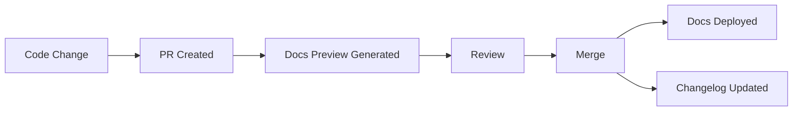

# Automated SDLC Documentation Frameworks Research

> Comprehensive analysis of documentation generation tools, standards compliance, and best practices for AgentScope

---

## Executive Summary

This research covers automated SDLC documentation frameworks, libraries, and standards compliance tools. The goal is to identify what AgentScope should implement to be a good citizen in the open-source ecosystem and demonstrate best practices.

**Key Findings:**
1. **Changelog Automation** is mature with semantic-release and release-please leading the space
2. **Standards Compliance** increasingly important (SBOM, SLSA, OpenSSF Scorecard)
3. **Docs-as-Code** is the dominant philosophy for modern documentation
4. **AI-Assisted Documentation** is rapidly evolving in 2025/2026
5. **Event-Driven Documentation** through Git hooks and CI/CD is standard practice

---

## 1. Automated Documentation Generation Tools

### 1.1 Changelog/Release Notes Generators

#### semantic-release
**What it does:** Fully automated version management and package publishing based on commit messages.

**How it captures events:**
- Analyzes git commit history looking for Conventional Commits
- Triggers on CI/CD pipeline runs (typically on main branch merges)
- Uses `@semantic-release/commit-analyzer` to determine version bumps
- Uses `@semantic-release/release-notes-generator` for changelog content

**Standards followed:**
- Conventional Commits specification
- Semantic Versioning (SemVer)
- Keep a Changelog format (via plugins)

**Key plugins:**
- `@semantic-release/changelog` - Creates/updates CHANGELOG.md
- `@semantic-release/git` - Commits changes back to repo
- `@semantic-release/npm` - Publishes to npm registry
- `@semantic-release/github` - Creates GitHub releases

**Best practices for integration:**
```yaml
# .releaserc.json
{
  "plugins": [
    "@semantic-release/commit-analyzer",
    "@semantic-release/release-notes-generator",
    "@semantic-release/changelog",
    "@semantic-release/npm",
    "@semantic-release/github",
    "@semantic-release/git"
  ]
}
```

**Sources:** [semantic-release npm](https://www.npmjs.com/package/semantic-release), [GitHub](https://github.com/semantic-release/semantic-release), [LogRocket Guide](https://blog.logrocket.com/using-semantic-release-automate-releases-changelogs/)

---

#### release-please (Google)
**What it does:** Creates release PRs based on Conventional Commits, keeping a running changelog PR that updates with each merge.

**How it captures events:**
- Parses git history for Conventional Commits (`feat:`, `fix:`, `deps:`)
- Maintains a "Release PR" that stays updated as work merges
- Merging the Release PR triggers: changelog update, version bump, git tag, GitHub release

**Standards followed:**
- Conventional Commits specification
- Semantic Versioning
- Keep a Changelog format

**Important 2025 Update:** The GitHub App was deprecated August 14, 2025. Use the GitHub Action instead.

**Configuration:**
```yaml
# release-please-config.json
{
  "packages": {
    ".": {
      "release-type": "node"
    }
  }
}
```

**Workflow Integration:**
```yaml
# .github/workflows/release-please.yml
name: release-please
on:
  push:
    branches: [main]
jobs:
  release-please:
    runs-on: ubuntu-latest
    steps:
      - uses: googleapis/release-please-action@v4
        with:
          token: ${{ secrets.GITHUB_TOKEN }}
```

**Sources:** [GitHub](https://github.com/googleapis/release-please), [Padok Guide](https://cloud.theodo.com/en/blog/release-please)

---

#### changesets
**What it does:** Monorepo-focused versioning and changelog management where developers declare change intent at PR time.

**How it captures events:**
- Developers create `.changeset/` files with each PR describing the change
- `changeset version` aggregates all changesets into changelog entries
- `changeset publish` handles npm publishing

**Standards followed:**
- Semantic Versioning
- Keep a Changelog format
- Monorepo-aware dependency updates

**Best for:** Monorepos, coordinated multi-package releases

**Notable users:** Chakra UI, Astro, Biome, SvelteKit, Remix, Apollo Client

**Sources:** [GitHub](https://github.com/changesets/changesets), [Vercel Academy](https://vercel.com/academy/production-monorepos/changesets-versioning)

---

#### Comparison Matrix

| Feature | semantic-release | release-please | changesets |
|---------|-----------------|----------------|------------|
| **Automation Level** | Fully automated | PR-based | Manual changeset |
| **Monorepo Support** | Via plugins | Native | Native (designed for) |
| **Human Review** | Post-release | PR before release | Changeset review |
| **Learning Curve** | Medium | Low | Medium |
| **Best For** | Single packages | Google-style workflow | Multi-package repos |

---

### 1.2 Documentation-as-Code Platforms

#### Backstage (Spotify)
**What it does:** Open-source framework for building developer portals with a centralized software catalog.

**How it captures metadata:**
- YAML descriptor files (`catalog-info.yaml`) stored with code
- Defines services, APIs, libraries, systems, teams
- TechDocs: "docs-like-code" with Markdown files living alongside code
- Harvests metadata and visualizes in the portal

**Standards followed:**
- Custom entity model specification
- Markdown/MkDocs for TechDocs
- OpenAPI for API documentation

**2025 Updates:**
- Spotify Portal for Backstage is now GA (managed version)
- Enhanced plugin architecture with better testing frameworks
- Now CNCF Incubation project

**Key Features:**
- Software Catalog for all software types
- Software Templates for standardizing new projects
- TechDocs with 5000+ documentation sites at Spotify

**Sources:** [Backstage.io](https://backstage.io/), [Spotify Portal](https://backstage.spotify.com/), [Cortex Overview](https://www.cortex.io/post/an-overview-of-spotify-backstage)

---

#### Docusaurus (Meta) vs MkDocs

| Aspect | Docusaurus | MkDocs |
|--------|------------|--------|
| **Language** | JavaScript/React | Python |
| **Best For** | Large docs, React customization | Simple docs, Python projects |
| **Versioning** | Native | Plugin required |
| **i18n** | Native | Plugin (mkdocs-static-i18n) |
| **Customization** | React components | Jinja templates |
| **Community** | Meta-backed, growing | Established, mature |
| **Deployment** | GitHub Pages, Vercel, Netlify | Same |

**Docs-as-Code Philosophy:**
- Documentation lives in git alongside code
- Versioned with source code
- CI/CD deployment pipelines
- Review process through PRs

**Sources:** [Docusaurus](https://docusaurus.io/docs), [MkDocs vs Docusaurus](https://blog.damavis.com/en/mkdocs-vs-docusaurus-for-technical-documentation/)

---

#### TypeScript Documentation: TypeDoc, JSDoc, TSDoc

| Tool | Purpose | Use Case |
|------|---------|----------|
| **TSDoc** | Specification only | Standardized comment format |
| **JSDoc** | Generator + format | JavaScript projects |
| **TypeDoc** | Generator (TSDoc-based) | TypeScript API docs |

**TypeDoc Configuration:**
```json
// typedoc.json
{
  "entryPoints": ["./src"],
  "out": "docs/api",
  "plugin": ["typedoc-plugin-markdown"]
}
```

**Best Practice:** Use TypeDoc for TypeScript projects as it leverages the type system for comprehensive documentation.

**Sources:** [TSDoc](https://tsdoc.org/), [TypeDoc](https://typedoc.org/), [Cloudflare Blog](https://blog.cloudflare.com/generating-documentation-for-typescript-projects/)

---

## 2. SDLC Event Documentation

### 2.1 Git Hooks and Events

**Events captured:**
- `pre-commit` - Before commit is created
- `commit-msg` - Validate commit message
- `pre-push` - Before push to remote
- `post-commit` - After commit is created
- `post-merge` - After merge is completed

**Common uses:**
- **commitlint** + Husky for commit message validation
- **lint-staged** for pre-commit linting
- **danger.js** for PR automation (post-push)

**Setup Example (Husky v9+):**
```bash
npm install --save-dev husky @commitlint/cli @commitlint/config-conventional
npx husky init
echo "npx --no -- commitlint --edit \$1" > .husky/commit-msg
```

**Sources:** [commitlint Guide](https://commitlint.js.org/guides/local-setup.html), [Husky](https://typicode.github.io/husky/)

---

### 2.2 GitHub Actions Events

**Key trigger types for documentation:**

| Event | When Triggered | Documentation Use |
|-------|---------------|-------------------|
| `push` | Code pushed to branch | Update docs on merge |
| `pull_request` | PR opened/updated | Preview docs, PR checks |
| `release` | Release published | Publish versioned docs |
| `workflow_dispatch` | Manual trigger | On-demand doc generation |
| `repository_dispatch` | External webhook | Third-party integrations |

**GitHub supports 73+ webhook events** covering code changes to security alerts.

**Sources:** [GitHub Events Docs](https://docs.github.com/en/actions/using-workflows/events-that-trigger-workflows), [Webhook Events](https://docs.github.com/en/webhooks/webhook-events-and-payloads)

---

### 2.3 GitLab Auto DevOps

**Automatic features:**
- Auto Build, Test, Code Quality
- Auto Review Apps for each branch
- Auto Deploy with review widgets
- Code Intelligence (Go projects)

**Documentation automation approaches:**
- Sphinx for Python documentation
- Pipeline-triggered doc builds
- Automatic deployment to GitLab Pages

**Sources:** [GitLab Auto DevOps](https://docs.gitlab.com/topics/autodevops/), [Stages](https://docs.gitlab.com/ee/topics/autodevops/stages.html)

---

## 3. Standards and Compliance Frameworks

### 3.1 De-facto Standards

#### Conventional Commits
**Specification:** Structured commit message format for automated changelog generation.

**Format:**
```
<type>[optional scope]: <description>

[optional body]

[optional footer(s)]
```

**Type to SemVer mapping:**
- `fix:` -> PATCH
- `feat:` -> MINOR
- `BREAKING CHANGE:` or `!` -> MAJOR

**Tools:** commitlint, semantic-release, release-please, changesets

**Source:** [conventionalcommits.org](https://www.conventionalcommits.org/en/v1.0.0/)

---

#### Keep a Changelog
**Specification:** Human-readable changelog format.

**Required structure:**
```markdown
# Changelog

All notable changes to this project will be documented in this file.

The format is based on [Keep a Changelog](https://keepachangelog.com/en/1.1.0/),
and this project adheres to [Semantic Versioning](https://semver.org/spec/v2.0.0.html).

## [Unreleased]

## [1.0.0] - 2024-01-15
### Added
### Changed
### Deprecated
### Removed
### Fixed
### Security
```

**Key rules:**
- Filename: `CHANGELOG.md`
- Latest release first (semantic ordering)
- Date format: `YYYY-MM-DD` (ISO 8601)
- `[YANKED]` tag for pulled releases

**Source:** [keepachangelog.com](https://keepachangelog.com/en/1.1.0/)

---

#### Semantic Versioning (SemVer)
**Format:** `MAJOR.MINOR.PATCH`

| Component | Increment When |
|-----------|----------------|
| MAJOR | Breaking changes |
| MINOR | New features (backward compatible) |
| PATCH | Bug fixes (backward compatible) |

**Source:** [semver.org](https://semver.org/)

---

#### OpenAPI/Swagger
**What it does:** Standard interface description for RESTful APIs.

**Tools:**
- **OpenAPI Generator** - SDK, server stubs, docs from spec
- **Swagger UI** - Interactive API explorer
- **Swagger Codegen** - Client/server generation

**Best Practice:** Generate API docs during build process, keep spec as source of truth.

**Sources:** [OpenAPI Specification](https://swagger.io/specification/), [OpenAPI Generator](https://github.com/OpenAPITools/openapi-generator)

---

### 3.2 Industry Standards

#### ISO/IEC/IEEE 26514
**Purpose:** Design and development of information for users of systems and software.

**Key principles:**
1. User-centered approach
2. Parallel development with software
3. Target audience analysis
4. Information concept derivation
5. Quality assurance through usability checks

**Superseded:** IEEE 1063-2001 (December 2001)

**Current:** ISO/IEC/IEEE 26514:2022-01

**Sources:** [IEEE Standards](https://standards.ieee.org/ieee/26514/7467/), [arc42 Quality Model](https://quality.arc42.org/standards/iso-26514)

---

#### DORA Metrics
**Purpose:** Measure software delivery performance.

**The 5 metrics (as of 2021):**

| Metric | Elite Performance | Description |
|--------|-------------------|-------------|
| Deployment Frequency | Multiple per day | How often releases to production |
| Lead Time for Changes | < 1 hour | Commit to production time |
| Mean Time to Restore | < 1 hour | Recovery from failures |
| Change Failure Rate | < 15% | Deployments causing failures |
| Reliability | High | System health and experience |

**Impact:** Teams excelling at DORA metrics are 2x more likely to exceed organizational performance goals.

**Sources:** [dora.dev](https://dora.dev/guides/dora-metrics-four-keys/), [GitLab DORA](https://docs.gitlab.com/ee/user/analytics/dora_metrics.html), [Octopus DORA](https://octopus.com/devops/metrics/dora-metrics/)

---

### 3.3 Security and Compliance Tools

#### OpenSSF Scorecard
**What it does:** Assesses open source projects for security risks through automated checks.

**How it works:**
- 18 checks across 3 themes: holistic security, source code risk, build process risk
- Scores 0-10 per check and overall
- Weekly scan of 1 million most critical projects
- Machine-readable patches for vulnerabilities

**Checks include:**
- Branch protection
- Code review
- Dependency updates
- Signed releases
- SBOM presence
- Vulnerability handling

**Integration:**
```yaml
# .github/workflows/scorecard.yml
- uses: ossf/scorecard-action@v2
```

**Sources:** [OpenSSF Scorecard](https://scorecard.dev/), [GitHub](https://github.com/ossf/scorecard), [CISA](https://www.cisa.gov/resources-tools/services/openssf-scorecard)

---

#### SLSA (Supply-chain Levels for Software Artifacts)
**What it does:** Security framework for supply chain integrity, "salsa" pronunciation.

**Levels:**

| Level | Requirements |
|-------|--------------|
| **SLSA 1** | Document supply chain, generate provenance |
| **SLSA 2** | Source-aware builds, signed artifacts |
| **SLSA 3** | Build from source definitions, hardened CI |
| **SLSA 4** | Full build environment accounting, dependency tracking |

**OpenSSF project since v1.0 (April 2023)**

**Sources:** [slsa.dev](https://slsa.dev/), [OpenSSF SLSA](https://openssf.org/projects/slsa/)

---

#### CycloneDX SBOM
**What it does:** OWASP standard for Software Bill of Materials.

**Why it matters:**
- U.S. Executive Order 2021 approved format
- ECMA-424 ratified standard
- Current version: CycloneDX v1.7 (October 2025)

**Generation tools by language:**
- **Node.js:** `@cyclonedx/bom`
- **Python:** `cyclonedx-python`
- **Webpack:** `cyclonedx-webpack-plugin`

**Best Practice:** Generate SBOM during build process for maximum accuracy.

**Sources:** [CycloneDX](https://cyclonedx.org/), [Tool Center](https://cyclonedx.org/tool-center/)

---

#### REUSE Tool (FSFE)
**What it does:** Ensures license compliance with machine-readable licensing information.

**Requirements:**
1. Each file must have licensing information
2. Use SPDX license identifiers
3. Create `LICENSES/` directory with full license texts
4. Add `SPDX-License-Identifier:` and `SPDX-FileCopyrightText:` tags

**Commands:**
- `reuse lint` - Check compliance
- `reuse annotate` - Add licensing headers
- `reuse download` - Download license texts

**Current version:** REUSE Specification 3.3, Tool 5.0.0

**Sources:** [reuse.software](https://reuse.software/spec-3.3/), [GitHub](https://github.com/fsfe/reuse-tool)

---

### 3.4 Contributor Recognition

#### All Contributors
**What it does:** Recognizes all types of contributions, not just code.

**Specification requirements:**
- Contributors section in prominent location
- Inclusive of all contribution types
- No exclusion based on perceived contribution level

**Contribution types:**
- code, doc, design, bug, ideas, infra, maintenance, review, test, translation, etc.

**Integration:**
```bash
# CLI
npx all-contributors add username code,doc

# Bot (GitHub App)
@all-contributors please add @username for code
```

**Sources:** [allcontributors.org](https://allcontributors.org/), [Specification](https://allcontributors.org/specification/)

---

## 4. Event-Driven Documentation Patterns

### 4.1 Backstage Service Metadata Capture

**Pattern:** YAML descriptors in repository root
```yaml
# catalog-info.yaml
apiVersion: backstage.io/v1alpha1
kind: Component
metadata:
  name: my-service
  description: A service that does things
  annotations:
    github.com/project-slug: org/repo
spec:
  type: service
  lifecycle: production
  owner: team-backend
```

**Events captured:**
- Repository changes (harvester scans)
- API spec changes
- Documentation updates
- Ownership changes

---

### 4.2 Documentation Update Triggers

**Recommended triggers:**

| Event | Documentation Action |
|-------|---------------------|
| PR merged to main | Update CHANGELOG, rebuild docs |
| Version tag created | Publish versioned docs |
| API schema changed | Regenerate API docs |
| README modified | Rebuild landing page |
| New contributor | Update contributors list |
| Security advisory | Add to security changelog |

---

### 4.3 Docs-as-Code Workflow



---

## 5. Agentic Documentation Considerations

### 5.1 AI Agent Documentation Generation

**Current capabilities (2025):**
- GitHub Copilot agent mode can generate documentation
- Claude Code can create/update docs, changelogs, API references
- Multi-agent orchestration for large documentation tasks

**Integration patterns:**
1. **Pre-commit hooks** - Validate documentation completeness
2. **PR automation** - Auto-generate doc updates from code changes
3. **Review assistance** - AI reviews documentation quality
4. **Batch updates** - Periodic documentation refresh

**Sources:** [Copilot Agent Mode](https://code.visualstudio.com/blogs/2025/02/24/introducing-copilot-agent-mode), [Claude Agents](https://claude.com/solutions/agents)

---

### 5.2 Hooks and Events for Documentation Updates

**Recommended hook points:**

| Hook | Documentation Trigger |
|------|----------------------|
| `pre-commit` | Validate doc file presence |
| `commit-msg` | Ensure breaking changes documented |
| `pre-push` | Check CHANGELOG has unreleased entries |
| `post-merge` | Trigger doc site rebuild |
| `release` | Generate release notes, version docs |

---

### 5.3 Maintaining Documentation Freshness

**Strategies:**
1. **Staleness detection** - Flag docs not updated with code
2. **Coverage metrics** - Track undocumented functions/APIs
3. **Automated reminders** - PR comments for outdated docs
4. **Periodic audits** - Scheduled documentation reviews

**Tools:**
- danger.js for PR documentation checks
- Custom linters for doc coverage
- AI agents for gap detection

---

## 6. Specific Library Analysis

### 6.1 semantic-release

| Aspect | Details |
|--------|---------|
| **Events** | CI/CD pipeline on main branch |
| **Standards** | Conventional Commits, SemVer, Keep a Changelog |
| **Output** | Changelog, git tags, npm publish, GitHub release |
| **Best for** | Fully automated single-package releases |

---

### 6.2 release-please

| Aspect | Details |
|--------|---------|
| **Events** | Push to main branch |
| **Standards** | Conventional Commits, SemVer |
| **Output** | Release PR with changelog, version bumps |
| **Best for** | Human-in-the-loop release approval |

---

### 6.3 Backstage

| Aspect | Details |
|--------|---------|
| **Events** | Repository scans, manual registration |
| **Standards** | Custom entity model, OpenAPI, Markdown |
| **Output** | Developer portal, service catalog, TechDocs |
| **Best for** | Large organizations, microservices |

---

### 6.4 commitlint

| Aspect | Details |
|--------|---------|
| **Events** | commit-msg git hook |
| **Standards** | Conventional Commits (configurable) |
| **Output** | Validation pass/fail, error messages |
| **Best for** | Enforcing commit message standards |

---

### 6.5 danger.js

| Aspect | Details |
|--------|---------|
| **Events** | PR created/updated (CI) |
| **Standards** | Custom rules in dangerfile |
| **Output** | PR comments, warnings, failures |
| **Best for** | PR automation, code review enhancement |

---

### 6.6 all-contributors

| Aspect | Details |
|--------|---------|
| **Events** | Bot command, CLI invocation |
| **Standards** | All Contributors Specification |
| **Output** | Updated README/CONTRIBUTORS with badges |
| **Best for** | Inclusive contributor recognition |

---

### 6.7 REUSE

| Aspect | Details |
|--------|---------|
| **Events** | CI check, local lint |
| **Standards** | REUSE Specification 3.3, SPDX |
| **Output** | Compliance report, SBOM generation |
| **Best for** | License compliance automation |

---

### 6.8 CycloneDX

| Aspect | Details |
|--------|---------|
| **Events** | Build process (recommended) |
| **Standards** | CycloneDX, SPDX |
| **Output** | SBOM in JSON/XML/Protocol Buffers |
| **Best for** | Supply chain transparency |

---

### 6.9 OpenSSF Scorecard

| Aspect | Details |
|--------|---------|
| **Events** | Scheduled scans, manual runs |
| **Standards** | OpenSSF security checks |
| **Output** | Security score 0-10, remediation patches |
| **Best for** | Security posture assessment |

---

### 6.10 Docusaurus

| Aspect | Details |
|--------|---------|
| **Events** | Git push, CI/CD deployment |
| **Standards** | Markdown/MDX, React components |
| **Output** | Static documentation website |
| **Best for** | Feature-rich documentation sites |

---

## 7. Recommendations for AgentScope

### 7.1 Must-Have (MVP)

| Feature | Rationale | Implementation |
|---------|-----------|----------------|
| **Conventional Commits** | Already adopted; enable automation | commitlint + husky |
| **Keep a Changelog** | Already exists; maintain consistency | Manual or semantic-release |
| **Semantic Versioning** | Industry standard | Package version management |
| **TypeDoc for API docs** | TypeScript project | typedoc + CI integration |
| **OpenSSF Scorecard** | Security credibility | GitHub Action |

---

### 7.2 Should-Have (v1.0)

| Feature | Rationale | Implementation |
|---------|-----------|----------------|
| **semantic-release** | Automate versioning | CI/CD integration |
| **REUSE compliance** | License clarity | reuse tool + CI check |
| **danger.js** | PR quality automation | GitHub Actions |
| **all-contributors** | Community building | Bot + CLI |
| **CycloneDX SBOM** | Supply chain transparency | Build-time generation |

---

### 7.3 Nice-to-Have (Future)

| Feature | Rationale | Implementation |
|---------|-----------|----------------|
| **SLSA Level 2+** | Supply chain security | Provenance generation |
| **Backstage integration** | Enterprise adoption | catalog-info.yaml |
| **DORA metrics** | Performance tracking | Custom tooling |
| **AI doc generation** | Automation | Agent integration |

---

### 7.4 Implementation Roadmap

**Phase 1: Foundation (Current)**
- [x] Conventional Commits (commitlint)
- [x] Keep a Changelog format
- [x] DCO sign-off
- [x] PR templates
- [ ] TypeDoc setup

**Phase 2: Automation (v0.2)**
- [ ] semantic-release or release-please
- [ ] danger.js for PR automation
- [ ] OpenSSF Scorecard badge
- [ ] all-contributors bot

**Phase 3: Compliance (v1.0)**
- [ ] REUSE specification compliance
- [ ] CycloneDX SBOM generation
- [ ] SLSA Level 1-2 provenance
- [ ] Security policy enforcement

**Phase 4: Enterprise (v2.0)**
- [ ] Backstage catalog integration
- [ ] DORA metrics dashboard
- [ ] AI-assisted documentation
- [ ] Multi-language doc generation

---

### 7.5 Concrete Next Steps

1. **Add TypeDoc** for API documentation:
   ```bash
   npm install --save-dev typedoc typedoc-plugin-markdown
   ```

2. **Add OpenSSF Scorecard** workflow:
   ```yaml
   # .github/workflows/scorecard.yml
   name: OpenSSF Scorecard
   on:
     schedule:
       - cron: '0 0 * * 0'
   ```

3. **Add danger.js** for PR automation:
   ```bash
   npm install --save-dev danger
   ```

4. **Consider semantic-release** for automated releases:
   ```bash
   npm install --save-dev semantic-release @semantic-release/changelog @semantic-release/git
   ```

5. **Add CycloneDX SBOM generation**:
   ```bash
   npm install --save-dev @cyclonedx/cyclonedx-npm
   ```

---

## 8. Summary Table: AgentScope Compliance Status

| Standard/Tool | Status | Priority | Notes |
|--------------|--------|----------|-------|
| Conventional Commits | Done | - | commitlint configured |
| Keep a Changelog | Done | - | docs/CHANGELOG.md |
| Semantic Versioning | Done | - | package.json version |
| DCO Sign-off | Done | - | CONTRIBUTING.md |
| PR Templates | Done | - | .github/ |
| TypeDoc | Not Started | High | Add for v0.1 |
| semantic-release | Not Started | High | Add for v0.2 |
| OpenSSF Scorecard | Not Started | Medium | Add for v0.2 |
| danger.js | Not Started | Medium | Add for v0.2 |
| all-contributors | Not Started | Medium | Add for v0.2 |
| REUSE | Not Started | Medium | Add for v1.0 |
| CycloneDX SBOM | Not Started | Medium | Add for v1.0 |
| SLSA Provenance | Not Started | Low | Consider for v1.0 |
| Backstage | Not Started | Low | Enterprise feature |

---

## Sources

### Changelog/Release Tools
- [semantic-release npm](https://www.npmjs.com/package/semantic-release)
- [semantic-release GitHub](https://github.com/semantic-release/semantic-release)
- [release-please GitHub](https://github.com/googleapis/release-please)
- [changesets GitHub](https://github.com/changesets/changesets)

### Documentation Platforms
- [Backstage.io](https://backstage.io/)
- [Docusaurus](https://docusaurus.io/docs)
- [TypeDoc](https://typedoc.org/)
- [TSDoc](https://tsdoc.org/)

### Standards
- [Conventional Commits](https://www.conventionalcommits.org/en/v1.0.0/)
- [Keep a Changelog](https://keepachangelog.com/en/1.1.0/)
- [Semantic Versioning](https://semver.org/)
- [OpenAPI Specification](https://swagger.io/specification/)
- [DORA Metrics](https://dora.dev/guides/dora-metrics-four-keys/)

### Security & Compliance
- [OpenSSF Scorecard](https://scorecard.dev/)
- [SLSA](https://slsa.dev/)
- [CycloneDX](https://cyclonedx.org/)
- [REUSE](https://reuse.software/)

### PR & Commit Tools
- [commitlint](https://commitlint.js.org/)
- [danger.js](https://danger.systems/js/)
- [all-contributors](https://allcontributors.org/)
- [Husky](https://typicode.github.io/husky/)

### AI Documentation
- [GitHub Copilot Agent Mode](https://code.visualstudio.com/blogs/2025/02/24/introducing-copilot-agent-mode)
- [Claude Agents](https://claude.com/solutions/agents)

### Monorepo Tools
- [Nx](https://nx.dev/)
- [Turborepo](https://turbo.build/)

### GitHub/GitLab
- [GitHub Actions Events](https://docs.github.com/en/actions/using-workflows/events-that-trigger-workflows)
- [GitLab Auto DevOps](https://docs.gitlab.com/topics/autodevops/)

---

*Research Date: January 2026*
