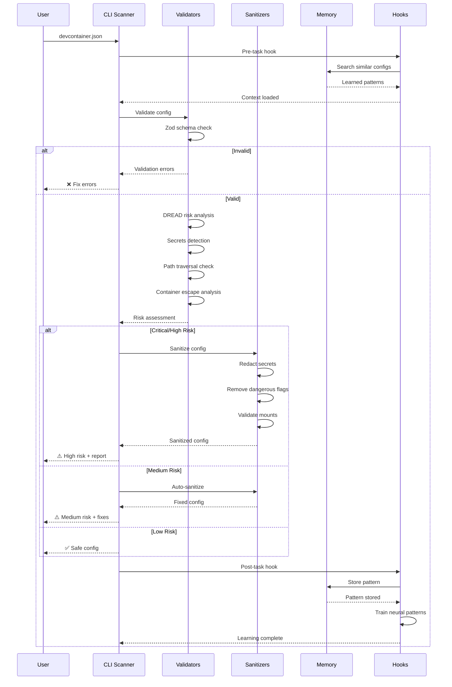
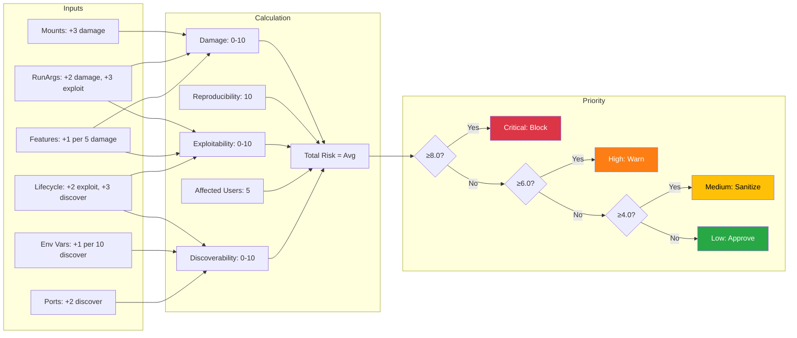
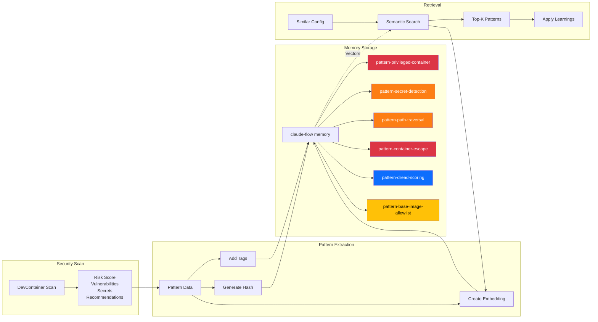
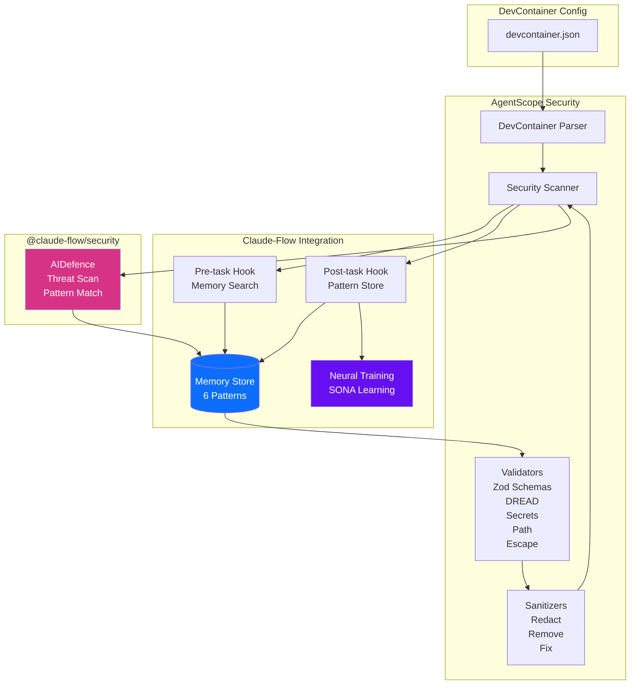

# DevContainer Security Architecture - Visual Diagrams

## 1. Five-Layer Security Architecture

```mermaid
graph TB
    subgraph Input["1. INPUT VALIDATION (Zod Schemas)"]
        A1[Container Name] --> V1[Injection Detection]
        A2[Base Image] --> V2[Allowlist Check]
        A3[Features] --> V3[Blocked Features]
        A4[Environment Vars] --> V4[Secret Detection]
        A5[Ports] --> V5[Range Validation]
        A6[Mounts] --> V6[Path Validation]
        A7[RunArgs] --> V7[Privilege Check]
        A8[Lifecycle Cmds] --> V8[Dangerous Patterns]
    end

    subgraph Risk["2. DREAD RISK ANALYSIS"]
        R1[Damage: 0-10]
        R2[Reproducibility: 10]
        R3[Exploitability: 0-10]
        R4[Affected Users: 5+]
        R5[Discoverability: 0-10]
        R6[Total Risk Score] --> R7{Priority}
        R7 -->|≥8.0| P1[Critical: Block]
        R7 -->|≥6.0| P2[High: Warn]
        R7 -->|≥4.0| P3[Medium: Sanitize]
        R7 -->|<4.0| P4[Low: Approve]
    end

    subgraph Secrets["3. SECRETS DETECTION"]
        S1[12 Patterns] --> S2[OpenAI: sk-]
        S1 --> S3[GitHub: ghp_/gho_]
        S1 --> S4[AWS: AKIA]
        S1 --> S5[Generic API Keys]
        S1 --> S6[Passwords]
        S1 --> S7[Connection Strings]
        S1 --> S8[Private Keys]
        S2 & S3 & S4 & S5 & S6 & S7 & S8 --> S9[Redact: REDACTED]
    end

    subgraph Path["4. PATH TRAVERSAL PREVENTION"]
        PT1[".." Detection] --> PT2{Contains ..?}
        PT2 -->|Yes| PT3[Reject]
        PT2 -->|No| PT4[Resolve Absolute]
        PT4 --> PT5{In Allowed Dir?}
        PT5 -->|No| PT3
        PT5 -->|Yes| PT6{Sensitive Path?}
        PT6 -->|Yes /etc /sys| PT3
        PT6 -->|No| PT7[Approve]
    end

    subgraph Escape["5. CONTAINER ESCAPE ANALYSIS"]
        E1[--privileged] --> EC1[Critical]
        E2[docker.sock mount] --> EC1
        E3[SYS_ADMIN cap] --> EC1
        E4[--pid=host] --> EC2[High]
        E5[--network=host] --> EC2
        E6[--ipc=host] --> EC2
        E7[apparmor=unconfined] --> EC2
        E8[seccomp=unconfined] --> EC2
        E9[/etc /sys /proc mount] --> EC2
        E10[Other capabilities] --> EC3[Medium]
    end

    Input --> Risk
    Risk --> Secrets
    Secrets --> Path
    Path --> Escape

    style Input fill:#e1f5e1
    style Risk fill:#fff3cd
    style Secrets fill:#f8d7da
    style Path fill:#d1ecf1
    style Escape fill:#f8d7da
```

## 2. Security Scanning Workflow



## 3. DREAD Risk Calculation



## 4. Container Escape Attack Surface

```mermaid
graph TB
    subgraph "Container Boundary"
        Container[DevContainer]
    end

    subgraph "Escape Vectors"
        E1[--privileged<br/>Full host access]
        E2[docker.sock mount<br/>Daemon control]
        E3[SYS_ADMIN cap<br/>Admin operations]
        E4[--pid=host<br/>Process inspection]
        E5[--network=host<br/>Network bypass]
        E6[--ipc=host<br/>Shared memory]
        E7[AppArmor disabled<br/>No MAC protection]
        E8[Seccomp disabled<br/>No syscall filter]
    end

    subgraph "Host System"
        Host[Host Kernel]
        Docker[Docker Daemon]
        Files[/etc /sys /proc]
    end

    Container -.->|E1 Critical| Host
    Container -.->|E2 Critical| Docker
    Container -.->|E3 Critical| Host
    Container -.->|E4 High| Host
    Container -.->|E5 High| Host
    Container -.->|E6 High| Host
    Container -.->|E7 High| Host
    Container -.->|E8 High| Host
    Container -.->|Sensitive mounts| Files

    style E1 fill:#dc3545,color:#fff
    style E2 fill:#dc3545,color:#fff
    style E3 fill:#dc3545,color:#fff
    style E4 fill:#fd7e14,color:#fff
    style E5 fill:#fd7e14,color:#fff
    style E6 fill:#fd7e14,color:#fff
    style E7 fill:#fd7e14,color:#fff
    style E8 fill:#fd7e14,color:#fff
```

## 5. Memory Pattern Storage



## 6. Integration Architecture



## Legend

### Risk Levels

- 🔴 **Critical** (≥8.0): Block configuration, manual review required
- 🟠 **High** (≥6.0): Warn user, require explicit approval
- 🟡 **Medium** (≥4.0): Warn and auto-sanitize
- 🟢 **Low** (<4.0): Approve, safe to use

### Color Coding

- **Red** (#dc3545): Critical vulnerabilities
- **Orange** (#fd7e14): High vulnerabilities
- **Yellow** (#ffc107): Medium risk items
- **Green** (#28a745): Safe/approved items
- **Blue** (#0d6efd): Framework/system components
- **Purple** (#6610f2): Learning/AI components

---

## References

- [ADR-011: DevContainer Security](../adr/ADR-011-devcontainer-security.md)
- [Security Summary](../DEVCONTAINER-SECURITY-SUMMARY.md)
- [Security README](DEVCONTAINER-SECURITY-README.md)
- [Source Code: validators.ts](/workspaces/agentscope/src/core/security/devcontainer-validators.ts)
- [Source Code: sanitizers.ts](/workspaces/agentscope/src/core/security/devcontainer-sanitizers.ts)
- [Example: devcontainer-scanning.ts](/workspaces/agentscope/examples/devcontainer-scanning.ts)
