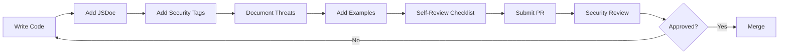
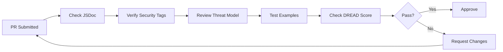

# Security Documentation Index

> **Central hub for all security documentation in AgentScope**

---

## Overview

AgentScope implements defense-in-depth security across multiple layers. This index organizes all security documentation by topic and use case.

---

## Quick Navigation

### 🚀 Getting Started
- [JSDoc Quick Start](./JSDOC-SECURITY-QUICK-START.md) - 5-minute guide to security documentation
- [Common Core JSDoc Standards](./COMMON-CORE-JSDOC-SECURITY.md) - Comprehensive security doc standards

### 🏗️ Architecture
- [ADR-012: Agent Security Architecture](../adr/ADR-012-agent-security-architecture.md) - Agent-focused security design
- [ADR-010: Security Model v1.2](../adr/ADR-010-security-model-v12.md) - Overall security model
- [Security Architecture Diagram](./ARCHITECTURE-DIAGRAM.md) - Visual architecture overview

### 📚 Domain-Specific
- [Agent Security Quick Reference](./agent-security-quick-reference.md) - Agent security patterns
- [Learning-Enhanced Security](./learning-security-quick-reference.md) - AI learning security
- [DevContainer Security](./DEVCONTAINER-SECURITY-README.md) - Container security (separate project scope)

### 📊 Reports & Summaries
- [Security Completion Report](./COMPLETION-REPORT.md) - v1.2 security implementation status
- [Learning Security Summary](./LEARNING-SECURITY-SUMMARY.md) - AI learning security status

---

## By Role

### For Developers

**Implementing Security Features**:
1. Read [JSDoc Quick Start](./JSDOC-SECURITY-QUICK-START.md) (5 min)
2. Review [Common Core JSDoc Standards](./COMMON-CORE-JSDOC-SECURITY.md) (30 min)
3. Study examples in `packages/security/src/`
4. Use security templates from standards doc

**Writing Security Documentation**:
1. Use templates from [JSDoc Quick Start](./JSDOC-SECURITY-QUICK-START.md)
2. Follow patterns in [Common Core JSDoc Standards](./COMMON-CORE-JSDOC-SECURITY.md)
3. Include `@security` tags for all security-sensitive APIs
4. Add threat mitigation notes and examples

### For Security Reviewers

**Reviewing Code**:
1. Check [Security Review Checklist](./COMMON-CORE-JSDOC-SECURITY.md#security-review-checklist)
2. Verify threat models documented
3. Ensure DREAD scores for high-risk APIs
4. Validate secure/insecure examples present

**Auditing Security**:
1. Review [ADR-012 Agent Security](../adr/ADR-012-agent-security-architecture.md)
2. Check [Completion Report](./COMPLETION-REPORT.md)
3. Verify all layers implemented
4. Test threat scenarios

### For Architects

**Designing Security**:
1. Study [ADR-012 Agent Security Architecture](../adr/ADR-012-agent-security-architecture.md)
2. Review [Security Model v1.2](../adr/ADR-010-security-model-v12.md)
3. Understand threat models per package
4. Design with defense-in-depth

**Making Decisions**:
1. Document in ADR format (see ADR-012 example)
2. Include STRIDE/DREAD analysis
3. Link to OWASP references
4. Update security index

---

## By Package

### packages/security

**Purpose**: Zero-dependency input validation and sanitization

**Key Documents**:
- [Common Core JSDoc Standards](./COMMON-CORE-JSDOC-SECURITY.md#packagessecurity-examples) - Documentation standards
- [InputValidator Source](../../packages/security/src/validators/InputValidator.ts) - Input validation
- [PathValidator Source](../../packages/security/src/validators/PathValidator.ts) - Path validation
- [SafeExecutor Source](../../packages/security/src/validators/SafeExecutor.ts) - Command safety
- [SecretsSanitizer Source](../../packages/security/src/sanitizers/SecretsSanitizer.ts) - Secret detection

**Threat Model**:
- Command injection → SafeExecutor
- Path traversal → PathValidator
- Secret exposure → SecretsSanitizer
- Injection attacks → InputValidator
- DoS via input → InputValidator limits

### packages/errors

**Purpose**: Structured error handling with information disclosure prevention

**Key Documents**:
- [Common Core JSDoc Standards](./COMMON-CORE-JSDOC-SECURITY.md#packageserrors-examples) - Error documentation standards
- [ErrorSerializer Source](../../packages/errors/src/serializer/error-serializer.ts) - Error sanitization
- [ErrorHandler Source](../../packages/errors/src/handler/error-handler.ts) - Safe error handling
- [BaseError Source](../../packages/errors/src/base/base-error.ts) - Error base class

**Threat Model**:
- Information disclosure → ErrorSerializer
- Sensitive data leakage → Redaction
- Log injection → Message sanitization
- Error oracle attacks → Response normalization

### packages/types

**Purpose**: Type-safe contracts with security annotations

**Key Documents**:
- [Common Core JSDoc Standards](./COMMON-CORE-JSDOC-SECURITY.md#packagestypes-examples) - Type documentation standards
- [Security Types](../../packages/types/src/security/security.ts) - Security type definitions
- [Result Types](../../packages/types/src/common/result.ts) - Result handling types

**Threat Model**:
- Type confusion → Branded types
- Missing validation → Documented requirements
- Privilege escalation → AgentSecurityContext

---

## By Threat Category

### Command Injection

**Affected APIs**:
- `SafeExecutor.validate()` - Command validation
- `SafeExecutor.escapeShellArg()` - Argument escaping
- `SafeExecutor.buildCommand()` - Safe command construction

**Documentation**:
- [SafeExecutor Source](../../packages/security/src/validators/SafeExecutor.ts)
- [Command Execution Template](./COMMON-CORE-JSDOC-SECURITY.md#template-3-security-sensitive-api)

**Mitigation Strategy**:
1. Allowlist safe commands
2. Blocklist dangerous commands
3. Detect injection patterns
4. Escape all arguments

### Path Traversal

**Affected APIs**:
- `PathValidator.validate()` - Path validation
- `PathValidator.isSafe()` - Safety check
- `PathValidator.sanitize()` - Path sanitization

**Documentation**:
- [PathValidator Source](../../packages/security/src/validators/PathValidator.ts)
- [Path Validation Template](./COMMON-CORE-JSDOC-SECURITY.md#inputvalidator-with-security-documentation)

**Mitigation Strategy**:
1. Block traversal patterns (`..`, `~`)
2. Normalize to absolute paths
3. Verify within allowed directories
4. Limit path depth

### Secret Exposure

**Affected APIs**:
- `SecretsSanitizer.detect()` - Secret detection
- `SecretsSanitizer.redact()` - Secret redaction
- `SecretsSanitizer.redactContent()` - Content sanitization

**Documentation**:
- [SecretsSanitizer Source](../../packages/security/src/sanitizers/SecretsSanitizer.ts)
- [Secret Detection Examples](./COMMON-CORE-JSDOC-SECURITY.md#sanitization-documentation-patterns)

**Detection Methods**:
1. Regex patterns (API keys, tokens)
2. Entropy analysis (high-entropy strings)
3. False positive filtering
4. Context-aware detection

### Information Disclosure

**Affected APIs**:
- `ErrorSerializer.serialize()` - Error sanitization
- `ErrorSerializer.sanitizeStackTrace()` - Stack trace cleaning
- `BaseError.toJSON()` - Safe serialization

**Documentation**:
- [ErrorSerializer Source](../../packages/errors/src/serializer/error-serializer.ts)
- [Error Handling Template](./COMMON-CORE-JSDOC-SECURITY.md#error-handling-security-documentation)

**Prevention Strategy**:
1. Remove stack traces from client errors
2. Redact sensitive values
3. Normalize error messages
4. Log full errors securely

---

## By Implementation Status

### ✅ Completed (v1.2)

- **Input Validation**: `InputValidator` with Zod-style API
- **Path Validation**: `PathValidator` with traversal prevention
- **Command Safety**: `SafeExecutor` with injection protection
- **Secret Detection**: `SecretsSanitizer` with entropy analysis
- **Error Handling**: `ErrorSerializer` with info disclosure prevention
- **Type Safety**: Security types with branded IDs
- **Documentation**: JSDoc standards and templates

### 🚧 In Progress

- **Agent Security**: Implementing ADR-012 recommendations
- **Learning Security**: AI model security enhancements
- **MCP Security**: Server and tool validation
- **Hook Security**: Pre/post hook validation

### 📋 Planned

- **Rate Limiting**: DoS prevention middleware
- **Audit Logging**: Security event logging
- **Policy Engine**: Claims-based authorization
- **Compliance**: SOC2, GDPR compliance tools

---

## Security Workflow

### Development Workflow

### Security Review Workflow

---

## DREAD Scoring Guide

Use DREAD methodology for risk assessment:

| Score | Damage | Reproducibility | Exploitability | Affected Users | Discoverability |
|-------|--------|----------------|----------------|----------------|-----------------|
| **10** | Complete system compromise | Always reproducible | Trivial, no auth needed | All users affected | Obvious, publicly known |
| **8** | Partial data compromise | Consistently reproducible | Easy, basic auth needed | Most users affected | Easy to discover |
| **5** | Minor data exposure | Intermittent | Moderate skill required | Some users affected | Requires effort |
| **3** | Limited impact | Difficult to reproduce | Advanced skill required | Few users affected | Very difficult |
| **0** | No damage | Cannot reproduce | Impossible | No users affected | Impossible |

**Risk Levels**:
- **Critical**: 9.0-10.0
- **High**: 7.0-8.9
- **Medium**: 4.0-6.9
- **Low**: 0-3.9

**Example**: Command Injection in SafeExecutor
- Damage: 10/10 (RCE)
- Reproducibility: 10/10 (deterministic)
- Exploitability: 8/10 (requires API access)
- Affected Users: 10/10 (all command execution)
- Discoverability: 8/10 (public API)
- **Total**: 9.2/10 → **Critical**

---

## Resources

### Internal
- [ADR Index](../adr/ADR-INDEX.md) - All architectural decisions
- [Architecture Diagrams](../architecture/) - System architecture
- [v1.2 Summary](../v1.2-SUMMARY.md) - Version 1.2 overview

### External
- [OWASP Top 10](https://owasp.org/www-project-top-ten/)
- [OWASP Cheat Sheets](https://cheatsheetseries.owasp.org/)
- [CWE Database](https://cwe.mitre.org/)
- [NIST Cybersecurity Framework](https://www.nist.gov/cyberframework)
- [STRIDE Threat Modeling](https://learn.microsoft.com/en-us/azure/security/develop/threat-modeling-tool-threats)

---

## Contributing

### Adding Security Documentation

1. **Choose appropriate template** from [JSDoc Standards](./COMMON-CORE-JSDOC-SECURITY.md)
2. **Include all required sections**: threat model, mitigation, examples
3. **Add DREAD score** for high-risk APIs
4. **Link to relevant ADRs** and external references
5. **Update this index** if adding new security domains

### Updating Security Architecture

1. **Create ADR** following ADR-012 format
2. **Include STRIDE analysis** for threat modeling
3. **Document DREAD scores** for identified threats
4. **Update threat models** in package docs
5. **Add to this index** under relevant sections

---

## Version History

- **v1.0.0** (2026-01-26): Initial security documentation index
  - Common core JSDoc standards
  - Quick start guide
  - Threat models by package
  - Security review checklist

---

**Document Owner**: Security Architecture Team
**Next Review**: 2026-04-26 (Quarterly)
**Related Documents**: ADR-012, ADR-010, CLAUDE.md
