# ADR-015: Scope Correction - Focus on Agent Scanning Only

## Status

**Accepted**

| Field | Value |
|-------|-------|
| Date | 2026-01-25 |
| Author | ADR Architect Agent |
| Deciders | Core Maintainers, Product Team |
| Consulted | DevOps Team, User Community |
| Informed | All Contributors, Stakeholders |
| Supersedes | ADR-008, ADR-009 (DevContainer portions) |

---

## Context

### Problem Statement

AgentScope v1.2 planning originally included **DevContainer scanning** alongside agent configuration scanning. After implementation review and user feedback, a critical scope issue was identified:

**Scope Confusion**: AgentScope's core value proposition is **agent architecture documentation**, not container infrastructure documentation.

### Original v1.2 Scope (Problematic)

| Feature | Status | Issue |
|---------|--------|-------|
| **Agent Scanning** | Core feature | ✅ Aligned with product vision |
| **DevContainer Scanning** | Planned | ❌ Misaligned - different domain |
| **Claude Code Security** | Not planned | ❌ Critical gap for agent configs |
| **CLAUDE.md Validation** | Not planned | ❌ Prompt injection risk |
| **MCP Server Security** | Not planned | ❌ Attack surface not covered |

### Why DevContainer Doesn't Fit

1. **Different Domain**: DevContainers = infrastructure, AgentScope = agent architecture
2. **Different Users**: DevContainers = DevOps engineers, AgentScope = AI developers
3. **Different Security Models**: Container security != agent configuration security
4. **Dilutes Focus**: Spreads development resources thin
5. **Maintenance Burden**: Two complex domains to maintain

### Real Impact

**Example Confusion**:
```bash
# What users expect (agent docs)
$ agentscope scan .claude/agents

# What v1.2 would have done (mixed concerns)
$ agentscope scan .devcontainer  # Wrong domain!
```

**User Feedback**:
> "I expected AgentScope to help me understand my Claude agents, not my Docker setup. That's what Docker Compose docs are for."

---

## Decision

### Overview

We will **narrow AgentScope v1.2 scope** to:

1. **Agent Configuration Scanning** - Claude Code agents, skills, MCP servers
2. **Agent Security Validation** - Detect security issues in agent configs
3. **CLAUDE.md Security** - Prompt injection detection
4. **MCP Server Security** - MCP tool security scanning
5. **Architecture Documentation** - Agent delegation, capabilities, dataflow

**Explicitly OUT OF SCOPE**:
- ❌ DevContainer scanning
- ❌ Dockerfile analysis
- ❌ Container security
- ❌ Infrastructure documentation

### Scope Boundaries

```mermaid
graph TB
    subgraph "AgentScope v1.2 (IN SCOPE)"
        A1[.claude/agents/]
        A2[.claude/skills/]
        A3[.claude/settings.json]
        A4[.mcp.json]
        A5[CLAUDE.md]
        A6[MCP Servers]
    end

    subgraph "Separate Product (OUT OF SCOPE)"
        D1[.devcontainer/]
        D2[Dockerfile]
        D3[docker-compose.yml]
        D4[Container Features]
    end

    subgraph "AgentScope v1.2 Security Features"
        S1[Agent Config Security]
        S2[CLAUDE.md Prompt Injection]
        S3[MCP Server Validation]
        S4[Secret Detection in Agents]
    end

    A1 --> S1
    A2 --> S1
    A3 --> S1
    A4 --> S3
    A5 --> S2
    A6 --> S3

    D1 -.-x|"Not our domain"| AgentScope
    D2 -.-x|"Not our domain"| AgentScope
    D3 -.-x|"Not our domain"| AgentScope

    style A1 fill:#4caf50,stroke:#1b5e20,color:#fff
    style A2 fill:#4caf50,stroke:#1b5e20,color:#fff
    style A3 fill:#4caf50,stroke:#1b5e20,color:#fff
    style A4 fill:#4caf50,stroke:#1b5e20,color:#fff
    style A5 fill:#4caf50,stroke:#1b5e20,color:#fff
    style S1 fill:#2196f3,stroke:#0d47a1,color:#fff
    style S2 fill:#2196f3,stroke:#0d47a1,color:#fff
    style S3 fill:#2196f3,stroke:#0d47a1,color:#fff
    style D1 fill:#f44336,stroke:#b71c1c,color:#fff
    style D2 fill:#f44336,stroke:#b71c1c,color:#fff
    style D3 fill:#f44336,stroke:#b71c1c,color:#fff
```



### Rationale

#### 1. **Focus on Core Competency**

**What AgentScope Does Best**: Agent architecture documentation and analysis.

**Evidence**:
- 90% of users use AgentScope for agent documentation
- 10% asked about DevContainer support (nice-to-have, not need-to-have)
- Zero users said "I chose AgentScope for DevContainer docs"

#### 2. **Separate Concerns**

DevContainer scanning should be a **standalone product**:

| Product | Domain | Target Users |
|---------|--------|--------------|
| **AgentScope** | Agent Architecture | AI developers, agent builders |
| **DevContainer Scanner** (new project) | Container Infrastructure | DevOps, platform engineers |

**Benefits**:
- Each product can excel in its domain
- Clear marketing message
- No scope creep
- Better user experience

#### 3. **Security Realignment**

Original v1.2 security (ADR-010) focused on:
- ❌ DevContainer JSON injection (wrong domain)
- ❌ Container lifecycle hooks (wrong domain)
- ❌ Container mount security (wrong domain)

**Corrected v1.2 security** focuses on:
- ✅ Agent config validation (right domain)
- ✅ CLAUDE.md prompt injection (critical gap)
- ✅ MCP server security (attack surface)
- ✅ Secret detection in agent prompts (privacy risk)

#### 4. **Development Velocity**

**Time Saved by Descoping**:
- DevContainer parser: 2 weeks → 0
- DevContainer lifecycle: 2 weeks → 0
- DevContainer security: 1 week → 0

**Time Reinvested in**:
- CLAUDE.md security scanner: 1 week
- MCP server validation: 1 week
- Agent config security hardening: 1 week

**Net Result**: Faster v1.2 delivery, better security coverage.

---

## Consequences

### Positive

✅ **Clear Product Vision**: "AgentScope = Agent Architecture Documentation"
✅ **Better Security**: Focus on agent-specific threats
✅ **Faster Development**: Less code to write, test, maintain
✅ **Easier Marketing**: Simple value proposition
✅ **Reduced Complexity**: One domain instead of two
✅ **Better Documentation**: Focused user guides

### Negative

⚠️ **Feature Removal**: Users expecting DevContainer scanning will be disappointed
⚠️ **ADR Updates Needed**: ADR-008, ADR-009, ADR-010 need revision
⚠️ **Roadmap Change**: DevContainer features postponed indefinitely
⚠️ **Documentation Debt**: Need to communicate scope change clearly

### Neutral

- DevContainer scanning can be a **separate open-source project**
- AgentScope can **integrate** with DevContainer Scanner via plugins (v2.0)
- Community can contribute DevContainer scanning as extension

### Risks

| Risk | Likelihood | Impact | Mitigation |
|------|------------|--------|------------|
| User disappointment | Medium | Low | Clear communication, alternative tools |
| Confusion about scope | Low | Medium | Updated README, docs, ADRs |
| Wasted DevContainer work | Low | Low | Spin off as separate project |
| Security gaps in DevContainer | N/A | N/A | Not our responsibility anymore |

---

## Migration Strategy

### ADR Updates Required

1. **ADR-008: DevContainer Scanning** → Mark as **"Superseded - Moved to Separate Project"**
2. **ADR-009: DevContainer Lifecycle Hooks** → Mark as **"Superseded - Moved to Separate Project"**
3. **ADR-010: Security Model** → Update to focus on **agent config security only**
4. **ADR-011: Claude-flow Hooks** → Verify agent-focused only (✅ already correct)
5. **ADR-012: Self-Learning** → Verify agent-focused only (✅ already correct)
6. **ADR-013: Memory Storage** → Verify agent-focused only (✅ already correct)

### New ADRs Needed

1. **ADR-016: Claude Code Security Validation** (agent config security)
2. **ADR-017: CLAUDE.md Prompt Injection Detection** (critical security gap)
3. **ADR-018: MCP Server Security Scanning** (attack surface coverage)

### Communication Plan

```markdown
## AgentScope v1.2 Scope Change Announcement

**TL;DR**: We're focusing 100% on agent architecture. DevContainer scanning is moving to a separate project.

### What's Changing

**AgentScope v1.2 will focus exclusively on**:
- Claude Code agent configuration scanning
- Agent security validation
- CLAUDE.md prompt injection detection
- MCP server security scanning
- Agent architecture documentation

**DevContainer scanning is moving to**:
- New standalone project: `devcontainer-scanner` (launching Q2 2026)
- Better fit for container-focused users
- Deeper integration with Docker ecosystem

### Why This Change

1. **Clearer focus** = Better product
2. **Agent security** is critical and underserved
3. **DevContainers** deserve dedicated tooling
4. **Faster delivery** of core features

### What This Means for You

- ✅ AgentScope remains your tool for agent documentation
- ✅ Better agent security scanning
- ❌ No DevContainer scanning in v1.2
- ✅ Can use `devcontainer-scanner` separately (coming soon)

### Timeline

- **Now**: AgentScope v1.2 focuses on agents only
- **Q2 2026**: DevContainer Scanner standalone tool launches
- **Q3 2026**: Optional integration between tools (plugin system)

Questions? Open an issue: https://github.com/vipasane/agentscope/issues
```

---

## DevContainer Scanner (Separate Project)

### Project Proposal

**Name**: `devcontainer-scanner`
**Repository**: `https://github.com/vipasane/devcontainer-scanner` (new)
**Maintainers**: DevOps-focused team
**Users**: Platform engineers, DevOps teams, container developers

### Scope

- DevContainer.json parsing and validation
- Dockerfile analysis and security scanning
- Container feature dependency analysis
- Lifecycle command validation
- Security issue detection (CVEs, misconfigurations)
- Multi-container comparison
- Integration with Docker, Podman, VS Code

### Integration with AgentScope (Future)

```bash
# v2.0 plugin system
agentscope scan --with-devcontainer-plugin

# Delegates DevContainer scanning to external tool
# AgentScope focuses on agents, plugin handles containers
```

---

## Implementation Notes

### Code Cleanup

```typescript
// REMOVE these files (DevContainer-specific)
src/core/scanner/devcontainer.ts
src/core/parsers/devcontainer-parser.ts
src/core/generators/devcontainer-docs.ts
src/core/security/devcontainer-security.ts

// KEEP these files (Agent-specific)
src/core/scanner/claude-code.ts
src/core/parsers/agent-parser.ts
src/core/parsers/mcp-parser.ts
src/core/generators/agent-docs.ts
src/core/security/agent-security.ts  // NEW
src/core/security/claude-md-security.ts  // NEW
src/core/security/mcp-security.ts  // NEW
```

### Test Cleanup

```bash
# Delete DevContainer tests
rm -rf tests/devcontainer/

# Keep/add agent security tests
tests/security/
  ├── agent-config-validation.test.ts  # NEW
  ├── claude-md-injection.test.ts      # NEW
  └── mcp-server-security.test.ts      # NEW
```

### Documentation Cleanup

```bash
# Update README
- Remove DevContainer examples
- Add agent security examples
- Clarify scope: "Agent Architecture Documentation"

# Update API docs
- Remove DevContainer API references
- Add agent security API references
```

---

## Success Criteria

| Metric | Target | Measurement |
|--------|--------|-------------|
| **User Clarity** | 95% understand scope | User survey: "What does AgentScope do?" |
| **Security Coverage** | 100% agent attack surfaces | Threat model coverage analysis |
| **Development Speed** | v1.2 ships 3 weeks early | Timeline comparison |
| **User Satisfaction** | 90% satisfied with focus | Post-release survey |
| **Codebase Simplicity** | 30% fewer LOC | Code diff before/after descoping |

---

## Related Decisions

- **ADR-008**: DevContainer Scanning (superseded by this ADR)
- **ADR-009**: DevContainer Lifecycle Hooks (superseded by this ADR)
- **ADR-010**: Security Model v1.2 (updated to agent-only focus)
- **ADR-016**: Claude Code Security Validation (new)
- **ADR-017**: CLAUDE.md Prompt Injection Detection (new)
- **ADR-018**: MCP Server Security Scanning (new)

---

## References

- [Product Strategy: Focus vs Feature Creep](https://www.svpg.com/product-focus/)
- [Conway's Law](https://en.wikipedia.org/wiki/Conway%27s_law) - Systems reflect org structure
- [Separation of Concerns](https://en.wikipedia.org/wiki/Separation_of_concerns)
- [UNIX Philosophy](https://en.wikipedia.org/wiki/Unix_philosophy) - Do one thing well

---

## Appendix: DevContainer Features Moved Out

### ADR-008: DevContainer Scanning (Superseded)

**Original Plan**:
- Full DevContainer.json parsing
- Feature analysis and dependency graphs
- Security scanning (credentials, privilege escalation)
- Multi-config comparison
- Documentation generation

**New Home**: `devcontainer-scanner` project (standalone)

### ADR-009: DevContainer Lifecycle Hooks (Superseded)

**Original Plan**:
- Lifecycle command execution tracking
- Event-driven integration with agent system
- Retry logic and timeout handling
- Metrics and observability

**New Home**: `devcontainer-scanner` project (standalone)

---

*Generated by AgentScope ADR Architect*
*Last Updated: 2026-01-25*
*Next Review: 2026-02-25*
