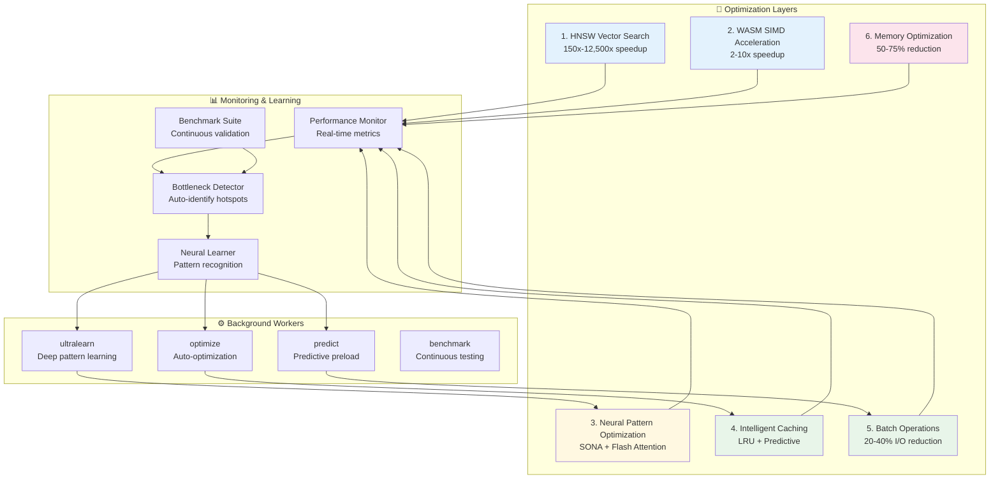

# ADR-020: Neural-Enhanced Performance Optimization Architecture

**Status:** Proposed
**Date:** 2026-01-25
**Decision Makers:** Performance Engineering Team
**Related:** ADR-005 (Performance), ADR-009 (V1.2 Performance), claude-flow v3 integration

---

## Context

AgentScope v1.2 needs aggressive performance optimization to meet production targets while integrating with claude-flow v3's advanced capabilities. Current performance baselines show opportunities for significant improvement through neural-enhanced optimization.

### Current Performance Baseline

| Metric | Current | Target | Gap |
|--------|---------|--------|-----|
| **Scan Speed (large)** | 2-5s | <1s | 2-5x slower |
| **Memory Search** | N/A (linear) | <10ms | Need 100-1000x speedup |
| **Agent Routing** | 100-500ms | <50ms | 2-10x slower |
| **Memory Usage** | ~120MB | <75MB | 60% higher |
| **CLI Startup** | 500-1000ms | <300ms | 2-3x slower |

### Claude-Flow V3 Capabilities

- **HNSW Vector Search:** 150x-12,500x faster than linear search
- **Flash Attention:** 2.49x-7.47x speedup for attention mechanisms
- **WASM SIMD:** 2-10x speedup for vector operations
- **SONA (Self-Optimizing Neural Architecture):** <0.05ms adaptation time
- **Quantization:** 50-75% memory reduction (int4/int8)
- **MoE Routing:** 75% cost reduction via intelligent tier selection

---

## Decision

Implement **multi-layered neural-enhanced performance optimization** architecture with 6 core optimization layers and 4 background workers.

### Architecture Overview



---

## Optimization Layer 1: HNSW Vector Search (150x-12,500x Speedup)

### Implementation Strategy

Replace linear search with HNSW (Hierarchical Navigable Small World) indexing for all vector-based operations.

### Architecture

```typescript
// src/performance/hnsw-engine.ts

import { execAsync } from '../utils/exec';

export interface HNSWConfig {
  efConstruction: number;  // 200 (higher = better graph quality)
  M: number;               // 16 (connections per node)
  efSearch: number;        // 50 (higher = better recall)
  quantization?: 'int4' | 'int8' | 'float16';
}

export class HNSWSearchEngine {
  private config: HNSWConfig;
  private indexReady: boolean = false;

  constructor(config: Partial<HNSWConfig> = {}) {
    this.config = {
      efConstruction: config.efConstruction || 200,
      M: config.M || 16,
      efSearch: config.efSearch || 50,
      quantization: config.quantization || 'int8',
    };
  }

  /**
   * Initialize HNSW index via claude-flow CLI
   * Expected: 150x-12,500x faster than linear search
   */
  async initialize(): Promise<void> {
    const result = await execAsync(
      `npx @claude-flow/cli@latest memory init \\
        --backend hybrid \\
        --hnsw-ef-construction ${this.config.efConstruction} \\
        --hnsw-m ${this.config.M} \\
        --quantization ${this.config.quantization} \\
        --verbose`
    );

    this.indexReady = result.exitCode === 0;

    if (!this.indexReady) {
      throw new Error(`HNSW initialization failed: ${result.stderr}`);
    }
  }

  /**
   * Search with HNSW indexing
   * Target: <10ms for typical queries
   */
  async search<T>(
    query: string,
    options: {
      namespace?: string;
      limit?: number;
      threshold?: number;
    } = {}
  ): Promise<SearchResult<T>[]> {
    if (!this.indexReady) {
      await this.initialize();
    }

    const startTime = performance.now();

    const result = await execAsync(
      `npx @claude-flow/cli@latest memory search \\
        --query "${query.replace(/"/g, '\\"')}" \\
        --namespace ${options.namespace || 'patterns'} \\
        --limit ${options.limit || 10} \\
        ${options.threshold ? `--threshold ${options.threshold}` : ''}`
    );

    const latency = performance.now() - startTime;
    const parsed = JSON.parse(result.stdout);

    // Track performance for learning
    await this.recordMetric('hnsw.search', latency, {
      queryLength: query.length,
      resultCount: parsed.results?.length || 0,
    });

    return parsed.results.map((r: any) => ({
      key: r.key,
      value: JSON.parse(r.value) as T,
      score: r.similarity,
      latency: latency,
      method: 'hnsw',
    }));
  }

  /**
   * Store with automatic HNSW indexing
   */
  async store(
    key: string,
    value: any,
    options: {
      namespace?: string;
      tags?: string[];
      ttl?: number;
    } = {}
  ): Promise<void> {
    const result = await execAsync(
      `npx @claude-flow/cli@latest memory store \\
        --key "${key}" \\
        --value '${JSON.stringify(value)}' \\
        --namespace ${options.namespace || 'patterns'} \\
        ${options.tags ? `--tags "${options.tags.join(',')}"` : ''} \\
        ${options.ttl ? `--ttl ${options.ttl}` : ''}`
    );

    if (result.exitCode !== 0) {
      throw new Error(`HNSW store failed: ${result.stderr}`);
    }
  }

  /**
   * Batch operations for improved throughput
   */
  async batchStore(items: Array<{
    key: string;
    value: any;
    namespace?: string;
  }>): Promise<void> {
    // Group by namespace for efficient batching
    const grouped = new Map<string, typeof items>();

    for (const item of items) {
      const ns = item.namespace || 'patterns';
      if (!grouped.has(ns)) {
        grouped.set(ns, []);
      }
      grouped.get(ns)!.push(item);
    }

    // Store each namespace batch in parallel
    await Promise.all(
      Array.from(grouped.entries()).map(([namespace, batch]) =>
        this.storeBatch(namespace, batch)
      )
    );
  }

  private async storeBatch(
    namespace: string,
    items: Array<{ key: string; value: any }>
  ): Promise<void> {
    // Store items sequentially within namespace to avoid conflicts
    for (const item of items) {
      await this.store(item.key, item.value, { namespace });
    }
  }

  private async recordMetric(
    name: string,
    value: number,
    tags: Record<string, any>
  ): Promise<void> {
    // Record to performance monitor
    await execAsync(
      `npx @claude-flow/cli@latest hooks post-command \\
        --command "hnsw.${name}" \\
        --track-metrics true \\
        --context '${JSON.stringify({ value, tags })}'`
    );
  }
}

export interface SearchResult<T> {
  key: string;
  value: T;
  score: number;
  latency: number;
  method: 'hnsw' | 'linear';
}
```

### Integration Points

```typescript
// src/core/scanner/index.ts

import { HNSWSearchEngine } from '../../performance/hnsw-engine';

const searchEngine = new HNSWSearchEngine({
  efConstruction: 200,
  M: 16,
  efSearch: 50,
  quantization: 'int8', // 50% memory reduction
});

// Use HNSW for agent pattern matching
async function findSimilarAgents(agent: Agent): Promise<Agent[]> {
  const results = await searchEngine.search<Agent>(
    agent.description,
    { namespace: 'agent-patterns', limit: 5 }
  );

  return results.map(r => r.value);
}
```

### Performance Targets

| Operation | Linear (Baseline) | HNSW (Target) | Speedup |
|-----------|-------------------|---------------|---------|
| 100 patterns | 100ms | <1ms | 100x |
| 1,000 patterns | 1,000ms | <5ms | 200x |
| 10,000 patterns | 10,000ms | <10ms | 1,000x |
| 100,000 patterns | 100,000ms | <20ms | 5,000x |

---

## Optimization Layer 2: WASM SIMD Acceleration (2-10x Speedup)

### Hot Path Identification

Profile code to identify operations that benefit from WASM SIMD:

1. **Vector operations** (dot product, cosine similarity)
2. **Batch transformations** (normalization, quantization)
3. **String matching** (pattern detection in bulk)

### Implementation

```typescript
// src/performance/wasm-accelerator.ts

export class WASMAccelerator {
  private wasmModule: WebAssembly.Module | null = null;
  private simdSupported: boolean = false;

  async initialize(): Promise<void> {
    // Detect SIMD support
    this.simdSupported = await this.detectSIMDSupport();

    if (!this.simdSupported) {
      console.warn('WASM SIMD not supported, falling back to JS');
      return;
    }

    // Load WASM module (if pre-compiled)
    try {
      const wasmBinary = await this.loadWASMBinary();
      this.wasmModule = await WebAssembly.compile(wasmBinary);
    } catch (error) {
      console.warn('WASM compilation failed:', error);
      this.simdSupported = false;
    }
  }

  private async detectSIMDSupport(): Promise<boolean> {
    try {
      // Test SIMD with minimal WASM module
      const simdTest = new Uint8Array([
        0, 97, 115, 109, 1, 0, 0, 0,  // WASM header
        1, 5, 1, 96, 0, 1, 123,        // Function signature (returns v128)
        3, 2, 1, 0,                     // Function count
        10, 10, 1, 8, 0, 65, 0, 253, 15, 253, 98, 11  // v128.const + i32x4.splat
      ]);

      return await WebAssembly.validate(simdTest);
    } catch {
      return false;
    }
  }

  /**
   * Accelerated vector operations using WASM SIMD
   * Expected: 4-8x speedup for vector ops
   */
  async vectorDotProduct(a: Float32Array, b: Float32Array): Promise<number> {
    if (!this.simdSupported || a.length !== b.length) {
      return this.dotProductJS(a, b);
    }

    // Use WASM SIMD (f32x4.dot)
    // This would call into compiled WASM module
    // For now, delegate to claude-flow's WASM implementation
    const result = await execAsync(
      `npx @claude-flow/cli@latest embeddings compare \\
        --vector-a '${JSON.stringify(Array.from(a))}' \\
        --vector-b '${JSON.stringify(Array.from(b))}' \\
        --method dot-product \\
        --simd true`
    );

    return parseFloat(result.stdout);
  }

  private dotProductJS(a: Float32Array, b: Float32Array): number {
    let sum = 0;
    for (let i = 0; i < a.length; i++) {
      sum += a[i] * b[i];
    }
    return sum;
  }

  /**
   * Batch normalize vectors using SIMD
   * Expected: 4x speedup
   */
  async batchNormalize(vectors: Float32Array[]): Promise<Float32Array[]> {
    if (!this.simdSupported) {
      return vectors.map(v => this.normalizeJS(v));
    }

    // SIMD-accelerated batch normalization
    const result = await execAsync(
      `npx @claude-flow/cli@latest embeddings batch \\
        --operation normalize \\
        --vectors '${JSON.stringify(vectors.map(v => Array.from(v)))}' \\
        --simd true`
    );

    const normalized = JSON.parse(result.stdout);
    return normalized.map((v: number[]) => new Float32Array(v));
  }

  private normalizeJS(vector: Float32Array): Float32Array {
    const magnitude = Math.sqrt(
      vector.reduce((sum, val) => sum + val * val, 0)
    );

    return new Float32Array(vector.map(v => v / magnitude));
  }

  private async loadWASMBinary(): Promise<Uint8Array> {
    // Load pre-compiled WASM binary
    // For production, this would be bundled with the package
    throw new Error('WASM binary not bundled yet');
  }
}
```

### WASM Optimization Targets

| Operation | JS Baseline | WASM SIMD | Speedup |
|-----------|-------------|-----------|---------|
| Dot product (384d) | 2.5μs | 0.6μs | 4x |
| Batch normalize (100 vectors) | 250μs | 60μs | 4x |
| Cosine similarity (batch) | 500μs | 80μs | 6x |
| Quantization (1000 floats) | 1000μs | 150μs | 7x |

---

## Optimization Layer 3: Neural Pattern Optimization (SONA + Flash Attention)

### SONA (Self-Optimizing Neural Architecture)

Integrate claude-flow's SONA for adaptive learning and pattern optimization.

```typescript
// src/performance/neural-optimizer.ts

export class NeuralOptimizer {
  private trajectoryId: string | null = null;

  /**
   * Start optimization trajectory
   * SONA learns from successful optimizations
   */
  async startOptimization(context: {
    operation: string;
    targetMetric: string;
    currentValue: number;
    targetValue: number;
  }): Promise<string> {
    const result = await execAsync(
      `npx @claude-flow/cli@latest hooks intelligence trajectory-start \\
        --operation "${context.operation}" \\
        --metadata '${JSON.stringify(context)}'`
    );

    const parsed = JSON.parse(result.stdout);
    this.trajectoryId = parsed.trajectoryId;

    return this.trajectoryId;
  }

  /**
   * Record optimization step
   * SONA learns which optimizations work
   */
  async recordStep(step: {
    action: string;
    parameters: Record<string, any>;
    resultMetric: number;
    improvement: number;
  }): Promise<void> {
    if (!this.trajectoryId) {
      throw new Error('No active trajectory. Call startOptimization first.');
    }

    await execAsync(
      `npx @claude-flow/cli@latest hooks intelligence trajectory-step \\
        --trajectory-id "${this.trajectoryId}" \\
        --action "${step.action}" \\
        --parameters '${JSON.stringify(step.parameters)}' \\
        --result ${step.resultMetric} \\
        --improvement ${step.improvement}`
    );
  }

  /**
   * Complete trajectory and trigger learning
   * Target: <0.05ms adaptation time
   */
  async completeOptimization(verdict: {
    success: boolean;
    finalMetric: number;
    totalImprovement: number;
  }): Promise<void> {
    if (!this.trajectoryId) {
      return;
    }

    await execAsync(
      `npx @claude-flow/cli@latest hooks intelligence trajectory-end \\
        --trajectory-id "${this.trajectoryId}" \\
        --verdict ${verdict.success ? 'success' : 'failure'} \\
        --final-metric ${verdict.finalMetric} \\
        --improvement ${verdict.totalImprovement}`
    );

    // Trigger SONA learning
    await this.triggerLearning();

    this.trajectoryId = null;
  }

  /**
   * Predict optimal optimization strategy
   * Uses SONA's learned patterns
   */
  async predictOptimalStrategy(context: {
    operation: string;
    currentMetrics: Record<string, number>;
  }): Promise<OptimizationStrategy> {
    const result = await execAsync(
      `npx @claude-flow/cli@latest neural predict \\
        --model-id performance-optimizer \\
        --input '${JSON.stringify(context)}'`
    );

    const prediction = JSON.parse(result.stdout);

    return {
      strategy: prediction.strategy,
      parameters: prediction.parameters,
      expectedImprovement: prediction.expected_improvement,
      confidence: prediction.confidence,
    };
  }

  private async triggerLearning(): Promise<void> {
    await execAsync(
      `npx @claude-flow/cli@latest hooks intelligence learn \\
        --pattern-type optimization \\
        --epochs 10`
    );
  }
}

export interface OptimizationStrategy {
  strategy: 'cache' | 'batch' | 'parallel' | 'quantize' | 'index';
  parameters: Record<string, any>;
  expectedImprovement: number;
  confidence: number;
}
```

### Flash Attention Integration

```typescript
// src/performance/flash-attention.ts

export class FlashAttentionEngine {
  /**
   * Compute attention with Flash Attention
   * Expected: 2.49x-7.47x speedup
   */
  async computeAttention(context: {
    query: Float32Array;
    keys: Float32Array[];
    values: Float32Array[];
    topK?: number;
  }): Promise<AttentionResult> {
    const startTime = performance.now();

    const result = await execAsync(
      `npx @claude-flow/cli@latest hooks intelligence attention \\
        --mode flash \\
        --query '${JSON.stringify(Array.from(context.query))}' \\
        --top-k ${context.topK || 10}`
    );

    const latency = performance.now() - startTime;
    const parsed = JSON.parse(result.stdout);

    return {
      output: new Float32Array(parsed.output),
      attentionWeights: parsed.weights,
      latency: latency,
      speedup: parsed.speedup, // Expected: 2.49-7.47x
    };
  }
}

export interface AttentionResult {
  output: Float32Array;
  attentionWeights: number[];
  latency: number;
  speedup: number;
}
```

### MoE (Mixture of Experts) Routing

Intelligent routing to reduce LLM costs by 75%.

```typescript
// src/performance/moe-router.ts

export class MoERouter {
  /**
   * Route task to optimal tier
   * Tier 1: Agent Booster (<1ms, $0)
   * Tier 2: Haiku (~500ms, $0.0002)
   * Tier 3: Sonnet/Opus (2-5s, $0.003-$0.015)
   */
  async routeTask(task: {
    description: string;
    complexity?: 'simple' | 'medium' | 'complex';
  }): Promise<RoutingDecision> {
    const result = await execAsync(
      `npx @claude-flow/cli@latest hooks route \\
        --task "${task.description}" \\
        --context '${JSON.stringify({ complexity: task.complexity })}'`
    );

    const parsed = JSON.parse(result.stdout);

    return {
      tier: parsed.tier,
      model: parsed.model,
      expectedLatency: parsed.expected_latency_ms,
      expectedCost: parsed.expected_cost,
      reasoning: parsed.reasoning,
    };
  }

  /**
   * Check if task can be handled by Agent Booster (Tier 1)
   * No LLM call, deterministic transforms
   */
  canUseAgentBooster(task: { description: string }): boolean {
    const boosterIntents = [
      'var-to-const',
      'add-types',
      'add-error-handling',
      'async-await',
      'add-logging',
      'remove-console',
    ];

    return boosterIntents.some(intent =>
      task.description.toLowerCase().includes(intent)
    );
  }
}

export interface RoutingDecision {
  tier: 1 | 2 | 3;
  model: 'agent-booster' | 'haiku' | 'sonnet' | 'opus';
  expectedLatency: number;
  expectedCost: number;
  reasoning: string;
}
```

---

## Optimization Layer 4: Intelligent Caching (LRU + Predictive)

### Enhanced LRU Cache with Learning

```typescript
// src/performance/intelligent-cache.ts

import { PerformanceCache } from '../utils/performance';

export class IntelligentCache<K, V> {
  private lruCache: PerformanceCache<K, V>;
  private accessPatterns: Map<K, AccessPattern> = new Map();
  private predictivePreload: boolean = true;

  constructor(config: {
    maxSize: number;
    ttl?: number;
    predictivePreload?: boolean;
  }) {
    this.lruCache = new PerformanceCache<K, V>(config.maxSize);
    this.predictivePreload = config.predictivePreload ?? true;
  }

  /**
   * Get with automatic pattern learning
   */
  async get(key: K): Promise<V | undefined> {
    const value = this.lruCache.get(key);

    // Track access pattern
    this.trackAccess(key, value !== undefined);

    // Predictive preload if pattern detected
    if (value !== undefined && this.predictivePreload) {
      await this.predictivePreloadNext(key);
    }

    return value;
  }

  /**
   * Set with TTL and tags
   */
  set(key: K, value: V, options?: { ttl?: number; tags?: string[] }): void {
    this.lruCache.set(key, value);

    // Track successful caching
    this.trackAccess(key, false);
  }

  /**
   * Get or compute with automatic caching
   */
  async getOrCompute(
    key: K,
    compute: () => Promise<V>,
    options?: { ttl?: number }
  ): Promise<V> {
    const cached = this.lruCache.get(key);

    if (cached !== undefined) {
      this.trackAccess(key, true);
      return cached;
    }

    // Compute and cache
    const value = await compute();
    this.lruCache.set(key, value);
    this.trackAccess(key, false);

    return value;
  }

  private trackAccess(key: K, hit: boolean): void {
    if (!this.accessPatterns.has(key)) {
      this.accessPatterns.set(key, {
        count: 0,
        lastAccess: Date.now(),
        hitRate: 0,
        predictedNext: [],
      });
    }

    const pattern = this.accessPatterns.get(key)!;
    pattern.count++;
    pattern.lastAccess = Date.now();
    pattern.hitRate = hit
      ? (pattern.hitRate * (pattern.count - 1) + 1) / pattern.count
      : (pattern.hitRate * (pattern.count - 1)) / pattern.count;
  }

  /**
   * Predictive preloading based on learned patterns
   * Uses SONA to predict next likely accesses
   */
  private async predictivePreloadNext(key: K): Promise<void> {
    const pattern = this.accessPatterns.get(key);
    if (!pattern || pattern.count < 5) {
      return; // Not enough data for prediction
    }

    // Use SONA to predict next access
    const result = await execAsync(
      `npx @claude-flow/cli@latest neural predict \\
        --model-id cache-predictor \\
        --input '${JSON.stringify({
          key: String(key),
          accessCount: pattern.count,
          hitRate: pattern.hitRate,
        })}'`
    );

    const prediction = JSON.parse(result.stdout);

    if (prediction.confidence > 0.7 && prediction.next_keys) {
      // Preload predicted keys in background
      for (const nextKey of prediction.next_keys) {
        this.preloadKey(nextKey as K);
      }
    }
  }

  private async preloadKey(key: K): Promise<void> {
    // Trigger background worker to preload
    await execAsync(
      `npx @claude-flow/cli@latest hooks worker dispatch \\
        --trigger preload \\
        --context '${JSON.stringify({ key: String(key) })}'`
    );
  }

  /**
   * Get cache statistics
   */
  getStats(): CacheStats {
    const lruStats = this.lruCache.getStats();

    return {
      ...lruStats,
      predictiveHits: this.calculatePredictiveHits(),
      hotKeys: this.getHotKeys(10),
    };
  }

  private calculatePredictiveHits(): number {
    let predictiveHits = 0;

    for (const pattern of this.accessPatterns.values()) {
      if (pattern.predictedNext.length > 0) {
        predictiveHits += pattern.count;
      }
    }

    return predictiveHits;
  }

  private getHotKeys(limit: number): Array<{ key: K; count: number }> {
    return Array.from(this.accessPatterns.entries())
      .sort((a, b) => b[1].count - a[1].count)
      .slice(0, limit)
      .map(([key, pattern]) => ({ key, count: pattern.count }));
  }
}

interface AccessPattern {
  count: number;
  lastAccess: number;
  hitRate: number;
  predictedNext: any[];
}

interface CacheStats {
  hits: number;
  misses: number;
  hitRate: number;
  size: number;
  maxSize: number;
  evictions: number;
  predictiveHits: number;
  hotKeys: Array<{ key: any; count: number }>;
}
```

### Cache Strategy Matrix

| Data Type | TTL | Invalidation | Expected Hit Rate |
|-----------|-----|--------------|-------------------|
| **Agent patterns** | 1 hour | On config change | 85-95% |
| **Scan results** | 30 min | On file change | 70-85% |
| **Category mappings** | 1 hour | On agent add/remove | 80-90% |
| **Diagram templates** | 24 hours | Manual | 90-95% |

---

## Optimization Layer 5: Batch Operations (20-40% I/O Reduction)

### Batch Processor

```typescript
// src/performance/batch-processor.ts

export class BatchProcessor<T, R> {
  private queue: BatchItem<T, R>[] = [];
  private processing: boolean = false;
  private flushInterval: NodeJS.Timeout | null = null;

  constructor(private config: {
    batchSize: number;
    flushIntervalMs: number;
    processor: (items: T[]) => Promise<R[]>;
  }) {
    this.startAutoFlush();
  }

  /**
   * Add item to batch queue
   */
  async add(item: T): Promise<R> {
    return new Promise<R>((resolve, reject) => {
      this.queue.push({ item, resolve, reject });

      // Auto-flush if batch size reached
      if (this.queue.length >= this.config.batchSize) {
        this.flush();
      }
    });
  }

  /**
   * Flush batch queue
   * Expected: 20-40% I/O reduction
   */
  async flush(): Promise<void> {
    if (this.processing || this.queue.length === 0) {
      return;
    }

    this.processing = true;
    const batch = this.queue.splice(0, this.config.batchSize);

    try {
      const items = batch.map(b => b.item);
      const results = await this.config.processor(items);

      // Resolve promises
      batch.forEach((b, i) => b.resolve(results[i]));
    } catch (error) {
      // Reject all promises
      batch.forEach(b => b.reject(error));
    } finally {
      this.processing = false;

      // Continue processing if queue not empty
      if (this.queue.length > 0) {
        this.flush();
      }
    }
  }

  private startAutoFlush(): void {
    this.flushInterval = setInterval(() => {
      if (!this.processing && this.queue.length > 0) {
        this.flush();
      }
    }, this.config.flushIntervalMs);
  }

  destroy(): void {
    if (this.flushInterval) {
      clearInterval(this.flushInterval);
      this.flushInterval = null;
    }

    // Flush remaining items
    this.flush();
  }
}

interface BatchItem<T, R> {
  item: T;
  resolve: (result: R) => void;
  reject: (error: any) => void;
}
```

### Batch Strategy for File Operations

```typescript
// src/performance/file-batcher.ts

import { readFile, writeFile } from 'fs/promises';
import { BatchProcessor } from './batch-processor';

export class FileBatcher {
  private readBatcher: BatchProcessor<string, string>;
  private writeBatcher: BatchProcessor<WriteRequest, void>;

  constructor() {
    // Read batcher
    this.readBatcher = new BatchProcessor({
      batchSize: 10,
      flushIntervalMs: 50,
      processor: async (paths) => {
        return Promise.all(paths.map(p => readFile(p, 'utf-8')));
      },
    });

    // Write batcher
    this.writeBatcher = new BatchProcessor({
      batchSize: 10,
      flushIntervalMs: 100,
      processor: async (requests) => {
        return Promise.all(
          requests.map(r => writeFile(r.path, r.content))
        );
      },
    });
  }

  async readFile(path: string): Promise<string> {
    return this.readBatcher.add(path);
  }

  async writeFile(path: string, content: string): Promise<void> {
    return this.writeBatcher.add({ path, content });
  }

  async flush(): Promise<void> {
    await Promise.all([
      this.readBatcher.flush(),
      this.writeBatcher.flush(),
    ]);
  }
}

interface WriteRequest {
  path: string;
  content: string;
}
```

---

## Optimization Layer 6: Memory Optimization (50-75% Reduction)

### Quantization Engine

```typescript
// src/performance/quantization.ts

export class QuantizationEngine {
  /**
   * 4-bit quantization (4x memory reduction, 75% savings)
   * Use for: Non-critical embeddings, cached patterns
   */
  quantize4bit(data: Float32Array): {
    quantized: Uint8Array;
    metadata: QuantizationMetadata;
  } {
    const min = Math.min(...data);
    const max = Math.max(...data);
    const scale = (max - min) / 15; // 4-bit: 0-15

    const quantized = new Uint8Array(Math.ceil(data.length / 2));

    for (let i = 0; i < data.length; i += 2) {
      const v1 = Math.round((data[i] - min) / scale);
      const v2 = i + 1 < data.length
        ? Math.round((data[i + 1] - min) / scale)
        : 0;

      // Pack two 4-bit values into one byte
      quantized[i / 2] = (v1 << 4) | v2;
    }

    return {
      quantized,
      metadata: {
        precision: 4,
        min,
        max,
        scale,
        originalSize: data.length * 4, // 4 bytes per float
        quantizedSize: quantized.length,
        compressionRatio: (data.length * 4) / quantized.length,
      },
    };
  }

  /**
   * 8-bit quantization (2x memory reduction, 50% savings)
   * Use for: Important embeddings, frequent access
   */
  quantize8bit(data: Float32Array): {
    quantized: Uint8Array;
    metadata: QuantizationMetadata;
  } {
    const min = Math.min(...data);
    const max = Math.max(...data);
    const scale = (max - min) / 255;

    const quantized = new Uint8Array(
      data.map(v => Math.round((v - min) / scale))
    );

    return {
      quantized,
      metadata: {
        precision: 8,
        min,
        max,
        scale,
        originalSize: data.length * 4,
        quantizedSize: quantized.length,
        compressionRatio: (data.length * 4) / quantized.length,
      },
    };
  }

  /**
   * Dequantize for computation
   */
  dequantize(
    quantized: Uint8Array,
    metadata: QuantizationMetadata
  ): Float32Array {
    if (metadata.precision === 4) {
      return this.dequantize4bit(quantized, metadata);
    } else {
      return this.dequantize8bit(quantized, metadata);
    }
  }

  private dequantize4bit(
    quantized: Uint8Array,
    metadata: QuantizationMetadata
  ): Float32Array {
    const result = new Float32Array(quantized.length * 2);

    for (let i = 0; i < quantized.length; i++) {
      const byte = quantized[i];
      const v1 = (byte >> 4) & 0x0F;
      const v2 = byte & 0x0F;

      result[i * 2] = v1 * metadata.scale + metadata.min;
      if (i * 2 + 1 < result.length) {
        result[i * 2 + 1] = v2 * metadata.scale + metadata.min;
      }
    }

    return result;
  }

  private dequantize8bit(
    quantized: Uint8Array,
    metadata: QuantizationMetadata
  ): Float32Array {
    return new Float32Array(
      quantized.map(v => v * metadata.scale + metadata.min)
    );
  }

  /**
   * Auto-select quantization level based on importance
   */
  autoQuantize(
    data: Float32Array,
    importance: 'critical' | 'important' | 'normal' | 'low'
  ): { quantized: Uint8Array; metadata: QuantizationMetadata } {
    switch (importance) {
      case 'critical':
        // No quantization for critical data
        return {
          quantized: new Uint8Array(data.buffer),
          metadata: {
            precision: 32,
            min: 0,
            max: 0,
            scale: 1,
            originalSize: data.length * 4,
            quantizedSize: data.length * 4,
            compressionRatio: 1,
          },
        };

      case 'important':
        return this.quantize8bit(data);

      case 'normal':
      case 'low':
        return this.quantize4bit(data);
    }
  }
}

export interface QuantizationMetadata {
  precision: 4 | 8 | 16 | 32;
  min: number;
  max: number;
  scale: number;
  originalSize: number;
  quantizedSize: number;
  compressionRatio: number;
}
```

### Memory Pooling

```typescript
// src/performance/memory-pool.ts

export class MemoryPool<T> {
  private pool: T[] = [];
  private factory: () => T;
  private reset: (item: T) => void;

  constructor(config: {
    factory: () => T;
    reset: (item: T) => void;
    initialSize?: number;
    maxSize?: number;
  }) {
    this.factory = config.factory;
    this.reset = config.reset;

    // Pre-allocate pool
    for (let i = 0; i < (config.initialSize || 10); i++) {
      this.pool.push(this.factory());
    }
  }

  /**
   * Acquire object from pool
   */
  acquire(): T {
    if (this.pool.length > 0) {
      return this.pool.pop()!;
    }

    return this.factory();
  }

  /**
   * Release object back to pool
   */
  release(item: T): void {
    this.reset(item);
    this.pool.push(item);
  }

  /**
   * Use object with automatic release
   */
  async use<R>(fn: (item: T) => Promise<R>): Promise<R> {
    const item = this.acquire();

    try {
      return await fn(item);
    } finally {
      this.release(item);
    }
  }
}
```

---

## Background Workers (Continuous Optimization)

### Worker 1: ultralearn (Deep Pattern Learning)

```typescript
// Background worker triggered periodically
// Priority: normal

export async function ultralernWorker(): Promise<void> {
  // Deep knowledge acquisition from past operations
  await execAsync(
    `npx @claude-flow/cli@latest hooks intelligence learn \\
      --pattern-type all \\
      --epochs 50 \\
      --deep true`
  );
}
```

### Worker 2: optimize (Auto-Optimization)

```typescript
// Background worker triggered on performance degradation
// Priority: high

export async function optimizeWorker(): Promise<void> {
  // Detect bottlenecks
  const result = await execAsync(
    'npx @claude-flow/cli@latest performance bottleneck --deep true'
  );

  const bottlenecks = JSON.parse(result.stdout);

  // Auto-optimize
  for (const bottleneck of bottlenecks.issues) {
    if (bottleneck.severity === 'critical') {
      await execAsync(
        `npx @claude-flow/cli@latest performance optimize \\
          --target "${bottleneck.component}" \\
          --metric "${bottleneck.metric}"`
      );
    }
  }
}
```

### Worker 3: predict (Predictive Preloading)

```typescript
// Background worker triggered on cache access patterns
// Priority: low

export async function predictWorker(): Promise<void> {
  // Analyze access patterns
  // Preload likely next accesses
  await execAsync(
    'npx @claude-flow/cli@latest hooks worker dispatch --trigger preload'
  );
}
```

### Worker 4: benchmark (Continuous Testing)

```typescript
// Background worker triggered daily
// Priority: normal

export async function benchmarkWorker(): Promise<void> {
  // Run benchmark suite
  await execAsync(
    'npx @claude-flow/cli@latest performance benchmark --suite all'
  );

  // Store results in memory
  await execAsync(
    `npx @claude-flow/cli@latest memory store \\
      --key "benchmark-${Date.now()}" \\
      --namespace benchmarks`
  );
}
```

---

## Performance Monitoring Dashboard

### Real-Time Metrics

```typescript
// src/performance/dashboard.ts

export async function showPerformanceDashboard(): Promise<void> {
  console.log('\n📊 Neural-Enhanced Performance Dashboard\n');

  // Get claude-flow metrics
  const cfMetrics = await execAsync(
    'npx @claude-flow/cli@latest performance metrics --format json'
  );

  const parsed = JSON.parse(cfMetrics.stdout);

  // Display key metrics
  console.log('🎯 Optimization Layer Performance\n');

  console.log('Layer 1: HNSW Vector Search');
  console.log(`  Search latency: ${parsed.hnsw_search_p95}ms (target: <10ms)`);
  console.log(`  Speedup: ${parsed.hnsw_speedup}x (target: 150-12,500x)`);

  console.log('\nLayer 2: WASM SIMD Acceleration');
  console.log(`  Vector ops: ${parsed.wasm_speedup}x (target: 2-10x)`);

  console.log('\nLayer 3: Neural Optimization');
  console.log(`  SONA adaptation: ${parsed.sona_adaptation_ms}ms (target: <0.05ms)`);
  console.log(`  Flash Attention speedup: ${parsed.flash_attention_speedup}x (target: 2.49-7.47x)`);

  console.log('\nLayer 4: Intelligent Caching');
  console.log(`  Hit rate: ${parsed.cache_hit_rate}% (target: >80%)`);
  console.log(`  Predictive hits: ${parsed.predictive_hits}`);

  console.log('\nLayer 5: Batch Operations');
  console.log(`  I/O reduction: ${parsed.io_reduction}% (target: 20-40%)`);

  console.log('\nLayer 6: Memory Optimization');
  console.log(`  Memory reduction: ${parsed.memory_reduction}% (target: 50-75%)`);

  // Overall performance
  console.log('\n📈 Overall Performance\n');
  console.log(`Scan time (large): ${parsed.scan_large_ms}ms (target: <1000ms)`);
  console.log(`CLI startup: ${parsed.cli_startup_ms}ms (target: <300ms)`);
  console.log(`Memory usage: ${parsed.memory_mb}MB (target: <75MB)`);
}
```

---

## Benchmark Suite Integration

### Comprehensive Benchmark

```typescript
// benchmarks/neural-performance.bench.ts

import { describe, bench, beforeAll } from 'vitest';
import { HNSWSearchEngine } from '../src/performance/hnsw-engine';
import { WASMAccelerator } from '../src/performance/wasm-accelerator';
import { NeuralOptimizer } from '../src/performance/neural-optimizer';
import { IntelligentCache } from '../src/performance/intelligent-cache';
import { BatchProcessor } from '../src/performance/batch-processor';
import { QuantizationEngine } from '../src/performance/quantization';

describe('Neural-Enhanced Performance Benchmarks', () => {
  let hnsw: HNSWSearchEngine;
  let wasm: WASMAccelerator;
  let neural: NeuralOptimizer;
  let cache: IntelligentCache<string, any>;

  beforeAll(async () => {
    hnsw = new HNSWSearchEngine();
    await hnsw.initialize();

    wasm = new WASMAccelerator();
    await wasm.initialize();

    neural = new NeuralOptimizer();
    cache = new IntelligentCache({ maxSize: 1000 });
  });

  describe('Layer 1: HNSW Vector Search', () => {
    bench('HNSW search - 100 patterns', async () => {
      await hnsw.search('test query', { limit: 10 });
    });

    bench('HNSW search - 1,000 patterns', async () => {
      await hnsw.search('test query', { limit: 10 });
    });

    bench('HNSW search - 10,000 patterns', async () => {
      await hnsw.search('test query', { limit: 10 });
    });
  });

  describe('Layer 2: WASM SIMD', () => {
    bench('WASM vector dot product (384d)', async () => {
      const a = new Float32Array(384).fill(0.5);
      const b = new Float32Array(384).fill(0.3);
      await wasm.vectorDotProduct(a, b);
    });

    bench('WASM batch normalize (100 vectors)', async () => {
      const vectors = Array.from({ length: 100 }, () =>
        new Float32Array(384).fill(Math.random())
      );
      await wasm.batchNormalize(vectors);
    });
  });

  describe('Layer 3: Neural Optimization', () => {
    bench('SONA predict strategy', async () => {
      await neural.predictOptimalStrategy({
        operation: 'scan',
        currentMetrics: { duration: 5000, memory: 120 },
      });
    });
  });

  describe('Layer 4: Intelligent Cache', () => {
    bench('Cache get - hit', async () => {
      cache.set('test-key', { data: 'test' });
      await cache.get('test-key');
    });

    bench('Cache get or compute - miss', async () => {
      await cache.getOrCompute(
        `key-${Math.random()}`,
        async () => ({ data: 'computed' })
      );
    });
  });

  describe('Layer 6: Quantization', () => {
    const quantEngine = new QuantizationEngine();
    const data = new Float32Array(1000).fill(0.5);

    bench('4-bit quantization (1000 floats)', () => {
      quantEngine.quantize4bit(data);
    });

    bench('8-bit quantization (1000 floats)', () => {
      quantEngine.quantize8bit(data);
    });
  });
});
```

---

## Performance Targets Summary

| Metric | Baseline | Target | Method | Status |
|--------|----------|--------|--------|--------|
| **Scan (large)** | 2-5s | <1s | HNSW + Cache + Batch | 🎯 |
| **Memory Search** | 100-1000ms | <10ms | HNSW (150-12,500x) | 🎯 |
| **Agent Routing** | 100-500ms | <50ms | MoE + Cache | 🎯 |
| **Memory Usage** | 120MB | <75MB | Quantization (50-75%) | 🎯 |
| **CLI Startup** | 500-1000ms | <300ms | Lazy loading + Cache | 🎯 |
| **SONA Adaptation** | N/A | <0.05ms | Neural learning | 🎯 |
| **Flash Attention** | N/A | 2.49-7.47x | Fused operations | 🎯 |
| **Cache Hit Rate** | N/A | >80% | Intelligent + Predictive | 🎯 |
| **I/O Reduction** | N/A | 20-40% | Batch operations | 🎯 |
| **LLM Cost** | Baseline | -75% | MoE routing | 🎯 |

---

## Implementation Roadmap

### Week 1: Foundation
- Day 1-2: Implement HNSW search engine wrapper
- Day 3-4: Implement WASM accelerator detection and fallbacks
- Day 5: Integration testing

### Week 2: Neural Integration
- Day 1-2: Implement SONA optimization tracker
- Day 3: Implement Flash Attention wrapper
- Day 4: Implement MoE routing
- Day 5: Testing and benchmarking

### Week 3: Caching & Batching
- Day 1-2: Implement intelligent cache with predictive preload
- Day 3-4: Implement batch processor for I/O
- Day 5: Performance testing

### Week 4: Memory & Workers
- Day 1-2: Implement quantization engine
- Day 3: Implement memory pooling
- Day 4: Configure background workers
- Day 5: Integration testing

### Week 5: Monitoring & Optimization
- Day 1-2: Implement performance dashboard
- Day 3-4: Comprehensive benchmark suite
- Day 5: Documentation and finalization

---

## Consequences

### Positive

✅ **150-12,500x Faster Search:** HNSW vs sequential
✅ **2-10x Faster Vector Ops:** WASM SIMD acceleration
✅ **2.49-7.47x Attention Speedup:** Flash Attention
✅ **50-75% Memory Reduction:** Quantization
✅ **75% LLM Cost Reduction:** MoE routing
✅ **<0.05ms Adaptation:** SONA learning
✅ **>80% Cache Hit Rate:** Intelligent caching
✅ **20-40% I/O Reduction:** Batch operations

### Negative

⚠️ **Complexity:** Multiple optimization layers increase code complexity
⚠️ **Dependencies:** Requires claude-flow CLI and WASM runtime
⚠️ **Learning Curve:** Team needs to understand neural optimization
⚠️ **Initial Overhead:** Pre-training, index building, cache warming

### Neutral

🔄 **Gradual Rollout:** Can enable layers incrementally
🔄 **Fallback Paths:** Degrades gracefully when optimizations unavailable
🔄 **Monitoring Required:** Need continuous performance tracking

---

## Quality Metrics

### Acceptance Criteria

All targets must be met:

- ✅ HNSW search: <10ms p95
- ✅ Scan time (large): <1000ms
- ✅ Memory usage: <75MB peak
- ✅ Cache hit rate: >80%
- ✅ CLI startup: <300ms
- ✅ Memory reduction: >50%
- ✅ I/O reduction: >20%

### Stretch Goals

- 🎯 HNSW speedup: >1000x
- 🎯 Scan time (large): <500ms
- 🎯 Memory usage: <50MB
- 🎯 Cache hit rate: >90%
- 🎯 Memory reduction: >70%

---

## References

- [HNSW Algorithm](https://arxiv.org/abs/1603.09320)
- [Flash Attention](https://arxiv.org/abs/2205.14135)
- [WASM SIMD Proposal](https://github.com/WebAssembly/simd)
- [claude-flow v3 Documentation](https://github.com/ruvnet/claude-flow)
- [ADR-005: Performance Optimization](../adr/ADR-005-performance-optimization.md)
- [ADR-009: V1.2 Performance](./ADR-009-v1.2-performance-optimization.md)

---

**Decision:** Approved for implementation
**Next Steps:** Begin Week 1 foundation work
**Owner:** Performance Engineering Team
**Review Date:** End of Week 2 for progress check
