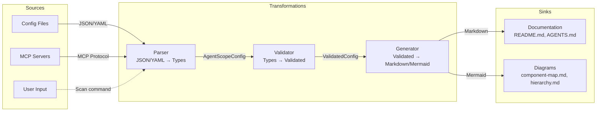

# Architecture Decision Records - v1.2

> **Project**: AgentScope v1.2
> **Format**: MADR (Markdown Any Decision Records) 3.0
> **Last Updated**: 2026-01-25

---

## v1.2 ADRs

| ADR | Title | Status | Date | Impact |
|-----|-------|--------|------|--------|
| [ADR-011](./ADR-011-multi-file-documentation.md) | Multi-File Documentation Strategy | Proposed | 2026-01-25 | High |
| [ADR-012](./ADR-012-category-detection.md) | Category Detection and Auto-Categorization | Proposed | 2026-01-25 | Medium |
| [ADR-013](./ADR-013-dataflow-visualization.md) | Data Flow Visualization Approach | Proposed | 2026-01-25 | Low |
| [ADR-014](./ADR-014-template-generation.md) | ADR and CONTEXT.md Template Generation | Proposed | 2026-01-25 | Low |

---

## ADR-011: Multi-File Documentation Strategy

### Status
**Proposed** - Pending implementation

### Context

AgentScope v1.1 generates single-file documentation (README.md, AGENTS.md) which works well for small projects (<10 agents) but becomes unwieldy for large projects (>20 agents).

**Problem**:
- Large README.md files are hard to navigate
- GitHub has no table of contents for markdown files
- Users want category-specific documentation

**Constraints**:
- Must maintain backward compatibility with v1.1
- Must not introduce complexity (no database, no state)
- Must follow `/examples/` documentation style

### Decision

Implement **category-based multi-file documentation** with the following approach:

1. **Detect categories** from agent frontmatter (`category` field)
2. **Auto-categorize** agents without explicit category based on naming patterns
3. **Generate category files** in `docs/agent-architecture/categories/` directory
4. **Link from main README.md** to category files

**File Structure**:
```
docs/agent-architecture/
├── README.md                    # Main overview
├── component-map.md             # Full system diagram
├── hierarchy.md                 # Delegation hierarchy
├── dataflow.md                  # Data flow diagram
└── categories/
    ├── github.md                # GitHub-related agents
    ├── security.md              # Security agents
    ├── development.md           # Development agents
    └── testing.md               # Testing agents
```

**Auto-Categorization Rules**:
- Agents with `github` in name → GitHub category
- Agents with `security`, `audit`, `pii` in name → Security category
- Agents with `coder`, `developer`, `architect` in name → Development category
- Agents with `tester`, `reviewer`, `validator` in name → Testing category
- Default → Development category

### Consequences

**Positive**:
- Improved navigation for large projects
- Category-specific diagrams are clearer
- Easier to find relevant agents
- Follows industry best practices (modular documentation)

**Negative**:
- More files to generate (potential performance impact)
- More complex testing (need integration tests for multi-file output)
- Risk of inconsistency between main README and category files

**Neutral**:
- Single-file output still available for small projects
- Categories auto-enabled when >10 agents detected

### Implementation Notes

**Scanner Changes**:
```typescript
// src/core/scanner/claude-code.ts
interface AgentMetadata {
  name: string;
  description: string;
  category?: string;  // NEW: Optional category field
  // ... existing fields
}
```

**Generator Changes**:
```typescript
// src/core/generators/diagrams/categories.ts
export function generateCategoryDocs(config: AgentScopeConfig): CategoryDocs {
  const categories = groupAgentsByCategory(config.agents);
  return categories.map(category => ({
    name: category.name,
    agents: category.agents,
    diagram: generateCategoryDiagram(category),
    markdown: formatCategoryMarkdown(category)
  }));
}
```

### Related Decisions
- ADR-012: Category Detection and Auto-Categorization
- ADR-005: Output Format (Markdown + JSON)

### References
- [GitHub Docs Style Guide](https://github.com/github/docs/blob/main/contributing/content-markup-reference.md)
- [arc42 Documentation Structure](https://arc42.org/)

---

## ADR-012: Category Detection and Auto-Categorization

### Status
**Proposed** - Pending implementation

### Context

To implement multi-file documentation (ADR-011), we need a strategy to categorize agents. Not all agents will have explicit categories in their frontmatter.

**Problem**:
- Some agents have `category` field, others don't
- Need consistent categorization across projects
- Should be automatic (no manual configuration)

### Decision

Implement **two-tier category detection**:

1. **Explicit Categories** (Priority 1): Read `category` field from agent frontmatter
2. **Auto-Categorization** (Priority 2): Use naming patterns and keyword matching

**Auto-Categorization Algorithm**:

```typescript
function autoDetectCategory(agent: Agent): string {
  const name = agent.name.toLowerCase();
  const description = agent.description.toLowerCase();

  // GitHub category
  if (
    name.includes('github') ||
    name.includes('pr-') ||
    name.includes('issue-') ||
    description.includes('pull request') ||
    description.includes('github')
  ) {
    return 'github';
  }

  // Security category
  if (
    name.includes('security') ||
    name.includes('audit') ||
    name.includes('pii') ||
    description.includes('security') ||
    description.includes('vulnerability')
  ) {
    return 'security';
  }

  // Testing category
  if (
    name.includes('test') ||
    name.includes('review') ||
    name.includes('validator') ||
    description.includes('testing') ||
    description.includes('validation')
  ) {
    return 'testing';
  }

  // Default: development
  return 'development';
}
```

**Category Hierarchy**:
- 🐙 **GitHub** - PR management, issue tracking, releases, workflows
- 🔒 **Security** - Auditing, PII detection, claims authorization
- 💻 **Development** - Coding, architecture, backend/frontend development
- 🧪 **Testing** - Testing, reviewing, validation

### Consequences

**Positive**:
- Works with both new (explicit category) and legacy (no category) agents
- Consistent categorization across projects
- No manual configuration required

**Negative**:
- Auto-categorization may be incorrect in edge cases
- Keyword-based matching is brittle (e.g., "test-driven-coder" → testing category)

**Mitigation**:
- Explicit category always takes precedence
- Users can override by adding `category` field to frontmatter
- Document auto-categorization rules in user guide

### Implementation Notes

**Category Override Example**:
```yaml
---
name: test-driven-coder
category: development  # Override auto-categorization (would be "testing")
description: Coder specializing in TDD
---
```

### Related Decisions
- ADR-011: Multi-File Documentation Strategy

---

## ADR-013: Data Flow Visualization Approach

### Status
**Proposed** - Pending implementation

### Context

Current dataflow diagram (v1.1) shows **sequence** (control flow) but not **data transformations**. Users want to understand how data moves through the system.

**Problem**:
- Current diagram shows "who calls who" but not "what data is transformed"
- No visibility into data formats (JSON → Markdown → Mermaid)
- Unclear where data originates and ends up

### Decision

Enhance dataflow diagram to show **data-centric view**:

1. **Data Sources**: User input, config files (.claude/, .mcp.json), MCP servers
2. **Data Transformations**: Parsing, validation, generation
3. **Data Sinks**: Documentation files (README.md, AGENTS.md), diagrams

**Diagram Structure**:



**Data Format Annotations**:
- Show data format at each edge (JSON, YAML, Markdown, Mermaid)
- Show transformation type (parse, validate, generate, sanitize)

### Consequences

**Positive**:
- Clearer understanding of data flow
- Helps developers understand system architecture
- Useful for debugging data transformation issues

**Negative**:
- More complex diagram (may be harder to read)
- Requires additional metadata about data formats

**Neutral**:
- Separate from sequence diagram (which shows temporal flow)

### Implementation Notes

**Data Format Metadata**:
```typescript
interface DataFlow {
  from: string;
  to: string;
  format: 'json' | 'yaml' | 'markdown' | 'mermaid' | 'typescript';
  transformation: 'parse' | 'validate' | 'generate' | 'sanitize';
}
```

### Related Decisions
- ADR-002: Diagram Format (Mermaid)

---

## ADR-014: ADR and CONTEXT.md Template Generation

### Status
**Proposed** - Pending implementation

### Context

AgentScope scans and documents agent configurations but doesn't help with **architectural documentation** (ADRs, CONTEXT.md).

**Problem**:
- Developers need to manually create ADRs and CONTEXT.md
- No templates or starting points
- Inconsistent formatting across projects

**Opportunity**:
- AgentScope has all data needed to bootstrap CONTEXT.md (agents, skills, MCP servers)
- Can auto-generate ADR index from existing ADR files

### Decision

Add **template generation** for architectural documentation:

1. **ADR Template Generation**:
   - Scan `/docs/adr/` and `/docs/architecture/decisions/` for existing ADRs
   - Generate ADR index (README.md) with links to all ADRs
   - Provide MADR 3.0 template for new ADRs

2. **CONTEXT.md Generation**:
   - Generate CONTEXT.md with arc42 sections 1-3
   - Auto-populate from scanned agent data
   - Include system boundary diagram

**ADR Index Structure**:
```markdown
# Architecture Decision Records

## ADR Index

| ADR | Title | Status | Date |
|-----|-------|--------|------|
| [ADR-001](./ADR-001-architecture-style.md) | Architecture Style | Accepted | 2026-01-20 |
| [ADR-002](./ADR-002-diagram-format.md) | Diagram Format | Accepted | 2026-01-20 |

## Categories

### Architecture & Design
- [ADR-001](./ADR-001-architecture-style.md)

### Output & Visualization
- [ADR-002](./ADR-002-diagram-format.md)
```

**CONTEXT.md Structure** (arc42 sections 1-3):
```markdown
# CONTEXT.md

## 1. Introduction and Goals

### Requirements Overview
- [Auto-generated from agent descriptions]

### Quality Goals
- [Auto-generated from agent capabilities]

## 2. Constraints

### Technical Constraints
- [Auto-generated from MCP servers, tools]

### Organizational Constraints
- [User fills in]

## 3. Context and Scope

### System Boundary
[Mermaid diagram showing agents, MCP servers, external systems]

### Interfaces
- [Auto-generated from MCP tools]
```

### Consequences

**Positive**:
- Faster architectural documentation setup
- Consistent formatting (MADR, arc42)
- Leverages existing scan data

**Negative**:
- Limited to sections that can be auto-populated
- User still needs to fill in gaps
- Risk of stale documentation if not updated

**Mitigation**:
- Clearly mark auto-generated vs. user-filled sections
- Add warnings to update manually-written sections
- Generate templates only, not final documentation

### Implementation Notes

**CLI Commands**:
```bash
# Generate ADR index
agentscope scan --generate-adr

# Generate CONTEXT.md template
agentscope scan --generate-context
```

### Related Decisions
- None (new feature)

### References
- [MADR Template](https://adr.github.io/madr/)
- [arc42 Documentation](https://arc42.org/)

---

## Decision Log

### Postponed Decisions

| Decision | Reason | Target Version |
|----------|--------|----------------|
| **AGENTS.md File References** | Requires file system scanning enhancements | v1.4 |
| **BMad Method Scanner** | Needs framework research | v1.4 |
| **Plugin Architecture** | Validate core extensibility first | v2.0 |

---

## ADR Template (MADR 3.0)

Use this template for new ADRs:

```markdown
# ADR-XXX: [Title]

## Status
[Proposed | Accepted | Deprecated | Superseded by ADR-XXX]

## Context
What is the issue that we're seeing that is motivating this decision?

## Decision
What is the change that we're proposing and/or doing?

## Consequences

### Positive
- Benefit 1
- Benefit 2

### Negative
- Tradeoff 1
- Tradeoff 2

### Neutral
- Side effect 1

## Options Considered

### Option 1: [Name]
- **Pros**: ...
- **Cons**: ...

### Option 2: [Name]
- **Pros**: ...
- **Cons**: ...

## Related Decisions
- ADR-XXX: Related decision

## References
- [Link to relevant documentation]
```

---

*ADR Index Version: 1.0 | Created: 2026-01-25 | Format: MADR 3.0*
