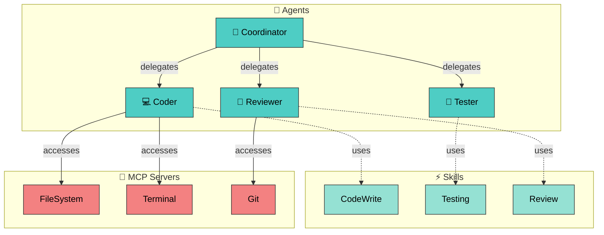
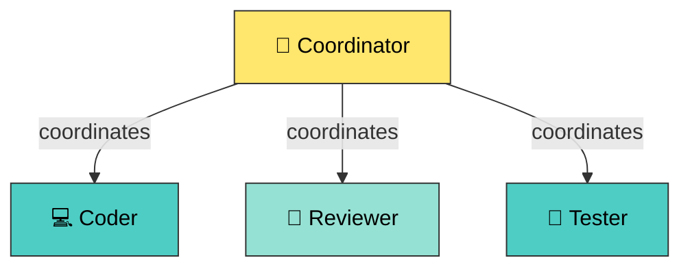
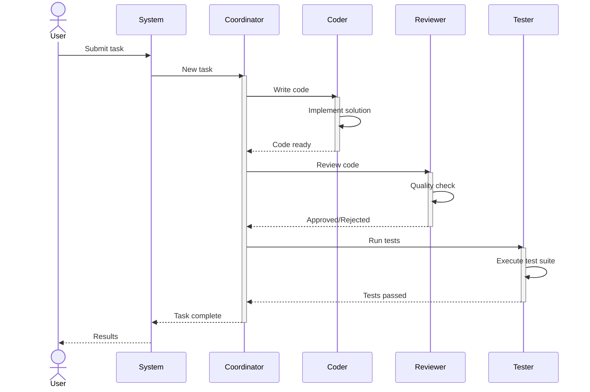
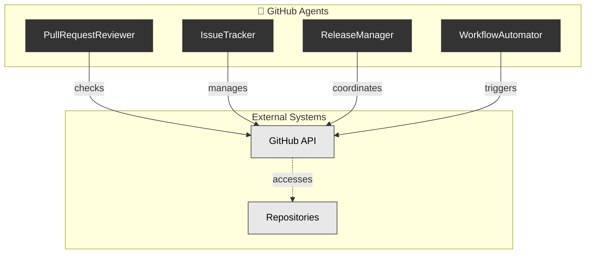
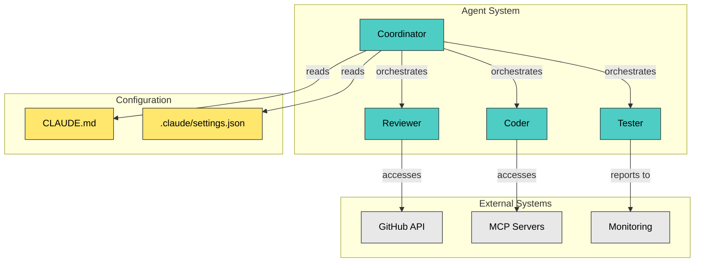

# Examples - AgentScope v1.2 Outputs

> **Complete examples of v1.2 documentation output** | Reference for generated documentation quality

## Table of Contents

1. [Output Structure](#output-structure)
2. [Single-File Output (v1.1 Style)](#single-file-output-v11-style)
3. [Multi-File Output (v1.2 Style)](#multi-file-output-v12-style)
4. [Category Documentation](#category-documentation)
5. [ADR Index](#adr-index)
6. [CONTEXT Template](#context-template)
7. [Generated Diagrams](#generated-diagrams)

---

## Output Structure

### Small Project (<10 agents)

```
docs/agent-architecture/
├── README.md              # Single comprehensive file
├── component-map.md       # (embedded in README in v1.1)
├── hierarchy.md           # (embedded in README in v1.1)
├── dataflow.md            # (embedded in README in v1.1)
└── config.json
```

### Large Project (>10 agents, v1.2)

```
docs/agent-architecture/
├── README.md              # Overview + navigation
├── component-map.md       # System diagram
├── hierarchy.md           # Agent delegation
├── dataflow.md            # Data transformation flow
├── config.json
└── categories/
    ├── github.md          # GitHub-related agents
    ├── security.md        # Security agents
    ├── development.md     # Development agents
    └── testing.md         # Testing agents

docs/adr/
├── README.md              # ADR index with links and template
└── (existing ADRs)

docs/
└── CONTEXT.md             # arc42 sections 1-3 template
```

---

## Single-File Output (v1.1 Style)

For projects with <10 agents or using `--no-categories` flag.

### Example: Generated README.md

```markdown
# Agent Architecture Documentation

> System overview and component reference for your agent ecosystem
> Generated by AgentScope v1.2.0 | [Learn more](https://github.com/vipasane/agentscope)

## Quick Stats

| Component | Count |
|-----------|------:|
| 🤖 Agents | 8 |
| ⚡ Skills | 5 |
| 🔌 MCP Servers | 3 |
| 🪝 Hooks | 4 |
| ⌘ Commands | 2 |
| 🧩 Plugins | 1 |
| 🔐 Permissions | 12 |

---

## System Overview



---

## Agents

### Dense Table

| Name | Type | Category | Delegations | Tools | Description |
|------|------|----------|------------|-------|-------------|
| **Coordinator** | coordinator | coordination | Coder, Reviewer, Tester | orchestrate, delegate | Main orchestrator for development workflow |
| **Coder** | worker | development | - | code-write, refactor, debug | Writes and modifies code |
| **Reviewer** | specialist | development | - | review, lint, analyze | Reviews code for quality and best practices |
| **Tester** | worker | testing | - | test-run, test-write, coverage | Writes and runs tests |

### Delegation Hierarchy

```
Coordinator (main)
├── Coder (worker)
├── Reviewer (specialist)
└── Tester (worker)
```

### Skills Reference

| Skill | Type | Handler | Parameters |
|-------|------|---------|------------|
| CodeWrite | code | handlers/code-write | language, style |
| Testing | workflow | handlers/test-suite | framework, coverage |
| Review | prompt | handlers/review | strictness |

### Permissions

| Subject | Resource | Action | Effect | Priority |
|---------|----------|--------|--------|----------|
| agent:Coder | fs:write | write | allow | 10 |
| agent:Reviewer | git:read | read | allow | 10 |
| agent:Tester | test:run | execute | allow | 10 |
| role:admin | * | * | allow | 100 |

---

## Component Map

[Mermaid diagram showing all components: agents, skills, MCPs, hooks]

---

## Delegation Hierarchy



---

## Data Flow



---

## Configuration

```json
{
  "agents": [
    {
      "name": "Coordinator",
      "type": "coordinator",
      "description": "Main orchestrator for development workflow",
      "delegations": ["Coder", "Reviewer", "Tester"]
    }
  ],
  "skills": [
    {
      "name": "CodeWrite",
      "type": "code",
      "handler": "handlers/code-write"
    }
  ]
}
```

---

Generated: 2026-02-01T10:30:00Z | AgentScope v1.2.0
```

---

## Multi-File Output (v1.2 Style)

### Example: README.md (Large Project)

```markdown
# Agent Architecture Documentation

> Professional agent system documentation for your project
> Generated by AgentScope v1.2.0 | Multi-file structure with categories

## Quick Stats

| Component | Count |
|-----------|------:|
| 🤖 Agents | 15 |
| ⚡ Skills | 8 |
| 🔌 MCP Servers | 4 |
| 🪝 Hooks | 6 |
| ⌘ Commands | 3 |
| 🧩 Plugins | 2 |
| 🔐 Permissions | 20 |

---

## Documentation Structure

### By Category

- **[🐙 GitHub](./categories/github.md)** (4 agents)
  - PR management, issue tracking, release coordination

- **[🔒 Security](./categories/security.md)** (3 agents)
  - Auditing, compliance checking, PII detection

- **[💻 Development](./categories/development.md)** (5 agents)
  - Backend, frontend, API, architecture services

- **[🧪 Testing](./categories/testing.md)** (3 agents)
  - TDD, validation, code review

---

## Full System Views

- **[System Component Map](./component-map.md)** - All components and relationships
- **[Agent Hierarchy](./hierarchy.md)** - Delegation and coordination structure
- **[Data Flow](./dataflow.md)** - Data transformation pipeline
- **[Configuration](./config.json)** - Raw JSON configuration

---

## Agents by Category

### 🐙 GitHub (4 agents)

| Agent | Type | Purpose |
|-------|------|---------|
| PullRequestReviewer | specialist | Reviews PRs for quality |
| IssueTracker | worker | Manages issue lifecycle |
| ReleaseManager | coordinator | Coordinates releases |
| WorkflowAutomator | worker | Automates CI/CD workflows |

See [GitHub Category](./categories/github.md) for details.

### 🔒 Security (3 agents)

| Agent | Type | Purpose |
|-------|------|---------|
| SecurityAuditor | specialist | Security audits |
| ComplianceChecker | worker | Compliance validation |
| PIIDetector | specialist | PII detection |

See [Security Category](./categories/security.md) for details.

### 💻 Development (5 agents)

| Agent | Type | Purpose |
|-------|------|---------|
| BackendDeveloper | worker | Backend development |
| FrontendDeveloper | worker | Frontend development |
| ArchitectureDesigner | specialist | Architecture decisions |
| APIDesigner | worker | API specification |
| DatabaseAdministrator | worker | Database management |

See [Development Category](./categories/development.md) for details.

### 🧪 Testing (3 agents)

| Agent | Type | Purpose |
|-------|------|---------|
| Tester | worker | Test execution |
| CodeReviewer | specialist | Code quality review |
| ValidationExpert | specialist | Validation & verification |

See [Testing Category](./categories/testing.md) for details.

---

## Capabilities Matrix

| Agent | Code | Review | Test | Deploy | Security |
|-------|------|--------|------|--------|----------|
| PullRequestReviewer | ❌ | ✅ | ❌ | ❌ | ✅ |
| BackendDeveloper | ✅ | ❌ | ✅ | ❌ | ❌ |
| SecurityAuditor | ❌ | ❌ | ❌ | ❌ | ✅ |
| Tester | ✅ | ❌ | ✅ | ❌ | ❌ |
| ReleaseManager | ❌ | ❌ | ❌ | ✅ | ❌ |

---

Generated: 2026-02-01T10:30:00Z | AgentScope v1.2.0
```

---

## Category Documentation

### Example: categories/github.md

```markdown
# GitHub Agents

> GitHub-related agents for PR management, issue tracking, and releases
> Category overview and agent details

## Category Overview

**Purpose**: Automate GitHub workflows including PR management, issue tracking, and release coordination.

**Agents**: 4 | **Skills**: 2 | **Permissions**: 5

---

## System Diagram



---

## Agents

### PullRequestReviewer

**Type**: specialist | **Delegations**: none

Automated reviewer for pull requests focusing on code quality, security, and best practices.

**Capabilities**:
- Reviews PR content
- Checks for security issues
- Enforces code standards
- Suggests improvements

**Tools**: github-api, linter, security-scanner

---

### IssueTracker

**Type**: worker | **Delegations**: none

Manages issue lifecycle including creation, assignment, updates, and closure.

**Capabilities**:
- Create issues
- Assign to agents
- Track status
- Close when resolved

**Tools**: github-api, notification-system

---

### ReleaseManager

**Type**: coordinator | **Delegations**: WorkflowAutomator

Coordinates release process including versioning, changelog, and deployment.

**Capabilities**:
- Version management
- Changelog generation
- Release coordination
- Deployment triggering

**Tools**: semantic-versioning, github-api

---

### WorkflowAutomator

**Type**: worker | **Delegations**: none

Automates CI/CD workflows including testing, building, and publishing.

**Capabilities**:
- Run tests
- Build artifacts
- Publish packages
- Monitor workflows

**Tools**: github-actions, ci-cd-system

---

## Skills

| Skill | Type | Purpose |
|-------|------|---------|
| PRReviewWorkflow | workflow | Automated PR review process |
| ReleaseAutomation | workflow | Automated release process |

---

## Permissions

| Agent | Resource | Action | Effect |
|-------|----------|--------|--------|
| PullRequestReviewer | github:pullRequests | read | allow |
| PullRequestReviewer | github:comments | write | allow |
| IssueTracker | github:issues | read,write | allow |
| ReleaseManager | github:releases | write | allow |
| WorkflowAutomator | github:workflows | trigger | allow |

---

Generated: 2026-02-01 | Part of Agent Architecture Documentation
```

---

## ADR Index

### Example: docs/adr/README.md

```markdown
# Architecture Decision Records (ADRs)

Index of all Architecture Decision Records for this project.

## Active ADRs

### Architecture Decisions

- **ADR-001**: [Unified Config Model](./ADR-001-unified-config-model.md)
  - Status: Accepted | Date: 2025-11-15
  - Decision to use unified configuration model for all entity types

- **ADR-002**: [Mermaid Security](./ADR-002-mermaid-security.md)
  - Status: Accepted | Date: 2025-11-20
  - Security approach for Mermaid diagram generation

### Implementation Decisions

- **ADR-004**: [Parser Plugin Architecture](./ADR-004-parser-plugin-architecture.md)
  - Status: Accepted | Date: 2025-12-01
  - Extensible parser system for multiple entity types

- **ADR-008**: [CLI Framework Selection](./ADR-008-cli-framework.md)
  - Status: Accepted | Date: 2025-12-15
  - Choice of Commander.js for CLI

## Creating New ADRs

Use the MADR 3.0 template below:

### Template: MADR 3.0 Format

```markdown
# [ADR-###] [Title]

**Date**: [YYYY-MM-DD]
**Status**: Proposed

## Context

[Describe the issue motivating this decision]

## Decision

[Describe the decision made]

## Consequences

### Positive

- [Benefit 1]
- [Benefit 2]

### Negative

- [Drawback 1]
- [Drawback 2]

## Alternatives Considered

1. [Alternative 1] - Why rejected
2. [Alternative 2] - Why rejected

## Related

- Relates to: [Other ADRs]
- Supersedes: [Previous ADRs if applicable]

## References

- [External documentation]
```

---

Generated: 2026-02-01 | AgentScope v1.2.0
```

---

## CONTEXT Template

### Example: docs/CONTEXT.md

```markdown
# CONTEXT: System Architecture (arc42)

> System context and architecture overview | arc42 sections 1-3

## 1. Introduction and Goals

### 1.1 What is the System About?

The Agent System is an orchestration platform for AI agents coordinating code development, documentation, and quality assurance tasks.

**Key Capabilities**:
- Autonomous agent coordination
- Multi-step workflow management
- Tool and MCP server integration
- Permission-based access control

### 1.2 Stakeholders

| Stakeholder | Concern |
|-------------|---------|
| Developers | Code quality, automation |
| DevOps | System reliability, monitoring |
| Security | Access control, compliance |
| Management | ROI, time-to-value |

### 1.3 Success Criteria

- [ ] Agents coordinate autonomously on complex tasks
- [ ] 80% automation of code review process
- [ ] <2 second response time for agent actions
- [ ] Zero security incidents related to permissions
- [ ] Support for 20+ concurrent agent tasks

---

## 2. Constraints

### 2.1 Technical Constraints

| Constraint | Impact |
|-----------|--------|
| MCP server availability | Only tools available via MCP can be used |
| Network latency | API calls to external services impact latency |
| Rate limits | GitHub API and other services have rate limits |
| Storage | Configuration storage must fit in version control |

### 2.2 Organizational Constraints

- Documentation must be maintainable by small team
- Cost must be justified by time savings
- Must integrate with existing CI/CD pipelines
- Security policy requires approval for tool access

### 2.3 Platform Constraints

- Requires Node.js 18+
- CLI-first interface
- JSON/YAML configuration
- Compatible with GitHub, GitLab workflows

---

## 3. Context and Scope

### 3.1 System Boundary



### 3.2 Key Responsibilities

| Component | Responsibility |
|-----------|-----------------|
| **Coordinator** | Orchestrate agents, manage workflows |
| **Coder** | Write and modify code |
| **Reviewer** | Review code quality and security |
| **Tester** | Execute tests and validate |
| **MCP Servers** | Provide tool access |
| **GitHub** | Repository management |

### 3.3 Interactions

| From | To | Purpose |
|------|----|---------|
| Coordinator | All agents | Task delegation |
| Coder | MCP | Tool access |
| Reviewer | GitHub | PR checks |
| Tester | Monitor | Test results |

---

## 4. Solution Strategy (auto-populated overview)

[To be completed: High-level overview of solution]

## 5. Building Blocks (to be completed)

[To be completed: Major system components]

## 6. Runtime View (to be completed)

[To be completed: Dynamic behavior and interactions]

---

Generated: 2026-02-01 | AgentScope v1.2.0
```

---

## Generated Diagrams

### Hierarchy Diagram
```
[Mermaid graph showing agent delegation hierarchy]
```

### Component Map
```
[Mermaid graph showing all system components]
```

### Enhanced Dataflow
```
[Mermaid diagram showing data sources, transformations, and sinks]
```

---

## Example Project Structure

```
my-project/
├── .claude/
│   ├── agents/
│   │   ├── coder.md
│   │   ├── reviewer.md
│   │   └── tester.md
│   ├── skills/
│   └── settings.json
├── .mcp.json
├── CLAUDE.md
└── docs/
    ├── agent-architecture/
    │   ├── README.md
    │   ├── component-map.md
    │   ├── hierarchy.md
    │   ├── dataflow.md
    │   ├── config.json
    │   └── categories/
    │       ├── github.md
    │       ├── security.md
    │       └── development.md
    ├── adr/
    │   └── README.md
    └── CONTEXT.md
```

---

## Usage Example

```bash
# Generate all outputs
agentscope scan \
  --categories \
  --generate-adr \
  --generate-context \
  --theme dark

# Output includes:
# - Multi-file documentation with categories
# - ADR index
# - arc42 template
# - Enhanced diagrams
```

---

## See Also

- [User Guide](./USER-GUIDE-v1.2.md) - Feature guide
- [CLI Reference](./CLI-REFERENCE.md) - All CLI commands
- [API Documentation](./API-DOCUMENTATION.md) - Programmatic usage
