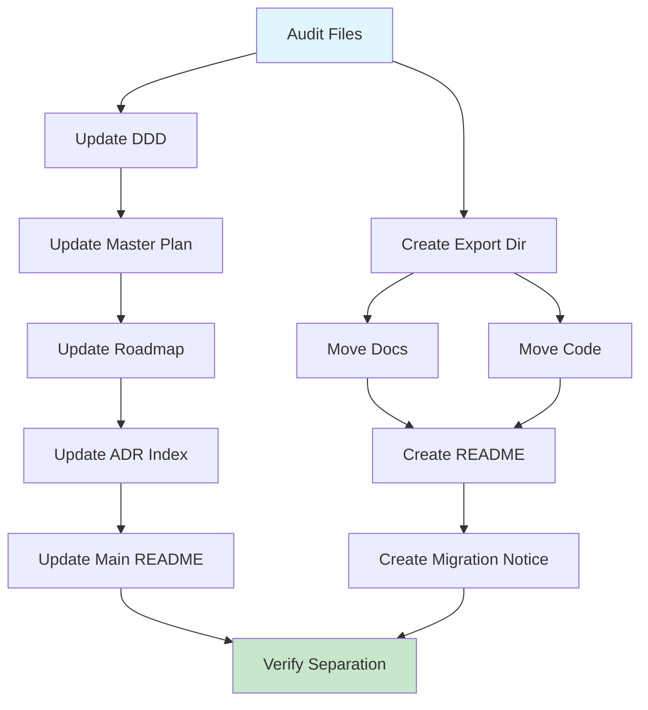

# AgentScope v1.2 Reorganization - Execution Coordination

> **Status**: Ready for Execution
> **Timeline**: 1 day reorganization + 2-3 weeks v1.2 implementation
> **Coordinator**: Strategic Planning Agent

---

## Phase 1: Reorganization (Day 1 - 8 hours)

### Morning Session (4 hours)

#### Agent Assignments

| Time | Agent | Task | Output |
|------|-------|------|--------|
| 9:00-9:30 | Researcher | Audit all DevContainer files | File manifest |
| 9:30-10:00 | Coder | Create export directory structure | `export/devcontainer-scanner/` |
| 10:00-11:00 | Coder | Move DevContainer documentation (11 files) | Files in export package |
| 11:00-11:30 | Coder | Move DevContainer code (2 files) | Code in export package |
| 11:30-12:00 | Technical Writer | Create export package README | Clear separation explanation |
| 12:00-13:00 | Technical Writer | Create migration notice | User communication |

### Afternoon Session (4 hours)

| Time | Agent | Task | Output |
|------|-------|------|--------|
| 14:00-15:00 | System Architect | Update DDD bounded contexts | Remove DevContainerContext |
| 15:00-15:30 | Coder | Update v1.2 Master Plan | Remove DevContainer sections |
| 15:30-16:00 | Coder | Update v1.2 Roadmap | Remove DevContainer milestones |
| 16:00-16:30 | Coder | Update ADR index | Remove DevContainer ADRs |
| 16:30-17:00 | Coder | Update main README | Remove DevContainer roadmap items |
| 17:00-18:00 | Reviewer | Verify separation | No DevContainer leakage |

### Deliverables (End of Day 1)

- [ ] `export/devcontainer-scanner/` package complete
- [ ] All DevContainer files moved
- [ ] All AgentScope docs updated
- [ ] v1.2 refocused on agent scanning
- [ ] Migration notice created
- [ ] Separation verified

---

## Phase 2: v1.2 Implementation (Weeks 2-3)

### Week 1: Enhanced Documentation Output

**Agent Assignments**:
- **Coder**: README enhancement, capabilities matrix, delegation hierarchy
- **Tester**: Unit tests for formatting functions
- **Reviewer**: Verify output matches examples

### Week 2: Multi-File & Agent Metadata

**Agent Assignments**:
- **Coder**: Category detection, diagrams, Claude Code settings deep scan
- **Researcher**: CLAUDE.md parsing enhancements
- **Tester**: Integration tests for multi-file output

### Week 2-3: Advanced Features

**Agent Assignments**:
- **Coder**: Enhanced dataflow, ADR templates, CONTEXT.md
- **System Architect**: Integration points, dependency management
- **Tester**: Comprehensive testing

### Week 3: Testing & Release

**Agent Assignments**:
- **Tester**: E2E tests, regression testing
- **Coder**: Performance optimization
- **Reviewer**: Documentation review, release preparation

---

## Coordination Protocol

### Daily Standup (Memory-Based)

Each agent updates progress:
```bash
npx @claude-flow/cli@latest memory store \
  --namespace v1.2-coordination \
  --key "status-$(date +%Y%m%d)-[agent-name]" \
  --value "Task: [task] | Status: [status] | Blockers: [blockers]"
```

### Blocker Escalation

If blocked >2 hours:
1. Store blocker in memory
2. Notify coordinator
3. Convene relevant agents

### Quality Gates

Before proceeding to next phase:
- [ ] All tasks complete
- [ ] All tests passing
- [ ] No regressions
- [ ] Documentation updated
- [ ] Reviewer approval

---

## Task Dependencies

### Phase 1 Dependencies



### Critical Path

```
Audit → Create Export → Move Files → Update Docs → Verify
```

**Total**: 8 hours (1 day)

---

## Communication

### Internal (Agents)

**Memory Namespace**: `v1.2-reorganization`

**Key Patterns**:
```bash
# Progress update
npx @claude-flow/cli@latest memory store \
  --namespace v1.2-reorganization \
  --key "progress-[task-id]" \
  --value "[status]"

# Blocker report
npx @claude-flow/cli@latest memory store \
  --namespace v1.2-reorganization \
  --key "blocker-[timestamp]" \
  --value "[description]"

# Completion notification
npx @claude-flow/cli@latest memory store \
  --namespace v1.2-reorganization \
  --key "complete-[phase]" \
  --value "[summary]"
```

### External (Users)

**GitHub Issue**: "AgentScope v1.2 Scope Correction"
**Migration Notice**: In export package
**README Update**: Clarify core mission

---

## Success Metrics

### Reorganization Phase

| Metric | Target | Status |
|--------|--------|--------|
| Files moved | 13 files | TBD |
| Docs updated | 9 files | TBD |
| DevContainer references removed | 100% | TBD |
| Export package complete | Yes | TBD |
| Migration notice created | Yes | TBD |
| Separation verified | Yes | TBD |

### v1.2 Implementation Phase

| Metric | Target | Status |
|--------|--------|--------|
| Test coverage | >85% | TBD |
| Documentation completeness | 100% | TBD |
| Example compliance | 100% | TBD |
| Scan performance | <3s | TBD |
| Zero regressions | All v1.1 tests pass | TBD |

---

## Risk Management

### Reorganization Risks

| Risk | Likelihood | Impact | Mitigation |
|------|------------|--------|------------|
| Missed DevContainer references | Medium | Low | Grep-based verification |
| Broken import links | Low | Medium | Test suite validation |
| User confusion | Medium | Low | Clear migration notice |
| Lost research work | Low | Low | All preserved in export |

### v1.2 Implementation Risks

| Risk | Likelihood | Impact | Mitigation |
|------|------------|--------|------------|
| Complexity creep | High | High | Strict adherence to simple architecture |
| Performance degradation | Low | Medium | Benchmark suite |
| Breaking changes | Low | High | Integration tests |
| Documentation inconsistency | Medium | Medium | Example file validation |

---

## Atomic Task List (Reorganization)

### Task 1: Audit DevContainer Files
- **Owner**: Researcher
- **Estimated**: 30 minutes
- **Deliverable**: File manifest (13 files identified)

### Task 2: Create Export Directory
- **Owner**: Coder
- **Estimated**: 30 minutes
- **Deliverable**: `export/devcontainer-scanner/` structure

### Task 3: Move DevContainer Documentation
- **Owner**: Coder
- **Estimated**: 1 hour
- **Deliverable**: 11 docs in export package

### Task 4: Move DevContainer Code
- **Owner**: Coder
- **Estimated**: 30 minutes
- **Deliverable**: 2 TypeScript files in export package

### Task 5: Create Export Package README
- **Owner**: Technical Writer
- **Estimated**: 1 hour
- **Deliverable**: Clear separation explanation

### Task 6: Create Migration Notice
- **Owner**: Technical Writer
- **Estimated**: 30 minutes
- **Deliverable**: User communication document

### Task 7: Update DDD Bounded Contexts
- **Owner**: System Architect
- **Estimated**: 1 hour
- **Deliverable**: Remove DevContainerContext, add AgentMetadataContext

### Task 8: Update v1.2 Master Plan
- **Owner**: Coder
- **Estimated**: 1 hour
- **Deliverable**: Remove DevContainer sections

### Task 9: Update v1.2 Roadmap
- **Owner**: Coder
- **Estimated**: 30 minutes
- **Deliverable**: Remove DevContainer milestones

### Task 10: Update ADR Index
- **Owner**: Coder
- **Estimated**: 30 minutes
- **Deliverable**: Remove DevContainer ADRs

### Task 11: Update Main README
- **Owner**: Coder
- **Estimated**: 30 minutes
- **Deliverable**: Remove DevContainer roadmap items

### Task 12: Verify Separation
- **Owner**: Reviewer
- **Estimated**: 1 hour
- **Deliverable**: Verification report (no DevContainer leakage)

**Total**: 8 hours (12 tasks)

---

## Definition of Done

### Reorganization Complete

- [ ] All DevContainer files in `export/devcontainer-scanner/`
- [ ] Export package README created
- [ ] Migration notice created
- [ ] All AgentScope docs updated (no DevContainer references)
- [ ] v1.2 Master Plan refocused
- [ ] v1.2 Roadmap updated
- [ ] DDD bounded contexts corrected
- [ ] ADR index updated
- [ ] Main README updated
- [ ] Grep verification shows no DevContainer leakage
- [ ] All tests passing

### v1.2 Implementation Complete

See `docs/v1.2/MASTER-PLAN.md` (updated) for v1.2 DoD.

---

## Next Actions

### Immediate (Today)

1. **Spawn execution agents** for reorganization
2. **Begin Phase 1** (reorganization)
3. **Track progress** in memory

### This Week

1. Complete reorganization (Day 1)
2. Begin v1.2 implementation (Days 2-5)

### Next 2-3 Weeks

1. Complete v1.2 implementation
2. Comprehensive testing
3. Release v1.2

---

*Coordination managed by Strategic Planning Agent*
*Updated: 2026-01-25*
