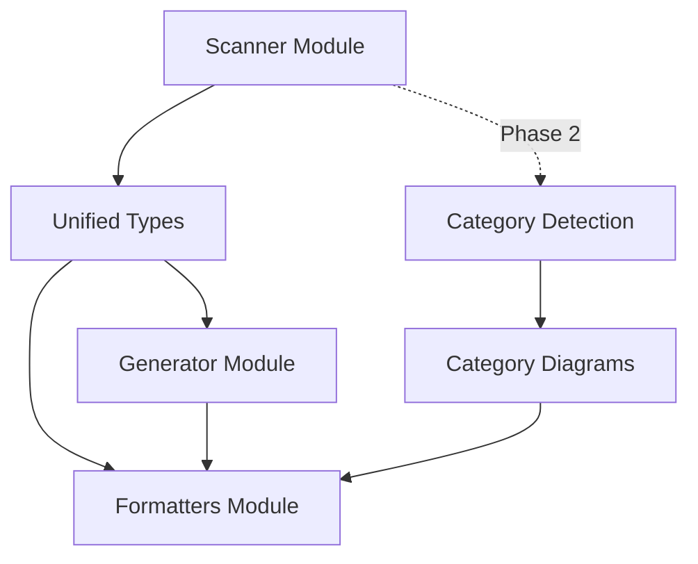

# AgentScope v1.2 Master Implementation Plan

> **Status**: Planning Complete
> **Version**: 1.2
> **Created**: 2026-01-25
> **Target Completion**: 2-3 weeks (estimated)

---

## Executive Summary

AgentScope v1.2 focuses on **expanding documentation capabilities** while maintaining the simple, focused architecture established in v1.1. This release adds support for additional file types, enhances documentation output, and introduces foundational features for future extensibility—all without introducing architectural complexity.

### What's Included in v1.2

| Feature | Priority | Complexity | Estimated Effort |
|---------|----------|------------|------------------|
| **Enhanced Documentation Output** | High | Low | 3-4 days |
| **Multi-File Diagram Support** | High | Medium | 3-4 days |
| **Category-Based Documentation** | Medium | Low | 2-3 days |
| **Dataflow Diagram Enhancement** | Medium | Medium | 2-3 days |
| **ADR Template Generation** | Low | Low | 1-2 days |
| **CONTEXT.md Generation** | Low | Low | 1-2 days |

### What's Postponed to v1.4+

| Feature | Reason | Target Version |
|---------|--------|----------------|
| **AGENTS.md File References** | Requires file system scanning enhancements | v1.4 |
| **BMad Method Scanner** | Needs framework research | v1.4 |
| **Watch Mode** | Needs file watching infrastructure | v1.3 |
| **GitHub Action** | Needs CI/CD integration patterns | v1.3 |
| **Plugin System** | Validate core extensibility first | v2.0+ |

---

## 1. Strategic Objectives

### 1.1 Primary Goals

1. **Enhance Documentation Quality**: Improve generated documentation to match professional standards
2. **Support Multi-File Diagrams**: Enable category-based diagrams for large agent systems
3. **Improve Developer Experience**: Better navigation, clearer structure, more actionable insights
4. **Maintain Simplicity**: Keep the simple 6-file architecture from v1.0

### 1.2 Success Criteria

| Criterion | Target | Measurement |
|-----------|--------|-------------|
| Documentation completeness | 100% coverage of 7 entity types | Automated validation |
| Example compliance | All outputs match `/examples/` style | Visual diff comparison |
| Test coverage | >85% line coverage | Vitest coverage report |
| Scan performance | <3s for 50 components | Benchmark suite |
| Zero regressions | All v1.1 features working | Integration tests |

---

## 2. Architecture Continuity

### 2.1 Maintaining v1.1 Architecture

AgentScope v1.2 **maintains** the simple architecture from v1.0/v1.1:

```
src/
├── index.ts              # CLI entry
├── scanner/              # Input parsing
│   ├── claude-code.ts
│   ├── settings-scanner.ts
│   ├── hook-parser.ts
│   ├── permission-parser.ts
│   └── plugin-parser.ts
├── types.ts              # Unified types
├── generator/            # Output generation
│   ├── mermaid.ts
│   └── markdown.ts
├── formatters/           # Documentation formatters (NEW in v1.1)
│   └── output/
│       ├── document-builder.ts
│       ├── section-formatters.ts
│       └── legend.ts
└── utils/
    └── path.ts
```

**No new modules added.** All v1.2 features integrate into existing structure.

### 2.2 Key Architectural Principles

1. **No DDD Overhead**: Entities remain simple TypeScript interfaces
2. **No Repository Pattern**: Direct file system access via scanner modules
3. **No Event Sourcing**: Stateless scan → generate workflow
4. **No Plugin Architecture Yet**: Hardcoded parsers, deferred to v2.0

---

## 3. Implementation Phases

### Phase 1: Enhanced Documentation Output (Week 1)

**Goal**: Generate documentation that matches `/examples/` style exactly

#### 3.1 README.md Enhancement

**Tasks**:
1. Add "Quick Stats" section (agents, skills, hooks, commands, plugins, MCP servers, permissions)
2. Add "System Overview" Mermaid diagram showing categories
3. Add "Agents Comparison" dense table
4. Add "Capabilities Matrix" showing agent capabilities
5. Add "Delegation Hierarchy" collapsible section
6. Add "Quick Navigation" table linking to all sections

**Acceptance Criteria**:
- Output matches `/workspaces/agentscope/examples/README-example.md` structure
- All sections auto-generated from scanned data
- All internal links functional
- Mermaid diagrams render correctly on GitHub

**Files Modified**:
- `src/core/formatters/output/document-builder.ts` (enhance)
- `src/core/formatters/output/section-formatters.ts` (enhance)

**Estimated Effort**: 2-3 days

---

#### 3.2 Component Map Enhancement

**Tasks**:
1. Generate component-map.md with full system diagram
2. Add category navigation table
3. Add relationship summary table
4. Add legend for symbols (👑, 🤖, 🔍, 🎯)
5. Link back to README.md

**Acceptance Criteria**:
- Matches `/workspaces/agentscope/examples/component-map-example.md`
- All relationships visualized
- Category subgraphs clearly delineated

**Files Modified**:
- `src/core/generators/diagrams/component-map.ts` (enhance)
- New: `src/core/formatters/output/component-map-formatter.ts`

**Estimated Effort**: 1-2 days

---

#### 3.3 Hierarchy Diagram Enhancement

**Tasks**:
1. Generate hierarchy.md with delegation tree
2. Add root coordinators table
3. Add delegation chains table
4. Add shared workers table
5. Add standalone agents table
6. Add depth analysis

**Acceptance Criteria**:
- Matches `/workspaces/agentscope/examples/hierarchy-example.md`
- Delegation chains clearly visible
- Shared workers identified

**Files Modified**:
- `src/core/generators/diagrams/hierarchy.ts` (enhance)
- New: `src/core/formatters/output/hierarchy-formatter.ts`

**Estimated Effort**: 1-2 days

---

### Phase 2: Multi-File Diagram Support (Week 2)

**Goal**: Support category-based documentation for large agent systems (>20 agents)

#### 3.4 Category Detection & Organization

**Tasks**:
1. Detect agent categories from frontmatter (`category` field)
2. Auto-categorize agents without explicit category (GitHub, Security, Development, Testing)
3. Generate category-specific documentation files
4. Create `docs/agent-architecture/categories/` directory structure

**Acceptance Criteria**:
- Categories auto-detected from agent metadata
- Fallback categorization for uncategorized agents
- Each category gets own diagram + markdown file

**Files Modified**:
- `src/core/scanner/claude-code.ts` (add category extraction)
- New: `src/core/generators/diagrams/categories.ts`
- New: `src/core/formatters/output/category-formatter.ts`

**Estimated Effort**: 2-3 days

---

#### 3.5 Category Documentation Generation

**Tasks**:
1. Generate individual category markdown files
2. Each category includes:
   - Agent list with capabilities
   - Category-specific component diagram
   - Delegation chains within category
   - Cross-category dependencies
3. Link from main README.md

**Output Structure**:
```
docs/agent-architecture/
├── README.md
├── component-map.md
├── hierarchy.md
├── dataflow.md
└── categories/
    ├── github.md
    ├── security.md
    ├── development.md
    └── testing.md
```

**Acceptance Criteria**:
- Matches `/workspaces/agentscope/examples/categories/github-example.md` style
- Each category is self-contained documentation
- Navigation links functional

**Files Created**:
- `src/core/formatters/output/category-formatter.ts`

**Estimated Effort**: 1-2 days

---

### Phase 3: Dataflow Enhancement (Week 2-3)

**Goal**: Improve dataflow diagram to show data transformations

#### 3.6 Enhanced Dataflow Diagram

**Tasks**:
1. Show data flow through system (not just sequence)
2. Identify data sources (user input, config files, MCP servers)
3. Show data transformations (parsing, validation, generation)
4. Show data sinks (documentation files, diagrams)
5. Add data format annotations

**Acceptance Criteria**:
- Dataflow diagram shows data, not just control flow
- Data formats labeled (JSON, Markdown, Mermaid)
- Transformations clearly annotated

**Files Modified**:
- `src/core/generators/diagrams/dataflow.ts` (major enhancement)

**Estimated Effort**: 2-3 days

---

### Phase 4: ADR & CONTEXT.md Generation (Week 3)

**Goal**: Auto-generate architectural documentation templates

#### 3.7 ADR Template Generation

**Tasks**:
1. Generate ADR index in `/docs/adr/README.md`
2. Auto-detect existing ADRs from `/docs/adr/` and `/docs/architecture/decisions/`
3. Generate ADR-XXX templates for new decisions
4. Follow MADR 3.0 format

**Acceptance Criteria**:
- ADR index auto-generated
- Templates follow MADR format
- Links to existing ADRs functional

**Files Created**:
- `src/core/generators/docs/adr-generator.ts`

**Estimated Effort**: 1 day

---

#### 3.8 CONTEXT.md Generation

**Tasks**:
1. Generate CONTEXT.md with arc42 sections 1-3:
   - Section 1: Introduction and Goals
   - Section 2: Constraints
   - Section 3: Context and Scope
2. Auto-populate from scanned data
3. Include system boundary diagram

**Acceptance Criteria**:
- CONTEXT.md includes arc42 sections 1-3
- Auto-populated with agent/skill/MCP data
- System boundary clearly defined

**Files Created**:
- `src/core/generators/docs/context-generator.ts`

**Estimated Effort**: 1 day

---

## 4. Detailed Task Breakdown (Atomic Tasks)

### Phase 1: Enhanced Documentation Output

#### Task 1.1: README.md Quick Stats Section
- **Size**: ~50 lines
- **Files**: `src/core/formatters/output/section-formatters.ts`
- **Acceptance**: Quick stats table with 6 entity counts
- **Tests**: Unit test for stats formatting
- **Estimated**: 2 hours

#### Task 1.2: README.md System Overview Diagram
- **Size**: ~80 lines
- **Files**: `src/core/formatters/output/section-formatters.ts`
- **Acceptance**: Mermaid subgraph diagram with categories
- **Tests**: Snapshot test for diagram output
- **Estimated**: 3 hours

#### Task 1.3: README.md Agents Comparison Table
- **Size**: ~100 lines
- **Files**: `src/core/formatters/output/section-formatters.ts`
- **Acceptance**: Dense table with all agents, categories, types, delegations
- **Tests**: Table rendering test
- **Estimated**: 4 hours

#### Task 1.4: README.md Capabilities Matrix
- **Size**: ~60 lines
- **Files**: `src/core/formatters/output/section-formatters.ts`
- **Acceptance**: Matrix showing agent capabilities (writes code, reviews, tests, etc.)
- **Tests**: Matrix generation test
- **Estimated**: 2 hours

#### Task 1.5: README.md Delegation Hierarchy Section
- **Size**: ~70 lines
- **Files**: `src/core/formatters/output/section-formatters.ts`
- **Acceptance**: Collapsible Mermaid hierarchy diagram
- **Tests**: Hierarchy formatting test
- **Estimated**: 3 hours

#### Task 1.6: Component Map Generation
- **Size**: ~120 lines
- **Files**: `src/core/generators/diagrams/component-map.ts`
- **Acceptance**: Full component map with all entities
- **Tests**: Component map generation test
- **Estimated**: 4 hours

#### Task 1.7: Hierarchy Diagram Enhancement
- **Size**: ~100 lines
- **Files**: `src/core/generators/diagrams/hierarchy.ts`
- **Acceptance**: Delegation tree with tables
- **Tests**: Hierarchy generation test
- **Estimated**: 3 hours

### Phase 2: Multi-File Diagram Support

#### Task 2.1: Category Detection from Frontmatter
- **Size**: ~40 lines
- **Files**: `src/core/scanner/claude-code.ts`
- **Acceptance**: Extract `category` field from agent frontmatter
- **Tests**: Category extraction test
- **Estimated**: 2 hours

#### Task 2.2: Auto-Categorization Fallback
- **Size**: ~80 lines
- **Files**: `src/core/generators/diagrams/categories.ts`
- **Acceptance**: Categorize agents without explicit category
- **Tests**: Auto-categorization logic test
- **Estimated**: 3 hours

#### Task 2.3: Category Diagram Generator
- **Size**: ~150 lines
- **Files**: `src/core/generators/diagrams/categories.ts`
- **Acceptance**: Generate per-category Mermaid diagrams
- **Tests**: Category diagram snapshot test
- **Estimated**: 5 hours

#### Task 2.4: Category Documentation Formatter
- **Size**: ~120 lines
- **Files**: `src/core/formatters/output/category-formatter.ts`
- **Acceptance**: Generate category markdown files
- **Tests**: Category markdown generation test
- **Estimated**: 4 hours

#### Task 2.5: Category File Output
- **Size**: ~60 lines
- **Files**: `src/core/generators/docs/markdown.ts`
- **Acceptance**: Write category files to `categories/` directory
- **Tests**: File writing integration test
- **Estimated**: 2 hours

### Phase 3: Dataflow Enhancement

#### Task 3.1: Data Source Identification
- **Size**: ~70 lines
- **Files**: `src/core/generators/diagrams/dataflow.ts`
- **Acceptance**: Identify data sources (user, config files, MCP)
- **Tests**: Data source detection test
- **Estimated**: 3 hours

#### Task 3.2: Data Transformation Mapping
- **Size**: ~100 lines
- **Files**: `src/core/generators/diagrams/dataflow.ts`
- **Acceptance**: Map data transformations (parse, validate, generate)
- **Tests**: Transformation mapping test
- **Estimated**: 4 hours

#### Task 3.3: Enhanced Dataflow Diagram Generation
- **Size**: ~120 lines
- **Files**: `src/core/generators/diagrams/dataflow.ts`
- **Acceptance**: Generate dataflow Mermaid diagram with annotations
- **Tests**: Dataflow diagram snapshot test
- **Estimated**: 4 hours

### Phase 4: ADR & CONTEXT.md Generation

#### Task 4.1: ADR Index Scanner
- **Size**: ~80 lines
- **Files**: `src/core/generators/docs/adr-generator.ts`
- **Acceptance**: Scan `/docs/adr/` and `/docs/architecture/decisions/` for ADRs
- **Tests**: ADR scanning test
- **Estimated**: 3 hours

#### Task 4.2: ADR Index Formatter
- **Size**: ~60 lines
- **Files**: `src/core/generators/docs/adr-generator.ts`
- **Acceptance**: Generate ADR index README.md
- **Tests**: ADR index formatting test
- **Estimated**: 2 hours

#### Task 4.3: CONTEXT.md Generator
- **Size**: ~100 lines
- **Files**: `src/core/generators/docs/context-generator.ts`
- **Acceptance**: Generate CONTEXT.md with arc42 sections 1-3
- **Tests**: CONTEXT.md generation test
- **Estimated**: 3 hours

---

## 5. Dependencies & Integration Points

### 5.1 Internal Dependencies



### 5.2 External Dependencies

| Dependency | Current Version | v1.2 Required | Notes |
|------------|----------------|---------------|-------|
| `gray-matter` | ^4.0.3 | ^4.0.3 | No change |
| `js-yaml` | ^4.1.0 | ^4.1.0 | No change |
| `commander` | ^11.1.0 | ^11.1.0 | No change |
| `vitest` | ^1.1.0 | ^1.1.0 | No change |
| `typescript` | ^5.3.3 | ^5.3.3 | No change |

**No new dependencies added in v1.2.**

---

## 6. Testing Strategy

### 6.1 Test Coverage Requirements

| Module | Target Coverage | Test Types |
|--------|----------------|------------|
| Scanner | 90%+ | Unit, Integration |
| Generators | 85%+ | Unit, Snapshot |
| Formatters | 90%+ | Unit, Snapshot |
| Integration | 100% critical paths | E2E |

### 6.2 New Test Files

```
tests/
├── formatters/
│   ├── section-formatters.test.ts (NEW)
│   ├── category-formatter.test.ts (NEW)
│   └── hierarchy-formatter.test.ts (NEW)
├── generators/
│   ├── categories.test.ts (NEW)
│   └── dataflow-enhanced.test.ts (NEW)
└── integration/
    ├── multi-file-output.test.ts (NEW)
    └── category-generation.test.ts (NEW)
```

### 6.3 Snapshot Tests

All diagram outputs will have snapshot tests to prevent unintended changes:
- README.md structure
- component-map.md
- hierarchy.md
- dataflow.md
- categories/*.md

---

## 7. Documentation Standards Compliance

### 7.1 Style Guide

All generated documentation MUST follow the style established in `/workspaces/agentscope/examples/`:

| Document | Example Reference | Required Elements |
|----------|------------------|-------------------|
| README.md | `examples/README-example.md` | Quick stats, system overview, agents comparison, capabilities matrix, delegation hierarchy, skills, MCP, hooks, commands, plugins, permissions |
| component-map.md | `examples/component-map-example.md` | Full system diagram, category navigation, legend, relationship summary |
| hierarchy.md | `examples/hierarchy-example.md` | Delegation tree, root coordinators, delegation chains, shared workers, standalone agents, depth analysis |
| categories/*.md | `examples/categories/github-example.md` | Category overview, agent list, capabilities, delegation, cross-category dependencies |

### 7.2 Validation Checklist

Before merging any documentation generator changes:

- [ ] Output matches example files structure
- [ ] All Mermaid diagrams render correctly
- [ ] All internal links functional
- [ ] All tables properly formatted
- [ ] No hardcoded values (all derived from scanned data)
- [ ] Snapshot tests pass
- [ ] Integration tests pass

---

## 8. Risk Assessment & Mitigation

### 8.1 Technical Risks

| Risk | Probability | Impact | Mitigation |
|------|-------------|--------|------------|
| **Complexity Creep** | Medium | High | Strict adherence to simple architecture, no new modules |
| **Performance Degradation** | Low | Medium | Benchmark suite, performance tests |
| **Breaking Changes** | Low | High | Comprehensive integration tests, backward compatibility checks |
| **Documentation Inconsistency** | Medium | Medium | Strict adherence to `/examples/` style, automated validation |

### 8.2 Scope Risks

| Risk | Probability | Impact | Mitigation |
|------|-------------|--------|------------|
| **Feature Creep** | High | High | Postpone AGENTS.md file references, BMad scanner to v1.4 |
| **Timeline Overrun** | Medium | Medium | Atomic task breakdown, 2-3 week buffer |
| **Quality Issues** | Low | High | TDD approach, >85% test coverage requirement |

---

## 9. Postponed Features (v1.4+)

### 9.1 AGENTS.md File References

**Why Postponed**: Requires filesystem scanning enhancements to link to actual agent/skill files

**Current Limitation**: Example files reference `.claude/agents/coder.md`, but current implementation doesn't scan these paths

**What's Needed**:
1. Enhanced file system scanner to resolve agent/skill file paths
2. Validation that referenced files exist
3. Link generation to actual files (not just frontmatter data)

**Target**: v1.4

---

### 9.2 BMad Method Scanner

**Why Postponed**: Requires research into BMad Method configuration format

**What's Needed**:
1. BMad Method documentation analysis
2. Configuration file format research
3. Parser implementation
4. Integration with unified config model

**Target**: v1.4

---

### 9.3 Watch Mode

**Why Postponed**: Requires file watching infrastructure

**What's Needed**:
1. File watcher implementation (chokidar)
2. Incremental update logic
3. Performance optimization for large projects

**Target**: v1.3

---

### 9.4 GitHub Action

**Why Postponed**: Needs CI/CD integration patterns

**What's Needed**:
1. GitHub Action YAML template
2. Docker container or npx execution
3. Pull request comment integration
4. Artifact upload

**Target**: v1.3

---

## 10. Definition of Done (v1.2)

A feature is complete when:

### Code Quality
- [ ] TypeScript strict mode passes with 0 errors
- [ ] ESLint passes with 0 warnings
- [ ] All tests passing (unit, integration, snapshot)
- [ ] Test coverage >85% for new code
- [ ] Code reviewed by at least one maintainer

### Documentation
- [ ] Outputs match `/examples/` style exactly
- [ ] All internal links functional
- [ ] README.md updated with v1.2 features
- [ ] CHANGELOG.md updated
- [ ] ADRs created for significant decisions

### Validation
- [ ] Snapshot tests pass for all diagrams
- [ ] Integration tests cover all new features
- [ ] Performance benchmarks meet targets (<3s scan)
- [ ] No regressions in v1.1 features

### Release
- [ ] Version bumped to 1.2.0
- [ ] npm package published
- [ ] GitHub release created
- [ ] Documentation site updated

---

## 11. Timeline & Milestones

### Week 1: Enhanced Documentation Output
- **Days 1-2**: README.md enhancement (Quick Stats, System Overview, Agents Comparison)
- **Day 3**: Capabilities Matrix & Delegation Hierarchy
- **Days 4-5**: Component Map & Hierarchy enhancements

**Milestone**: README.md, component-map.md, hierarchy.md match `/examples/` exactly

### Week 2: Multi-File Diagram Support
- **Days 1-2**: Category detection & auto-categorization
- **Days 3-4**: Category diagram generation
- **Day 5**: Category documentation formatting

**Milestone**: Category-based documentation generated for projects with >10 agents

### Week 2-3: Dataflow Enhancement & Templates
- **Days 1-2**: Enhanced dataflow diagram
- **Day 3**: ADR template generation
- **Day 4**: CONTEXT.md generation
- **Day 5**: Integration testing & polish

**Milestone**: All v1.2 features complete, tests passing, documentation updated

### Week 3: Testing, Polish & Release
- **Days 1-2**: Comprehensive testing (unit, integration, E2E)
- **Day 3**: Performance benchmarking
- **Day 4**: Documentation review & updates
- **Day 5**: Release preparation & npm publish

**Milestone**: v1.2.0 released to npm

---

## 12. Success Metrics

### Quantitative Metrics

| Metric | Target | Measurement Method |
|--------|--------|-------------------|
| Test Coverage | >85% | Vitest coverage report |
| Documentation Completeness | 100% of 7 entity types | Automated validation script |
| Example Style Compliance | 100% match | Visual diff + automated checks |
| Scan Performance | <3s for 50 components | Benchmark suite |
| Zero Regressions | All v1.1 tests pass | CI pipeline |

### Qualitative Metrics

| Metric | Target | Measurement Method |
|--------|--------|-------------------|
| Documentation Clarity | High | User feedback, readability analysis |
| Navigation Ease | Excellent | Internal link validation, user testing |
| Diagram Readability | Excellent | GitHub rendering test, peer review |
| Code Maintainability | High | Code review, complexity metrics |

---

## 13. Team Coordination

### Agent Assignments

| Agent Type | Responsibilities | Tasks |
|------------|-----------------|--------|
| **Planner** | Coordinate phases, track progress | This document, task breakdown |
| **Researcher** | Documentation standards analysis | Example file analysis, best practices |
| **DDD Domain Expert** | Entity model refinement | Types.ts enhancements |
| **System Architect** | Component integration | Module design, dependency management |
| **Coder** | Implementation | All coding tasks |
| **Tester** | Test coverage | Unit tests, integration tests, snapshots |
| **Reviewer** | Code quality | Pull request reviews, quality gates |

### Communication Protocol

1. **Daily Progress**: Update task status in memory
2. **Blockers**: Report immediately via memory notifications
3. **Code Reviews**: Required for all PRs
4. **Integration Points**: Coordinate via shared memory patterns

---

## 14. Appendix

### A. File Structure (v1.2)

```
docs/agent-architecture/
├── README.md                    # Enhanced with quick stats, system overview, etc.
├── component-map.md             # Full system component diagram
├── hierarchy.md                 # Delegation hierarchy
├── dataflow.md                  # Enhanced data flow diagram
├── categories/                  # NEW: Category-based docs
│   ├── github.md
│   ├── security.md
│   ├── development.md
│   └── testing.md
├── config.json                  # Raw unified config
└── raw/
    └── agentscope.json
```

### B. CLI Usage (v1.2)

```bash
# Scan with all enhancements
agentscope scan

# Generate category-based docs (auto-enabled for >10 agents)
agentscope scan --categories

# Generate specific diagram
agentscope scan --diagram dataflow

# Output to custom directory
agentscope scan --output ./docs/agents/

# Generate ADR templates
agentscope scan --generate-adr

# Generate CONTEXT.md
agentscope scan --generate-context
```

### C. Memory Patterns to Store

After successful v1.2 implementation, store these patterns:

```bash
# Store v1.2 planning approach
npx @claude-flow/cli@latest memory store \
  --key "v1.2-planning-approach" \
  --value "Multi-phase planning with atomic tasks, strict example compliance, postponed features to v1.4" \
  --namespace planning

# Store documentation generation pattern
npx @claude-flow/cli@latest memory store \
  --key "documentation-generation-pattern" \
  --value "Section formatters → Document builder → File output, with snapshot tests" \
  --namespace patterns

# Store category detection logic
npx @claude-flow/cli@latest memory store \
  --key "category-detection-logic" \
  --value "Frontmatter extraction → Auto-categorization fallback → Category grouping" \
  --namespace patterns
```

---

*Master Plan Version: 1.0 | Created: 2026-01-25 | Coordinated by Strategic Planning Agent*
