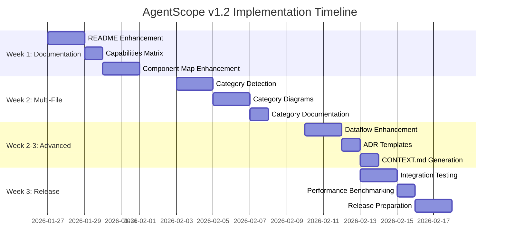

# AgentScope v1.2 Roadmap

> **Project**: AgentScope - Agent Architecture Documentation Tool
> **Version**: 1.2
> **Timeline**: 2-3 weeks
> **Status**: Planning Complete

---

## Overview

This roadmap outlines the phased implementation of AgentScope v1.2 features with clear milestones, dependencies, and acceptance criteria.

## Visual Timeline



---

## Phase 1: Enhanced Documentation Output (Week 1)

### Objective
Generate professional-quality documentation that matches `/examples/` style exactly.

### Milestone 1.1: README.md Enhancement

**Timeline**: Days 1-2 (Jan 27-28)

| Task | Owner | Estimated | Status |
|------|-------|-----------|--------|
| Quick Stats Section | Coder | 2h | Not Started |
| System Overview Diagram | Coder | 3h | Not Started |
| Agents Comparison Table | Coder | 4h | Not Started |
| Unit Tests | Tester | 2h | Not Started |

**Deliverables**:
- [ ] Quick Stats section with 7 entity counts
- [ ] System Overview Mermaid diagram with category subgraphs
- [ ] Agents Comparison dense table with all agents
- [ ] Unit tests for formatting functions
- [ ] Snapshot test for README structure

**Acceptance Criteria**:
- README.md matches `/workspaces/agentscope/examples/README-example.md` structure
- All sections auto-generated from scanned data
- Test coverage >90% for new formatting code

---

### Milestone 1.2: Capabilities Matrix & Delegation Hierarchy

**Timeline**: Day 3 (Jan 29)

| Task | Owner | Estimated | Status |
|------|-------|-----------|--------|
| Capabilities Matrix Generator | Coder | 2h | Not Started |
| Delegation Hierarchy Section | Coder | 3h | Not Started |
| Snapshot Tests | Tester | 2h | Not Started |

**Deliverables**:
- [ ] Capabilities Matrix showing agent capabilities
- [ ] Delegation Hierarchy collapsible section
- [ ] Snapshot tests for matrix and hierarchy

**Acceptance Criteria**:
- Matrix shows capabilities (writes code, reviews, tests, deploys, security)
- Hierarchy shows parent/subagent relationships
- Collapsible sections render correctly on GitHub

---

### Milestone 1.3: Component Map & Hierarchy Enhancements

**Timeline**: Days 4-5 (Jan 30-31)

| Task | Owner | Estimated | Status |
|------|-------|-----------|--------|
| Component Map Generator | Coder | 4h | Not Started |
| Hierarchy Diagram Generator | Coder | 3h | Not Started |
| Integration Tests | Tester | 3h | Not Started |

**Deliverables**:
- [ ] component-map.md with full system diagram
- [ ] hierarchy.md with delegation tree and tables
- [ ] Integration tests for diagram generation

**Acceptance Criteria**:
- component-map.md matches `examples/component-map-example.md`
- hierarchy.md matches `examples/hierarchy-example.md`
- All Mermaid diagrams render correctly

**Phase 1 Completion**: Feb 1, 2026

---

## Phase 2: Multi-File Diagram Support (Week 2)

### Objective
Enable category-based documentation for large agent systems (>10 agents).

### Milestone 2.1: Category Detection

**Timeline**: Days 1-2 (Feb 3-4)

| Task | Owner | Estimated | Status |
|------|-------|-----------|--------|
| Category Extraction from Frontmatter | Coder | 2h | Not Started |
| Auto-Categorization Logic | Coder | 3h | Not Started |
| Unit Tests | Tester | 2h | Not Started |

**Deliverables**:
- [ ] Extract `category` field from agent frontmatter
- [ ] Auto-categorize agents without explicit category
- [ ] Unit tests for categorization logic

**Acceptance Criteria**:
- Categories extracted from frontmatter
- Fallback categorization works (GitHub, Security, Development, Testing)
- Test coverage >90%

---

### Milestone 2.2: Category Diagram Generation

**Timeline**: Days 3-4 (Feb 5-6)

| Task | Owner | Estimated | Status |
|------|-------|-----------|--------|
| Category Diagram Generator | Coder | 5h | Not Started |
| Category Formatter | Coder | 4h | Not Started |
| Snapshot Tests | Tester | 3h | Not Started |

**Deliverables**:
- [ ] Generate per-category Mermaid diagrams
- [ ] Category documentation formatter
- [ ] Snapshot tests for category diagrams

**Acceptance Criteria**:
- Each category has own diagram
- Category diagrams show agents, delegations, cross-category dependencies
- Diagrams render correctly

---

### Milestone 2.3: Category Documentation Output

**Timeline**: Day 5 (Feb 7)

| Task | Owner | Estimated | Status |
|------|-------|-----------|--------|
| Category File Writer | Coder | 2h | Not Started |
| README Integration | Coder | 2h | Not Started |
| Integration Tests | Tester | 3h | Not Started |

**Deliverables**:
- [ ] Write category files to `categories/` directory
- [ ] Integrate category links into main README.md
- [ ] Integration tests for multi-file output

**Acceptance Criteria**:
- Category files written to `docs/agent-architecture/categories/`
- Each category file matches `examples/categories/github-example.md` style
- Navigation links functional

**Phase 2 Completion**: Feb 8, 2026

---

## Phase 3: Dataflow Enhancement & Templates (Week 2-3)

### Objective
Improve dataflow diagram and add architectural documentation templates.

### Milestone 3.1: Enhanced Dataflow Diagram

**Timeline**: Days 1-2 (Feb 10-11)

| Task | Owner | Estimated | Status |
|------|-------|-----------|--------|
| Data Source Identification | Coder | 3h | Not Started |
| Data Transformation Mapping | Coder | 4h | Not Started |
| Dataflow Diagram Generator | Coder | 4h | Not Started |
| Snapshot Tests | Tester | 2h | Not Started |

**Deliverables**:
- [ ] Identify data sources (user, config, MCP)
- [ ] Map data transformations (parse, validate, generate)
- [ ] Generate enhanced dataflow Mermaid diagram
- [ ] Snapshot tests for dataflow diagram

**Acceptance Criteria**:
- Dataflow shows data (not just control flow)
- Data formats labeled (JSON, Markdown, Mermaid)
- Transformations clearly annotated

---

### Milestone 3.2: ADR Template Generation

**Timeline**: Day 3 (Feb 12)

| Task | Owner | Estimated | Status |
|------|-------|-----------|--------|
| ADR Scanner | Coder | 3h | Not Started |
| ADR Index Generator | Coder | 2h | Not Started |
| Unit Tests | Tester | 2h | Not Started |

**Deliverables**:
- [ ] Scan `/docs/adr/` and `/docs/architecture/decisions/` for ADRs
- [ ] Generate ADR index README.md
- [ ] Unit tests for ADR scanning

**Acceptance Criteria**:
- ADR index auto-generated
- Templates follow MADR 3.0 format
- Links to existing ADRs functional

---

### Milestone 3.3: CONTEXT.md Generation

**Timeline**: Day 4 (Feb 13)

| Task | Owner | Estimated | Status |
|------|-------|-----------|--------|
| CONTEXT.md Generator | Coder | 3h | Not Started |
| arc42 Section Formatting | Coder | 2h | Not Started |
| Integration Tests | Tester | 2h | Not Started |

**Deliverables**:
- [ ] Generate CONTEXT.md with arc42 sections 1-3
- [ ] Auto-populate from scanned data
- [ ] Integration tests for CONTEXT.md

**Acceptance Criteria**:
- CONTEXT.md includes arc42 sections 1-3
- Auto-populated with agent/skill/MCP data
- System boundary clearly defined

**Phase 3 Completion**: Feb 14, 2026

---

## Phase 4: Testing, Polish & Release (Week 3)

### Objective
Comprehensive testing, performance optimization, and release preparation.

### Milestone 4.1: Integration Testing

**Timeline**: Days 1-2 (Feb 13-14)

| Task | Owner | Estimated | Status |
|------|-------|-----------|--------|
| E2E Test Suite | Tester | 6h | Not Started |
| Regression Testing | Tester | 4h | Not Started |
| Bug Fixes | Coder | 4h | Not Started |

**Deliverables**:
- [ ] E2E tests for all v1.2 features
- [ ] Regression tests for v1.1 features
- [ ] Bug fixes for discovered issues

**Acceptance Criteria**:
- All tests passing
- Test coverage >85%
- No regressions in v1.1 features

---

### Milestone 4.2: Performance Benchmarking

**Timeline**: Day 3 (Feb 15)

| Task | Owner | Estimated | Status |
|------|-------|-----------|--------|
| Benchmark Suite | Coder | 3h | Not Started |
| Performance Optimization | Coder | 3h | Not Started |
| Benchmark Documentation | Reviewer | 2h | Not Started |

**Deliverables**:
- [ ] Benchmark suite for scan performance
- [ ] Performance optimizations if needed
- [ ] Benchmark documentation

**Acceptance Criteria**:
- Scan performance <3s for 50 components
- No performance regressions from v1.1

---

### Milestone 4.3: Release Preparation

**Timeline**: Days 4-5 (Feb 16-17)

| Task | Owner | Estimated | Status |
|------|-------|-----------|--------|
| Documentation Review | Reviewer | 3h | Not Started |
| CHANGELOG Update | Reviewer | 1h | Not Started |
| Version Bump | Coder | 1h | Not Started |
| npm Publish | Coder | 1h | Not Started |
| GitHub Release | Coder | 1h | Not Started |

**Deliverables**:
- [ ] Documentation reviewed and updated
- [ ] CHANGELOG.md updated with v1.2 changes
- [ ] Version bumped to 1.2.0
- [ ] npm package published
- [ ] GitHub release created

**Acceptance Criteria**:
- All documentation accurate and up-to-date
- CHANGELOG follows Keep a Changelog format
- npm package published successfully
- GitHub release includes all changes

**Phase 4 Completion / v1.2 Release**: Feb 17, 2026

---

## Critical Path

The critical path for v1.2 implementation:

```
README Enhancement (2d)
  ↓
Component Map Enhancement (2d)
  ↓
Category Detection (2d)
  ↓
Category Diagram Generation (2d)
  ↓
Dataflow Enhancement (2d)
  ↓
Integration Testing (2d)
  ↓
Release (2d)
```

**Total Critical Path**: 14 days (2 weeks)

---

## Dependencies

### Cross-Phase Dependencies

| From | To | Dependency |
|------|-----|-----------|
| Phase 1 (README) | Phase 2 (Categories) | Category links in README |
| Phase 2 (Categories) | Phase 3 (Dataflow) | Category data for dataflow |
| Phase 1-3 (All Features) | Phase 4 (Testing) | All features complete for E2E tests |

### External Dependencies

- **No new npm packages** required
- **No breaking changes** to existing APIs
- **Backward compatible** with v1.1

---

## Risk Mitigation

### High-Risk Areas

| Area | Risk | Mitigation |
|------|------|-----------|
| **Category Detection Logic** | Complex edge cases | Comprehensive unit tests, fallback categorization |
| **Multi-File Output** | File system errors | Error handling, integration tests |
| **Performance** | Slowdown with many files | Benchmark suite, performance optimization |

### Contingency Plans

| Scenario | Contingency |
|----------|-------------|
| Phase runs over time | Reduce scope, move features to v1.3 |
| Critical bug discovered | Hot-fix release, delay v1.2 launch |
| Performance regression | Optimize or revert problematic changes |

---

## Communication Plan

### Daily Standup (Memory-Based)

Each agent updates task status daily:
```bash
npx @claude-flow/cli@latest memory store \
  --key "task-status-[date]" \
  --value "[agent-name]: [task] - [status] - [blockers]" \
  --namespace v1.2-coordination
```

### Weekly Review

Every Friday, review:
- [ ] Tasks completed vs. planned
- [ ] Blockers and resolutions
- [ ] Upcoming week priorities
- [ ] Risk assessment updates

### Blocker Escalation

If blocked for >4 hours:
1. Report blocker via memory notification
2. Escalate to planning coordinator
3. Convene relevant agents for resolution

---

## Success Metrics (Tracked Daily)

| Metric | Target | Current | Trend |
|--------|--------|---------|-------|
| Tasks Completed | 100% | TBD | - |
| Test Coverage | >85% | TBD | - |
| Performance | <3s scan | TBD | - |
| Documentation Quality | 100% example match | TBD | - |

---

## Version History

| Version | Date | Changes |
|---------|------|---------|
| 1.0 | 2026-01-25 | Initial roadmap created |

---

*Roadmap managed by Strategic Planning Agent | Updated: 2026-01-25*
