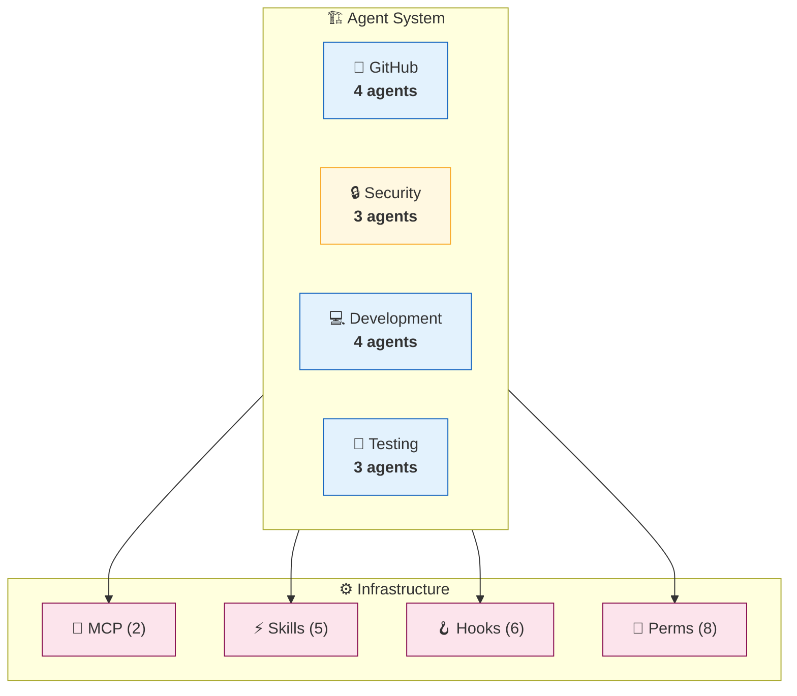
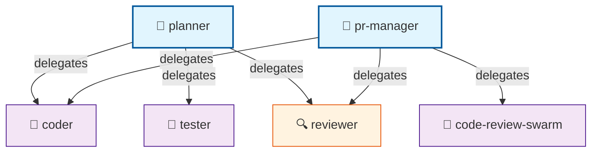

# Agent Architecture Documentation

> Generated by AgentScope v0.1.0 | Schema 2026.01 | [Full Diagram](./component-map-example.md) | [Hierarchy](./hierarchy-example.md) | [Themes](./theme-examples.md)

## Quick Stats

| Component | Count | Details |
|-----------|------:|---------|
| 🤖 Agents | 14 | [View all →](#agents-comparison) |
| ⚡ Skills | 5 | [View all →](#skills) |
| 🔌 MCP Servers | 2 | [View all →](#mcp-servers) |
| 🪝 Hooks | 6 | [View all →](#hooks) |
| ⌘ Commands | 3 | [View all →](#commands) |
| 🧩 Plugins | 2 | [View all →](#plugins) |
| 🔐 Permissions | 8 | [View all →](#permissions) |

**Scanned:** 2026-01-22 14:32:05 UTC | **Duration:** 1.2s | **Files:** 47

---

## System Overview



**Drill into categories:**

| Category | Agents | 👑 | 🤖 | 🎯 | 🔍 | Details |
|----------|-------:|---:|---:|---:|---:|---------|
| 🐙 GitHub | 4 | 1 | 3 | 0 | 0 | [→ github.md](./categories/github-example.md) |
| 🔒 Security | 3 | 0 | 0 | 3 | 0 | [→ security.md](./categories/security-example.md) |
| 💻 Development | 4 | 1 | 3 | 0 | 0 | [→ development.md](#) |
| 🧪 Testing | 3 | 0 | 2 | 0 | 1 | [→ testing.md](#) |

---

## Agents Comparison

### Dense Table (All Agents)

| Agent | Cat | Type | Delegates To | Tools | Description |
|-------|-----|------|--------------|-------|-------------|
| pr-manager | 🐙 | 👑 | reviewer, coder, code-review-swarm | github | PR lifecycle management |
| code-review-swarm | 🐙 | 🤖 | — | github | Multi-agent code review |
| issue-tracker | 🐙 | 🤖 | — | github | Issue management and triage |
| release-manager | 🐙 | 🤖 | — | github | Release automation |
| security-auditor | 🔒 | 🎯 | — | — | CVE and OWASP scanning |
| pii-detector | 🔒 | 🎯 | — | — | PII and secrets detection |
| claims-authorizer | 🔒 | 🎯 | — | — | RBAC access control |
| planner | 💻 | 👑 | coder, tester, reviewer | — | Task orchestration |
| coder | 💻 | 🤖 | — | claude-flow, filesystem | Code implementation |
| backend-dev | 💻 | 🤖 | — | claude-flow | API development |
| ml-developer | 💻 | 🤖 | — | — | ML model development |
| tester | 🧪 | 🤖 | — | — | Test writing and execution |
| reviewer | 🧪 | 🔍 | — | — | Code review and quality |
| production-validator | 🧪 | 🤖 | — | — | Production readiness checks |

**Legend:** 👑 Coordinator | 🤖 Worker | 🔍 Reviewer | 🎯 Specialist

---

### Capabilities Matrix

| Agent | Writes Code | Reviews | Tests | Deploys | Security | API |
|-------|:-----------:|:-------:|:-----:|:-------:|:--------:|:---:|
| pr-manager | | ✓ | | ✓ | | |
| code-review-swarm | | ✓ | | | | |
| security-auditor | | ✓ | | | ✓ | |
| pii-detector | | | | | ✓ | |
| claims-authorizer | | | | | ✓ | ✓ |
| planner | | | | | | |
| coder | ✓ | | | | | |
| backend-dev | ✓ | | | | | ✓ |
| ml-developer | ✓ | | | | | |
| tester | | | ✓ | | | |
| reviewer | | ✓ | | | | |
| production-validator | | ✓ | ✓ | | | |
| release-manager | | | | ✓ | | |

---

### Delegation Hierarchy

<details>
<summary>📊 Click to expand hierarchy</summary>



**Shared workers:** `coder` and `reviewer` accept tasks from both `planner` and `pr-manager`.

</details>

---

## Skills

| Skill | Category | Agents Using | Description |
|-------|----------|--------------|-------------|
| github-code-review | GitHub | reviewer, pr-manager | Code review automation |
| sparc-methodology | SPARC | planner | Structured development |
| pair-programming | Development | coder | Collaborative coding |
| verification-quality | Testing | tester, reviewer | Quality assurance |
| browser | Automation | — | Browser automation |

<details>
<summary>⚡ Skill Details</summary>

### github-code-review

**Status:** 🟢 Enabled
**Path:** `.claude/skills/github-code-review/SKILL.md`

Code review automation with multi-agent analysis and security scanning.

**Triggers:**
- `PR created`
- `review requested`

### sparc-methodology

**Status:** 🟢 Enabled
**Path:** `.claude/skills/sparc-methodology/SKILL.md`

Structured development using Specification, Pseudocode, Architecture, Refinement, and Completion phases.

**Triggers:**
- `/sparc` command

### pair-programming

**Status:** 🟢 Enabled
**Path:** `.claude/skills/pair-programming/SKILL.md`

Collaborative coding with driver/navigator mode switching and real-time verification.

**Triggers:**
- `/pair` command

### verification-quality

**Status:** 🟢 Enabled
**Path:** `.claude/skills/verification-quality/SKILL.md`

Quality assurance with truth scoring and automatic rollback at 0.95 accuracy threshold.

**Triggers:**
- `test completion`
- `PR review`

### browser

**Status:** 🟢 Enabled
**Path:** `.claude/skills/browser/SKILL.md`

Browser automation with AI-optimized snapshots for web scraping and testing.

**Triggers:**
- `web scraping tasks`

</details>

---

## MCP Servers

| Server | Status | Transport | Command | Tools Provided |
|--------|:------:|-----------|---------|----------------|
| claude-flow | 🟢 | stdio | `npx @claude-flow/cli` | swarm, memory, agents |
| github | 🟢 | stdio | `npx @github/mcp` | issues, prs, repos |

<details>
<summary>🔌 Server Details</summary>

### claude-flow

**Status:** 🟢 Enabled
**Type:** stdio

**Command:**
```bash
npx @claude-flow/cli mcp start
```

**Environment Variables:**
- `CLAUDE_FLOW_MODE`: `v3`
- `CLAUDE_FLOW_HOOKS_ENABLED`: `true`
- `CLAUDE_FLOW_TOPOLOGY`: `hierarchical-mesh`

**Provides Tools:**
- `swarm_init` — Initialize multi-agent swarms
- `agent_spawn` — Spawn specialized agents
- `memory_search` — Semantic memory search
- `task_orchestrate` — Task orchestration

### github

**Status:** 🟢 Enabled
**Type:** stdio

**Command:**
```bash
npx @github/mcp
```

**Provides Tools:**
- `create_pull_request` — Create PRs
- `get_issue` — Read issues
- `search_repositories` — Search repos

</details>

---

## Hooks

| Event | Matcher | Type | Timeout | Status |
|-------|---------|------|--------:|:------:|
| PreToolUse | `^(Write\|Edit\|MultiEdit)$` | command | 5s | 🟢 |
| PreToolUse | `^Bash$` | command | 5s | 🟢 |
| PreToolUse | `^Task$` | command | 5s | 🟢 |
| PostToolUse | `^(Write\|Edit\|MultiEdit)$` | command | 5s | 🟢 |
| PostToolUse | `^Bash$` | command | 5s | 🟢 |
| SessionStart | — | command | 10s | 🟢 |

<details>
<summary>🪝 Hook Details</summary>

### PreToolUse: Write/Edit/MultiEdit

Runs pre-edit hook to capture file context before modifications.

```json
{
  "type": "command",
  "command": "npx @claude-flow/cli hooks pre-edit --file \"$TOOL_INPUT_file_path\"",
  "timeout": 5000,
  "matcher": "^(Write|Edit|MultiEdit)$"
}
```

### PreToolUse: Bash

Validates and logs bash commands before execution.

```json
{
  "type": "command",
  "command": "npx @claude-flow/cli hooks pre-command --command \"$TOOL_INPUT_command\"",
  "timeout": 5000,
  "matcher": "^Bash$"
}
```

### PreToolUse: Task

Routes task to optimal agent with pre-task intelligence.

```json
{
  "type": "command",
  "command": "npx @claude-flow/cli hooks pre-task --description \"$TOOL_INPUT_prompt\"",
  "timeout": 5000,
  "matcher": "^Task$"
}
```

### PostToolUse: Write/Edit/MultiEdit

Records edit outcome and optionally trains neural patterns.

```json
{
  "type": "command",
  "command": "npx @claude-flow/cli hooks post-edit --file \"$TOOL_INPUT_file_path\" --success \"$TOOL_SUCCESS\"",
  "timeout": 5000,
  "matcher": "^(Write|Edit|MultiEdit)$"
}
```

### PostToolUse: Bash

Records command execution outcome for metrics tracking.

```json
{
  "type": "command",
  "command": "npx @claude-flow/cli hooks post-command --command \"$TOOL_INPUT_command\" --success \"$TOOL_SUCCESS\"",
  "timeout": 5000,
  "matcher": "^Bash$"
}
```

### SessionStart

Starts the daemon and restores previous session state.

```json
{
  "type": "command",
  "command": "npx @claude-flow/cli daemon start --quiet && npx @claude-flow/cli hooks session-restore --session-id \"$SESSION_ID\"",
  "timeout": 10000
}
```

</details>

---

## Commands

| Command | Description | Allowed Tools | Disallowed Tools |
|---------|-------------|---------------|------------------|
| /commit | Create git commit with AI message | Bash, Read | Write, Edit |
| /review-pr | Review pull request changes | Read, Grep, Glob | Bash |
| /deploy | Deploy to staging environment | Bash | — |

<details>
<summary>⌘ Command Details</summary>

### /commit

Creates a git commit with an AI-generated message based on staged changes.

**Allowed:** `Bash`, `Read`
**Disallowed:** `Write`, `Edit`

### /review-pr

Reviews pull request changes with security and code quality checks.

**Allowed:** `Read`, `Grep`, `Glob`
**Disallowed:** `Bash`

### /deploy

Deploys the current branch to staging environment with validation.

**Allowed:** `Bash`
**Disallowed:** None

</details>

---

## Plugins

| Plugin | Marketplace | Status | Version | Description |
|--------|-------------|:------:|---------|-------------|
| sparc-modes | anthropic | 🟢 | 1.2.0 | SPARC methodology modes |
| github-enhanced | community | 🟢 | 2.0.1 | Enhanced GitHub integration |

<details>
<summary>🧩 Plugin Details</summary>

### sparc-modes@anthropic

**Source:** `github:anthropic/sparc-modes`
**Status:** Enabled
**Version:** 1.2.0

Provides SPARC methodology modes for structured development including specification, pseudocode, architecture, refinement, and completion phases.

### github-enhanced@community

**Source:** `npm:@community/github-enhanced`
**Status:** Enabled
**Version:** 2.0.1

Enhanced GitHub integration with advanced PR management, issue tracking, and release automation features.

</details>

---

## Permissions

**Default Mode:** `default` | **Total Rules:** 8

| Type | Count | Description |
|------|------:|-------------|
| ✅ Allow | 4 | Permitted operations |
| ❌ Deny | 2 | Blocked operations |
| ❓ Ask | 2 | Prompt for confirmation |

<details>
<summary>🔐 Permission Rules</summary>

### Allow Rules (4)

| Pattern | Description |
|---------|-------------|
| `Bash(npm run:*)` | Allow npm scripts |
| `Bash(git *)` | Allow git commands |
| `Read(./src/**)` | Allow reading source files |
| `Write(./src/**)` | Allow writing source files |

### Deny Rules (2)

| Pattern | Description |
|---------|-------------|
| `Read(./.env)` | Block reading environment secrets |
| `Read(./secrets/**)` | Block reading secrets directory |

### Ask Rules (2)

| Pattern | Description |
|---------|-------------|
| `Bash(rm *)` | Confirm file deletions |
| `Write(./.claude/*)` | Confirm config changes |

### Additional Scoped Directories

- `./scripts` — Utility scripts
- `./docs` — Documentation

</details>

---

## Dependencies

| Dependency | Type | Required |
|------------|------|:--------:|
| Node.js | Runtime | ≥20.0.0 |
| npm | Package Manager | ≥9.0.0 |
| Git | Version Control | ≥2.0.0 |

---

## Quick Navigation

| Section | Description | Link |
|---------|-------------|------|
| 📊 Full Component Map | All agents with relationships | [→ component-map.md](./component-map-example.md) |
| 🏛️ Hierarchy Diagram | Delegation chains | [→ hierarchy.md](./hierarchy-example.md) |
| 📋 Comparison Tables | Dense tables for all entities | [→ comparison-tables.md](./comparison-tables-example.md) |
| 🎨 Theme Examples | All 6 theme variants | [→ themes.md](./theme-examples.md) |
| 🐙 GitHub Category | 4 GitHub-related agents | [→ categories/github.md](./categories/github-example.md) |
| 🔒 Security Category | 3 security agents | [→ categories/security.md](./categories/security-example.md) |
| 🪝 Hooks Configuration | 6 lifecycle hooks | [→ #hooks](#hooks) |
| ⌘ Commands | 3 slash commands | [→ #commands](#commands) |
| 🧩 Plugins | 2 installed plugins | [→ #plugins](#plugins) |
| 🔐 Permissions | 8 access rules | [→ #permissions](#permissions) |
| 📦 Export Data | Raw JSON config | [→ config.json](./sample-config.json) |
