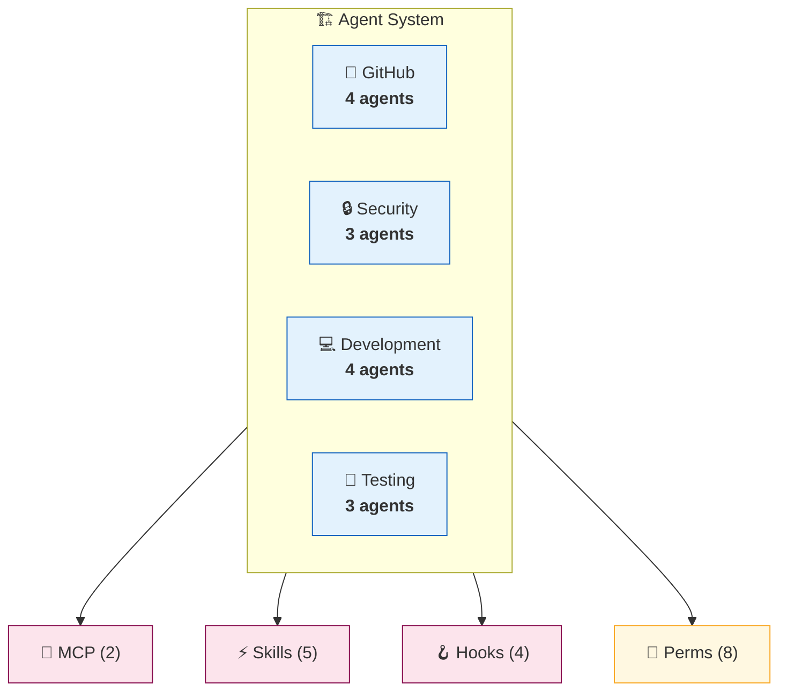
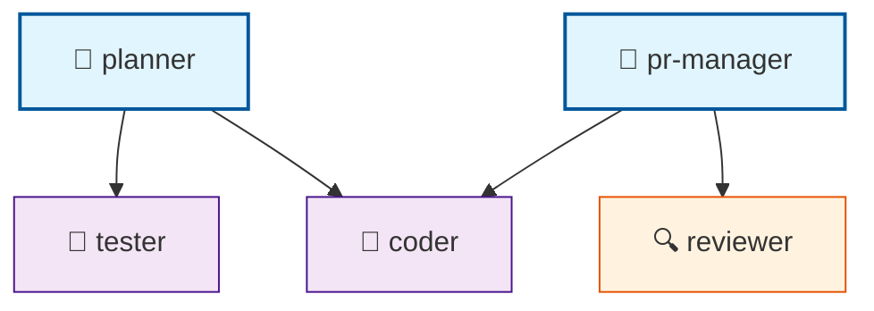

# Agent Architecture Documentation

> Generated by AgentScope v0.1.0 | Schema 2026.01 | [Full Diagram](./component-map-example.md) | [Hierarchy](./hierarchy-example.md)

## Quick Stats

| Component | Count | Details |
|-----------|------:|---------|
| 🤖 Agents | 14 | [View all →](#agents-comparison) |
| ⚡ Skills | 5 | [View all →](#skills) |
| 🔌 MCP Servers | 2 | [View all →](#mcp-servers) |
| 🪝 Hooks | 4 | [View all →](#hooks) |
| ⌘ Commands | 3 | [View all →](#commands) |
| 🧩 Plugins | 2 | [View all →](#plugins) |
| 🔐 Permissions | 8 | [View all →](#permissions) |

**Scanned:** 2026-01-22 14:32:05 UTC | **Duration:** 1.2s | **Files:** 47

---

## System Overview



**Drill into categories:**

| Category | Agents | Coordinators | Workers | Details |
|----------|-------:|-------------:|--------:|---------|
| 🐙 GitHub | 4 | 1 | 3 | [→ github.md](./categories/github-example.md) |
| 🔒 Security | 3 | 0 | 3 | [→ security.md](./categories/security-example.md) |
| 💻 Development | 4 | 1 | 3 | [→ development.md](#) |
| 🧪 Testing | 3 | 0 | 3 | [→ testing.md](#) |

---

## Agents Comparison

### Dense Table (All Agents)

| Agent | Cat | Type | Delegates To | Tools | Description |
|-------|-----|------|--------------|-------|-------------|
| pr-manager | 🐙 | 👑 | reviewer, coder | github | PR lifecycle management |
| code-review-swarm | 🐙 | 🤖 | — | github | Multi-agent code review |
| issue-tracker | 🐙 | 🤖 | — | github | Issue management |
| release-manager | 🐙 | 🤖 | — | github | Release automation |
| security-auditor | 🔒 | 🤖 | — | — | Security scanning |
| pii-detector | 🔒 | 🤖 | — | — | PII detection |
| claims-authorizer | 🔒 | 🤖 | — | — | Access control |
| coder | 💻 | 🤖 | — | filesystem | Code implementation |
| planner | 💻 | 👑 | coder, tester | — | Task planning |
| backend-dev | 💻 | 🤖 | — | — | API development |
| ml-developer | 💻 | 🤖 | — | — | ML model development |
| tester | 🧪 | 🤖 | — | — | Test writing |
| reviewer | 🧪 | 🔍 | — | — | Code review |
| production-validator | 🧪 | 🤖 | — | — | Production readiness |

**Legend:** 👑 Coordinator | 🤖 Worker | 🔍 Reviewer | 🎯 Specialist

---

### Capabilities Matrix

| Agent | Writes Code | Reviews | Tests | Deploys | Security |
|-------|:-----------:|:-------:|:-----:|:-------:|:--------:|
| pr-manager | | ✓ | | ✓ | |
| coder | ✓ | | | | |
| tester | | | ✓ | | |
| reviewer | | ✓ | | | |
| security-auditor | | ✓ | | | ✓ |
| backend-dev | ✓ | | | | |
| release-manager | | | | ✓ | |

---

### Delegation Hierarchy

<details>
<summary>📊 Click to expand hierarchy</summary>



</details>

---

## Skills

| Skill | Category | Agents Using | Description |
|-------|----------|--------------|-------------|
| github-code-review | GitHub | reviewer, pr-manager | Code review automation |
| sparc-methodology | SPARC | planner | Structured development |
| pair-programming | Development | coder | Collaborative coding |
| verification-quality | Testing | tester, reviewer | Quality assurance |
| browser | Automation | — | Browser automation |

---

## MCP Servers

| Server | Status | Command | Tools Provided |
|--------|:------:|---------|----------------|
| claude-flow | 🟢 | `npx @claude-flow/cli` | swarm, memory, agents |
| github | 🟢 | `npx @github/mcp` | issues, prs, repos |

---

## Hooks

| Event | Matcher | Type | Timeout | Status |
|-------|---------|------|--------:|:------:|
| PreToolUse | `Bash` | command | 10s | 🟢 |
| PostToolUse | `*` | command | 5s | 🟢 |
| Notification | — | prompt | 30s | 🟢 |
| Stop | — | command | 5s | 🟢 |

<details>
<summary>🪝 Hook Details</summary>

### PreToolUse: Bash

Validates bash commands before execution.

```json
{
  "type": "command",
  "command": "node ./scripts/validate-bash.js",
  "timeout": 10,
  "matcher": "Bash"
}
```

### PostToolUse: All Tools

Logs tool usage for analytics.

```json
{
  "type": "command",
  "command": "node ./scripts/log-tool-usage.js",
  "timeout": 5
}
```

### Notification Handler

Sends notifications via Slack integration.

```json
{
  "type": "prompt",
  "prompt": "Summarize the notification: $ARGUMENTS",
  "timeout": 30
}
```

</details>

---

## Commands

| Command | Description | Allowed Tools | Disallowed Tools |
|---------|-------------|---------------|------------------|
| /commit | Create git commit with AI message | Bash, Read | Write, Edit |
| /review-pr | Review pull request changes | Read, Grep, Glob | Bash |
| /deploy | Deploy to staging environment | Bash | — |

<details>
<summary>⌘ Command Details</summary>

### /commit

Creates a git commit with an AI-generated message based on staged changes.

**Allowed:** `Bash`, `Read`
**Disallowed:** `Write`, `Edit`

### /review-pr

Reviews pull request changes with security and code quality checks.

**Allowed:** `Read`, `Grep`, `Glob`
**Disallowed:** `Bash`

### /deploy

Deploys the current branch to staging environment with validation.

**Allowed:** `Bash`
**Disallowed:** None

</details>

---

## Plugins

| Plugin | Marketplace | Status | Version | Description |
|--------|-------------|:------:|---------|-------------|
| sparc-modes | anthropic | 🟢 | 1.2.0 | SPARC methodology modes |
| github-enhanced | community | 🟢 | 2.0.1 | Enhanced GitHub integration |

<details>
<summary>🧩 Plugin Details</summary>

### sparc-modes@anthropic

**Source:** `github:anthropic/sparc-modes`
**Status:** Enabled
**Version:** 1.2.0

Provides SPARC methodology modes for structured development including specification, pseudocode, architecture, refinement, and completion phases.

### github-enhanced@community

**Source:** `npm:@community/github-enhanced`
**Status:** Enabled
**Version:** 2.0.1

Enhanced GitHub integration with advanced PR management, issue tracking, and release automation features.

</details>

---

## Permissions

**Default Mode:** `default` | **Total Rules:** 8

| Type | Count | Description |
|------|------:|-------------|
| ✅ Allow | 4 | Permitted operations |
| ❌ Deny | 2 | Blocked operations |
| ❓ Ask | 2 | Prompt for confirmation |

<details>
<summary>🔐 Permission Rules</summary>

### Allow Rules (4)

| Pattern | Description |
|---------|-------------|
| `Bash(npm run:*)` | Allow npm scripts |
| `Bash(git *)` | Allow git commands |
| `Read(./src/**)` | Allow reading source files |
| `Write(./src/**)` | Allow writing source files |

### Deny Rules (2)

| Pattern | Description |
|---------|-------------|
| `Read(./.env)` | Block reading environment secrets |
| `Read(./secrets/**)` | Block reading secrets directory |

### Ask Rules (2)

| Pattern | Description |
|---------|-------------|
| `Bash(rm *)` | Confirm file deletions |
| `Write(./.claude/*)` | Confirm config changes |

### Additional Scoped Directories

- `./scripts` — Utility scripts
- `./docs` — Documentation

</details>

---

## Dependencies

| Dependency | Type | Required |
|------------|------|:--------:|
| Node.js | Runtime | ≥20.0.0 |
| npm | Package Manager | ≥9.0.0 |
| Git | Version Control | ≥2.0.0 |

---

## Quick Navigation

| Section | Description | Link |
|---------|-------------|------|
| 📊 Full Component Map | All agents with relationships | [→ component-map.md](./component-map-example.md) |
| 🏛️ Hierarchy Diagram | Delegation chains | [→ hierarchy.md](./hierarchy-example.md) |
| 🐙 GitHub Category | 4 GitHub-related agents | [→ categories/github.md](./categories/github-example.md) |
| 🔒 Security Category | 3 security agents | [→ categories/security.md](./categories/security-example.md) |
| 🪝 Hooks Configuration | 4 lifecycle hooks | [→ #hooks](#hooks) |
| ⌘ Commands | 3 slash commands | [→ #commands](#commands) |
| 🧩 Plugins | 2 installed plugins | [→ #plugins](#plugins) |
| 🔐 Permissions | 8 access rules | [→ #permissions](#permissions) |
| 📦 Export Data | Raw JSON config | [→ config.json](#) |
