# Component Map

[← Back to Overview](./README-example.md) | [Hierarchy →](./hierarchy-example.md)

---

## Full System Diagram

```mermaid
graph TB
    %% Agent Architecture Component Map

    subgraph github["🐙 GitHub (4)"]
        pr_manager["👑 pr-manager"]
        code_review_swarm["🤖 code-review-swarm"]
        issue_tracker["🤖 issue-tracker"]
        release_manager["🤖 release-manager"]
    end

    subgraph security["🔒 Security (3)"]
        security_auditor["🎯 security-auditor"]
        pii_detector["🎯 pii-detector"]
        claims_authorizer["🎯 claims-authorizer"]
    end

    subgraph development["💻 Development (4)"]
        planner["👑 planner"]
        coder["🤖 coder"]
        backend_dev["🤖 backend-dev"]
        ml_developer["🤖 ml-developer"]
    end

    subgraph testing["🧪 Testing (3)"]
        tester["🤖 tester"]
        reviewer["🔍 reviewer"]
        production_validator["🤖 production-validator"]
    end

    subgraph MCP["🔌 MCP Servers"]
        mcp_claude_flow["🟢 claude-flow"]
        mcp_github["🟢 github"]
    end

    subgraph Skills["⚡ Skills"]
        skill_github["github-code-review"]
        skill_sparc["sparc-methodology"]
        skill_pair["pair-programming"]
    end

    %% Delegation relationships (solid arrows)
    planner -->|delegates| coder
    planner -->|delegates| tester
    planner -->|delegates| reviewer
    pr_manager -->|delegates| code_review_swarm
    pr_manager -->|delegates| reviewer
    pr_manager -->|delegates| coder

    %% Tool connections (dashed arrows)
    pr_manager -.->|uses| mcp_github
    coder -.->|uses| mcp_claude_flow
    backend_dev -.->|uses| mcp_claude_flow
    code_review_swarm -.->|uses| mcp_github
    issue_tracker -.->|uses| mcp_github
    release_manager -.->|uses| mcp_github

    %% Skill connections (dotted arrows)
    pr_manager -.-> skill_github
    code_review_swarm -.-> skill_github
    planner -.-> skill_sparc
    coder -.-> skill_pair

    %% Styling
    classDef coord fill:#e1f5fe,stroke:#01579b,stroke-width:2px
    classDef worker fill:#f3e5f5,stroke:#4a148c
    classDef reviewer fill:#fff3e0,stroke:#e65100
    classDef specialist fill:#e8f5e9,stroke:#1b5e20
    classDef mcp fill:#fce4ec,stroke:#880e4f
    classDef skill fill:#e3f2fd,stroke:#0d47a1

    class planner,pr_manager coord
    class coder,backend_dev,ml_developer,code_review_swarm,issue_tracker,release_manager,tester,production_validator worker
    class reviewer reviewer
    class security_auditor,pii_detector,claims_authorizer specialist
    class mcp_claude_flow,mcp_github mcp
    class skill_github,skill_sparc,skill_pair skill
```

---

## Category Navigation

| Category | Agents | Diagram Section | Details |
|----------|-------:|-----------------|---------|
| 🐙 GitHub | 4 | [↑ github](#github) | [→ categories/github.md](./categories/github-example.md) |
| 🔒 Security | 3 | [↑ security](#security) | [→ categories/security.md](./categories/security-example.md) |
| 💻 Development | 4 | [↑ development](#development) | [→ categories/development.md](#) |
| 🧪 Testing | 3 | [↑ testing](#testing) | [→ categories/testing.md](#) |

---

## Legend

| Symbol | Meaning |
|--------|---------|
| 👑 | Coordinator (orchestrates other agents) |
| 🤖 | Worker (executes tasks) |
| 🔍 | Reviewer (validates work) |
| 🎯 | Specialist (domain expert) |
| 🟢 | Enabled MCP server |
| 🔴 | Disabled MCP server |
| `→` | Delegation (solid line) |
| `-.->` | Tool/Skill usage (dashed line) |

---

## Relationship Summary

| Relationship Type | Count | Example |
|-------------------|------:|---------|
| Delegations | 6 | planner → coder |
| Tool Usages | 6 | pr-manager → github MCP |
| Skill Usages | 4 | planner → sparc-methodology |

---

[← Back to Overview](./README-example.md)
