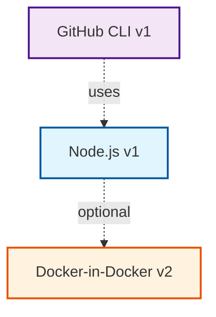
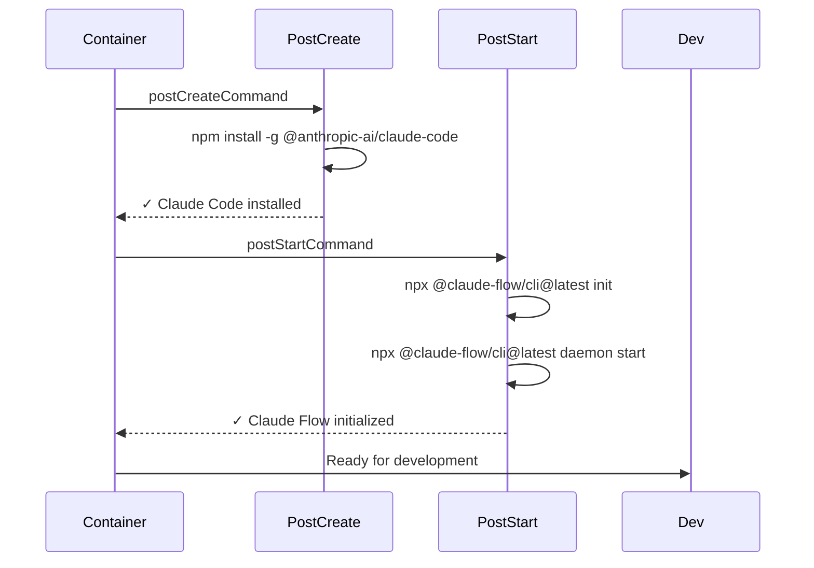

# DevContainer Implementation Example

This document demonstrates the practical implementation of the DevContainer scanning and documentation system following DDD-002 and ADR-008.

## Table of Contents

1. [Basic Usage](#basic-usage)
2. [Configuration Parsing Example](#configuration-parsing-example)
3. [DevContainer Scanning Example](#devcontainer-scanning-example)
4. [Documentation Generation Example](#documentation-generation-example)
5. [Lifecycle Hooks Example](#lifecycle-hooks-example)
6. [Complete End-to-End Example](#complete-end-to-end-example)

---

## Basic Usage

### Scanning a DevContainer

```bash
# Scan the DevContainer in the current directory
agentscope scan-devcontainer .devcontainer

# Scan a specific DevContainer configuration
agentscope scan-devcontainer /path/to/.devcontainer

# Scan with detailed output
agentscope scan-devcontainer .devcontainer --verbose

# Scan and export results as JSON
agentscope scan-devcontainer .devcontainer --format json --output scan-result.json
```

### Generating Documentation

```bash
# Generate comprehensive documentation
agentscope devcontainer-docs .devcontainer --output docs/devcontainer/

# Generate only specific sections
agentscope devcontainer-docs .devcontainer --sections features,security

# Use custom template
agentscope devcontainer-docs .devcontainer --template ./my-template.md
```

### Comparing Configurations

```bash
# Compare two DevContainers
agentscope compare-devcontainers .devcontainer ../project-b/.devcontainer

# Compare multiple projects
agentscope compare-devcontainers \
  project-a/.devcontainer \
  project-b/.devcontainer \
  project-c/.devcontainer \
  --output comparison-report.md
```

---

## Configuration Parsing Example

### Input: devcontainer.json

```json
{
  "name": "Claude Flow Dev",
  "image": "mcr.microsoft.com/devcontainers/base:bookworm",

  "features": {
    "ghcr.io/devcontainers/features/docker-in-docker:2": {
      "version": "latest",
      "enableNonRootDocker": "true",
      "moby": "true"
    },
    "ghcr.io/devcontainers/features/github-cli:1": {
      "installDirectlyFromGitHubRelease": true,
      "version": "latest"
    },
    "ghcr.io/devcontainers/features/node:1": {
      "nodeGypDependencies": true,
      "version": "lts",
      "pnpmVersion": "latest"
    }
  },

  "customizations": {
    "vscode": {
      "extensions": [
        "yzhang.markdown-all-in-one",
        "dbaeumer.vscode-eslint",
        "ms-vscode.vscode-typescript-next"
      ],
      "settings": {
        "editor.formatOnSave": true,
        "typescript.preferences.importModuleSpecifier": "relative"
      }
    }
  },

  "forwardPorts": [3000, 8080],

  "containerEnv": {
    "DOCKER_BUILDKIT": "1",
    "COMPOSE_DOCKER_CLI_BUILD": "1"
  },

  "postCreateCommand": "npm install -g @anthropic-ai/claude-code",
  "postStartCommand": "npx @claude-flow/cli@latest init --force && npx @claude-flow/cli@latest daemon start"
}
```

### Domain Model Representation

```typescript
// Parse external schema to domain model
const parser = new DevContainerParser();
const result = await parser.parseFile('.devcontainer/devcontainer.json');

if (result.isErr()) {
  console.error('Parse error:', result.unwrapErr());
  process.exit(1);
}

const config: DevContainerConfig = result.unwrap();

// Access domain types
console.log('Configuration ID:', config.id);
console.log('Name:', config.name); // "Claude Flow Dev"
console.log('Base Image:', config.image); // "mcr.microsoft.com/..."

// Features are strongly typed
config.features.forEach((feature: Feature) => {
  console.log('Feature:', feature.id);
  console.log('  Version:', feature.version.toString()); // "2.0.0"
  console.log('  Provider:', feature.provider); // "ghcr.io/devcontainers/features"
  console.log('  Options:', feature.options);
});

// Customizations
const vscode = config.customizations.vscode;
console.log('VS Code Extensions:', vscode.extensions.length); // 3
console.log('VS Code Settings:', Object.keys(vscode.settings).length); // 2

// Port mappings
config.forwardPorts.forEach((port: PortMapping) => {
  console.log(`Port: ${port.containerPort} -> ${port.hostPort ?? port.containerPort}`);
});

// Lifecycle commands
const postCreate = config.getLifecycleCommand('postCreateCommand');
console.log('Post-create command:', postCreate?.command);

// Environment validation
const envValidation = config.containerEnv.validate();
if (envValidation.hasSensitiveData()) {
  console.warn('Warning: Environment variables may contain sensitive data');
}
```

### Output

```
Configuration ID: config-1738000000-abc123
Name: Claude Flow Dev
Base Image: mcr.microsoft.com/devcontainers/base:bookworm

Feature: ghcr.io/devcontainers/features/docker-in-docker
  Version: 2.0.0
  Provider: ghcr.io/devcontainers/features
  Options: { version: "latest", enableNonRootDocker: "true", moby: "true" }

Feature: ghcr.io/devcontainers/features/github-cli
  Version: 1.0.0
  Provider: ghcr.io/devcontainers/features
  Options: { installDirectlyFromGitHubRelease: true, version: "latest" }

Feature: ghcr.io/devcontainers/features/node
  Version: 1.0.0
  Provider: ghcr.io/devcontainers/features
  Options: { nodeGypDependencies: true, version: "lts", pnpmVersion: "latest" }

VS Code Extensions: 3
VS Code Settings: 2

Port: 3000 -> 3000
Port: 8080 -> 8080

Post-create command: npm install -g @anthropic-ai/claude-code
```

---

## DevContainer Scanning Example

### Performing a Scan

```typescript
import { DevContainerScanner } from './core/scanners/devcontainer';

// Initialize scanner
const scanner = new DevContainerScanner({
  securityScanning: true,
  dependencyAnalysis: true,
  featureUpdates: true
});

// Perform scan
const scanResult: ScanResult = await scanner.scan('.devcontainer');

// Access scan results
console.log('Scan ID:', scanResult.id);
console.log('Scanned at:', scanResult.timestamp);
console.log('Configuration:', scanResult.config.name);

// Feature analysis
console.log('\n=== Feature Analysis ===');
scanResult.features.forEach((analysis: FeatureAnalysis) => {
  console.log(`${analysis.feature.id}:`);
  console.log(`  Security Rating: ${analysis.securityRating}`);
  console.log(`  Usage Count: ${analysis.usageCount}`);
  console.log(`  Dependencies: ${analysis.dependencies.length}`);

  if (analysis.updateAvailable) {
    console.log(`  ⚠️  Update available: ${analysis.updateAvailable}`);
  }
});

// Metrics
const metrics = scanResult.metrics;
console.log('\n=== Configuration Metrics ===');
console.log('Feature Count:', metrics.featureCount);
console.log('Extension Count:', metrics.extensionCount);
console.log('Port Count:', metrics.portCount);
console.log('Complexity Score:', metrics.complexityScore, '/100');
console.log('Security Score:', metrics.securityScore, '/100');

// Security issues
if (scanResult.securityIssues.length > 0) {
  console.log('\n=== Security Issues ===');
  scanResult.securityIssues.forEach((issue: SecurityIssue) => {
    console.log(`[${issue.severity.toUpperCase()}] ${issue.message}`);
    if (issue.remediation) {
      console.log(`  Remediation: ${issue.remediation}`);
    }
  });
}

// Recommendations
if (scanResult.recommendations.length > 0) {
  console.log('\n=== Recommendations ===');
  scanResult.recommendations.forEach((rec: Recommendation) => {
    console.log(`[${rec.priority.toUpperCase()}] ${rec.title}`);
    console.log(`  ${rec.description}`);
    if (rec.action) {
      console.log(`  Action: ${rec.action}`);
    }
  });
}
```

### Output

```
Scan ID: scan-1738000000-def456
Scanned at: 2026-01-25T19:52:00.000Z
Configuration: Claude Flow Dev

=== Feature Analysis ===
ghcr.io/devcontainers/features/docker-in-docker:
  Security Rating: medium-risk
  Usage Count: 1
  Dependencies: 0
  ⚠️  Update available: 2.1.0

ghcr.io/devcontainers/features/github-cli:
  Security Rating: safe
  Usage Count: 1
  Dependencies: 0

ghcr.io/devcontainers/features/node:
  Security Rating: safe
  Usage Count: 1
  Dependencies: 0
  ⚠️  Update available: 1.2.0

=== Configuration Metrics ===
Feature Count: 3
Extension Count: 3
Port Count: 2
Complexity Score: 42 /100
Security Score: 78 /100

=== Security Issues ===
[MEDIUM] Docker-in-Docker feature allows container privilege escalation
  Remediation: Ensure container security policies are in place

=== Recommendations ===
[HIGH] Update outdated features
  2 features have updates available: docker-in-docker (2.0.0 → 2.1.0), node (1.0.0 → 1.2.0)
  Action: Run feature update command or modify devcontainer.json

[MEDIUM] Add .dockerignore file
  No .dockerignore file detected. This can lead to larger image sizes.
  Action: Create .dockerignore to exclude node_modules, .git, etc.

[LOW] Consider using specific Node.js version
  Using "lts" for Node.js version. Consider pinning to specific version for reproducibility.
  Action: Change version from "lts" to specific version like "20.11.0"
```

---

## Documentation Generation Example

### Generating Documentation

```typescript
import { DocumentationGenerator } from './core/generators/devcontainer';

// Initialize generator
const generator = new DocumentationGenerator({
  includeDiagrams: true,
  includeComparisons: false,
  theme: 'light'
});

// Generate documentation
const document: DevContainerDocument = await generator.generate(scanResult, {
  sections: ['summary', 'features', 'security', 'lifecycle', 'recommendations'],
  format: 'markdown'
});

// Render to markdown
const markdown = document.render();

// Save to file
await fs.writeFile('docs/devcontainer/README.md', markdown);
```

### Generated Documentation Output

````markdown
# DevContainer Configuration: Claude Flow Dev

**Scanned:** 2026-01-25 at 19:52:00
**Base Image:** mcr.microsoft.com/devcontainers/base:bookworm
**Complexity Score:** 42/100 (Medium)
**Security Score:** 78/100 (Good)

## Table of Contents

- [Summary](#summary)
- [Features](#features)
- [Customizations](#customizations)
- [Security Analysis](#security-analysis)
- [Lifecycle Commands](#lifecycle-commands)
- [Recommendations](#recommendations)

---

## Summary

This DevContainer provides a comprehensive development environment for Claude Flow projects with:
- **3 features** installed (Docker, GitHub CLI, Node.js)
- **3 VS Code extensions** for enhanced development experience
- **2 forwarded ports** for local development
- **Lifecycle commands** for automatic agent initialization

### Statistics

| Metric | Value |
|--------|-------|
| Total Features | 3 |
| VS Code Extensions | 3 |
| Forwarded Ports | 2 |
| Environment Variables | 2 |
| Lifecycle Commands | 2 |

---

## Features

### Feature Dependency Graph



### Feature Details

#### 1. Docker-in-Docker (v2.0.0)

**Provider:** ghcr.io/devcontainers/features
**Security Rating:** ⚠️ Medium Risk
**Update Available:** ✅ v2.1.0

**Options:**
- `version`: latest
- `enableNonRootDocker`: true
- `moby`: true

**Description:** Enables Docker daemon inside the DevContainer for building and running containers.

**Security Considerations:**
- Grants container privileges that could be exploited
- Requires careful security policy configuration
- Consider alternatives like Docker-outside-of-Docker if possible

---

#### 2. GitHub CLI (v1.0.0)

**Provider:** ghcr.io/devcontainers/features
**Security Rating:** ✅ Safe

**Options:**
- `installDirectlyFromGitHubRelease`: true
- `version`: latest

**Description:** Provides `gh` command-line tool for GitHub API interactions.

---

#### 3. Node.js (v1.0.0)

**Provider:** ghcr.io/devcontainers/features
**Security Rating:** ✅ Safe
**Update Available:** ✅ v1.2.0

**Options:**
- `nodeGypDependencies`: true
- `version`: lts
- `pnpmVersion`: latest

**Description:** Installs Node.js LTS with build tools and pnpm package manager.

**Recommendation:** Consider pinning to specific Node.js version for reproducibility.

---

## Customizations

### VS Code Extensions

| Extension | Purpose |
|-----------|---------|
| `yzhang.markdown-all-in-one` | Markdown editing and preview |
| `dbaeumer.vscode-eslint` | JavaScript/TypeScript linting |
| `ms-vscode.vscode-typescript-next` | TypeScript language support |

### VS Code Settings

```json
{
  "editor.formatOnSave": true,
  "typescript.preferences.importModuleSpecifier": "relative"
}
```

---

## Security Analysis

### Security Score: 78/100 (Good)

### Issues Detected

#### ⚠️ MEDIUM: Docker-in-Docker Privilege Escalation Risk

**Description:** Docker-in-Docker feature allows container privilege escalation

**Remediation:** Ensure container security policies are in place and consider:
- Using Docker-outside-of-Docker pattern
- Implementing security profiles (AppArmor/SELinux)
- Regular security audits of container configurations

**Location:** `features["ghcr.io/devcontainers/features/docker-in-docker:2"]`

---

## Lifecycle Commands

### Lifecycle Flow



### Command Details

#### postCreateCommand

**Executes:** `npm install -g @anthropic-ai/claude-code`

**Purpose:** Install Claude Code globally for AI-assisted development

**Timing:** Runs once after container is created

---

#### postStartCommand

**Executes:** `npx @claude-flow/cli@latest init --force && npx @claude-flow/cli@latest daemon start`

**Purpose:** Initialize Claude Flow and start background daemon

**Timing:** Runs every time the container starts

**Note:** Uses `--force` flag to reinitialize if needed

---

## Recommendations

### 🔴 High Priority

#### Update Outdated Features

2 features have updates available:
- docker-in-docker: 2.0.0 → 2.1.0
- node: 1.0.0 → 1.2.0

**Action:** Update feature versions in devcontainer.json or run feature update command

---

### 🟡 Medium Priority

#### Add .dockerignore File

No .dockerignore file detected. This can lead to larger image sizes and longer build times.

**Action:** Create `.dockerignore` with common exclusions:
```
node_modules
.git
.env
dist
coverage
```

---

### 🟢 Low Priority

#### Pin Node.js Version

Currently using `"lts"` for Node.js version. Consider pinning to specific version for reproducibility.

**Action:** Change from:
```json
"version": "lts"
```

To:
```json
"version": "20.11.0"
```

---

## Comparison with Standard Setup

| Aspect | This Config | Standard Node Dev |
|--------|-------------|-------------------|
| Base Image | Debian Bookworm | Ubuntu |
| Node.js | LTS (via feature) | Pre-installed |
| Package Manager | pnpm | npm |
| Docker Support | ✅ Docker-in-Docker | ❌ |
| GitHub Integration | ✅ gh CLI | ❌ |
| VS Code Extensions | 3 custom | 0 |

---

*Documentation generated by AgentScope v1.2*
*Last updated: 2026-01-25 at 19:52:00*
````

---

## Lifecycle Hooks Example

### Monitoring Lifecycle Execution

```typescript
import { LifecycleOrchestrator } from './core/hooks/devcontainer';

// Initialize orchestrator
const orchestrator = new LifecycleOrchestrator({
  timeout: 300000, // 5 minutes
  retryAttempts: 2,
  logOutput: true
});

// Subscribe to lifecycle events
orchestrator.on('phase-started', (event: LifecyclePhaseStarted) => {
  console.log(`[${event.phase}] Phase started at ${event.timestamp}`);
  console.log(`  Commands to execute: ${event.commandCount}`);
});

orchestrator.on('command-executed', (event: CommandExecuted) => {
  const status = event.success ? '✓' : '✗';
  console.log(`[${status}] Command completed in ${event.duration}ms`);
  if (!event.success && event.exitCode) {
    console.error(`  Exit code: ${event.exitCode}`);
  }
});

orchestrator.on('phase-completed', (event: LifecyclePhaseCompleted) => {
  const status = event.success ? '✓ SUCCESS' : '✗ FAILED';
  console.log(`[${event.phase}] ${status} (${event.duration}ms)`);
});

orchestrator.on('command-failed', (event: CommandExecutionFailed) => {
  console.error(`[ERROR] Command failed: ${event.error.message}`);
  if (event.willRetry) {
    console.log('  Will retry...');
  } else {
    console.error('  Max retries reached. Aborting.');
  }
  if (event.error.suggestion) {
    console.log(`  Suggestion: ${event.error.suggestion}`);
  }
});

// Execute lifecycle
const execution = await orchestrator.executePhase('postCreateCommand', config);

// Check results
if (execution.status === 'completed') {
  console.log('✓ All lifecycle commands completed successfully');
} else if (execution.status === 'failed') {
  const failedCommands = execution.getFailedCommands();
  console.error(`✗ ${failedCommands.length} command(s) failed`);

  failedCommands.forEach((cmd: CommandExecution) => {
    console.error(`  - ${cmd.command}`);
    console.error(`    Exit code: ${cmd.exitCode}`);
    console.error(`    Error: ${cmd.stderr}`);
  });
}
```

### Output

```
[postCreateCommand] Phase started at 2026-01-25T19:52:00.000Z
  Commands to execute: 1

[INFO] Executing: npm install -g @anthropic-ai/claude-code
[✓] Command completed in 8234ms

[postCreateCommand] ✓ SUCCESS (8234ms)

[postStartCommand] Phase started at 2026-01-25T19:52:08.500Z
  Commands to execute: 2

[INFO] Executing: npx @claude-flow/cli@latest init --force
[✓] Command completed in 2156ms

[INFO] Executing: npx @claude-flow/cli@latest daemon start
[✓] Command completed in 1023ms

[postStartCommand] ✓ SUCCESS (3179ms)

✓ All lifecycle commands completed successfully
```

---

## Complete End-to-End Example

### Full Workflow Integration

```typescript
import { DevContainerWorkflow } from './workflows/devcontainer';

async function analyzeDevContainer(path: string) {
  console.log('🔍 AgentScope DevContainer Analysis\n');

  // Create workflow
  const workflow = new DevContainerWorkflow();

  try {
    // Step 1: Parse configuration
    console.log('📄 Step 1: Parsing configuration...');
    const config = await workflow.parse(path);
    console.log(`✓ Parsed: ${config.name}`);
    console.log(`  Features: ${config.features.length}`);
    console.log(`  Extensions: ${config.customizations.vscode?.extensions.length ?? 0}`);

    // Step 2: Scan and analyze
    console.log('\n🔬 Step 2: Scanning configuration...');
    const scanResult = await workflow.scan(config);
    console.log(`✓ Scan completed`);
    console.log(`  Complexity: ${scanResult.metrics.complexityScore}/100`);
    console.log(`  Security: ${scanResult.metrics.securityScore}/100`);

    // Step 3: Check for issues
    if (scanResult.securityIssues.length > 0) {
      console.log('\n⚠️  Security Issues Found:');
      scanResult.securityIssues
        .filter(issue => issue.severity === 'critical' || issue.severity === 'high')
        .forEach(issue => {
          console.log(`  [${issue.severity.toUpperCase()}] ${issue.message}`);
        });
    }

    // Step 4: Generate documentation
    console.log('\n📝 Step 3: Generating documentation...');
    const document = await workflow.generateDocumentation(scanResult);
    await workflow.exportDocumentation(document, 'docs/devcontainer/');
    console.log('✓ Documentation exported to docs/devcontainer/');

    // Step 5: Execute lifecycle commands (optional)
    if (process.env.EXECUTE_LIFECYCLE === 'true') {
      console.log('\n🚀 Step 4: Executing lifecycle commands...');
      const execution = await workflow.executeLifecycle(config);

      if (execution.status === 'completed') {
        console.log('✓ Lifecycle execution completed');
      } else {
        console.error('✗ Lifecycle execution failed');
        process.exit(1);
      }
    }

    // Step 6: Display summary
    console.log('\n✅ Analysis Complete\n');
    console.log('Summary:');
    console.log(`  Configuration: ${config.name}`);
    console.log(`  Features: ${scanResult.metrics.featureCount}`);
    console.log(`  Security Issues: ${scanResult.securityIssues.length}`);
    console.log(`  Recommendations: ${scanResult.recommendations.length}`);
    console.log(`  Documentation: docs/devcontainer/README.md`);

  } catch (error) {
    console.error('\n❌ Error:', error.message);
    if (error.stack) {
      console.error(error.stack);
    }
    process.exit(1);
  }
}

// Run analysis
analyzeDevContainer('.devcontainer')
  .then(() => {
    console.log('\n🎉 Done!');
    process.exit(0);
  })
  .catch(error => {
    console.error('Fatal error:', error);
    process.exit(1);
  });
```

### Complete Output

```
🔍 AgentScope DevContainer Analysis

📄 Step 1: Parsing configuration...
✓ Parsed: Claude Flow Dev
  Features: 3
  Extensions: 3

🔬 Step 2: Scanning configuration...
✓ Scan completed
  Complexity: 42/100
  Security: 78/100

⚠️  Security Issues Found:
  [MEDIUM] Docker-in-Docker feature allows container privilege escalation

📝 Step 3: Generating documentation...
✓ Documentation exported to docs/devcontainer/
  ├── README.md
  ├── features.md
  ├── security-analysis.md
  └── diagrams/
      ├── feature-dependencies.mermaid
      └── lifecycle-flow.mermaid

✅ Analysis Complete

Summary:
  Configuration: Claude Flow Dev
  Features: 3
  Security Issues: 1
  Recommendations: 3
  Documentation: docs/devcontainer/README.md

🎉 Done!
```

---

## CLI Integration Examples

### Scan Command

```bash
$ agentscope scan-devcontainer .devcontainer --verbose

🔍 Scanning DevContainer Configuration
━━━━━━━━━━━━━━━━━━━━━━━━━━━━━━━━━━━━━━━━━

📄 Configuration: Claude Flow Dev
   Base Image: mcr.microsoft.com/devcontainers/base:bookworm

━━━━━━━━━━━━━━━━━━━━━━━━━━━━━━━━━━━━━━━━━

🔧 Features (3)

  ✓ docker-in-docker v2
    Security: ⚠️  Medium Risk
    Options: 3
    Update: v2.1.0 available

  ✓ github-cli v1
    Security: ✅ Safe
    Options: 2

  ✓ node v1
    Security: ✅ Safe
    Options: 3
    Update: v1.2.0 available

━━━━━━━━━━━━━━━━━━━━━━━━━━━━━━━━━━━━━━━━━

🔒 Security Analysis

  ⚠️  1 issue detected

  [MEDIUM] Docker-in-Docker privilege escalation
  └─ Remediation: Ensure security policies are in place

━━━━━━━━━━━━━━━━━━━━━━━━━━━━━━━━━━━━━━━━━

📊 Metrics

  Complexity:     ████████████░░░░░░░░ 42/100 (Medium)
  Security:       ███████████████░░░░░ 78/100 (Good)

  Features:       3
  Extensions:     3
  Ports:          2
  Commands:       2

━━━━━━━━━━━━━━━━━━━━━━━━━━━━━━━━━━━━━━━━━

💡 Recommendations (3)

  🔴 HIGH: Update outdated features
  └─ 2 features have updates available

  🟡 MEDIUM: Add .dockerignore file
  └─ Can reduce image size

  🟢 LOW: Pin Node.js version
  └─ Improves reproducibility

━━━━━━━━━━━━━━━━━━━━━━━━━━━━━━━━━━━━━━━━━

✅ Scan Complete

   Results saved to: .agentscope/scans/scan-1738000000.json
   Run 'agentscope devcontainer-docs' to generate documentation
```

---

## Testing Examples

### Unit Test: Configuration Parsing

```typescript
import { describe, it, expect } from 'vitest';
import { DevContainerParser } from './parsers/devcontainer';

describe('DevContainerParser', () => {
  const parser = new DevContainerParser();

  it('should parse valid devcontainer.json', async () => {
    const json = `{
      "name": "Test Container",
      "image": "node:20",
      "features": {
        "ghcr.io/devcontainers/features/node:1": {
          "version": "lts"
        }
      }
    }`;

    const result = await parser.parse(json);

    expect(result.isOk()).toBe(true);
    const config = result.unwrap();
    expect(config.name).toBe('Test Container');
    expect(config.image).toBe('node:20');
    expect(config.features).toHaveLength(1);
    expect(config.features[0].id).toBe('ghcr.io/devcontainers/features/node');
  });

  it('should enforce image XOR build invariant', async () => {
    const json = `{
      "name": "Invalid Container",
      "image": "node:20",
      "build": {
        "dockerfile": "Dockerfile"
      }
    }`;

    const result = await parser.parse(json);

    expect(result.isErr()).toBe(true);
    expect(result.unwrapErr().code).toBe('INVARIANT_VIOLATION');
  });

  it('should reject invalid feature URIs', async () => {
    const json = `{
      "image": "node:20",
      "features": {
        "not-a-valid-uri": {}
      }
    }`;

    const result = await parser.parse(json);

    expect(result.isErr()).toBe(true);
    expect(result.unwrapErr().code).toBe('INVALID_FEATURE_URI');
  });
});
```

### Integration Test: Full Scan Workflow

```typescript
import { describe, it, expect, beforeEach } from 'vitest';
import { DevContainerWorkflow } from './workflows/devcontainer';
import { InMemoryFileSystem } from './test-utils';

describe('DevContainer Scan Workflow', () => {
  let workflow: DevContainerWorkflow;
  let fs: InMemoryFileSystem;

  beforeEach(() => {
    fs = new InMemoryFileSystem();
    workflow = new DevContainerWorkflow({ fileSystem: fs });
  });

  it('should complete full scan workflow', async () => {
    // Setup test devcontainer.json
    fs.writeFile('.devcontainer/devcontainer.json', JSON.stringify({
      name: 'Test Container',
      image: 'node:20',
      features: {
        'ghcr.io/devcontainers/features/node:1': { version: 'lts' }
      },
      postCreateCommand: 'npm install'
    }));

    // Parse
    const config = await workflow.parse('.devcontainer');
    expect(config.name).toBe('Test Container');

    // Scan
    const scanResult = await workflow.scan(config);
    expect(scanResult.metrics.featureCount).toBe(1);
    expect(scanResult.metrics.complexityScore).toBeGreaterThan(0);

    // Generate docs
    const document = await workflow.generateDocumentation(scanResult);
    expect(document.sections).toHaveLength(5);

    // Verify documentation content
    const markdown = document.render();
    expect(markdown).toContain('# DevContainer Configuration: Test Container');
    expect(markdown).toContain('## Features');
    expect(markdown).toContain('node');
  });

  it('should detect security issues', async () => {
    // Setup insecure configuration
    fs.writeFile('.devcontainer/devcontainer.json', JSON.stringify({
      image: 'node:20',
      containerEnv: {
        API_KEY: 'sk-1234567890abcdef' // Exposed secret
      }
    }));

    const config = await workflow.parse('.devcontainer');
    const scanResult = await workflow.scan(config);

    expect(scanResult.securityIssues.length).toBeGreaterThan(0);
    expect(scanResult.securityIssues).toContainEqual(
      expect.objectContaining({
        category: 'credential-exposure',
        severity: 'high'
      })
    );
  });
});
```

---

## Error Handling Examples

### Graceful Error Handling

```typescript
import { DevContainerScanner } from './core/scanners/devcontainer';
import { Result } from './utils/result';

async function safeScan(path: string): Promise<Result<ScanResult, ScanError>> {
  try {
    const scanner = new DevContainerScanner();
    const result = await scanner.scan(path);
    return Result.ok(result);

  } catch (error) {
    if (error instanceof FileNotFoundError) {
      return Result.err({
        code: 'FILE_NOT_FOUND',
        message: `DevContainer configuration not found at ${path}`,
        suggestion: 'Ensure .devcontainer/devcontainer.json exists'
      });
    }

    if (error instanceof ParseError) {
      return Result.err({
        code: 'PARSE_ERROR',
        message: `Failed to parse devcontainer.json: ${error.message}`,
        suggestion: 'Check JSON syntax and schema compliance',
        location: error.location
      });
    }

    if (error instanceof ValidationError) {
      return Result.err({
        code: 'VALIDATION_ERROR',
        message: `Configuration validation failed: ${error.message}`,
        suggestion: error.suggestion,
        errors: error.validationErrors
      });
    }

    // Unknown error
    return Result.err({
      code: 'UNKNOWN_ERROR',
      message: error.message ?? 'An unexpected error occurred',
      suggestion: 'Please report this issue with the stack trace'
    });
  }
}

// Usage
const result = await safeScan('.devcontainer');

if (result.isErr()) {
  const error = result.unwrapErr();
  console.error(`[${error.code}] ${error.message}`);

  if (error.suggestion) {
    console.log(`Suggestion: ${error.suggestion}`);
  }

  if (error.location) {
    console.log(`Location: ${error.location.path} (line ${error.location.line})`);
  }

  process.exit(1);
}

const scanResult = result.unwrap();
console.log('✓ Scan successful');
```

---

## References

- [DDD-002: DevContainer Domain Model](../docs/adr/DDD-002-devcontainer-domain.md)
- [ADR-008: DevContainer Scanning System](../docs/adr/ADR-008-devcontainer-scanning.md)
- [DevContainer Specification](https://containers.dev/implementors/json_reference/)

---

*Generated by AgentScope v1.2*
*Last Updated: 2026-01-25*
