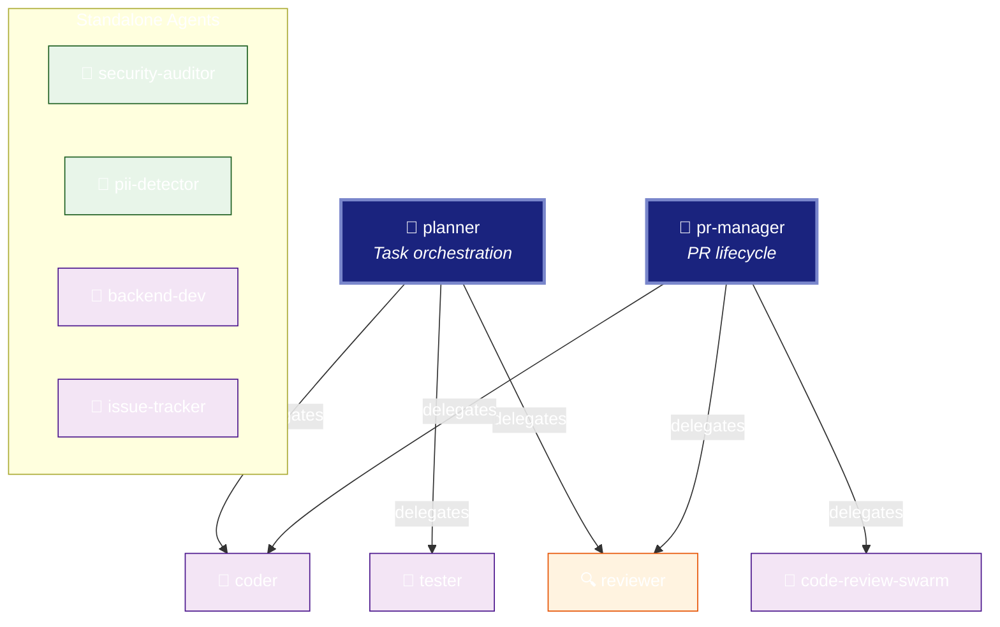

# Agent Hierarchy

[← Back to Overview](./README-example.md) | [← Component Map](./component-map-example.md)

---

## Delegation Tree

---

## Hierarchy Table

### Root Coordinators (Entry Points)

| Coordinator | Delegates To | Total Chain Depth |
|-------------|--------------|------------------:|
| 👑 planner | coder, tester, reviewer | 1 |
| 👑 pr-manager | code-review-swarm, coder, reviewer | 1 |

### Delegation Chains

| From | To | Relationship | Chain |
|------|----|--------------| ------|
| planner | coder | direct | planner → coder |
| planner | tester | direct | planner → tester |
| planner | reviewer | direct | planner → reviewer |
| pr-manager | code-review-swarm | direct | pr-manager → code-review-swarm |
| pr-manager | coder | direct | pr-manager → coder |
| pr-manager | reviewer | direct | pr-manager → reviewer |

### Shared Workers (Multiple Parents)

| Worker | Delegated By | Conflict Resolution |
|--------|--------------|---------------------|
| coder | planner, pr-manager | First-come-first-served |
| reviewer | planner, pr-manager | Queue-based |

### Standalone Agents (No Delegations)

| Agent | Category | Trigger |
|-------|----------|---------|
| security-auditor | 🔒 Security | PR events, manual |
| pii-detector | 🔒 Security | Pre-commit hook |
| backend-dev | 💻 Development | Manual spawn |
| issue-tracker | 🐙 GitHub | Issue events |

---

## Depth Analysis

| Depth Level | Agents | % of Total | Examples |
|-------------|-------:|-----------:|---------|
| 0 (Root) | 2 | 14% | planner, pr-manager |
| 1 (Worker) | 4 | 29% | coder, tester, reviewer, code-review-swarm |
| Standalone | 8 | 57% | security-auditor, pii-detector, claims-authorizer, backend-dev, ml-developer, issue-tracker, release-manager, production-validator |

### Metrics

| Metric | Value |
|--------|------:|
| Total delegation edges | 6 |
| Shared workers | 2 |
| Max chain depth | 1 |
| Avg fan-out (coordinators) | 3.0 |
| Root coordinators | 2 |
| Standalone agents | 8 |

---

[← Back to Overview](./README-example.md)
