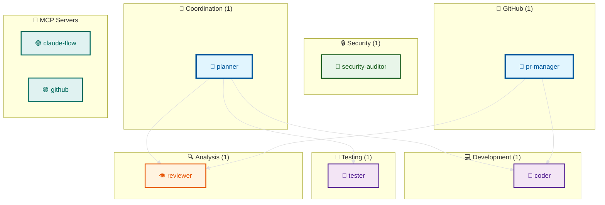
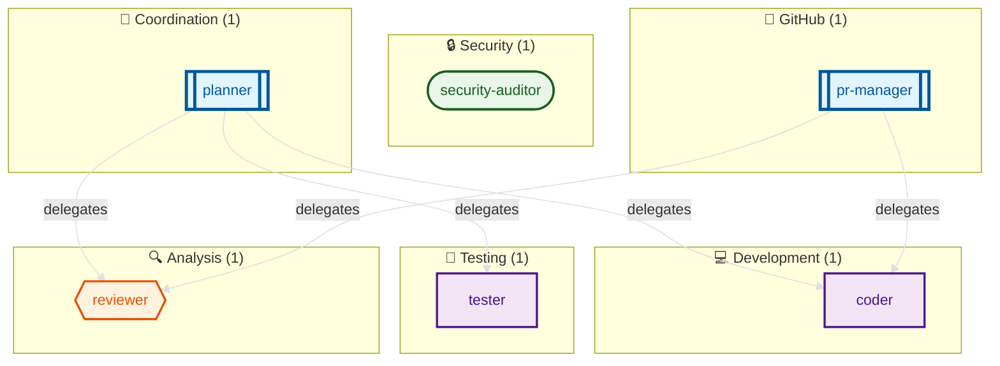
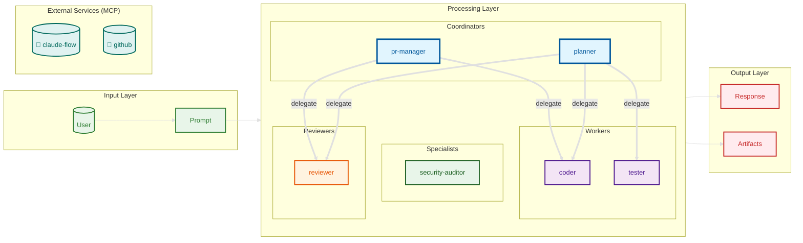

# Agent Architecture Documentation

> Generated by AgentScope v0.1.0
> Scanned: 2026-01-22T19:07:06.094Z

## Table of Contents

- [Overview](#overview)
- [Agents](#agents)
- [MCP Servers](#mcp-servers)
- [Diagrams](#diagrams)
- [Scan Metadata](#scan-metadata)

## Overview

| Component | Count |
|-----------|-------|
| Agents | 6 |
| Skills | 0 |
| Hooks | 0 |
| Commands | 0 |
| MCP Servers | 2 |

### Agent Types

- **Coordinator**: 2
- **Specialist**: 1
- **Reviewer**: 1
- **Worker**: 2

### MCP Server Status

- **Enabled**: 2
- **Disabled**: 0

## Agents

### planner

**Type**: `Coordinator`

Task orchestration agent for workflow planning

**Defined in**: `CLAUDE.md`

**Delegates to**:
- coder
- tester
- reviewer

---

### pr-manager

**Type**: `Coordinator`

Pull request lifecycle coordinator

**Defined in**: `CLAUDE.md`

**Delegates to**:
- coder
- reviewer

---

### security-auditor

**Type**: `Specialist`

Security vulnerability analysis expert

**Defined in**: `CLAUDE.md`

---

### reviewer

**Type**: `Reviewer`

Code review and quality specialist

**Defined in**: `CLAUDE.md`

---

### coder

**Type**: `Worker`

Implementation specialist for writing code

**Defined in**: `CLAUDE.md`

**Tools**:
- `github MCP server`

---

### tester

**Type**: `Worker`

Test writing and execution agent

**Defined in**: `CLAUDE.md`

---


## MCP Servers

| Server | Command | Type | Status |
|--------|---------|------|--------|
| **claude-flow** | `npx` | stdio | Enabled |
| **github** | `gh` | stdio | Enabled |

### claude-flow

**Status**: 🟢 Enabled

**Command**:
```bash
npx @claude-flow/cli
```

---

### github

**Status**: 🟢 Enabled

**Command**:
```bash
gh mcp
```

---


## Diagrams

### Component Map



---
*Generated by AgentScope on 2026-01-22 at 19:07:08.206Z*

### Agent Hierarchy



---
*Generated by AgentScope on 2026-01-22 at 19:07:11.066Z*

### Dataflow



---
*Generated by AgentScope on 2026-01-22 at 19:07:11 UTC*

## Scan Metadata

| Property | Value |
|----------|-------|
| Scanned At | 2026-01-22T19:07:06.094Z |
| Root Path | `/workspaces/agentscope/examples/sample-project` |
| Files Scanned | 10 |
| Duration | 13ms |
| AgentScope Version | 0.1.0 |
