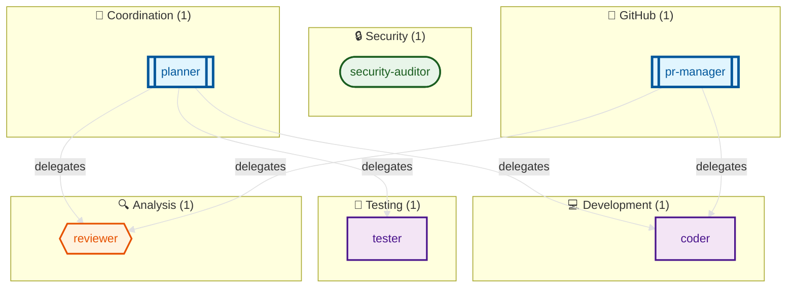

```mermaid
%%{init: {"theme":"default","themeVariables":{"background":"#ffffff","primaryBorderColor":"#e0e0e0","primaryTextColor":"#212121","secondaryTextColor":"#757575","primaryColor":"#fafafa","secondaryColor":"#e3f2fd","tertiaryColor":"#fff8e1","lineColor":"#e0e0e0","fontSize":"14px","fontFamily":"system-ui, -apple-system, sans-serif"}}}%%
graph TB
    %% Agent Hierarchy - Category View

    subgraph github["🐙 GitHub (1)"]
        pr_manager[["pr-manager"]]
    end

    subgraph security["🔒 Security (1)"]
        security_auditor(["security-auditor"])
    end

    subgraph coordination["👑 Coordination (1)"]
        planner[["planner"]]
    end

    subgraph development["💻 Development (1)"]
        coder["coder"]
    end

    subgraph testing["🧪 Testing (1)"]
        tester["tester"]
    end

    subgraph analysis["🔍 Analysis (1)"]
        reviewer{{"reviewer"}}
    end

    %% Delegation Relationships
    planner -->|delegates| coder
    planner -->|delegates| tester
    planner -->|delegates| reviewer
    pr_manager -->|delegates| coder
    pr_manager -->|delegates| reviewer

    %% Styling
    classDef coordinator fill:#e1f5fe,stroke:#01579b,color:#01579b,stroke-width:3px
    classDef worker fill:#f3e5f5,stroke:#4a148c,color:#4a148c,stroke-width:2px
    classDef specialist fill:#e8f5e9,stroke:#1b5e20,color:#1b5e20,stroke-width:2px
    classDef reviewer fill:#fff3e0,stroke:#e65100,color:#e65100,stroke-width:2px
    classDef custom fill:#fce4ec,stroke:#880e4f,color:#880e4f,stroke-width:2px
    classDef input fill:#e8f5e9,stroke:#2e7d32,color:#2e7d32,stroke-width:2px
    classDef output fill:#ffebee,stroke:#c62828,color:#c62828,stroke-width:2px
    classDef hook fill:#fff8e1,stroke:#f57f17,color:#f57f17,stroke-width:2px,stroke-dasharray:5 5
    classDef mcp fill:#e0f2f1,stroke:#00695c,color:#00695c,stroke-width:2px
    classDef skill fill:#e3f2fd,stroke:#0d47a1,color:#0d47a1,stroke-width:2px,stroke-dasharray:5 5
    classDef subgraph_style fill:#fafafa,stroke:#9e9e9e,color:#424242,stroke-width:1px
    classDef more fill:#f5f5f5,stroke:#757575,stroke-dasharray:3 3,color:#757575
    classDef category fill:#fafafa,stroke:#9e9e9e,stroke-width:2px,color:#212121
    class planner coordinator
    class pr_manager coordinator
    class coder worker
    class tester worker
    class reviewer reviewer
    class security_auditor specialist
    class github_more more
    class security_more more
    class coordination_more more
    class development_more more
    class testing_more more
    class analysis_more more
    class skills_more more
```

---
*Generated by AgentScope on 2026-01-22 at 19:07:11.059Z*