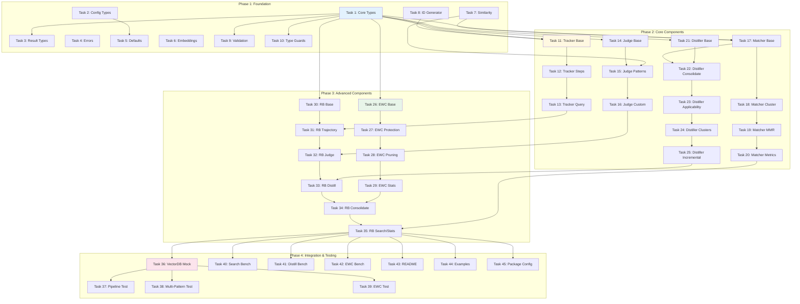

# Learning Package Implementation Plan

**Package:** @vipasane/agentscope-learning
**Version:** 1.2.0
**Last Updated:** 2026-01-30

---

## Overview

This implementation plan breaks down the Learning package development into atomic tasks (<200 lines each). Each task is independently testable and can be committed separately.

**Total Estimated Tasks:** 45
**Estimated Duration:** 3-4 weeks (1-2 tasks per day)

---

## Implementation Phases

### Phase 1: Foundation (Week 1)
- Core types and interfaces
- Base classes and utilities
- Error handling
- Configuration

### Phase 2: Core Components (Week 2)
- TrajectoryTracker
- VerdictJudge
- PatternMatcher
- Embedding utilities

### Phase 3: Advanced Components (Week 3)
- MemoryDistiller
- EWCConsolidator
- ReasoningBank orchestrator

### Phase 4: Integration & Testing (Week 4)
- VectorDatabase integration
- Integration tests
- Performance benchmarks
- Documentation

---

## Task Breakdown

### Phase 1: Foundation (Tasks 1-10)

#### Task 1: Core Type Definitions
**File:** `src/types/core.ts`
**Lines:** ~150
**Dependencies:** None
**Tests:** Type compilation

```typescript
// Define core interfaces:
// - Trajectory
// - TrajectoryStep
// - Pattern
// - DistilledPattern
// - Verdict
// - EWCWeights
```

**Acceptance Criteria:**
- [ ] All core types defined
- [ ] JSDoc comments complete
- [ ] Type compilation passes
- [ ] Exported from src/types/index.ts

---

#### Task 2: Configuration Types
**File:** `src/types/config.ts`
**Lines:** ~120
**Dependencies:** None
**Tests:** Type compilation

```typescript
// Define configuration interfaces:
// - LearningConfig
// - SearchOptions
// - DistillOptions
// - EWCOptions
// - JudgmentOptions
```

**Acceptance Criteria:**
- [ ] All config types defined
- [ ] Default values documented
- [ ] Optional fields marked
- [ ] Exported from src/types/index.ts

---

#### Task 3: Result Types
**File:** `src/types/results.ts`
**Lines:** ~100
**Dependencies:** core.ts
**Tests:** Type compilation

```typescript
// Define result interfaces:
// - LearningStats
// - ConsolidationResult
// - ClusterGroup
// - ImportanceStats
// - PerformanceMetrics
```

**Acceptance Criteria:**
- [ ] All result types defined
- [ ] Computed fields documented
- [ ] Exported from src/types/index.ts

---

#### Task 4: Error Classes
**File:** `src/errors/learning-errors.ts`
**Lines:** ~80
**Dependencies:** None
**Tests:** Error instantiation tests

```typescript
// Define error classes:
// - LearningError (base)
// - TrajectoryNotFoundError
// - IncompleteTrajectoryError
// - InvalidPatternError
// - EWCCapacityError
```

**Acceptance Criteria:**
- [ ] All error classes defined
- [ ] Error messages clear and actionable
- [ ] Error names match class names
- [ ] Tests: error creation and properties
- [ ] 100% test coverage

---

#### Task 5: Default Configuration
**File:** `src/config/defaults.ts`
**Lines:** ~40
**Dependencies:** config.ts
**Tests:** Configuration validation

```typescript
// Define DEFAULT_CONFIG constant
// Document all default values and rationale
```

**Acceptance Criteria:**
- [ ] DEFAULT_CONFIG exported
- [ ] All fields documented
- [ ] Rationale for defaults explained
- [ ] Tests: config validation

---

#### Task 6: Embedding Utilities
**File:** `src/utils/embeddings.ts`
**Lines:** ~150
**Dependencies:** None
**Tests:** Embedding generation and normalization

```typescript
// Functions:
// - createEmbedding(text: string): Float32Array
// - normalizeEmbedding(embedding: Float32Array): Float32Array
// - validateEmbedding(embedding: Float32Array): boolean
```

**Acceptance Criteria:**
- [ ] Simple hash-based embedding (character frequency)
- [ ] L2 normalization
- [ ] Dimension validation (384)
- [ ] Tests: generation, normalization, validation
- [ ] >90% test coverage

---

#### Task 7: Similarity Utilities
**File:** `src/utils/similarity.ts`
**Lines:** ~100
**Dependencies:** None
**Tests:** Similarity computation

```typescript
// Functions:
// - cosineSimilarity(a: Float32Array, b: Float32Array): number
// - euclideanDistance(a: Float32Array, b: Float32Array): number
// - dotProduct(a: Float32Array, b: Float32Array): number
```

**Acceptance Criteria:**
- [ ] Efficient vectorized operations
- [ ] Boundary case handling (zero vectors)
- [ ] Tests: known vectors, edge cases
- [ ] >90% test coverage

---

#### Task 8: ID Generation Utility
**File:** `src/utils/id-generator.ts`
**Lines:** ~40
**Dependencies:** None
**Tests:** ID generation and uniqueness

```typescript
// Functions:
// - generateTrajectoryId(): string
// - generatePatternId(): string
// - generateSessionId(): string
```

**Acceptance Criteria:**
- [ ] Unique ID generation (timestamp + random)
- [ ] Prefix-based (traj-, pat-, sess-)
- [ ] Tests: uniqueness, format
- [ ] >95% test coverage

---

#### Task 9: Validation Utilities
**File:** `src/utils/validation.ts`
**Lines:** ~120
**Dependencies:** core.ts
**Tests:** Validation functions

```typescript
// Functions:
// - validateTrajectory(trajectory: Trajectory): boolean
// - validatePattern(pattern: Pattern): boolean
// - validateVerdict(verdict: Verdict): boolean
// - validateReward(reward: number): boolean
```

**Acceptance Criteria:**
- [ ] Validate required fields
- [ ] Validate value ranges (0-1 for rewards)
- [ ] Throw descriptive errors
- [ ] Tests: valid/invalid inputs
- [ ] >90% test coverage

---

#### Task 10: Type Guards
**File:** `src/utils/type-guards.ts`
**Lines:** ~80
**Dependencies:** core.ts
**Tests:** Type guard functions

```typescript
// Functions:
// - isTrajectory(obj: unknown): obj is Trajectory
// - isPattern(obj: unknown): obj is Pattern
// - isDistilledPattern(obj: unknown): obj is DistilledPattern
// - isVerdict(obj: unknown): obj is Verdict
```

**Acceptance Criteria:**
- [ ] All core types have guards
- [ ] Runtime type validation
- [ ] Tests: valid/invalid objects
- [ ] >95% test coverage

---

### Phase 2: Core Components (Tasks 11-25)

#### Task 11: TrajectoryTracker - Basic Structure
**File:** `src/trajectory/tracker.ts`
**Lines:** ~180
**Dependencies:** core.ts, id-generator.ts
**Tests:** Tracker instantiation

```typescript
// Class: TrajectoryTracker
// Methods:
// - constructor()
// - startTrajectory(sessionId, task, input): string
// - getTrajectory(id): Trajectory | undefined
```

**Acceptance Criteria:**
- [ ] Class structure defined
- [ ] In-memory storage (Map)
- [ ] Active/completed separation
- [ ] Tests: create, retrieve
- [ ] >85% test coverage

---

#### Task 12: TrajectoryTracker - Step Management
**File:** `src/trajectory/tracker.ts` (extend)
**Lines:** ~80
**Dependencies:** Task 11
**Tests:** Step addition

```typescript
// Methods:
// - addStep(trajectoryId, step): void
// - endTrajectory(trajectoryId, output, success): void
```

**Acceptance Criteria:**
- [ ] Steps stored chronologically
- [ ] Metrics calculated on end
- [ ] Error handling (not found, already ended)
- [ ] Tests: add steps, end trajectory
- [ ] >90% test coverage

---

#### Task 13: TrajectoryTracker - Query Methods
**File:** `src/trajectory/tracker.ts` (extend)
**Lines:** ~70
**Dependencies:** Task 12
**Tests:** Query operations

```typescript
// Methods:
// - getActiveTrajectories(sessionId?): Trajectory[]
// - getCompletedTrajectories(sessionId?): Trajectory[]
// - clearCompleted(olderThan?): number
```

**Acceptance Criteria:**
- [ ] Filter by session ID
- [ ] Filter by completion status
- [ ] Cleanup old trajectories
- [ ] Tests: filtering, cleanup
- [ ] >90% test coverage

---

#### Task 14: VerdictJudge - Basic Structure
**File:** `src/verdict/judge.ts`
**Lines:** ~150
**Dependencies:** core.ts
**Tests:** Judge instantiation

```typescript
// Class: VerdictJudge
// Methods:
// - constructor()
// - judge(trajectory, options?): Verdict
```

**Acceptance Criteria:**
- [ ] Default judgment algorithm
- [ ] Efficiency calculation (latency/steps)
- [ ] Quality calculation (success rate)
- [ ] Tests: basic judgment
- [ ] >85% test coverage

---

#### Task 15: VerdictJudge - Pattern Comparison
**File:** `src/verdict/judge.ts` (extend)
**Lines:** ~100
**Dependencies:** Task 14, similarity.ts
**Tests:** Pattern-based judgment

```typescript
// Methods:
// - judgeWithPatterns(trajectory, patterns): Verdict
```

**Acceptance Criteria:**
- [ ] Compare efficiency vs patterns
- [ ] Compare quality vs patterns
- [ ] Generate contextual improvements
- [ ] Tests: with/without patterns
- [ ] >90% test coverage

---

#### Task 16: VerdictJudge - Custom Evaluator
**File:** `src/verdict/judge.ts` (extend)
**Lines:** ~60
**Dependencies:** Task 15
**Tests:** Custom evaluation

```typescript
// Methods:
// - judgeWithEvaluator(trajectory, evaluator): Verdict
// - judgeMany(trajectories): Verdict[]
```

**Acceptance Criteria:**
- [ ] Custom evaluator support
- [ ] Batch judgment
- [ ] Error handling
- [ ] Tests: custom evaluators, batch
- [ ] >90% test coverage

---

#### Task 17: PatternMatcher - Similarity Search
**File:** `src/matching/matcher.ts`
**Lines:** ~150
**Dependencies:** core.ts, similarity.ts
**Tests:** Pattern matching

```typescript
// Class: PatternMatcher
// Methods:
// - constructor()
// - findSimilar(embedding, patterns, options): Pattern[]
// - cosineSimilarity(a, b): number
```

**Acceptance Criteria:**
- [ ] Cosine similarity ranking
- [ ] Top-k selection
- [ ] Reward filtering
- [ ] Tests: similarity search
- [ ] >85% test coverage

---

#### Task 18: PatternMatcher - Clustering
**File:** `src/matching/matcher.ts` (extend)
**Lines:** ~180
**Dependencies:** Task 17
**Tests:** K-means clustering

```typescript
// Methods:
// - cluster(patterns, k): ClusterGroup[]
```

**Acceptance Criteria:**
- [ ] K-means implementation
- [ ] Centroid calculation
- [ ] Cluster assignment
- [ ] Tests: clustering quality
- [ ] >80% test coverage

---

#### Task 19: PatternMatcher - MMR Diversity
**File:** `src/matching/matcher.ts` (extend)
**Lines:** ~120
**Dependencies:** Task 18
**Tests:** Diversity selection

```typescript
// Methods:
// - maximalMarginalRelevance(candidates, k, lambda): Pattern[]
```

**Acceptance Criteria:**
- [ ] MMR algorithm implementation
- [ ] Relevance-diversity balancing
- [ ] Lambda parameter (0-1)
- [ ] Tests: diverse selection
- [ ] >85% test coverage

---

#### Task 20: PatternMatcher - Distance Metrics
**File:** `src/matching/matcher.ts` (extend)
**Lines:** ~60
**Dependencies:** Task 19
**Tests:** Distance calculations

```typescript
// Methods:
// - euclideanDistance(a, b): number
// - manhattanDistance(a, b): number
```

**Acceptance Criteria:**
- [ ] Additional distance metrics
- [ ] Efficient computation
- [ ] Tests: known distances
- [ ] >90% test coverage

---

#### Task 21: MemoryDistiller - Basic Structure
**File:** `src/distill/distiller.ts`
**Lines:** ~150
**Dependencies:** core.ts
**Tests:** Distiller instantiation

```typescript
// Class: MemoryDistiller
// Methods:
// - constructor()
// - distillTrajectory(trajectory, verdict): Pattern
```

**Acceptance Criteria:**
- [ ] Convert trajectory to pattern
- [ ] Extract basic metadata
- [ ] Generate embedding
- [ ] Tests: single trajectory distillation
- [ ] >85% test coverage

---

#### Task 22: MemoryDistiller - Pattern Consolidation
**File:** `src/distill/distiller.ts` (extend)
**Lines:** ~180
**Dependencies:** Task 21, matcher.ts
**Tests:** Multi-pattern distillation

```typescript
// Methods:
// - distillPatterns(patterns, options): DistilledPattern
```

**Acceptance Criteria:**
- [ ] Cluster similar patterns
- [ ] Extract common themes
- [ ] Weighted reward calculation
- [ ] Tests: consolidation quality
- [ ] >80% test coverage

---

#### Task 23: MemoryDistiller - Applicability Detection
**File:** `src/distill/distiller.ts` (extend)
**Lines:** ~100
**Dependencies:** Task 22
**Tests:** Applicability extraction

```typescript
// Private methods:
// - extractApplicability(patterns): string[]
// - identifyAntiPatterns(patterns): string[]
```

**Acceptance Criteria:**
- [ ] Extract common conditions
- [ ] Identify failure patterns
- [ ] Generate actionable rules
- [ ] Tests: applicability accuracy
- [ ] >85% test coverage

---

#### Task 24: MemoryDistiller - Cluster-based Distillation
**File:** `src/distill/distiller.ts` (extend)
**Lines:** ~90
**Dependencies:** Task 23
**Tests:** Multi-cluster distillation

```typescript
// Methods:
// - distillClusters(patterns, k): DistilledPattern[]
```

**Acceptance Criteria:**
- [ ] Cluster then distill each
- [ ] Preserve cluster diversity
- [ ] Tests: multi-cluster quality
- [ ] >85% test coverage

---

#### Task 25: MemoryDistiller - Incremental Update
**File:** `src/distill/distiller.ts` (extend)
**Lines:** ~80
**Dependencies:** Task 24
**Tests:** Incremental distillation

```typescript
// Methods:
// - updateDistillation(existing, newPattern): DistilledPattern
```

**Acceptance Criteria:**
- [ ] Merge new pattern without full recomputation
- [ ] Update weights incrementally
- [ ] Tests: incremental updates
- [ ] >90% test coverage

---

### Phase 3: Advanced Components (Tasks 26-35)

#### Task 26: EWCConsolidator - Basic Structure
**File:** `src/consolidate/ewc.ts`
**Lines:** ~150
**Dependencies:** core.ts
**Tests:** Consolidator instantiation

```typescript
// Class: EWCConsolidator
// Methods:
// - constructor()
// - consolidate(pattern, options): ConsolidationResult
```

**Acceptance Criteria:**
- [ ] Class structure defined
- [ ] Protected patterns storage (Map)
- [ ] Fisher information computation
- [ ] Tests: basic consolidation
- [ ] >80% test coverage

---

#### Task 27: EWCConsolidator - Protection Management
**File:** `src/consolidate/ewc.ts` (extend)
**Lines:** ~100
**Dependencies:** Task 26
**Tests:** Protection operations

```typescript
// Methods:
// - isProtected(patternId): boolean
// - getWeights(patternId): EWCWeights | undefined
// - unprotect(patternId): void
```

**Acceptance Criteria:**
- [ ] Protection tracking
- [ ] Weight retrieval
- [ ] Unprotection
- [ ] Tests: protection management
- [ ] >90% test coverage

---

#### Task 28: EWCConsolidator - Adaptive Pruning
**File:** `src/consolidate/ewc.ts` (extend)
**Lines:** ~120
**Dependencies:** Task 27
**Tests:** Pruning logic

```typescript
// Private methods:
// - pruneLowestImportance(): string[]
// - computeFisherInformation(pattern): Float32Array
```

**Acceptance Criteria:**
- [ ] Prune when at capacity
- [ ] Preserve high-importance patterns
- [ ] Fisher information calculation
- [ ] Tests: pruning behavior
- [ ] >85% test coverage

---

#### Task 29: EWCConsolidator - Statistics
**File:** `src/consolidate/ewc.ts` (extend)
**Lines:** ~80
**Dependencies:** Task 28
**Tests:** Statistics generation

```typescript
// Methods:
// - getProtectedCount(): number
// - getImportanceDistribution(): ImportanceStats
```

**Acceptance Criteria:**
- [ ] Count protected patterns
- [ ] Importance distribution stats
- [ ] Percentile calculations
- [ ] Tests: statistics accuracy
- [ ] >90% test coverage

---

#### Task 30: ReasoningBank - Basic Structure
**File:** `src/core/reasoning-bank.ts`
**Lines:** ~180
**Dependencies:** All components
**Tests:** Bank instantiation

```typescript
// Class: ReasoningBank
// Methods:
// - constructor(vectorDB, config)
// - retrieve(taskDescription, k): Promise<Pattern[]>
```

**Acceptance Criteria:**
- [ ] Component initialization
- [ ] VectorDatabase integration
- [ ] Configuration management
- [ ] Tests: instantiation, retrieval
- [ ] >85% test coverage

---

#### Task 31: ReasoningBank - Trajectory Management
**File:** `src/core/reasoning-bank.ts` (extend)
**Lines:** ~120
**Dependencies:** Task 30, TrajectoryTracker
**Tests:** Trajectory operations

```typescript
// Methods:
// - startTrajectory(sessionId, task, input): Promise<string>
// - addTrajectoryStep(id, step): Promise<void>
// - endTrajectory(id, output, success): Promise<void>
```

**Acceptance Criteria:**
- [ ] Delegate to TrajectoryTracker
- [ ] Async wrappers
- [ ] Error handling
- [ ] Tests: trajectory lifecycle
- [ ] >90% test coverage

---

#### Task 32: ReasoningBank - Judgment
**File:** `src/core/reasoning-bank.ts` (extend)
**Lines:** ~100
**Dependencies:** Task 31, VerdictJudge
**Tests:** Judgment operations

```typescript
// Methods:
// - judge(trajectoryId, success, reward, critique): Promise<Verdict>
```

**Acceptance Criteria:**
- [ ] Retrieve trajectory
- [ ] Fetch similar patterns
- [ ] Judge with patterns
- [ ] Tests: judgment flow
- [ ] >90% test coverage

---

#### Task 33: ReasoningBank - Distillation
**File:** `src/core/reasoning-bank.ts` (extend)
**Lines:** ~150
**Dependencies:** Task 32, MemoryDistiller
**Tests:** Distillation operations

```typescript
// Methods:
// - distill(trajectoryId): Promise<DistilledPattern>
```

**Acceptance Criteria:**
- [ ] Get trajectory and verdict
- [ ] Distill to pattern
- [ ] Store in VectorDB
- [ ] Consolidate similar patterns
- [ ] Tests: distillation flow
- [ ] >85% test coverage

---

#### Task 34: ReasoningBank - Consolidation
**File:** `src/core/reasoning-bank.ts` (extend)
**Lines:** ~80
**Dependencies:** Task 33, EWCConsolidator
**Tests:** Consolidation operations

```typescript
// Methods:
// - consolidate(pattern): Promise<void>
```

**Acceptance Criteria:**
- [ ] Apply EWC consolidation
- [ ] Update pattern metadata
- [ ] Store in VectorDB
- [ ] Tests: consolidation flow
- [ ] >90% test coverage

---

#### Task 35: ReasoningBank - Statistics & Search
**File:** `src/core/reasoning-bank.ts` (extend)
**Lines:** ~150
**Dependencies:** Task 34, PatternMatcher
**Tests:** Statistics and search

```typescript
// Methods:
// - searchPatterns(query, options): Promise<Pattern[]>
// - getStats(): Promise<LearningStats>
```

**Acceptance Criteria:**
- [ ] Advanced pattern search
- [ ] Comprehensive statistics
- [ ] Common theme extraction
- [ ] Tests: search and stats
- [ ] >90% test coverage

---

### Phase 4: Integration & Testing (Tasks 36-45)

#### Task 36: VectorDatabase Mock
**File:** `tests/mocks/vector-database.mock.ts`
**Lines:** ~180
**Dependencies:** memory package types
**Tests:** Mock functionality

```typescript
// Class: MockVectorDatabase
// Implements VectorDatabase interface
// In-memory storage for testing
```

**Acceptance Criteria:**
- [ ] Implements full VectorDatabase interface
- [ ] In-memory storage (Map)
- [ ] Similarity search simulation
- [ ] Tests: mock operations
- [ ] >95% test coverage

---

#### Task 37: Integration Test - Full Pipeline
**File:** `tests/integration/learning-pipeline.test.ts`
**Lines:** ~150
**Dependencies:** All components, VectorDatabase mock
**Tests:** End-to-end flow

```typescript
// Test complete 4-step pipeline:
// RETRIEVE → JUDGE → DISTILL → CONSOLIDATE
```

**Acceptance Criteria:**
- [ ] Complete cycle tested
- [ ] Pattern stored and retrieved
- [ ] EWC protection verified
- [ ] 100% integration coverage

---

#### Task 38: Integration Test - Multi-Pattern Learning
**File:** `tests/integration/multi-pattern.test.ts`
**Lines:** ~120
**Dependencies:** ReasoningBank, VectorDatabase mock
**Tests:** Multiple patterns

```typescript
// Test consolidation of multiple patterns
// Verify storage reduction
// Verify key learnings extraction
```

**Acceptance Criteria:**
- [ ] Multiple patterns distilled
- [ ] Storage reduction verified
- [ ] Quality preserved

---

#### Task 39: Integration Test - EWC Protection
**File:** `tests/integration/ewc-protection.test.ts`
**Lines:** ~100
**Dependencies:** EWCConsolidator, ReasoningBank
**Tests:** Forgetting prevention

```typescript
// Test EWC protection mechanism
// Verify important patterns preserved
// Verify low-importance patterns pruned
```

**Acceptance Criteria:**
- [ ] Protection working correctly
- [ ] Pruning behavior correct
- [ ] No catastrophic forgetting

---

#### Task 40: Performance Benchmark - Search
**File:** `benchmarks/search-performance.bench.ts`
**Lines:** ~120
**Dependencies:** PatternMatcher, HNSW
**Tests:** Search performance

```typescript
// Benchmark search performance:
// - 1K patterns
// - 10K patterns
// - 100K patterns
// - 1M patterns
```

**Acceptance Criteria:**
- [ ] HNSW <10ms for 1M patterns
- [ ] Linear search baseline measured
- [ ] Speedup factors documented

---

#### Task 41: Performance Benchmark - Distillation
**File:** `benchmarks/distillation-performance.bench.ts`
**Lines:** ~100
**Dependencies:** MemoryDistiller
**Tests:** Distillation performance

```typescript
// Benchmark distillation:
// - Single pattern
// - 10 patterns
// - 100 patterns
// - 1000 patterns
```

**Acceptance Criteria:**
- [ ] <50ms for 100 patterns
- [ ] <500ms for 1000 patterns
- [ ] Memory usage measured

---

#### Task 42: Performance Benchmark - EWC
**File:** `benchmarks/ewc-performance.bench.ts`
**Lines:** ~80
**Dependencies:** EWCConsolidator
**Tests:** Consolidation performance

```typescript
// Benchmark EWC consolidation:
// - Fisher computation
// - Protection overhead
// - Pruning performance
```

**Acceptance Criteria:**
- [ ] <50ms consolidation
- [ ] <10ms Fisher computation
- [ ] Performance targets met

---

#### Task 43: Documentation - README
**File:** `README.md`
**Lines:** ~200
**Dependencies:** All public APIs
**Tests:** Documentation review

```typescript
// Complete README with:
// - Features
// - Installation
// - Quick start
// - Examples
// - API overview
// - Performance
```

**Acceptance Criteria:**
- [ ] Clear quick start
- [ ] Complete examples
- [ ] Performance data included
- [ ] Links to detailed docs

---

#### Task 44: Documentation - Examples
**File:** `examples/complete-learning-cycle.ts`
**Lines:** ~150
**Dependencies:** ReasoningBank
**Tests:** Example runs successfully

```typescript
// Comprehensive example demonstrating:
// - RETRIEVE
// - TRACK
// - JUDGE
// - DISTILL
// - CONSOLIDATE
// - SEARCH
// - STATS
```

**Acceptance Criteria:**
- [ ] Example runs without errors
- [ ] All features demonstrated
- [ ] Comments explain each step

---

#### Task 45: Package Configuration
**File:** `package.json`, `tsconfig.json`
**Lines:** ~100
**Dependencies:** All tasks complete
**Tests:** Build and publish

```json
// Configure:
// - Dependencies
// - Scripts
// - Exports
// - TypeScript config
```

**Acceptance Criteria:**
- [ ] Build succeeds
- [ ] Tests pass
- [ ] Exports correct
- [ ] Ready for publish

---

## Task Dependencies



---

## Progress Tracking

### Week 1 (Phase 1)
- [ ] Task 1: Core Types
- [ ] Task 2: Config Types
- [ ] Task 3: Result Types
- [ ] Task 4: Errors
- [ ] Task 5: Defaults
- [ ] Task 6: Embeddings
- [ ] Task 7: Similarity
- [ ] Task 8: ID Generator
- [ ] Task 9: Validation
- [ ] Task 10: Type Guards

### Week 2 (Phase 2)
- [ ] Task 11-13: TrajectoryTracker
- [ ] Task 14-16: VerdictJudge
- [ ] Task 17-20: PatternMatcher
- [ ] Task 21-25: MemoryDistiller

### Week 3 (Phase 3)
- [ ] Task 26-29: EWCConsolidator
- [ ] Task 30-35: ReasoningBank

### Week 4 (Phase 4)
- [ ] Task 36-39: Integration Tests
- [ ] Task 40-42: Performance Benchmarks
- [ ] Task 43-45: Documentation & Package

---

## Testing Requirements

### Unit Test Coverage
- **Target:** >90% coverage
- **Requirement:** Every public method tested
- **Tools:** Vitest, @vitest/coverage-v8

### Integration Test Coverage
- **Target:** 100% of critical paths
- **Requirement:** End-to-end flows tested
- **Tools:** Vitest with VectorDatabase mock

### Performance Benchmarks
- **Target:** Meet documented performance targets
- **Requirement:** Benchmark suite for critical operations
- **Tools:** Vitest benchmark mode

---

## Commit Strategy

### Atomic Commits
Each task = one commit with format:

```
feat(learning): implement <component> <feature>

- <detail 1>
- <detail 2>
- <detail 3>

Tests: <test description>
Coverage: <percentage>%

Refs: #<issue-number>

Co-Authored-By: claude-flow <ruv@ruv.net>
```

### Example Commits

```
feat(learning): implement core type definitions

- Add Trajectory, Pattern, DistilledPattern types
- Add Verdict and EWCWeights types
- Add comprehensive JSDoc comments
- Export from src/types/index.ts

Tests: Type compilation and exports
Coverage: 100%

Refs: #123

Co-Authored-By: claude-flow <ruv@ruv.net>
```

```
feat(learning): implement TrajectoryTracker base

- Add TrajectoryTracker class with Map storage
- Implement startTrajectory and getTrajectory methods
- Add active/completed trajectory separation
- Add error handling for not found

Tests: Tracker creation and retrieval
Coverage: 87%

Refs: #124

Co-Authored-By: claude-flow <ruv@ruv.net>
```

---

## Success Criteria

### Phase 1 Complete
- [ ] All types defined and exported
- [ ] All utilities implemented and tested
- [ ] >90% test coverage

### Phase 2 Complete
- [ ] All core components implemented
- [ ] Integration between components working
- [ ] >90% test coverage

### Phase 3 Complete
- [ ] ReasoningBank orchestrating all components
- [ ] Full 4-step pipeline working
- [ ] >90% test coverage

### Phase 4 Complete
- [ ] All integration tests passing
- [ ] Performance benchmarks meet targets
- [ ] Documentation complete
- [ ] Package ready for publish

---

## Risk Mitigation

| Risk | Impact | Mitigation |
|------|--------|------------|
| VectorDatabase dependency changes | High | Mock for testing, interface abstraction |
| HNSW performance not meeting targets | Medium | Fallback to linear search |
| EWC complexity too high | Medium | Simplify to importance-based pruning |
| Pattern consolidation quality low | Medium | Tune clustering parameters, add manual review |
| Memory usage too high | Low | Quantization, pruning, TTL-based cleanup |

---

## Version History

| Version | Date | Changes |
|---------|------|---------|
| 1.2.0 | 2026-01-30 | Complete implementation plan |
| 1.1.0 | 2026-01-27 | Initial planning |
